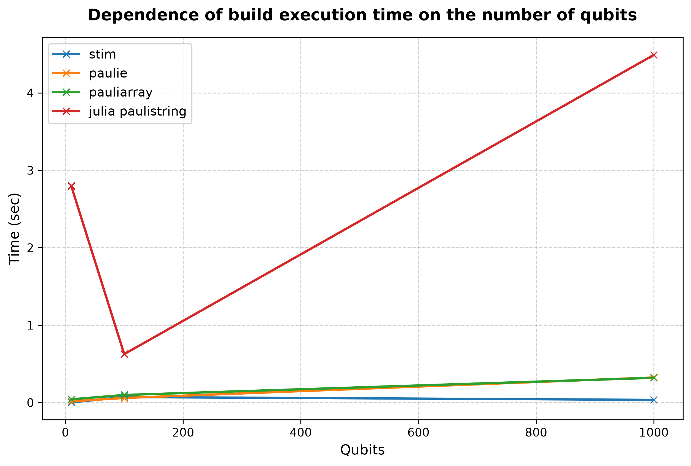
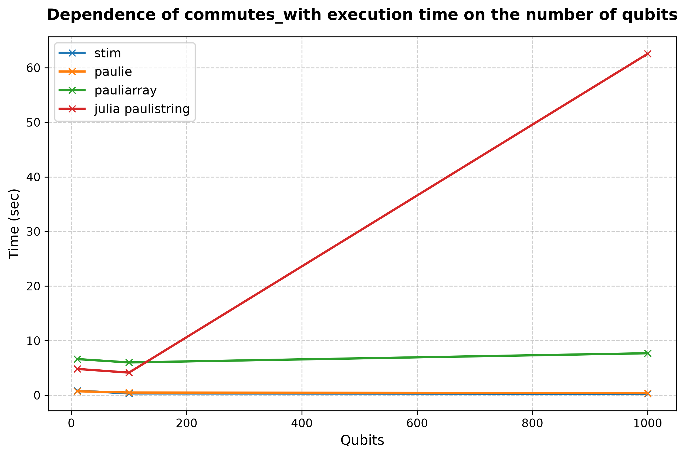
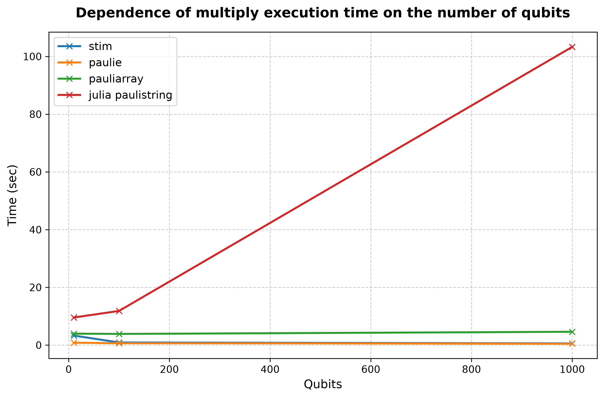

## Processor: Intel(R) Core(TM) i5-8265U CPU @ 1.60GHz

### Performance for 10 qubits (lenght of list is 1000 and number of operations is 499500) 
|library                  |build, sec|commutes_with, sec|multiply, sec|
|:----------------------- |:-----:   |:-----:           |:-----:      |
|stim| 0.0033| 0.8363| 3.3133|
|paulie| 0.0166| 0.7197| 0.8337|
|pauliarray| 0.0427| 6.6207| 3.9725|
|julia paulistring| 2.7982| 4.8151| 9.5565|
 

### Performance for 100 qubits (lenght of list is 1000 and number of operations is 499500) 
|library                  |build, sec|commutes_with, sec|multiply, sec|
|:----------------------- |:-----:   |:-----:           |:-----:      |
|stim| 0.0716| 0.3282| 0.9093|
|paulie| 0.0599| 0.4936| 0.6692|
|pauliarray| 0.0984| 6.0014| 3.8704|
|julia paulistring| 0.6259| 4.1352| 11.8417|
 

### Performance for 1000 qubits (lenght of list is 1000 and number of operations is 499500) 
|library                  |build, sec|commutes_with, sec|multiply, sec|
|:----------------------- |:-----:   |:-----:           |:-----:      |
|stim| 0.0353| 0.2726| 0.5972|
|paulie| 0.3247| 0.3758| 0.5050|
|pauliarray| 0.3197| 7.6873| 4.6196|
|julia paulistring| 4.4896| 62.5631| 103.3022|
 

