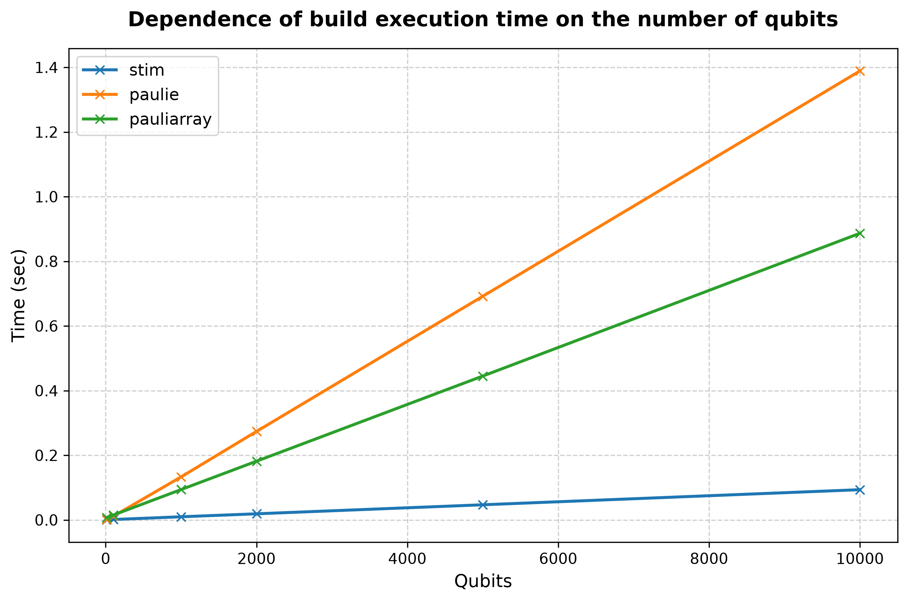
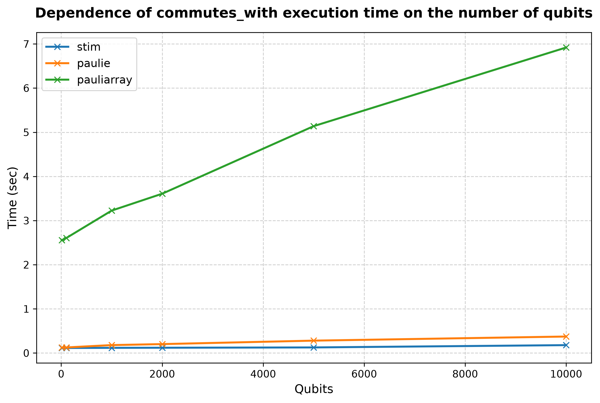
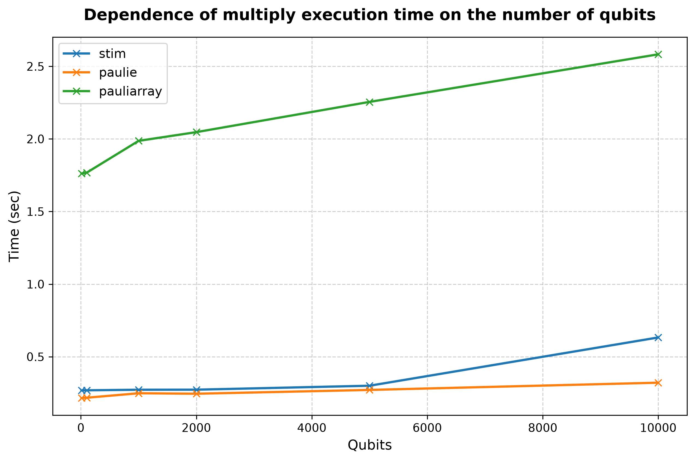

## Processor: Intel(R) Core(TM) i9-14900KF

### Performance for 10 qubits (lenght of list is 1000 and number of operations is 499500) 
|library                  |build, sec|commutes_with, sec|multiply, sec|
|:----------------------- |:-----:   |:-----:           |:-----:      |
|stim| 0.0005| 0.1173| 0.2678|
|paulie| 0.0019| 0.1254| 0.2154|
|pauliarray| 0.0074| 2.5553| 1.7617|
 

### Performance for 100 qubits (lenght of list is 1000 and number of operations is 499500) 
|library                  |build, sec|commutes_with, sec|multiply, sec|
|:----------------------- |:-----:   |:-----:           |:-----:      |
|stim| 0.0013| 0.1151| 0.2686|
|paulie| 0.0112| 0.1267| 0.2174|
|pauliarray| 0.0150| 2.6041| 1.7674|
 

### Performance for 1000 qubits (lenght of list is 1000 and number of operations is 499500) 
|library                  |build, sec|commutes_with, sec|multiply, sec|
|:----------------------- |:-----:   |:-----:           |:-----:      |
|stim| 0.0098| 0.1176| 0.2725|
|paulie| 0.1331| 0.1799| 0.2483|
|pauliarray| 0.0940| 3.2259| 1.9866|
 

### Performance for 2000 qubits (lenght of list is 1000 and number of operations is 499500) 
|library                  |build, sec|commutes_with, sec|multiply, sec|
|:----------------------- |:-----:   |:-----:           |:-----:      |
|stim| 0.0190| 0.1201| 0.2728|
|paulie| 0.2738| 0.2025| 0.2449|
|pauliarray| 0.1817| 3.6080| 2.0466|
 

### Performance for 5000 qubits (lenght of list is 1000 and number of operations is 499500) 
|library                  |build, sec|commutes_with, sec|multiply, sec|
|:----------------------- |:-----:   |:-----:           |:-----:      |
|stim| 0.0469| 0.1268| 0.3001|
|paulie| 0.6919| 0.2808| 0.2711|
|pauliarray| 0.4451| 5.1380| 2.2550|
 

### Performance for 10000 qubits (lenght of list is 1000 and number of operations is 499500) 
|library                  |build, sec|commutes_with, sec|multiply, sec|
|:----------------------- |:-----:   |:-----:           |:-----:      |
|stim| 0.0936| 0.1789| 0.6325|
|paulie| 1.3889| 0.3737| 0.3210|
|pauliarray| 0.8867| 6.9193| 2.5826|
 

