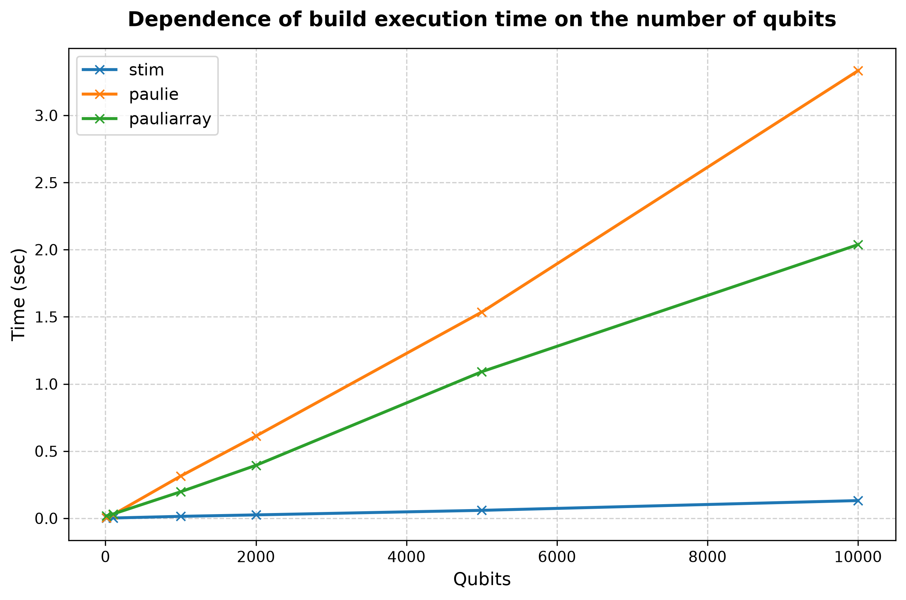
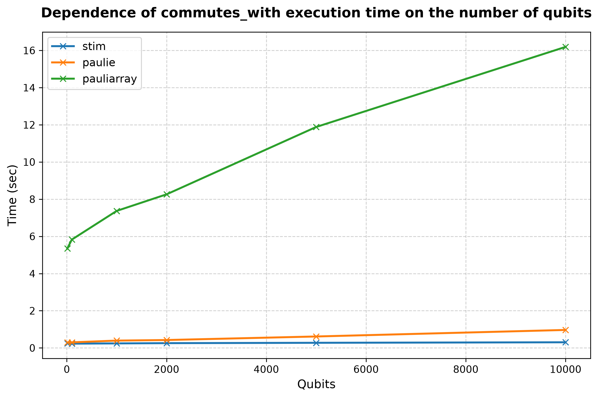
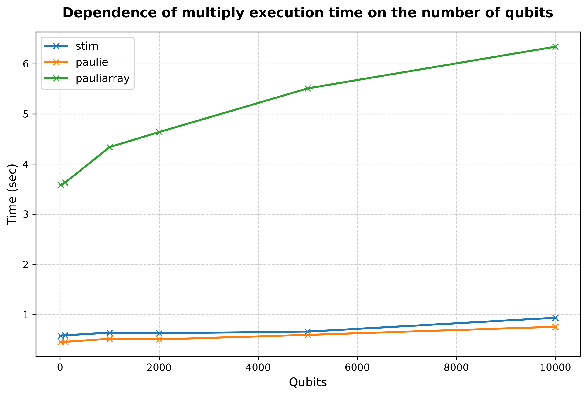

## Processor: Intel(R) Core(TM) i5-8265U CPU @ 1.60GHz

### Performance for 10 qubits (lenght of list is 1000 and number of operations is 499500) 
|library                  |build, sec|commutes_with, sec|multiply, sec|
|:----------------------- |:-----:   |:-----:           |:-----:      |
|stim| 0.0020| 0.2429| 0.5748|
|paulie| 0.0059| 0.2976| 0.4526|
|pauliarray| 0.0181| 5.3444| 3.5851|
 

### Performance for 100 qubits (lenght of list is 1000 and number of operations is 499500) 
|library                  |build, sec|commutes_with, sec|multiply, sec|
|:----------------------- |:-----:   |:-----:           |:-----:      |
|stim| 0.0022| 0.2306| 0.5846|
|paulie| 0.0265| 0.3008| 0.4544|
|pauliarray| 0.0317| 5.8256| 3.6289|
 

### Performance for 1000 qubits (lenght of list is 1000 and number of operations is 499500) 
|library                  |build, sec|commutes_with, sec|multiply, sec|
|:----------------------- |:-----:   |:-----:           |:-----:      |
|stim| 0.0146| 0.2431| 0.6370|
|paulie| 0.3145| 0.3940| 0.5150|
|pauliarray| 0.1977| 7.3691| 4.3382|
 

### Performance for 2000 qubits (lenght of list is 1000 and number of operations is 499500) 
|library                  |build, sec|commutes_with, sec|multiply, sec|
|:----------------------- |:-----:   |:-----:           |:-----:      |
|stim| 0.0254| 0.2568| 0.6260|
|paulie| 0.6124| 0.4247| 0.5027|
|pauliarray| 0.3945| 8.2603| 4.6376|
 

### Performance for 5000 qubits (lenght of list is 1000 and number of operations is 499500) 
|library                  |build, sec|commutes_with, sec|multiply, sec|
|:----------------------- |:-----:   |:-----:           |:-----:      |
|stim| 0.0593| 0.2755| 0.6579|
|paulie| 1.5353| 0.6152| 0.5923|
|pauliarray| 1.0913| 11.8827| 5.5089|
 

### Performance for 10000 qubits (lenght of list is 1000 and number of operations is 499500) 
|library                  |build, sec|commutes_with, sec|multiply, sec|
|:----------------------- |:-----:   |:-----:           |:-----:      |
|stim| 0.1320| 0.3035| 0.9350|
|paulie| 3.3324| 0.9670| 0.7546|
|pauliarray| 2.0374| 16.1894| 6.3411|
 

