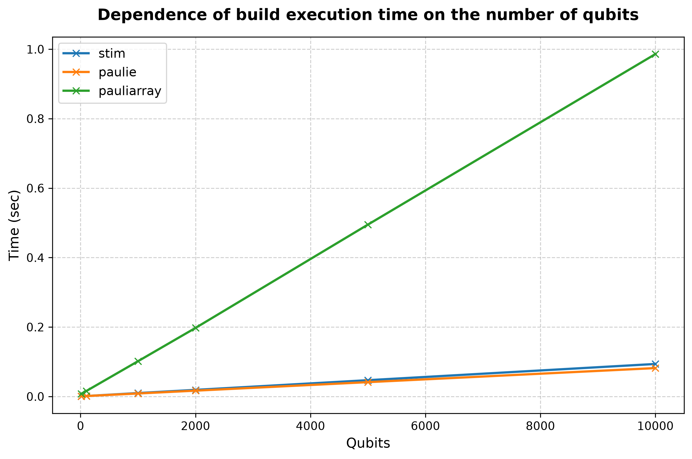
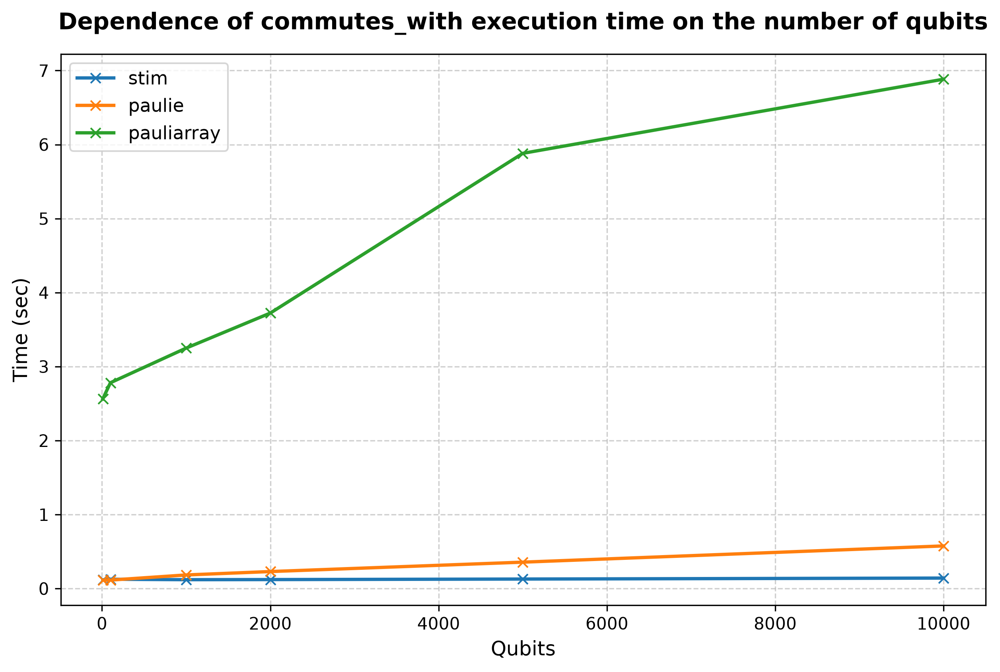
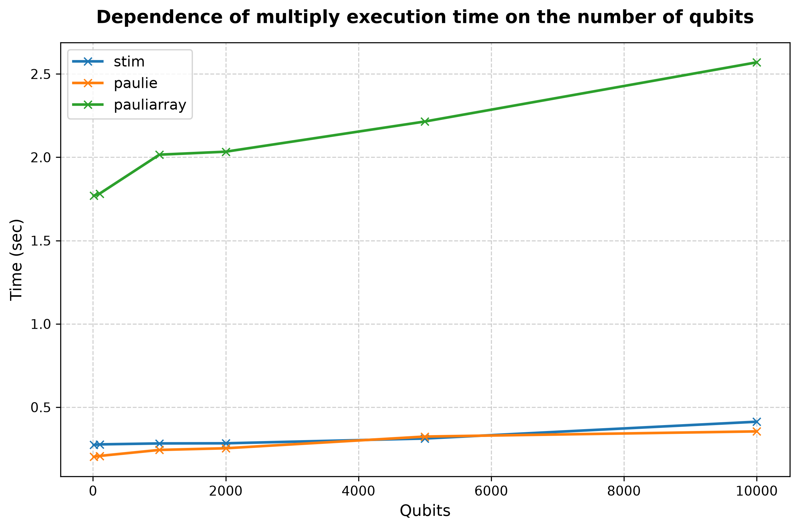

## Processor: Intel(R) Core(TM) i9-14900KF

### Performance for 10 qubits (lenght of list is 1000 and number of operations is 499500) 
|library                  |build, sec|commutes_with, sec|multiply, sec|
|:----------------------- |:-----:   |:-----:           |:-----:      |
|stim| 0.0005| 0.1179| 0.2734|
|paulie| 0.0007| 0.1133| 0.2026|
|pauliarray| 0.0076| 2.5647| 1.7694|
 

### Performance for 100 qubits (lenght of list is 1000 and number of operations is 499500) 
|library                  |build, sec|commutes_with, sec|multiply, sec|
|:----------------------- |:-----:   |:-----:           |:-----:      |
|stim| 0.0013| 0.1265| 0.2768|
|paulie| 0.0013| 0.1149| 0.2075|
|pauliarray| 0.0158| 2.7815| 1.7817|
 

### Performance for 1000 qubits (lenght of list is 1000 and number of operations is 499500) 
|library                  |build, sec|commutes_with, sec|multiply, sec|
|:----------------------- |:-----:   |:-----:           |:-----:      |
|stim| 0.0098| 0.1204| 0.2825|
|paulie| 0.0087| 0.1843| 0.2435|
|pauliarray| 0.1016| 3.2497| 2.0156|
 

### Performance for 2000 qubits (lenght of list is 1000 and number of operations is 499500) 
|library                  |build, sec|commutes_with, sec|multiply, sec|
|:----------------------- |:-----:   |:-----:           |:-----:      |
|stim| 0.0190| 0.1219| 0.2833|
|paulie| 0.0168| 0.2303| 0.2536|
|pauliarray| 0.1974| 3.7231| 2.0335|
 

### Performance for 5000 qubits (lenght of list is 1000 and number of operations is 499500) 
|library                  |build, sec|commutes_with, sec|multiply, sec|
|:----------------------- |:-----:   |:-----:           |:-----:      |
|stim| 0.0469| 0.1290| 0.3120|
|paulie| 0.0413| 0.3572| 0.3237|
|pauliarray| 0.4950| 5.8814| 2.2145|
 

### Performance for 10000 qubits (lenght of list is 1000 and number of operations is 499500) 
|library                  |build, sec|commutes_with, sec|multiply, sec|
|:----------------------- |:-----:   |:-----:           |:-----:      |
|stim| 0.0936| 0.1422| 0.4128|
|paulie| 0.0818| 0.5766| 0.3548|
|pauliarray| 0.9859| 6.8833| 2.5697|
 

