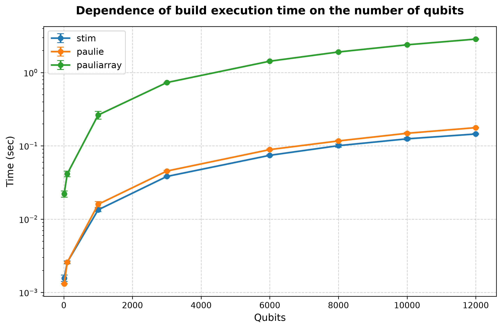
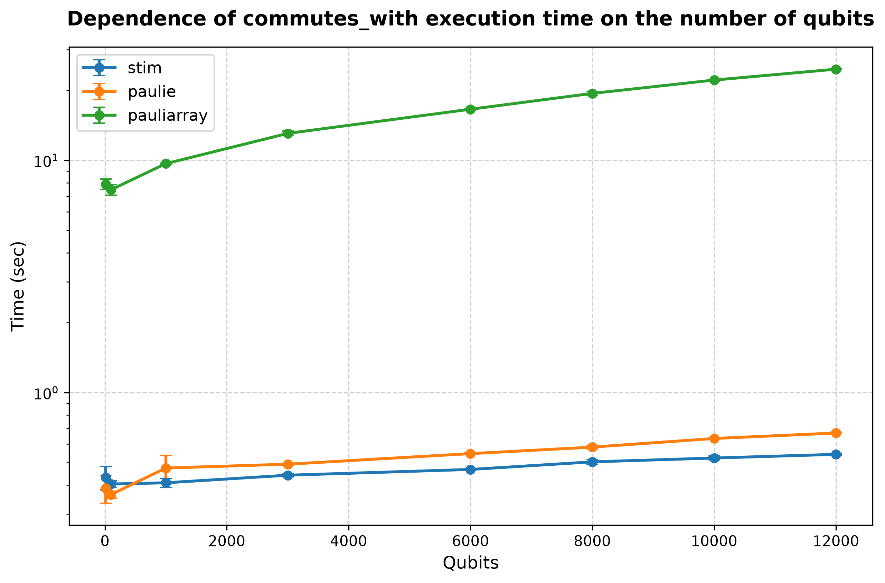
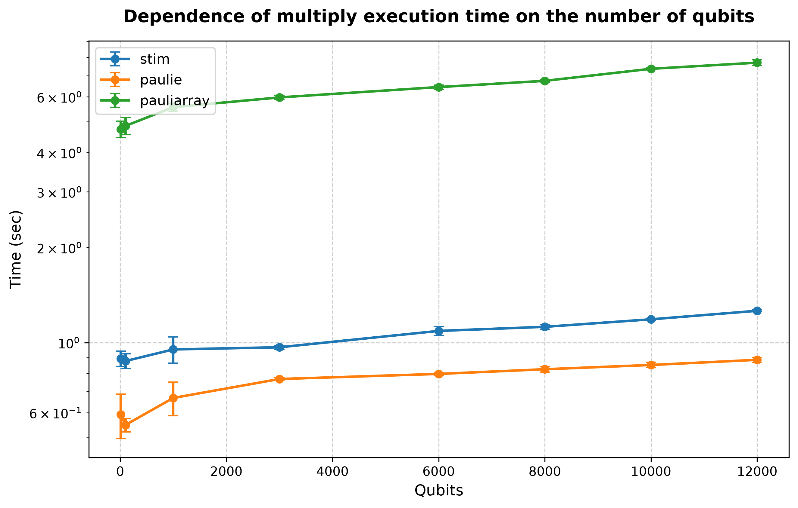

## Processor: Intel(R) Core(TM) i5-8265U CPU @ 1.60GHz

### Performance for build (10 qubits and lenght of list is 1000')) 
| # | stim | paulie | pauliarray |
| :---: | :------: | :------: | :------: |
| 1 | 0.001366 | 0.001321 | 0.019322 |
| 2 | 0.001479 | 0.001306 | 0.021645 |
| 3 | 0.001835 | 0.001294 | 0.026002 |
| 4 | 0.001589 | 0.001309 | 0.022144 |
| 5 | 0.001568 | 0.001327 | 0.021503 |
| avg | 0.001567 | 0.001312 | 0.022123 |
| dev | 0.000155 | 0.000012 | 0.002168 |
### Performance for commutes_with (10 qubits and lenght of list is 1000')) 
| # | stim | paulie | pauliarray |
| :---: | :------: | :------: | :------: |
| 1 | 0.353012 | 0.333262 | 8.581274 |
| 2 | 0.419900 | 0.362337 | 7.595381 |
| 3 | 0.510128 | 0.487047 | 8.188050 |
| 4 | 0.434699 | 0.379090 | 7.589817 |
| 5 | 0.441391 | 0.369446 | 7.559999 |
| avg | 0.431826 | 0.386236 | 7.902904 |
| dev | 0.050169 | 0.052675 | 0.412716 |
### Performance for multiply (10 qubits and lenght of list is 1000')) 
| # | stim | paulie | pauliarray |
| :---: | :------: | :------: | :------: |
| 1 | 0.794769 | 0.489424 | 4.179845 |
| 2 | 0.904118 | 0.561270 | 4.813750 |
| 3 | 0.941058 | 0.772766 | 4.840196 |
| 4 | 0.906309 | 0.577466 | 4.892999 |
| 5 | 0.903476 | 0.558768 | 4.963408 |
| avg | 0.889946 | 0.591939 | 4.738040 |
| dev | 0.049644 | 0.095350 | 0.283744 |
### Performance for build (100 qubits and lenght of list is 1000')) 
| # | stim | paulie | pauliarray |
| :---: | :------: | :------: | :------: |
| 1 | 0.002366 | 0.002563 | 0.036117 |
| 2 | 0.002585 | 0.002691 | 0.040235 |
| 3 | 0.002584 | 0.002462 | 0.041372 |
| 4 | 0.002724 | 0.002581 | 0.042710 |
| 5 | 0.002634 | 0.002577 | 0.047122 |
| avg | 0.002579 | 0.002575 | 0.041511 |
| dev | 0.000118 | 0.000073 | 0.003568 |
### Performance for commutes_with (100 qubits and lenght of list is 1000')) 
| # | stim | paulie | pauliarray |
| :---: | :------: | :------: | :------: |
| 1 | 0.378701 | 0.340217 | 6.700355 |
| 2 | 0.413596 | 0.366889 | 7.709146 |
| 3 | 0.407070 | 0.374419 | 7.697789 |
| 4 | 0.408621 | 0.371016 | 7.681570 |
| 5 | 0.411782 | 0.367962 | 7.598329 |
| avg | 0.403954 | 0.364101 | 7.477438 |
| dev | 0.012833 | 0.012226 | 0.390483 |
### Performance for multiply (100 qubits and lenght of list is 1000')) 
| # | stim | paulie | pauliarray |
| :---: | :------: | :------: | :------: |
| 1 | 0.784418 | 0.496840 | 4.294199 |
| 2 | 0.892596 | 0.549791 | 5.201786 |
| 3 | 0.888932 | 0.571369 | 4.934114 |
| 4 | 0.920783 | 0.565686 | 4.979661 |
| 5 | 0.884053 | 0.559396 | 4.855123 |
| avg | 0.874157 | 0.548617 | 4.852976 |
| dev | 0.046655 | 0.026860 | 0.302171 |
### Performance for build (1000 qubits and lenght of list is 1000')) 
| # | stim | paulie | pauliarray |
| :---: | :------: | :------: | :------: |
| 1 | 0.011930 | 0.013537 | 0.231520 |
| 2 | 0.013638 | 0.018094 | 0.324312 |
| 3 | 0.013702 | 0.016423 | 0.256083 |
| 4 | 0.013612 | 0.015761 | 0.258014 |
| 5 | 0.014124 | 0.015908 | 0.247718 |
| avg | 0.013401 | 0.015945 | 0.263529 |
| dev | 0.000759 | 0.001461 | 0.031796 |
### Performance for commutes_with (1000 qubits and lenght of list is 1000')) 
| # | stim | paulie | pauliarray |
| :---: | :------: | :------: | :------: |
| 1 | 0.374620 | 0.417297 | 9.604810 |
| 2 | 0.419327 | 0.597512 | 9.768816 |
| 3 | 0.425581 | 0.453264 | 9.657597 |
| 4 | 0.414715 | 0.447800 | 9.718567 |
| 5 | 0.411219 | 0.452374 | 9.665711 |
| avg | 0.409092 | 0.473649 | 9.683100 |
| dev | 0.017895 | 0.063331 | 0.056013 |
### Performance for multiply (1000 qubits and lenght of list is 1000')) 
| # | stim | paulie | pauliarray |
| :---: | :------: | :------: | :------: |
| 1 | 0.849403 | 0.602410 | 5.884622 |
| 2 | 1.118937 | 0.828446 | 5.397986 |
| 3 | 0.953584 | 0.641095 | 5.512400 |
| 4 | 0.920472 | 0.637995 | 5.510224 |
| 5 | 0.914218 | 0.629996 | 5.507251 |
| avg | 0.951323 | 0.667988 | 5.562497 |
| dev | 0.090350 | 0.081380 | 0.166807 |
### Performance for build (3000 qubits and lenght of list is 1000')) 
| # | stim | paulie | pauliarray |
| :---: | :------: | :------: | :------: |
| 1 | 0.038070 | 0.043552 | 0.737740 |
| 2 | 0.038162 | 0.046688 | 0.724936 |
| 3 | 0.039003 | 0.045262 | 0.728368 |
| 4 | 0.038533 | 0.045501 | 0.739927 |
| 5 | 0.037308 | 0.045525 | 0.722223 |
| avg | 0.038215 | 0.045305 | 0.730639 |
| dev | 0.000560 | 0.001007 | 0.007003 |
### Performance for commutes_with (3000 qubits and lenght of list is 1000')) 
| # | stim | paulie | pauliarray |
| :---: | :------: | :------: | :------: |
| 1 | 0.450393 | 0.485329 | 13.591780 |
| 2 | 0.441674 | 0.495739 | 12.892267 |
| 3 | 0.433615 | 0.494817 | 13.128158 |
| 4 | 0.444872 | 0.490403 | 12.891711 |
| 5 | 0.434208 | 0.492926 | 12.820569 |
| avg | 0.440953 | 0.491843 | 13.064897 |
| dev | 0.006393 | 0.003734 | 0.283231 |
### Performance for multiply (3000 qubits and lenght of list is 1000')) 
| # | stim | paulie | pauliarray |
| :---: | :------: | :------: | :------: |
| 1 | 0.941539 | 0.774279 | 5.966005 |
| 2 | 0.978076 | 0.757191 | 6.107704 |
| 3 | 0.962401 | 0.763929 | 5.864910 |
| 4 | 0.977220 | 0.780315 | 5.897591 |
| 5 | 0.972900 | 0.758147 | 6.030768 |
| avg | 0.966427 | 0.766772 | 5.973395 |
| dev | 0.013636 | 0.009100 | 0.088205 |
### Performance for build (6000 qubits and lenght of list is 1000')) 
| # | stim | paulie | pauliarray |
| :---: | :------: | :------: | :------: |
| 1 | 0.076197 | 0.086318 | 1.419967 |
| 2 | 0.074995 | 0.087667 | 1.422766 |
| 3 | 0.072954 | 0.091344 | 1.421443 |
| 4 | 0.072677 | 0.091336 | 1.439815 |
| 5 | 0.074473 | 0.088002 | 1.447210 |
| avg | 0.074259 | 0.088933 | 1.430240 |
| dev | 0.001308 | 0.002044 | 0.011122 |
### Performance for commutes_with (6000 qubits and lenght of list is 1000')) 
| # | stim | paulie | pauliarray |
| :---: | :------: | :------: | :------: |
| 1 | 0.465627 | 0.534567 | 16.413814 |
| 2 | 0.465522 | 0.548393 | 16.439872 |
| 3 | 0.464501 | 0.553990 | 16.597705 |
| 4 | 0.472664 | 0.549290 | 16.774738 |
| 5 | 0.466177 | 0.544498 | 16.798106 |
| avg | 0.466898 | 0.546148 | 16.604847 |
| dev | 0.002933 | 0.006531 | 0.161228 |
### Performance for multiply (6000 qubits and lenght of list is 1000')) 
| # | stim | paulie | pauliarray |
| :---: | :------: | :------: | :------: |
| 1 | 1.063543 | 0.780346 | 6.505555 |
| 2 | 1.150621 | 0.792072 | 6.381626 |
| 3 | 1.051071 | 0.804648 | 6.337936 |
| 4 | 1.070850 | 0.797536 | 6.607801 |
| 5 | 1.108006 | 0.804563 | 6.371376 |
| avg | 1.088818 | 0.795833 | 6.440859 |
| dev | 0.036261 | 0.009064 | 0.100980 |
### Performance for build (8000 qubits and lenght of list is 1000')) 
| # | stim | paulie | pauliarray |
| :---: | :------: | :------: | :------: |
| 1 | 0.106999 | 0.115234 | 1.894704 |
| 2 | 0.097233 | 0.115627 | 1.884772 |
| 3 | 0.096650 | 0.117307 | 1.915792 |
| 4 | 0.106051 | 0.121320 | 1.959231 |
| 5 | 0.096094 | 0.114430 | 1.900231 |
| avg | 0.100605 | 0.116784 | 1.910946 |
| dev | 0.004856 | 0.002455 | 0.026148 |
### Performance for commutes_with (8000 qubits and lenght of list is 1000')) 
| # | stim | paulie | pauliarray |
| :---: | :------: | :------: | :------: |
| 1 | 0.512822 | 0.571577 | 20.164131 |
| 2 | 0.498742 | 0.580407 | 19.124561 |
| 3 | 0.493582 | 0.597745 | 19.169883 |
| 4 | 0.522142 | 0.573953 | 19.206850 |
| 5 | 0.489647 | 0.589040 | 19.463350 |
| avg | 0.503387 | 0.582544 | 19.425755 |
| dev | 0.012225 | 0.009715 | 0.387484 |
### Performance for multiply (8000 qubits and lenght of list is 1000')) 
| # | stim | paulie | pauliarray |
| :---: | :------: | :------: | :------: |
| 1 | 1.125705 | 0.806301 | 6.828596 |
| 2 | 1.101313 | 0.820506 | 6.718065 |
| 3 | 1.108121 | 0.854188 | 6.665692 |
| 4 | 1.153543 | 0.811425 | 6.723239 |
| 5 | 1.120395 | 0.824520 | 6.766608 |
| avg | 1.121815 | 0.823388 | 6.740440 |
| dev | 0.018065 | 0.016693 | 0.054479 |
### Performance for build (10000 qubits and lenght of list is 1000')) 
| # | stim | paulie | pauliarray |
| :---: | :------: | :------: | :------: |
| 1 | 0.131863 | 0.141583 | 2.359013 |
| 2 | 0.124373 | 0.150832 | 2.394171 |
| 3 | 0.126706 | 0.152363 | 2.412995 |
| 4 | 0.120493 | 0.151876 | 2.374792 |
| 5 | 0.120011 | 0.146015 | 2.427159 |
| avg | 0.124689 | 0.148534 | 2.393626 |
| dev | 0.004362 | 0.004142 | 0.024709 |
### Performance for commutes_with (10000 qubits and lenght of list is 1000')) 
| # | stim | paulie | pauliarray |
| :---: | :------: | :------: | :------: |
| 1 | 0.541560 | 0.635781 | 22.015292 |
| 2 | 0.519870 | 0.629948 | 22.017709 |
| 3 | 0.519536 | 0.635996 | 22.038136 |
| 4 | 0.513980 | 0.631312 | 22.450652 |
| 5 | 0.519560 | 0.639978 | 22.326900 |
| avg | 0.522901 | 0.634603 | 22.169738 |
| dev | 0.009586 | 0.003598 | 0.183247 |
### Performance for multiply (10000 qubits and lenght of list is 1000')) 
| # | stim | paulie | pauliarray |
| :---: | :------: | :------: | :------: |
| 1 | 1.182052 | 0.825622 | 7.357113 |
| 2 | 1.185163 | 0.856310 | 7.372766 |
| 3 | 1.181837 | 0.874196 | 7.277149 |
| 4 | 1.202102 | 0.852873 | 7.395102 |
| 5 | 1.173131 | 0.838170 | 7.395362 |
| avg | 1.184857 | 0.849434 | 7.359499 |
| dev | 0.009508 | 0.016530 | 0.043628 |
### Performance for build (12000 qubits and lenght of list is 1000')) 
| # | stim | paulie | pauliarray |
| :---: | :------: | :------: | :------: |
| 1 | 0.146629 | 0.174476 | 2.875479 |
| 2 | 0.146981 | 0.178165 | 2.894146 |
| 3 | 0.147609 | 0.176673 | 2.817988 |
| 4 | 0.141018 | 0.175956 | 2.837581 |
| 5 | 0.143255 | 0.180788 | 2.887531 |
| avg | 0.145099 | 0.177212 | 2.862545 |
| dev | 0.002539 | 0.002147 | 0.029661 |
### Performance for commutes_with (12000 qubits and lenght of list is 1000')) 
| # | stim | paulie | pauliarray |
| :---: | :------: | :------: | :------: |
| 1 | 0.534767 | 0.666974 | 24.859118 |
| 2 | 0.548608 | 0.678076 | 24.507620 |
| 3 | 0.544284 | 0.669890 | 24.614529 |
| 4 | 0.541691 | 0.668326 | 24.760889 |
| 5 | 0.542001 | 0.666899 | 24.719069 |
| avg | 0.542270 | 0.670033 | 24.692245 |
| dev | 0.004493 | 0.004167 | 0.121165 |
### Performance for multiply (12000 qubits and lenght of list is 1000')) 
| # | stim | paulie | pauliarray |
| :---: | :------: | :------: | :------: |
| 1 | 1.251690 | 0.855762 | 7.524954 |
| 2 | 1.259449 | 0.873561 | 7.985798 |
| 3 | 1.259215 | 0.882166 | 7.727293 |
| 4 | 1.254761 | 0.897851 | 7.627556 |
| 5 | 1.279314 | 0.899998 | 7.610121 |
| avg | 1.260886 | 0.881868 | 7.695144 |
| dev | 0.009659 | 0.016339 | 0.158918 |
