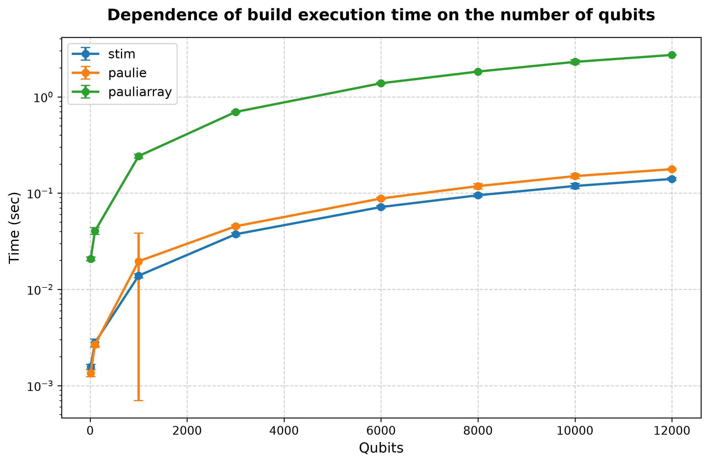
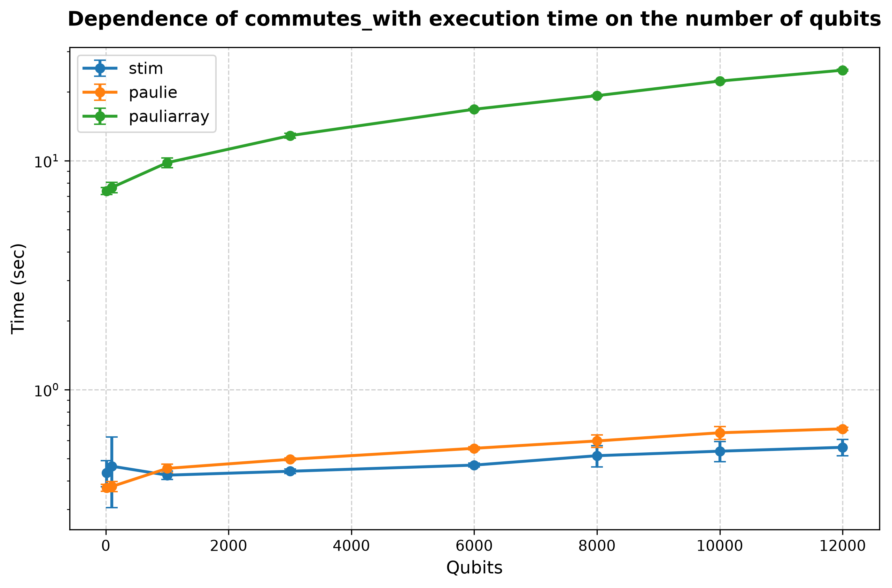
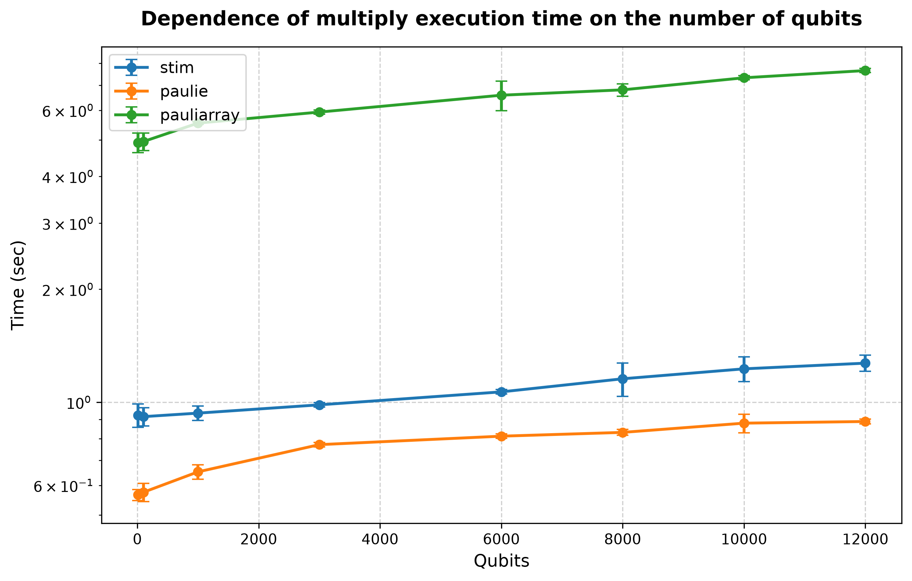

## Processor: Intel(R) Core(TM) i5-8265U CPU @ 1.60GHz

### Performance for build (10 qubits and lenght of list is 1000')) 
| # | stim | paulie | pauliarray |
| :---: | :------: | :------: | :------: |
| 1 | 0.001555 | 0.001135 | 0.018696 |
| 2 | 0.001605 | 0.001557 | 0.021252 |
| 3 | 0.001503 | 0.001266 | 0.019851 |
| 4 | 0.001538 | 0.001214 | 0.021762 |
| 5 | 0.001560 | 0.001263 | 0.020743 |
| 6 | 0.001590 | 0.001616 | 0.020188 |
| 7 | 0.001492 | 0.001469 | 0.021029 |
| 8 | 0.001965 | 0.001319 | 0.021012 |
| 9 | 0.001497 | 0.001240 | 0.019889 |
| 10 | 0.001563 | 0.001335 | 0.020744 |
| 11 | 0.001639 | 0.001345 | 0.020366 |
| 12 | 0.001720 | 0.001325 | 0.022752 |
| 13 | 0.001578 | 0.001265 | 0.021804 |
| 14 | 0.001585 | 0.001358 | 0.020461 |
| 15 | 0.001523 | 0.001294 | 0.020270 |
| 16 | 0.001607 | 0.001345 | 0.019744 |
| 17 | 0.001485 | 0.001665 | 0.019876 |
| 18 | 0.001517 | 0.001398 | 0.021073 |
| 19 | 0.001481 | 0.001317 | 0.021194 |
| 20 | 0.001571 | 0.001356 | 0.022652 |
| 21 | 0.001614 | 0.001371 | 0.020570 |
| 22 | 0.001531 | 0.001238 | 0.019558 |
| 23 | 0.001637 | 0.001355 | 0.019626 |
| 24 | 0.001591 | 0.001335 | 0.021700 |
| 25 | 0.001545 | 0.001282 | 0.019908 |
| 26 | 0.001532 | 0.001399 | 0.020113 |
| 27 | 0.001592 | 0.001302 | 0.021301 |
| 28 | 0.001466 | 0.001422 | 0.021189 |
| 29 | 0.001493 | 0.001294 | 0.022199 |
| 30 | 0.001545 | 0.001306 | 0.019229 |
| avg | 0.001571 | 0.001346 | 0.020692 |
| dev | 0.000092 | 0.000111 | 0.000972 |
### Performance for commutes_with (10 qubits and lenght of list is 1000')) 
| # | stim | paulie | pauliarray |
| :---: | :------: | :------: | :------: |
| 1 | 0.356344 | 0.314831 | 6.366719 |
| 2 | 0.404172 | 0.363040 | 7.318597 |
| 3 | 0.605153 | 0.370699 | 7.401815 |
| 4 | 0.414565 | 0.391919 | 7.434269 |
| 5 | 0.411739 | 0.373551 | 7.529961 |
| 6 | 0.421809 | 0.368007 | 7.422079 |
| 7 | 0.426544 | 0.373419 | 7.386376 |
| 8 | 0.413078 | 0.374858 | 7.351094 |
| 9 | 0.414533 | 0.366650 | 7.421083 |
| 10 | 0.413546 | 0.368188 | 7.321641 |
| 11 | 0.457872 | 0.391029 | 7.358425 |
| 12 | 0.586779 | 0.396580 | 7.367861 |
| 13 | 0.411692 | 0.364246 | 7.382702 |
| 14 | 0.411894 | 0.383857 | 7.331879 |
| 15 | 0.407084 | 0.377943 | 8.343328 |
| 16 | 0.600305 | 0.370643 | 7.408741 |
| 17 | 0.413978 | 0.370556 | 7.358572 |
| 18 | 0.414238 | 0.377332 | 7.371559 |
| 19 | 0.417072 | 0.373034 | 7.369339 |
| 20 | 0.415261 | 0.374455 | 7.393754 |
| 21 | 0.436913 | 0.380612 | 7.377404 |
| 22 | 0.409242 | 0.379286 | 7.393044 |
| 23 | 0.424381 | 0.362253 | 7.374386 |
| 24 | 0.423055 | 0.376306 | 7.330627 |
| 25 | 0.416383 | 0.377350 | 7.350548 |
| 26 | 0.411383 | 0.378716 | 7.308963 |
| 27 | 0.412071 | 0.367769 | 7.427334 |
| 28 | 0.415151 | 0.365030 | 7.400916 |
| 29 | 0.418306 | 0.371821 | 7.439991 |
| 30 | 0.414121 | 0.371596 | 7.470613 |
| avg | 0.433289 | 0.372519 | 7.383787 |
| dev | 0.056672 | 0.013458 | 0.259446 |
### Performance for multiply (10 qubits and lenght of list is 1000')) 
| # | stim | paulie | pauliarray |
| :---: | :------: | :------: | :------: |
| 1 | 0.783175 | 0.476569 | 4.198647 |
| 2 | 0.897227 | 0.557169 | 4.909583 |
| 3 | 1.090397 | 0.569841 | 4.846141 |
| 4 | 0.896420 | 0.587239 | 4.870882 |
| 5 | 0.901253 | 0.556636 | 4.963679 |
| 6 | 0.906679 | 0.582573 | 4.838634 |
| 7 | 0.902454 | 0.570868 | 4.815190 |
| 8 | 0.900697 | 0.562979 | 5.910561 |
| 9 | 0.915251 | 0.569146 | 4.870809 |
| 10 | 0.906976 | 0.577553 | 4.816637 |
| 11 | 0.922670 | 0.579651 | 4.917913 |
| 12 | 1.112778 | 0.576068 | 4.855596 |
| 13 | 0.888724 | 0.556472 | 4.840681 |
| 14 | 0.897817 | 0.564010 | 4.804417 |
| 15 | 0.926682 | 0.564892 | 5.880949 |
| 16 | 1.121195 | 0.562206 | 4.835398 |
| 17 | 0.895082 | 0.570232 | 4.893746 |
| 18 | 0.904564 | 0.553978 | 4.828416 |
| 19 | 0.904850 | 0.568719 | 4.849462 |
| 20 | 0.922881 | 0.591750 | 5.140398 |
| 21 | 0.911069 | 0.571541 | 4.873443 |
| 22 | 0.912551 | 0.566178 | 4.854200 |
| 23 | 0.901781 | 0.563321 | 4.903230 |
| 24 | 0.926486 | 0.576491 | 4.825676 |
| 25 | 0.913684 | 0.562277 | 4.821344 |
| 26 | 0.908817 | 0.585017 | 4.938702 |
| 27 | 0.894360 | 0.562784 | 4.876321 |
| 28 | 0.925167 | 0.568919 | 4.826651 |
| 29 | 0.899375 | 0.568124 | 4.900898 |
| 30 | 0.900236 | 0.568457 | 4.908071 |
| avg | 0.923043 | 0.566389 | 4.920543 |
| dev | 0.066431 | 0.019026 | 0.294168 |
### Performance for build (100 qubits and lenght of list is 1000')) 
| # | stim | paulie | pauliarray |
| :---: | :------: | :------: | :------: |
| 1 | 0.002324 | 0.002304 | 0.035157 |
| 2 | 0.002832 | 0.002566 | 0.039914 |
| 3 | 0.002744 | 0.002646 | 0.041768 |
| 4 | 0.002813 | 0.002707 | 0.046719 |
| 5 | 0.002827 | 0.002630 | 0.039876 |
| 6 | 0.002644 | 0.002849 | 0.037938 |
| 7 | 0.002656 | 0.002546 | 0.040220 |
| 8 | 0.003027 | 0.003185 | 0.051155 |
| 9 | 0.002560 | 0.002651 | 0.040683 |
| 10 | 0.002863 | 0.002640 | 0.037811 |
| 11 | 0.002840 | 0.002645 | 0.041682 |
| 12 | 0.002780 | 0.002727 | 0.037375 |
| 13 | 0.002603 | 0.002752 | 0.038511 |
| 14 | 0.002886 | 0.002647 | 0.037636 |
| 15 | 0.003922 | 0.002952 | 0.048961 |
| 16 | 0.002923 | 0.002843 | 0.042223 |
| 17 | 0.002899 | 0.002566 | 0.039951 |
| 18 | 0.002776 | 0.002770 | 0.038610 |
| 19 | 0.002621 | 0.002704 | 0.039176 |
| 20 | 0.002741 | 0.002478 | 0.037202 |
| 21 | 0.002861 | 0.002743 | 0.041679 |
| 22 | 0.002736 | 0.002433 | 0.040323 |
| 23 | 0.002786 | 0.002687 | 0.037116 |
| 24 | 0.002936 | 0.002800 | 0.038391 |
| 25 | 0.002690 | 0.002736 | 0.039481 |
| 26 | 0.002640 | 0.002552 | 0.040166 |
| 27 | 0.002733 | 0.002656 | 0.040542 |
| 28 | 0.002622 | 0.002596 | 0.040336 |
| 29 | 0.002689 | 0.002506 | 0.042370 |
| 30 | 0.003012 | 0.002506 | 0.041023 |
| avg | 0.002799 | 0.002667 | 0.040467 |
| dev | 0.000253 | 0.000163 | 0.003335 |
### Performance for commutes_with (100 qubits and lenght of list is 1000')) 
| # | stim | paulie | pauliarray |
| :---: | :------: | :------: | :------: |
| 1 | 0.367464 | 0.334566 | 6.659493 |
| 2 | 0.415010 | 0.370583 | 7.561133 |
| 3 | 0.409500 | 0.366061 | 7.526061 |
| 4 | 0.404804 | 0.392313 | 7.864773 |
| 5 | 0.425643 | 0.372232 | 7.649760 |
| 6 | 0.420242 | 0.387097 | 7.579404 |
| 7 | 0.412255 | 0.370528 | 7.563582 |
| 8 | 0.511592 | 0.444382 | 9.376063 |
| 9 | 0.416182 | 0.373611 | 7.525806 |
| 10 | 0.405998 | 0.378664 | 7.567430 |
| 11 | 0.418868 | 0.365539 | 7.563171 |
| 12 | 0.412276 | 0.365589 | 7.518533 |
| 13 | 0.425606 | 0.376691 | 7.759808 |
| 14 | 0.426165 | 0.372987 | 7.699546 |
| 15 | 0.497026 | 0.428239 | 8.438165 |
| 16 | 0.413629 | 0.374080 | 7.556468 |
| 17 | 1.037071 | 0.373463 | 7.511783 |
| 18 | 0.416574 | 0.382548 | 7.498345 |
| 19 | 0.410474 | 0.377629 | 7.562607 |
| 20 | 1.054484 | 0.371520 | 7.613467 |
| 21 | 0.424974 | 0.367941 | 7.593458 |
| 22 | 0.415219 | 0.372472 | 7.667693 |
| 23 | 0.422466 | 0.378851 | 7.554106 |
| 24 | 0.417482 | 0.373835 | 7.544496 |
| 25 | 0.418749 | 0.369178 | 7.598940 |
| 26 | 0.413842 | 0.381086 | 7.659795 |
| 27 | 0.411964 | 0.370984 | 7.540416 |
| 28 | 0.412460 | 0.361654 | 7.534363 |
| 29 | 0.425923 | 0.388176 | 7.635549 |
| 30 | 0.415017 | 0.377113 | 7.550809 |
| avg | 0.462632 | 0.377320 | 7.649168 |
| dev | 0.157811 | 0.018699 | 0.401945 |
### Performance for multiply (100 qubits and lenght of list is 1000')) 
| # | stim | paulie | pauliarray |
| :---: | :------: | :------: | :------: |
| 1 | 0.823436 | 0.515621 | 4.392170 |
| 2 | 0.895892 | 0.569436 | 5.678991 |
| 3 | 0.907060 | 0.573366 | 4.899102 |
| 4 | 0.890956 | 0.614171 | 4.917072 |
| 5 | 0.902896 | 0.553711 | 4.924454 |
| 6 | 0.910447 | 0.568152 | 4.858981 |
| 7 | 0.911678 | 0.596673 | 4.930021 |
| 8 | 1.129446 | 0.686124 | 6.038827 |
| 9 | 0.909182 | 0.570734 | 5.138395 |
| 10 | 0.905069 | 0.554160 | 4.866352 |
| 11 | 0.919289 | 0.569114 | 4.856815 |
| 12 | 0.909331 | 0.575362 | 4.858172 |
| 13 | 0.906019 | 0.556583 | 4.927858 |
| 14 | 0.904852 | 0.581651 | 4.840300 |
| 15 | 1.054245 | 0.674351 | 4.935910 |
| 16 | 0.906252 | 0.571972 | 4.904355 |
| 17 | 0.888030 | 0.576131 | 4.875059 |
| 18 | 0.908028 | 0.567446 | 4.910422 |
| 19 | 0.910162 | 0.563105 | 4.885525 |
| 20 | 0.903495 | 0.563957 | 4.867906 |
| 21 | 0.906997 | 0.563272 | 4.873888 |
| 22 | 0.917291 | 0.550034 | 4.869159 |
| 23 | 0.910065 | 0.555116 | 4.891133 |
| 24 | 0.902190 | 0.564622 | 4.928739 |
| 25 | 0.897847 | 0.566457 | 4.907602 |
| 26 | 0.899132 | 0.568347 | 4.903003 |
| 27 | 0.906507 | 0.559672 | 4.902502 |
| 28 | 0.909501 | 0.584818 | 4.930985 |
| 29 | 0.911585 | 0.577986 | 4.930324 |
| 30 | 0.896465 | 0.571056 | 4.881760 |
| avg | 0.915111 | 0.575440 | 4.950859 |
| dev | 0.050853 | 0.032257 | 0.268424 |
### Performance for build (1000 qubits and lenght of list is 1000')) 
| # | stim | paulie | pauliarray |
| :---: | :------: | :------: | :------: |
| 1 | 0.012763 | 0.013688 | 0.232702 |
| 2 | 0.014499 | 0.015913 | 0.240163 |
| 3 | 0.013583 | 0.015810 | 0.256452 |
| 4 | 0.013931 | 0.017273 | 0.226198 |
| 5 | 0.014098 | 0.015340 | 0.249265 |
| 6 | 0.013773 | 0.016065 | 0.242772 |
| 7 | 0.013687 | 0.016068 | 0.234409 |
| 8 | 0.016792 | 0.019822 | 0.293808 |
| 9 | 0.014011 | 0.016035 | 0.242451 |
| 10 | 0.014424 | 0.016211 | 0.236054 |
| 11 | 0.013526 | 0.016472 | 0.236858 |
| 12 | 0.013088 | 0.016100 | 0.238369 |
| 13 | 0.014529 | 0.015474 | 0.243737 |
| 14 | 0.013504 | 0.014949 | 0.233154 |
| 15 | 0.013491 | 0.016088 | 0.244666 |
| 16 | 0.013577 | 0.016070 | 0.251834 |
| 17 | 0.013368 | 0.016193 | 0.233471 |
| 18 | 0.013617 | 0.016139 | 0.243247 |
| 19 | 0.013783 | 0.016764 | 0.243524 |
| 20 | 0.013897 | 0.015598 | 0.242575 |
| 21 | 0.014070 | 0.015787 | 0.235583 |
| 22 | 0.013909 | 0.015808 | 0.241407 |
| 23 | 0.014633 | 0.015380 | 0.234623 |
| 24 | 0.013407 | 0.016220 | 0.237302 |
| 25 | 0.013644 | 0.016509 | 0.245442 |
| 26 | 0.014319 | 0.015474 | 0.235083 |
| 27 | 0.013539 | 0.016625 | 0.233256 |
| 28 | 0.013552 | 0.016186 | 0.242864 |
| 29 | 0.013676 | 0.121175 | 0.252119 |
| 30 | 0.013907 | 0.016353 | 0.234071 |
| avg | 0.013887 | 0.019586 | 0.241915 |
| dev | 0.000680 | 0.018888 | 0.011691 |
### Performance for commutes_with (1000 qubits and lenght of list is 1000')) 
| # | stim | paulie | pauliarray |
| :---: | :------: | :------: | :------: |
| 1 | 0.378505 | 0.420273 | 9.366912 |
| 2 | 0.417021 | 0.446544 | 9.652567 |
| 3 | 0.417106 | 0.450330 | 9.622227 |
| 4 | 0.417675 | 0.457300 | 9.654711 |
| 5 | 0.431479 | 0.440957 | 9.646187 |
| 6 | 0.411351 | 0.445659 | 9.665692 |
| 7 | 0.422006 | 0.465653 | 9.629296 |
| 8 | 0.506817 | 0.542195 | 11.760987 |
| 9 | 0.428854 | 0.451813 | 9.626194 |
| 10 | 0.429138 | 0.456291 | 9.684859 |
| 11 | 0.430173 | 0.444483 | 9.740482 |
| 12 | 0.421354 | 0.453602 | 9.629512 |
| 13 | 0.427468 | 0.445332 | 9.630197 |
| 14 | 0.430067 | 0.437868 | 9.614097 |
| 15 | 0.418034 | 0.459739 | 9.650732 |
| 16 | 0.411093 | 0.437603 | 9.629250 |
| 17 | 0.421021 | 0.454142 | 10.927556 |
| 18 | 0.422589 | 0.458088 | 9.936061 |
| 19 | 0.415109 | 0.446249 | 9.681528 |
| 20 | 0.417376 | 0.451789 | 9.667743 |
| 21 | 0.419190 | 0.446590 | 9.661055 |
| 22 | 0.421468 | 0.471441 | 9.925856 |
| 23 | 0.423107 | 0.445304 | 9.733045 |
| 24 | 0.418962 | 0.449968 | 9.696391 |
| 25 | 0.423846 | 0.459470 | 10.762135 |
| 26 | 0.422080 | 0.442194 | 9.604876 |
| 27 | 0.423375 | 0.442277 | 9.663973 |
| 28 | 0.417388 | 0.468148 | 9.641878 |
| 29 | 0.425019 | 0.457771 | 9.652817 |
| 30 | 0.417553 | 0.431909 | 9.671108 |
| avg | 0.422874 | 0.452699 | 9.814331 |
| dev | 0.018141 | 0.019664 | 0.475409 |
### Performance for multiply (1000 qubits and lenght of list is 1000')) 
| # | stim | paulie | pauliarray |
| :---: | :------: | :------: | :------: |
| 1 | 0.859007 | 0.600162 | 5.561140 |
| 2 | 0.915611 | 0.644003 | 5.587033 |
| 3 | 0.930971 | 0.639709 | 5.567044 |
| 4 | 0.939493 | 0.657731 | 5.534764 |
| 5 | 0.917874 | 0.636534 | 5.633216 |
| 6 | 0.933122 | 0.651945 | 5.497731 |
| 7 | 0.934882 | 0.663772 | 5.514998 |
| 8 | 1.139273 | 0.786484 | 5.500874 |
| 9 | 0.929797 | 0.647372 | 5.479369 |
| 10 | 0.949809 | 0.664291 | 5.503068 |
| 11 | 0.930535 | 0.658284 | 5.533098 |
| 12 | 0.921283 | 0.659581 | 5.515794 |
| 13 | 0.914235 | 0.659314 | 5.506085 |
| 14 | 0.912272 | 0.633851 | 5.552060 |
| 15 | 0.954304 | 0.654160 | 5.548929 |
| 16 | 0.938028 | 0.646148 | 5.525743 |
| 17 | 0.918898 | 0.654193 | 5.548704 |
| 18 | 0.924727 | 0.648704 | 5.519610 |
| 19 | 0.930134 | 0.646277 | 5.510112 |
| 20 | 0.936846 | 0.640182 | 5.549539 |
| 21 | 0.939353 | 0.656046 | 5.651658 |
| 22 | 0.950341 | 0.647158 | 5.528562 |
| 23 | 0.917876 | 0.683254 | 5.658393 |
| 24 | 0.929716 | 0.656687 | 5.534667 |
| 25 | 0.932707 | 0.629886 | 5.516343 |
| 26 | 0.913903 | 0.658094 | 5.541176 |
| 27 | 0.929330 | 0.636196 | 5.516659 |
| 28 | 0.914155 | 0.642154 | 5.556230 |
| 29 | 0.937804 | 0.610096 | 5.604921 |
| 30 | 0.956334 | 0.652150 | 5.532153 |
| avg | 0.935087 | 0.652147 | 5.544322 |
| dev | 0.041770 | 0.029408 | 0.043400 |
### Performance for build (3000 qubits and lenght of list is 1000')) 
| # | stim | paulie | pauliarray |
| :---: | :------: | :------: | :------: |
| 1 | 0.038190 | 0.045059 | 0.683549 |
| 2 | 0.037223 | 0.043820 | 0.672284 |
| 3 | 0.038663 | 0.046116 | 0.697627 |
| 4 | 0.036155 | 0.048553 | 0.705213 |
| 5 | 0.037025 | 0.046222 | 0.702978 |
| 6 | 0.035844 | 0.043241 | 0.701985 |
| 7 | 0.037769 | 0.045015 | 0.697648 |
| 8 | 0.036900 | 0.044563 | 0.714330 |
| 9 | 0.037379 | 0.046747 | 0.695379 |
| 10 | 0.037769 | 0.045666 | 0.693257 |
| 11 | 0.036516 | 0.044384 | 0.701810 |
| 12 | 0.037185 | 0.044943 | 0.701892 |
| 13 | 0.033888 | 0.043191 | 0.690647 |
| 14 | 0.036067 | 0.045539 | 0.704978 |
| 15 | 0.038888 | 0.045314 | 0.684402 |
| 16 | 0.036902 | 0.045969 | 0.709897 |
| 17 | 0.038855 | 0.045163 | 0.686510 |
| 18 | 0.038375 | 0.046734 | 0.687628 |
| 19 | 0.036281 | 0.045116 | 0.701772 |
| 20 | 0.037891 | 0.047053 | 0.697415 |
| 21 | 0.036886 | 0.045008 | 0.693341 |
| 22 | 0.037611 | 0.045479 | 0.715791 |
| 23 | 0.038361 | 0.045088 | 0.694193 |
| 24 | 0.037658 | 0.045222 | 0.720071 |
| 25 | 0.037633 | 0.046146 | 0.680396 |
| 26 | 0.041035 | 0.044996 | 0.697835 |
| 27 | 0.037085 | 0.044345 | 0.687770 |
| 28 | 0.037781 | 0.045274 | 0.678538 |
| 29 | 0.037865 | 0.043839 | 0.697653 |
| 30 | 0.034933 | 0.044097 | 0.689812 |
| avg | 0.037354 | 0.045263 | 0.696220 |
| dev | 0.001290 | 0.001125 | 0.010920 |
### Performance for commutes_with (3000 qubits and lenght of list is 1000')) 
| # | stim | paulie | pauliarray |
| :---: | :------: | :------: | :------: |
| 1 | 0.453599 | 0.486875 | 12.753197 |
| 2 | 0.441447 | 0.483834 | 12.848104 |
| 3 | 0.434195 | 0.489663 | 12.776751 |
| 4 | 0.440253 | 0.504479 | 12.796085 |
| 5 | 0.427360 | 0.493356 | 12.810261 |
| 6 | 0.446944 | 0.500624 | 12.794161 |
| 7 | 0.445905 | 0.505119 | 13.003797 |
| 8 | 0.429820 | 0.486688 | 12.759400 |
| 9 | 0.430476 | 0.488072 | 12.735228 |
| 10 | 0.444323 | 0.497147 | 12.806268 |
| 11 | 0.442530 | 0.500679 | 12.800662 |
| 12 | 0.441294 | 0.497260 | 12.753339 |
| 13 | 0.430016 | 0.483097 | 12.915688 |
| 14 | 0.438599 | 0.493754 | 12.800165 |
| 15 | 0.443003 | 0.496601 | 12.790408 |
| 16 | 0.441752 | 0.497342 | 12.878180 |
| 17 | 0.450202 | 0.485953 | 12.850493 |
| 18 | 0.447592 | 0.492426 | 12.861928 |
| 19 | 0.443135 | 0.495232 | 12.813792 |
| 20 | 0.433925 | 0.503330 | 12.957261 |
| 21 | 0.430343 | 0.497125 | 14.597228 |
| 22 | 0.411308 | 0.492446 | 12.759001 |
| 23 | 0.445906 | 0.507992 | 12.718073 |
| 24 | 0.436492 | 0.499913 | 12.839249 |
| 25 | 0.421812 | 0.513712 | 12.829967 |
| 26 | 0.467169 | 0.490432 | 12.806725 |
| 27 | 0.449832 | 0.493773 | 12.754764 |
| 28 | 0.445540 | 0.505518 | 12.812341 |
| 29 | 0.440547 | 0.497594 | 12.914096 |
| 30 | 0.438327 | 0.496902 | 12.843093 |
| avg | 0.439788 | 0.495898 | 12.879323 |
| dev | 0.010277 | 0.007274 | 0.325315 |
### Performance for multiply (3000 qubits and lenght of list is 1000')) 
| # | stim | paulie | pauliarray |
| :---: | :------: | :------: | :------: |
| 1 | 0.969426 | 0.765292 | 5.806495 |
| 2 | 0.979968 | 0.762332 | 6.159649 |
| 3 | 1.013596 | 0.756624 | 6.107927 |
| 4 | 0.995224 | 0.781072 | 5.989940 |
| 5 | 0.975917 | 0.769429 | 5.879724 |
| 6 | 0.971710 | 0.775607 | 5.957836 |
| 7 | 0.984596 | 0.783212 | 5.864927 |
| 8 | 0.989003 | 0.764943 | 5.950739 |
| 9 | 0.983720 | 0.775901 | 6.016697 |
| 10 | 0.982035 | 0.761192 | 5.888964 |
| 11 | 0.962061 | 0.762166 | 5.886283 |
| 12 | 0.971960 | 0.769514 | 6.048465 |
| 13 | 0.997055 | 0.767215 | 5.885980 |
| 14 | 0.978836 | 0.773514 | 5.878040 |
| 15 | 0.979865 | 0.760562 | 5.863395 |
| 16 | 0.985562 | 0.781143 | 5.860219 |
| 17 | 0.979111 | 0.766399 | 5.957508 |
| 18 | 0.974835 | 0.772158 | 5.887677 |
| 19 | 0.985924 | 0.764845 | 5.978746 |
| 20 | 1.006843 | 0.752567 | 5.930773 |
| 21 | 0.980530 | 0.770143 | 5.900979 |
| 22 | 0.997739 | 0.756512 | 5.902589 |
| 23 | 0.988776 | 0.788764 | 5.969627 |
| 24 | 0.983994 | 0.766781 | 5.872848 |
| 25 | 0.985982 | 0.788811 | 5.883528 |
| 26 | 0.998665 | 0.771414 | 5.927767 |
| 27 | 0.989042 | 0.782328 | 5.873324 |
| 28 | 0.946751 | 0.758476 | 5.875699 |
| 29 | 0.984203 | 0.775936 | 5.918102 |
| 30 | 0.993012 | 0.794469 | 6.025252 |
| avg | 0.983865 | 0.770644 | 5.931657 |
| dev | 0.012766 | 0.010290 | 0.077268 |
### Performance for build (6000 qubits and lenght of list is 1000')) 
| # | stim | paulie | pauliarray |
| :---: | :------: | :------: | :------: |
| 1 | 0.078240 | 0.088945 | 1.417397 |
| 2 | 0.075184 | 0.091666 | 1.356369 |
| 3 | 0.073601 | 0.088273 | 1.395974 |
| 4 | 0.071590 | 0.092139 | 1.390785 |
| 5 | 0.072245 | 0.089551 | 1.369488 |
| 6 | 0.070018 | 0.087030 | 1.476873 |
| 7 | 0.074520 | 0.087183 | 1.359889 |
| 8 | 0.067986 | 0.091164 | 1.375430 |
| 9 | 0.071453 | 0.090673 | 1.354799 |
| 10 | 0.072449 | 0.086183 | 1.353985 |
| 11 | 0.070185 | 0.086559 | 1.509471 |
| 12 | 0.072564 | 0.081278 | 1.373784 |
| 13 | 0.072567 | 0.085880 | 1.369162 |
| 14 | 0.070231 | 0.088797 | 1.385408 |
| 15 | 0.066106 | 0.089225 | 1.363343 |
| 16 | 0.069487 | 0.085866 | 1.403381 |
| 17 | 0.073992 | 0.085753 | 1.388989 |
| 18 | 0.070107 | 0.087629 | 1.385850 |
| 19 | 0.070315 | 0.085790 | 1.398910 |
| 20 | 0.070362 | 0.086845 | 1.366578 |
| 21 | 0.072964 | 0.090763 | 1.365994 |
| 22 | 0.071171 | 0.086362 | 1.369010 |
| 23 | 0.073796 | 0.086710 | 1.374506 |
| 24 | 0.072828 | 0.087310 | 1.369004 |
| 25 | 0.068775 | 0.089832 | 1.341788 |
| 26 | 0.070974 | 0.083805 | 1.370398 |
| 27 | 0.072956 | 0.088214 | 1.388274 |
| 28 | 0.072621 | 0.086320 | 1.370510 |
| 29 | 0.070353 | 0.090510 | 1.385895 |
| 30 | 0.070106 | 0.091394 | 1.350087 |
| avg | 0.071658 | 0.087922 | 1.382711 |
| dev | 0.002317 | 0.002448 | 0.034095 |
### Performance for commutes_with (6000 qubits and lenght of list is 1000')) 
| # | stim | paulie | pauliarray |
| :---: | :------: | :------: | :------: |
| 1 | 0.466942 | 0.542957 | 16.425205 |
| 2 | 0.477222 | 0.548528 | 16.614206 |
| 3 | 0.476206 | 0.559099 | 16.716438 |
| 4 | 0.470645 | 0.548362 | 16.678666 |
| 5 | 0.471623 | 0.557780 | 16.751942 |
| 6 | 0.464065 | 0.547976 | 16.843544 |
| 7 | 0.457656 | 0.557274 | 16.833395 |
| 8 | 0.468561 | 0.567058 | 16.693808 |
| 9 | 0.457029 | 0.557776 | 16.762798 |
| 10 | 0.455017 | 0.559541 | 16.762181 |
| 11 | 0.491447 | 0.562661 | 16.803217 |
| 12 | 0.471137 | 0.538158 | 16.879926 |
| 13 | 0.473223 | 0.556134 | 16.971436 |
| 14 | 0.481468 | 0.553257 | 16.949606 |
| 15 | 0.468271 | 0.553431 | 16.731083 |
| 16 | 0.456743 | 0.557406 | 16.818689 |
| 17 | 0.459488 | 0.575469 | 16.774513 |
| 18 | 0.459760 | 0.568228 | 16.859028 |
| 19 | 0.469505 | 0.559828 | 16.843770 |
| 20 | 0.466981 | 0.561572 | 16.991848 |
| 21 | 0.468794 | 0.556045 | 16.844524 |
| 22 | 0.467464 | 0.545177 | 16.815605 |
| 23 | 0.457145 | 0.540285 | 16.773691 |
| 24 | 0.473387 | 0.541682 | 16.818659 |
| 25 | 0.465440 | 0.549937 | 16.919763 |
| 26 | 0.447256 | 0.543699 | 16.727276 |
| 27 | 0.471332 | 0.554071 | 16.776427 |
| 28 | 0.474663 | 0.544927 | 16.842015 |
| 29 | 0.475204 | 0.556985 | 16.905574 |
| 30 | 0.472641 | 0.553895 | 16.863577 |
| avg | 0.467877 | 0.553973 | 16.799747 |
| dev | 0.008826 | 0.008602 | 0.109945 |
### Performance for multiply (6000 qubits and lenght of list is 1000')) 
| # | stim | paulie | pauliarray |
| :---: | :------: | :------: | :------: |
| 1 | 1.046428 | 0.802898 | 6.375553 |
| 2 | 1.083621 | 0.799147 | 6.412583 |
| 3 | 1.058132 | 0.809982 | 6.574999 |
| 4 | 1.061589 | 0.805885 | 6.387321 |
| 5 | 1.059527 | 0.818871 | 6.362032 |
| 6 | 1.059561 | 0.807717 | 6.748622 |
| 7 | 1.061199 | 0.820804 | 7.226584 |
| 8 | 1.039358 | 0.819781 | 6.496946 |
| 9 | 1.063171 | 0.799743 | 6.579010 |
| 10 | 1.062640 | 0.810106 | 6.341820 |
| 11 | 1.046801 | 0.805740 | 6.414076 |
| 12 | 1.098435 | 0.810293 | 6.393839 |
| 13 | 1.068770 | 0.803598 | 6.407316 |
| 14 | 1.044785 | 0.822847 | 9.673366 |
| 15 | 1.043892 | 0.808051 | 6.679873 |
| 16 | 1.049707 | 0.808876 | 6.425597 |
| 17 | 1.083311 | 0.803687 | 6.388503 |
| 18 | 1.084108 | 0.815796 | 6.391032 |
| 19 | 1.058120 | 0.803284 | 6.400237 |
| 20 | 1.065417 | 0.791937 | 6.512470 |
| 21 | 1.072587 | 0.832261 | 6.449351 |
| 22 | 1.092521 | 0.798594 | 6.412459 |
| 23 | 1.061042 | 0.830947 | 6.436746 |
| 24 | 1.072566 | 0.817335 | 6.411378 |
| 25 | 1.064869 | 0.839364 | 6.432810 |
| 26 | 1.067586 | 0.819528 | 6.387114 |
| 27 | 1.086448 | 0.805683 | 6.438094 |
| 28 | 1.076755 | 0.825538 | 6.383690 |
| 29 | 1.067782 | 0.814426 | 6.394092 |
| 30 | 1.059417 | 0.799699 | 6.435753 |
| avg | 1.065338 | 0.811747 | 6.579109 |
| dev | 0.014513 | 0.010994 | 0.598208 |
### Performance for build (8000 qubits and lenght of list is 1000')) 
| # | stim | paulie | pauliarray |
| :---: | :------: | :------: | :------: |
| 1 | 0.098313 | 0.125751 | 1.814530 |
| 2 | 0.100253 | 0.118133 | 1.789745 |
| 3 | 0.094628 | 0.112008 | 1.818493 |
| 4 | 0.092770 | 0.114733 | 1.799642 |
| 5 | 0.092875 | 0.113845 | 1.838644 |
| 6 | 0.098977 | 0.113112 | 1.854956 |
| 7 | 0.090249 | 0.111940 | 1.839471 |
| 8 | 0.093458 | 0.121440 | 1.826266 |
| 9 | 0.097886 | 0.117265 | 1.820108 |
| 10 | 0.094062 | 0.115635 | 1.828313 |
| 11 | 0.091758 | 0.118992 | 1.904002 |
| 12 | 0.098073 | 0.116580 | 1.828226 |
| 13 | 0.095434 | 0.111353 | 1.825121 |
| 14 | 0.096314 | 0.118546 | 1.866715 |
| 15 | 0.097052 | 0.118400 | 1.825057 |
| 16 | 0.091761 | 0.120097 | 1.838502 |
| 17 | 0.091216 | 0.119063 | 1.818656 |
| 18 | 0.096236 | 0.116758 | 1.815188 |
| 19 | 0.093406 | 0.118140 | 1.819209 |
| 20 | 0.093959 | 0.119282 | 1.803405 |
| 21 | 0.094802 | 0.118536 | 1.799023 |
| 22 | 0.096136 | 0.118233 | 1.837928 |
| 23 | 0.092037 | 0.114058 | 1.843826 |
| 24 | 0.094466 | 0.109618 | 1.822260 |
| 25 | 0.090542 | 0.120206 | 1.836963 |
| 26 | 0.098943 | 0.115009 | 1.831256 |
| 27 | 0.091538 | 0.116225 | 1.831322 |
| 28 | 0.093532 | 0.120860 | 1.814427 |
| 29 | 0.107885 | 0.153835 | 1.851461 |
| 30 | 0.088451 | 0.117561 | 1.824606 |
| avg | 0.094900 | 0.118174 | 1.828911 |
| dev | 0.003754 | 0.007424 | 0.021569 |
### Performance for commutes_with (8000 qubits and lenght of list is 1000')) 
| # | stim | paulie | pauliarray |
| :---: | :------: | :------: | :------: |
| 1 | 0.490775 | 0.593707 | 19.017037 |
| 2 | 0.502710 | 0.587854 | 19.006748 |
| 3 | 0.487011 | 0.587559 | 19.147476 |
| 4 | 0.494321 | 0.578705 | 19.030444 |
| 5 | 0.502681 | 0.586300 | 19.209023 |
| 6 | 0.492008 | 0.588763 | 19.321071 |
| 7 | 0.501072 | 0.586174 | 19.159031 |
| 8 | 0.503214 | 0.593816 | 19.293946 |
| 9 | 0.489344 | 0.587639 | 19.181462 |
| 10 | 0.507964 | 0.592876 | 19.443049 |
| 11 | 0.661209 | 0.592413 | 19.297463 |
| 12 | 0.499010 | 0.599488 | 19.174375 |
| 13 | 0.491596 | 0.587020 | 19.220561 |
| 14 | 0.492728 | 0.584413 | 19.211117 |
| 15 | 0.677369 | 0.590761 | 19.162186 |
| 16 | 0.494775 | 0.603235 | 19.227880 |
| 17 | 0.485864 | 0.598504 | 19.353552 |
| 18 | 0.511632 | 0.594607 | 19.328726 |
| 19 | 0.493301 | 0.586747 | 19.435192 |
| 20 | 0.499530 | 0.582389 | 19.287675 |
| 21 | 0.506788 | 0.586246 | 19.299265 |
| 22 | 0.498746 | 0.601277 | 19.408974 |
| 23 | 0.495884 | 0.581114 | 19.195951 |
| 24 | 0.495523 | 0.584488 | 19.300821 |
| 25 | 0.486758 | 0.582883 | 19.557069 |
| 26 | 0.495018 | 0.596761 | 19.252218 |
| 27 | 0.490718 | 0.592380 | 19.413377 |
| 28 | 0.499777 | 0.595393 | 19.269431 |
| 29 | 0.690881 | 0.795552 | 19.376151 |
| 30 | 0.491218 | 0.578927 | 19.289487 |
| avg | 0.514314 | 0.596600 | 19.262359 |
| dev | 0.054550 | 0.037476 | 0.125128 |
### Performance for multiply (8000 qubits and lenght of list is 1000')) 
| # | stim | paulie | pauliarray |
| :---: | :------: | :------: | :------: |
| 1 | 1.125279 | 0.838261 | 6.616895 |
| 2 | 1.139130 | 0.824920 | 6.696891 |
| 3 | 1.133700 | 0.815360 | 6.720719 |
| 4 | 1.138594 | 0.836966 | 6.671004 |
| 5 | 1.111014 | 0.837468 | 6.767456 |
| 6 | 1.128878 | 0.822175 | 7.392809 |
| 7 | 1.098861 | 0.826740 | 6.691275 |
| 8 | 1.117229 | 0.816787 | 7.050085 |
| 9 | 1.132739 | 0.855791 | 6.687925 |
| 10 | 1.082965 | 0.825348 | 6.698672 |
| 11 | 1.354835 | 0.832258 | 6.674640 |
| 12 | 1.118869 | 0.826301 | 6.752675 |
| 13 | 1.144395 | 0.804103 | 6.684168 |
| 14 | 1.146621 | 0.862889 | 7.539920 |
| 15 | 1.370055 | 0.823346 | 6.711995 |
| 16 | 1.112429 | 0.833297 | 6.722004 |
| 17 | 1.139584 | 0.836384 | 6.701336 |
| 18 | 1.066583 | 0.826171 | 6.659033 |
| 19 | 1.129303 | 0.822438 | 6.669009 |
| 20 | 1.121374 | 0.848466 | 6.750189 |
| 21 | 1.145106 | 0.826161 | 6.688972 |
| 22 | 1.124833 | 0.832273 | 7.690583 |
| 23 | 1.100554 | 0.820318 | 6.740203 |
| 24 | 1.114924 | 0.815827 | 6.697777 |
| 25 | 1.103660 | 0.844457 | 6.684120 |
| 26 | 1.121549 | 0.820970 | 6.738895 |
| 27 | 1.107822 | 0.816988 | 6.709789 |
| 28 | 1.123418 | 0.835789 | 6.694019 |
| 29 | 1.687257 | 0.878449 | 6.726420 |
| 30 | 1.093749 | 0.818110 | 6.740852 |
| avg | 1.154510 | 0.830827 | 6.799011 |
| dev | 0.117426 | 0.015168 | 0.259717 |
### Performance for build (10000 qubits and lenght of list is 1000')) 
| # | stim | paulie | pauliarray |
| :---: | :------: | :------: | :------: |
| 1 | 0.123183 | 0.150649 | 2.236857 |
| 2 | 0.150982 | 0.186927 | 2.892499 |
| 3 | 0.120874 | 0.145815 | 2.255606 |
| 4 | 0.123625 | 0.148786 | 2.277217 |
| 5 | 0.114905 | 0.152327 | 2.277913 |
| 6 | 0.114887 | 0.142809 | 2.259553 |
| 7 | 0.112121 | 0.148790 | 2.289706 |
| 8 | 0.118003 | 0.142288 | 2.279495 |
| 9 | 0.116238 | 0.146174 | 2.287743 |
| 10 | 0.116305 | 0.147608 | 2.267740 |
| 11 | 0.115901 | 0.152899 | 2.294216 |
| 12 | 0.126713 | 0.146683 | 2.283438 |
| 13 | 0.118310 | 0.142864 | 2.284617 |
| 14 | 0.126134 | 0.148215 | 2.270819 |
| 15 | 0.112974 | 0.173190 | 2.421828 |
| 16 | 0.118123 | 0.148255 | 2.430033 |
| 17 | 0.117485 | 0.151346 | 2.272231 |
| 18 | 0.115108 | 0.146358 | 2.242519 |
| 19 | 0.121341 | 0.150213 | 2.292719 |
| 20 | 0.113632 | 0.153005 | 2.269953 |
| 21 | 0.111792 | 0.152970 | 2.284803 |
| 22 | 0.123886 | 0.150041 | 2.287919 |
| 23 | 0.109739 | 0.148399 | 2.266018 |
| 24 | 0.118204 | 0.142178 | 2.273422 |
| 25 | 0.115212 | 0.150346 | 2.291942 |
| 26 | 0.118084 | 0.148418 | 2.276655 |
| 27 | 0.118206 | 0.148342 | 2.266597 |
| 28 | 0.120071 | 0.144776 | 2.308895 |
| 29 | 0.114284 | 0.148811 | 2.299977 |
| 30 | 0.108899 | 0.146201 | 2.254366 |
| avg | 0.118507 | 0.150189 | 2.306576 |
| dev | 0.007456 | 0.008718 | 0.116100 |
### Performance for commutes_with (10000 qubits and lenght of list is 1000')) 
| # | stim | paulie | pauliarray |
| :---: | :------: | :------: | :------: |
| 1 | 0.519482 | 0.630273 | 21.838190 |
| 2 | 0.690656 | 0.833182 | 22.440076 |
| 3 | 0.532038 | 0.634901 | 22.469056 |
| 4 | 0.525758 | 0.626631 | 22.012980 |
| 5 | 0.522343 | 0.632312 | 22.523444 |
| 6 | 0.514036 | 0.637848 | 22.219644 |
| 7 | 0.508200 | 0.640294 | 22.199491 |
| 8 | 0.518155 | 0.635209 | 22.184756 |
| 9 | 0.523487 | 0.632856 | 22.128126 |
| 10 | 0.523345 | 0.643364 | 22.268722 |
| 11 | 0.710704 | 0.626781 | 22.309845 |
| 12 | 0.535750 | 0.641510 | 22.424450 |
| 13 | 0.522278 | 0.670365 | 22.203668 |
| 14 | 0.522952 | 0.649593 | 22.496939 |
| 15 | 0.697255 | 0.754236 | 22.168284 |
| 16 | 0.515500 | 0.641009 | 22.330235 |
| 17 | 0.516142 | 0.636889 | 22.790941 |
| 18 | 0.525569 | 0.645792 | 22.553709 |
| 19 | 0.514366 | 0.633238 | 22.301127 |
| 20 | 0.528310 | 0.652817 | 22.341064 |
| 21 | 0.515814 | 0.635320 | 22.294130 |
| 22 | 0.524505 | 0.636983 | 22.269580 |
| 23 | 0.528182 | 0.634979 | 22.282917 |
| 24 | 0.516167 | 0.632297 | 22.451336 |
| 25 | 0.501719 | 0.628404 | 22.203683 |
| 26 | 0.520285 | 0.630414 | 22.151579 |
| 27 | 0.527202 | 0.635373 | 22.194625 |
| 28 | 0.525392 | 0.636471 | 22.536606 |
| 29 | 0.516109 | 0.644178 | 22.403921 |
| 30 | 0.506954 | 0.619347 | 22.358528 |
| avg | 0.538289 | 0.647762 | 22.311722 |
| dev | 0.054287 | 0.041342 | 0.180349 |
### Performance for multiply (10000 qubits and lenght of list is 1000')) 
| # | stim | paulie | pauliarray |
| :---: | :------: | :------: | :------: |
| 1 | 1.184818 | 0.863471 | 7.339441 |
| 2 | 1.564108 | 1.064092 | 7.292331 |
| 3 | 1.207500 | 0.849147 | 7.318936 |
| 4 | 1.234705 | 0.868846 | 7.314107 |
| 5 | 1.173999 | 0.897297 | 7.298434 |
| 6 | 1.204953 | 0.848780 | 7.281263 |
| 7 | 1.190886 | 0.886285 | 7.310366 |
| 8 | 1.206194 | 0.870929 | 7.799967 |
| 9 | 1.194180 | 0.839149 | 7.238732 |
| 10 | 1.219217 | 0.856839 | 7.302781 |
| 11 | 1.416911 | 0.868973 | 7.294235 |
| 12 | 1.203876 | 0.845571 | 7.254537 |
| 13 | 1.194423 | 0.860564 | 7.376173 |
| 14 | 1.229322 | 0.870298 | 7.245111 |
| 15 | 1.498987 | 1.050770 | 7.262384 |
| 16 | 1.199314 | 0.849440 | 7.341694 |
| 17 | 1.185587 | 0.859844 | 7.270435 |
| 18 | 1.205161 | 0.862305 | 7.285476 |
| 19 | 1.175183 | 0.862134 | 7.304930 |
| 20 | 1.182422 | 0.863023 | 7.309763 |
| 21 | 1.202571 | 0.863597 | 7.293762 |
| 22 | 1.192652 | 0.877588 | 7.410458 |
| 23 | 1.241456 | 0.863396 | 7.288874 |
| 24 | 1.192966 | 0.875670 | 7.316976 |
| 25 | 1.182224 | 0.881626 | 7.279233 |
| 26 | 1.198308 | 0.908682 | 7.342199 |
| 27 | 1.211311 | 0.867318 | 7.305664 |
| 28 | 1.170546 | 0.862980 | 7.316667 |
| 29 | 1.187469 | 0.854588 | 7.341973 |
| 30 | 1.162605 | 0.885065 | 7.301041 |
| avg | 1.227128 | 0.879276 | 7.321265 |
| dev | 0.092452 | 0.049847 | 0.095744 |
### Performance for build (12000 qubits and lenght of list is 1000')) 
| # | stim | paulie | pauliarray |
| :---: | :------: | :------: | :------: |
| 1 | 0.143955 | 0.185913 | 2.699194 |
| 2 | 0.140974 | 0.174184 | 2.695240 |
| 3 | 0.141279 | 0.180773 | 2.717825 |
| 4 | 0.144571 | 0.184085 | 2.723682 |
| 5 | 0.136865 | 0.175821 | 2.735684 |
| 6 | 0.140604 | 0.176665 | 2.728799 |
| 7 | 0.136160 | 0.172962 | 2.711337 |
| 8 | 0.134442 | 0.173448 | 2.723390 |
| 9 | 0.139420 | 0.175390 | 2.764041 |
| 10 | 0.145717 | 0.176924 | 2.743793 |
| 11 | 0.137345 | 0.174313 | 2.702702 |
| 12 | 0.146455 | 0.176456 | 2.696353 |
| 13 | 0.145884 | 0.176968 | 2.705499 |
| 14 | 0.132495 | 0.170289 | 2.702744 |
| 15 | 0.140958 | 0.186897 | 2.712216 |
| 16 | 0.131097 | 0.175312 | 2.715956 |
| 17 | 0.140995 | 0.180000 | 2.760580 |
| 18 | 0.140370 | 0.170606 | 2.728390 |
| 19 | 0.139968 | 0.176090 | 2.685099 |
| 20 | 0.142750 | 0.175116 | 2.735790 |
| 21 | 0.145641 | 0.182731 | 2.725027 |
| 22 | 0.139565 | 0.180662 | 2.727414 |
| 23 | 0.135538 | 0.177401 | 2.728438 |
| 24 | 0.147479 | 0.177659 | 2.718832 |
| 25 | 0.143973 | 0.174381 | 2.697361 |
| 26 | 0.142257 | 0.169029 | 2.739566 |
| 27 | 0.135226 | 0.180117 | 2.741831 |
| 28 | 0.136875 | 0.176914 | 2.716078 |
| 29 | 0.144957 | 0.181580 | 2.716358 |
| 30 | 0.135623 | 0.175724 | 2.723379 |
| avg | 0.140315 | 0.177147 | 2.720753 |
| dev | 0.004315 | 0.004248 | 0.018399 |
### Performance for commutes_with (12000 qubits and lenght of list is 1000')) 
| # | stim | paulie | pauliarray |
| :---: | :------: | :------: | :------: |
| 1 | 0.533234 | 0.659275 | 24.606828 |
| 2 | 0.533320 | 0.676800 | 24.783300 |
| 3 | 0.574821 | 0.665851 | 24.621611 |
| 4 | 0.550602 | 0.678245 | 25.076050 |
| 5 | 0.536070 | 0.664555 | 24.803650 |
| 6 | 0.546248 | 0.691609 | 24.998100 |
| 7 | 0.544307 | 0.694132 | 25.086153 |
| 8 | 0.537210 | 0.676047 | 24.833549 |
| 9 | 0.542235 | 0.698371 | 24.770364 |
| 10 | 0.550451 | 0.667069 | 24.740325 |
| 11 | 0.718657 | 0.665720 | 25.508853 |
| 12 | 0.563772 | 0.660386 | 24.810077 |
| 13 | 0.540716 | 0.665737 | 24.906964 |
| 14 | 0.538430 | 0.679474 | 24.810130 |
| 15 | 0.734460 | 0.675101 | 24.740790 |
| 16 | 0.540717 | 0.686065 | 24.915823 |
| 17 | 0.534960 | 0.688511 | 24.706483 |
| 18 | 0.548220 | 0.671061 | 24.753950 |
| 19 | 0.550743 | 0.684756 | 24.994421 |
| 20 | 0.555887 | 0.658332 | 25.111402 |
| 21 | 0.555842 | 0.675319 | 24.627540 |
| 22 | 0.556706 | 0.672740 | 25.464049 |
| 23 | 0.565252 | 0.659244 | 24.647152 |
| 24 | 0.565805 | 0.678092 | 24.703280 |
| 25 | 0.553662 | 0.671362 | 24.718555 |
| 26 | 0.538871 | 0.678249 | 25.332085 |
| 27 | 0.547381 | 0.665697 | 24.745007 |
| 28 | 0.544998 | 0.678781 | 24.914949 |
| 29 | 0.546534 | 0.671108 | 24.864235 |
| 30 | 0.533986 | 0.662194 | 24.941829 |
| avg | 0.559470 | 0.673996 | 24.884583 |
| dev | 0.045891 | 0.010554 | 0.228620 |
### Performance for multiply (12000 qubits and lenght of list is 1000')) 
| # | stim | paulie | pauliarray |
| :---: | :------: | :------: | :------: |
| 1 | 1.233420 | 0.880196 | 7.600790 |
| 2 | 1.253161 | 0.872084 | 7.677125 |
| 3 | 1.267541 | 0.885651 | 7.692141 |
| 4 | 1.220165 | 0.876241 | 7.703203 |
| 5 | 1.265826 | 0.874765 | 7.714790 |
| 6 | 1.275377 | 0.895680 | 7.775527 |
| 7 | 1.261042 | 0.899974 | 7.647606 |
| 8 | 1.238178 | 0.903048 | 7.675484 |
| 9 | 1.276224 | 0.857200 | 7.666361 |
| 10 | 1.243256 | 0.919313 | 7.799308 |
| 11 | 1.496934 | 0.890011 | 7.656834 |
| 12 | 1.278633 | 0.903900 | 7.689745 |
| 13 | 1.270970 | 0.892938 | 7.614124 |
| 14 | 1.232184 | 0.874096 | 7.581864 |
| 15 | 1.487865 | 0.895065 | 7.622423 |
| 16 | 1.254606 | 0.873120 | 7.680012 |
| 17 | 1.226897 | 0.876738 | 7.620003 |
| 18 | 1.267388 | 0.884990 | 7.623782 |
| 19 | 1.270336 | 0.907668 | 7.673802 |
| 20 | 1.245703 | 0.878218 | 7.558049 |
| 21 | 1.247795 | 0.898199 | 7.565160 |
| 22 | 1.259766 | 0.898867 | 7.622180 |
| 23 | 1.209055 | 0.888042 | 7.618094 |
| 24 | 1.306835 | 0.899588 | 7.592999 |
| 25 | 1.264751 | 0.889510 | 7.547916 |
| 26 | 1.282678 | 0.901879 | 7.553068 |
| 27 | 1.231417 | 0.876616 | 7.529454 |
| 28 | 1.239638 | 0.885461 | 7.634203 |
| 29 | 1.261938 | 0.874114 | 7.593450 |
| 30 | 1.250775 | 0.892809 | 8.066592 |
| avg | 1.270678 | 0.888199 | 7.653203 |
| dev | 0.062678 | 0.013238 | 0.099001 |
