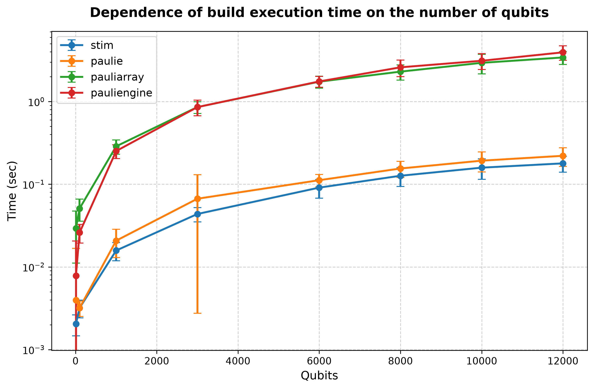
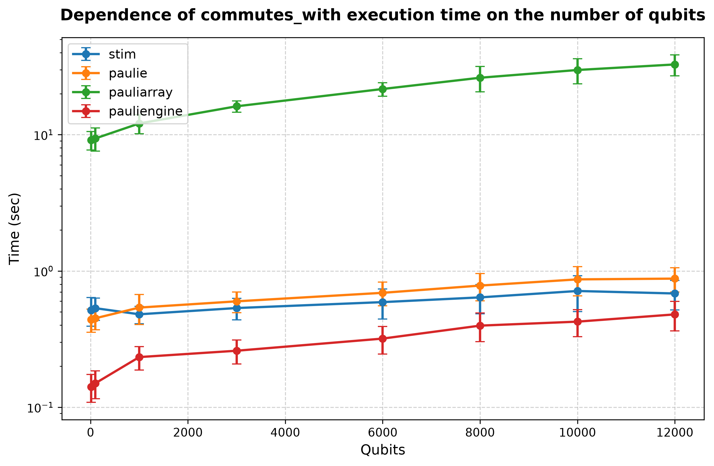
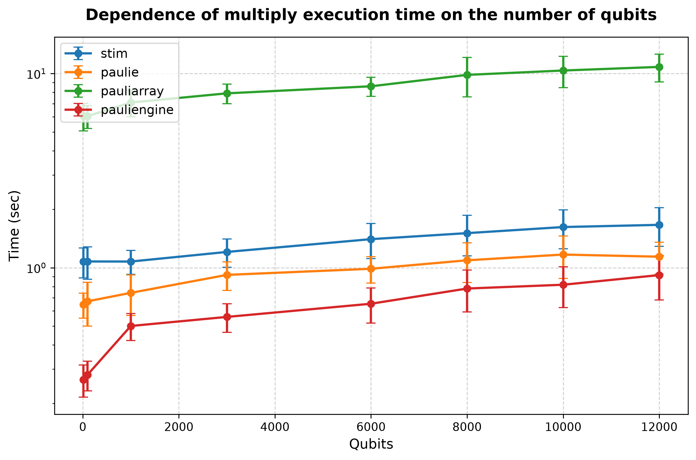

## Processor: Intel(R) Core(TM) i5-8265U CPU @ 1.60GHz

### Performance for build (10 qubits and lenght of list is 1000')) 
| # | stim | paulie | pauliarray | pauliengine |
| :---: | :------: | :------: | :------: | :------: |
| 1 | 0.003462 | 0.072935 | 0.116853 | 0.075884 |
| 2 | 0.003785 | 0.001200 | 0.031411 | 0.009549 |
| 3 | 0.001666 | 0.001513 | 0.023324 | 0.004982 |
| 4 | 0.001726 | 0.001396 | 0.022074 | 0.006774 |
| 5 | 0.001915 | 0.001417 | 0.024963 | 0.009277 |
| 6 | 0.001463 | 0.001406 | 0.025149 | 0.004748 |
| 7 | 0.002588 | 0.001221 | 0.021888 | 0.004629 |
| 8 | 0.001623 | 0.001348 | 0.042660 | 0.005100 |
| 9 | 0.001962 | 0.001190 | 0.018135 | 0.003679 |
| 10 | 0.001817 | 0.001805 | 0.022170 | 0.004671 |
| 11 | 0.001961 | 0.001345 | 0.034541 | 0.005524 |
| 12 | 0.001480 | 0.001934 | 0.060493 | 0.004778 |
| 13 | 0.002427 | 0.001922 | 0.020842 | 0.004556 |
| 14 | 0.003064 | 0.002284 | 0.027089 | 0.005561 |
| 15 | 0.001676 | 0.001364 | 0.021679 | 0.004444 |
| 16 | 0.001619 | 0.001342 | 0.029858 | 0.004131 |
| 17 | 0.001676 | 0.001967 | 0.021191 | 0.004536 |
| 18 | 0.001899 | 0.001371 | 0.019962 | 0.007516 |
| 19 | 0.001657 | 0.002174 | 0.026898 | 0.004860 |
| 20 | 0.001736 | 0.001469 | 0.021612 | 0.004966 |
| 21 | 0.002102 | 0.001267 | 0.024332 | 0.005520 |
| 22 | 0.001959 | 0.002299 | 0.021382 | 0.006452 |
| 23 | 0.001491 | 0.001647 | 0.024985 | 0.004818 |
| 24 | 0.001870 | 0.001330 | 0.025400 | 0.010822 |
| 25 | 0.002686 | 0.001488 | 0.027880 | 0.004391 |
| 26 | 0.001785 | 0.002484 | 0.030186 | 0.004440 |
| 27 | 0.001708 | 0.001399 | 0.027662 | 0.004362 |
| 28 | 0.001944 | 0.001294 | 0.022024 | 0.004219 |
| 29 | 0.001775 | 0.001378 | 0.021875 | 0.004346 |
| 30 | 0.002894 | 0.001565 | 0.020002 | 0.005773 |
| avg | 0.002047 | 0.003958 | 0.029284 | 0.007844 |
| dev | 0.000582 | 0.012813 | 0.018145 | 0.012746 |
### Performance for commutes_with (10 qubits and lenght of list is 1000')) 
| # | stim | paulie | pauliarray | pauliengine |
| :---: | :------: | :------: | :------: | :------: |
| 1 | 0.372435 | 0.348255 | 6.503416 | 0.121190 |
| 2 | 0.900407 | 0.543534 | 14.362900 | 0.141822 |
| 3 | 0.463542 | 0.543409 | 9.433330 | 0.134427 |
| 4 | 0.544240 | 0.451495 | 9.900924 | 0.173032 |
| 5 | 0.444780 | 0.429788 | 9.053985 | 0.247668 |
| 6 | 0.439304 | 0.415435 | 11.074784 | 0.139367 |
| 7 | 0.443327 | 0.428732 | 8.978188 | 0.111985 |
| 8 | 0.437257 | 0.466348 | 8.780511 | 0.128175 |
| 9 | 0.351853 | 0.315494 | 6.229936 | 0.105974 |
| 10 | 0.674513 | 0.422448 | 8.915423 | 0.115573 |
| 11 | 0.530061 | 0.386236 | 8.574719 | 0.130646 |
| 12 | 0.474015 | 0.418965 | 8.803222 | 0.129126 |
| 13 | 0.474895 | 0.385165 | 8.933246 | 0.127859 |
| 14 | 0.905502 | 0.808551 | 8.912546 | 0.191372 |
| 15 | 0.533737 | 0.418301 | 9.364809 | 0.109363 |
| 16 | 0.498708 | 0.363005 | 8.587379 | 0.127442 |
| 17 | 0.467856 | 0.391727 | 8.986800 | 0.126674 |
| 18 | 0.529160 | 0.382668 | 8.542411 | 0.170340 |
| 19 | 0.514982 | 0.495159 | 9.013326 | 0.159069 |
| 20 | 0.446756 | 0.404980 | 12.481697 | 0.129176 |
| 21 | 0.492262 | 0.389738 | 8.994211 | 0.137953 |
| 22 | 0.463567 | 0.456847 | 8.695524 | 0.151606 |
| 23 | 0.442815 | 0.431151 | 8.805182 | 0.124860 |
| 24 | 0.453204 | 0.419710 | 9.139107 | 0.231406 |
| 25 | 0.538674 | 0.458056 | 8.749127 | 0.132044 |
| 26 | 0.452783 | 0.466436 | 8.737432 | 0.147738 |
| 27 | 0.486084 | 0.456696 | 8.931718 | 0.120073 |
| 28 | 0.494946 | 0.390449 | 8.789796 | 0.118087 |
| 29 | 0.538356 | 0.426231 | 9.173632 | 0.115387 |
| 30 | 0.645542 | 0.467381 | 8.679561 | 0.134734 |
| avg | 0.515185 | 0.439413 | 9.137628 | 0.141139 |
| dev | 0.121850 | 0.084408 | 1.423518 | 0.032525 |
### Performance for multiply (10 qubits and lenght of list is 1000')) 
| # | stim | paulie | pauliarray | pauliengine |
| :---: | :------: | :------: | :------: | :------: |
| 1 | 0.918393 | 0.466773 | 4.308628 | 0.198274 |
| 2 | 1.308740 | 0.767929 | 10.285358 | 0.338486 |
| 3 | 0.980329 | 0.587246 | 5.941415 | 0.284474 |
| 4 | 1.138372 | 0.686837 | 6.605739 | 0.309341 |
| 5 | 1.096712 | 0.597961 | 7.252264 | 0.417913 |
| 6 | 0.986039 | 0.662468 | 6.704088 | 0.252936 |
| 7 | 1.080846 | 0.629517 | 6.048050 | 0.233030 |
| 8 | 1.034365 | 0.762611 | 5.825181 | 0.237057 |
| 9 | 0.782270 | 0.472766 | 4.145803 | 0.190849 |
| 10 | 1.234322 | 0.610777 | 6.053652 | 0.232218 |
| 11 | 0.976943 | 0.712000 | 5.672603 | 0.227960 |
| 12 | 0.992676 | 0.704055 | 5.589107 | 0.227245 |
| 13 | 1.143763 | 0.567663 | 6.092258 | 0.294883 |
| 14 | 1.950245 | 0.980851 | 5.766275 | 0.229988 |
| 15 | 1.010475 | 0.594317 | 5.706179 | 0.283377 |
| 16 | 1.030357 | 0.622769 | 6.095873 | 0.236900 |
| 17 | 1.049635 | 0.655613 | 5.849910 | 0.341161 |
| 18 | 0.932175 | 0.567690 | 6.004912 | 0.236813 |
| 19 | 0.976038 | 0.714788 | 6.171000 | 0.241761 |
| 20 | 1.043733 | 0.631501 | 6.146423 | 0.226573 |
| 21 | 1.058948 | 0.647268 | 5.336397 | 0.239538 |
| 22 | 0.967734 | 0.589297 | 6.316163 | 0.233241 |
| 23 | 1.083601 | 0.676392 | 6.014965 | 0.262737 |
| 24 | 1.010796 | 0.613113 | 5.972883 | 0.223528 |
| 25 | 1.019799 | 0.655975 | 5.854270 | 0.304045 |
| 26 | 1.003012 | 0.587339 | 5.859824 | 0.312426 |
| 27 | 1.084707 | 0.673070 | 5.936081 | 0.235658 |
| 28 | 1.097424 | 0.570508 | 5.764422 | 0.315925 |
| 29 | 1.173455 | 0.588246 | 5.630707 | 0.336398 |
| 30 | 1.068139 | 0.748897 | 6.412612 | 0.252168 |
| avg | 1.074468 | 0.644875 | 6.045435 | 0.265230 |
| dev | 0.189116 | 0.094737 | 0.975149 | 0.049876 |
### Performance for build (100 qubits and lenght of list is 1000')) 
| # | stim | paulie | pauliarray | pauliengine |
| :---: | :------: | :------: | :------: | :------: |
| 1 | 0.002400 | 0.002214 | 0.038908 | 0.017810 |
| 2 | 0.002577 | 0.003131 | 0.108020 | 0.028605 |
| 3 | 0.005150 | 0.002462 | 0.061958 | 0.021766 |
| 4 | 0.003845 | 0.003377 | 0.058938 | 0.029512 |
| 5 | 0.005295 | 0.003572 | 0.041150 | 0.022359 |
| 6 | 0.004749 | 0.003452 | 0.042220 | 0.027392 |
| 7 | 0.003428 | 0.002861 | 0.048175 | 0.025137 |
| 8 | 0.002475 | 0.002927 | 0.050376 | 0.026392 |
| 9 | 0.002379 | 0.002365 | 0.038190 | 0.019765 |
| 10 | 0.002961 | 0.003127 | 0.044534 | 0.024004 |
| 11 | 0.002617 | 0.003311 | 0.072103 | 0.022622 |
| 12 | 0.003362 | 0.003223 | 0.060198 | 0.036420 |
| 13 | 0.002429 | 0.003385 | 0.044560 | 0.034499 |
| 14 | 0.003224 | 0.002846 | 0.054463 | 0.022042 |
| 15 | 0.002623 | 0.002552 | 0.041405 | 0.052056 |
| 16 | 0.003242 | 0.002626 | 0.042550 | 0.020908 |
| 17 | 0.002864 | 0.002619 | 0.043504 | 0.035540 |
| 18 | 0.003037 | 0.004808 | 0.053181 | 0.021809 |
| 19 | 0.003485 | 0.002711 | 0.061561 | 0.021328 |
| 20 | 0.003143 | 0.003801 | 0.044407 | 0.019885 |
| 21 | 0.002901 | 0.002818 | 0.038809 | 0.026479 |
| 22 | 0.002640 | 0.004862 | 0.042037 | 0.023423 |
| 23 | 0.002651 | 0.003322 | 0.041490 | 0.022764 |
| 24 | 0.002587 | 0.002768 | 0.048711 | 0.026201 |
| 25 | 0.004022 | 0.003237 | 0.088646 | 0.023066 |
| 26 | 0.004032 | 0.003436 | 0.041403 | 0.025713 |
| 27 | 0.002476 | 0.003947 | 0.044983 | 0.023653 |
| 28 | 0.002879 | 0.002602 | 0.042792 | 0.026379 |
| 29 | 0.003109 | 0.004619 | 0.040570 | 0.022382 |
| 30 | 0.003097 | 0.002701 | 0.048506 | 0.030681 |
| avg | 0.003189 | 0.003189 | 0.050945 | 0.026020 |
| dev | 0.000774 | 0.000669 | 0.015258 | 0.006609 |
### Performance for commutes_with (100 qubits and lenght of list is 1000')) 
| # | stim | paulie | pauliarray | pauliengine |
| :---: | :------: | :------: | :------: | :------: |
| 1 | 0.353046 | 0.324567 | 6.751305 | 0.118483 |
| 2 | 0.543724 | 0.757851 | 18.569486 | 0.160325 |
| 3 | 0.544110 | 0.399086 | 9.207163 | 0.124999 |
| 4 | 0.635253 | 0.493567 | 9.608924 | 0.139179 |
| 5 | 0.921597 | 0.462818 | 8.907098 | 0.145806 |
| 6 | 0.452332 | 0.421745 | 9.851141 | 0.177309 |
| 7 | 0.557463 | 0.463809 | 9.109500 | 0.133822 |
| 8 | 0.459573 | 0.398742 | 9.443180 | 0.219185 |
| 9 | 0.431688 | 0.326449 | 7.038377 | 0.107309 |
| 10 | 0.464089 | 0.477511 | 9.678038 | 0.146542 |
| 11 | 0.542078 | 0.464906 | 8.864194 | 0.132482 |
| 12 | 0.661416 | 0.457880 | 8.893940 | 0.127614 |
| 13 | 0.662493 | 0.413177 | 9.407133 | 0.204727 |
| 14 | 0.477115 | 0.419615 | 8.820876 | 0.136285 |
| 15 | 0.544079 | 0.366784 | 9.245240 | 0.149896 |
| 16 | 0.520159 | 0.396733 | 9.757172 | 0.135007 |
| 17 | 0.541443 | 0.495782 | 9.433770 | 0.195608 |
| 18 | 0.634720 | 0.486867 | 9.421270 | 0.125804 |
| 19 | 0.498856 | 0.507016 | 9.171887 | 0.114811 |
| 20 | 0.515708 | 0.434238 | 8.721031 | 0.110788 |
| 21 | 0.438916 | 0.524471 | 9.239560 | 0.146756 |
| 22 | 0.474781 | 0.435256 | 9.126548 | 0.132033 |
| 23 | 0.478458 | 0.404390 | 9.130950 | 0.134615 |
| 24 | 0.506483 | 0.434210 | 9.190794 | 0.145424 |
| 25 | 0.506264 | 0.439425 | 9.236689 | 0.264266 |
| 26 | 0.536439 | 0.413680 | 9.093387 | 0.135418 |
| 27 | 0.573327 | 0.595319 | 9.228446 | 0.137322 |
| 28 | 0.493354 | 0.425676 | 8.911206 | 0.142313 |
| 29 | 0.560171 | 0.476930 | 9.358688 | 0.158451 |
| 30 | 0.465549 | 0.373452 | 9.218839 | 0.197767 |
| avg | 0.533156 | 0.449732 | 9.387861 | 0.150012 |
| dev | 0.099224 | 0.079978 | 1.821572 | 0.034438 |
### Performance for multiply (100 qubits and lenght of list is 1000')) 
| # | stim | paulie | pauliarray | pauliengine |
| :---: | :------: | :------: | :------: | :------: |
| 1 | 0.811831 | 0.491745 | 4.264284 | 0.209516 |
| 2 | 1.339639 | 1.489030 | 9.622600 | 0.332872 |
| 3 | 1.023649 | 0.629183 | 5.666222 | 0.275625 |
| 4 | 1.328914 | 0.602243 | 5.937752 | 0.256591 |
| 5 | 1.982261 | 0.704522 | 5.822953 | 0.235223 |
| 6 | 0.951205 | 0.629010 | 6.282789 | 0.283487 |
| 7 | 0.966475 | 0.638316 | 5.904188 | 0.250853 |
| 8 | 0.963134 | 0.606429 | 5.734636 | 0.318791 |
| 9 | 0.809669 | 0.503364 | 4.693762 | 0.199919 |
| 10 | 1.136637 | 0.612662 | 6.079337 | 0.319975 |
| 11 | 0.991334 | 0.621652 | 5.889565 | 0.263301 |
| 12 | 1.012993 | 0.679861 | 6.182832 | 0.339195 |
| 13 | 1.103966 | 0.657740 | 5.816330 | 0.323507 |
| 14 | 0.998410 | 0.794685 | 6.297199 | 0.416377 |
| 15 | 0.989804 | 0.590714 | 6.279082 | 0.239326 |
| 16 | 1.060276 | 0.710121 | 6.096836 | 0.245967 |
| 17 | 1.086060 | 0.628307 | 5.880619 | 0.333054 |
| 18 | 1.056353 | 0.753550 | 5.868860 | 0.336867 |
| 19 | 1.086454 | 0.800790 | 6.198980 | 0.231557 |
| 20 | 0.914709 | 0.669974 | 5.363632 | 0.202942 |
| 21 | 0.983769 | 0.573750 | 6.405841 | 0.249415 |
| 22 | 1.106137 | 0.588473 | 5.843583 | 0.254593 |
| 23 | 1.161961 | 0.606074 | 6.000753 | 0.260739 |
| 24 | 1.105907 | 0.587983 | 5.803137 | 0.275210 |
| 25 | 0.994652 | 0.677756 | 5.916001 | 0.306978 |
| 26 | 1.104148 | 0.577279 | 6.041134 | 0.258113 |
| 27 | 1.107756 | 0.704011 | 5.992585 | 0.249195 |
| 28 | 1.182852 | 0.594358 | 6.219658 | 0.303728 |
| 29 | 0.998746 | 0.586153 | 6.131450 | 0.311002 |
| 30 | 0.952487 | 0.832006 | 6.765782 | 0.351229 |
| avg | 1.077073 | 0.671391 | 6.033413 | 0.281172 |
| dev | 0.204383 | 0.170797 | 0.811189 | 0.049268 |
### Performance for build (1000 qubits and lenght of list is 1000')) 
| # | stim | paulie | pauliarray | pauliengine |
| :---: | :------: | :------: | :------: | :------: |
| 1 | 0.011787 | 0.013636 | 0.221870 | 0.204065 |
| 2 | 0.028374 | 0.042379 | 0.530887 | 0.383465 |
| 3 | 0.016950 | 0.021422 | 0.271317 | 0.291991 |
| 4 | 0.012015 | 0.018978 | 0.252408 | 0.269179 |
| 5 | 0.015581 | 0.016651 | 0.342467 | 0.236767 |
| 6 | 0.014424 | 0.016341 | 0.267777 | 0.234553 |
| 7 | 0.014452 | 0.019049 | 0.314831 | 0.315271 |
| 8 | 0.013880 | 0.030438 | 0.277394 | 0.249693 |
| 9 | 0.012924 | 0.014986 | 0.303646 | 0.249788 |
| 10 | 0.014349 | 0.020789 | 0.262508 | 0.319413 |
| 11 | 0.020104 | 0.017191 | 0.257526 | 0.262494 |
| 12 | 0.013978 | 0.014397 | 0.241379 | 0.220087 |
| 13 | 0.017374 | 0.017082 | 0.263913 | 0.245650 |
| 14 | 0.027118 | 0.015925 | 0.346232 | 0.213952 |
| 15 | 0.013370 | 0.029056 | 0.303882 | 0.398468 |
| 16 | 0.014456 | 0.046371 | 0.359416 | 0.225913 |
| 17 | 0.015430 | 0.017212 | 0.344991 | 0.249207 |
| 18 | 0.014094 | 0.021638 | 0.274661 | 0.219209 |
| 19 | 0.016655 | 0.016649 | 0.260966 | 0.224520 |
| 20 | 0.012678 | 0.015380 | 0.231943 | 0.232841 |
| 21 | 0.021958 | 0.016387 | 0.260803 | 0.271215 |
| 22 | 0.015748 | 0.016621 | 0.249014 | 0.218758 |
| 23 | 0.013887 | 0.016846 | 0.279585 | 0.214199 |
| 24 | 0.013708 | 0.034512 | 0.302065 | 0.244685 |
| 25 | 0.013432 | 0.020607 | 0.257639 | 0.221157 |
| 26 | 0.014360 | 0.020704 | 0.261060 | 0.271696 |
| 27 | 0.014514 | 0.016542 | 0.294841 | 0.215823 |
| 28 | 0.019050 | 0.018560 | 0.283928 | 0.215360 |
| 29 | 0.012524 | 0.017544 | 0.261653 | 0.245883 |
| 30 | 0.014330 | 0.019001 | 0.243479 | 0.199072 |
| avg | 0.015784 | 0.020763 | 0.287469 | 0.252146 |
| dev | 0.003916 | 0.007829 | 0.056759 | 0.047367 |
### Performance for commutes_with (1000 qubits and lenght of list is 1000')) 
| # | stim | paulie | pauliarray | pauliengine |
| :---: | :------: | :------: | :------: | :------: |
| 1 | 0.374662 | 0.415747 | 8.575747 | 0.171195 |
| 2 | 0.778237 | 1.208998 | 21.824936 | 0.378304 |
| 3 | 0.446910 | 0.570631 | 12.020651 | 0.252391 |
| 4 | 0.458880 | 0.533913 | 12.227836 | 0.254144 |
| 5 | 0.531989 | 0.509715 | 11.894657 | 0.192661 |
| 6 | 0.499519 | 0.485497 | 11.933044 | 0.192860 |
| 7 | 0.495870 | 0.494731 | 11.255614 | 0.211617 |
| 8 | 0.439263 | 0.591478 | 11.738540 | 0.190537 |
| 9 | 0.390192 | 0.415944 | 11.752301 | 0.181360 |
| 10 | 0.506465 | 0.509866 | 12.723683 | 0.276007 |
| 11 | 0.540522 | 0.488548 | 11.582433 | 0.208034 |
| 12 | 0.444514 | 0.419829 | 11.919256 | 0.228668 |
| 13 | 0.452002 | 0.516362 | 11.484653 | 0.188691 |
| 14 | 0.506572 | 0.475264 | 11.963381 | 0.198986 |
| 15 | 0.539755 | 0.571548 | 11.679140 | 0.202038 |
| 16 | 0.446271 | 0.561801 | 12.570664 | 0.296973 |
| 17 | 0.497411 | 0.563204 | 12.096604 | 0.245147 |
| 18 | 0.443191 | 0.517832 | 12.417906 | 0.232474 |
| 19 | 0.432028 | 0.569600 | 12.268516 | 0.288532 |
| 20 | 0.387357 | 0.421598 | 11.274904 | 0.251589 |
| 21 | 0.472196 | 0.491354 | 11.804546 | 0.240958 |
| 22 | 0.506287 | 0.508404 | 11.735511 | 0.221140 |
| 23 | 0.524161 | 0.612978 | 11.997421 | 0.248227 |
| 24 | 0.495438 | 0.584965 | 11.655745 | 0.304944 |
| 25 | 0.503934 | 0.516933 | 11.640845 | 0.193088 |
| 26 | 0.452312 | 0.530595 | 11.460749 | 0.239657 |
| 27 | 0.453825 | 0.499417 | 11.845135 | 0.245612 |
| 28 | 0.519524 | 0.511531 | 11.661830 | 0.204056 |
| 29 | 0.442075 | 0.538475 | 11.356762 | 0.285870 |
| 30 | 0.446252 | 0.521763 | 12.238080 | 0.174469 |
| avg | 0.480921 | 0.538617 | 12.086703 | 0.233341 |
| dev | 0.070258 | 0.134432 | 1.934066 | 0.045689 |
### Performance for multiply (1000 qubits and lenght of list is 1000')) 
| # | stim | paulie | pauliarray | pauliengine |
| :---: | :------: | :------: | :------: | :------: |
| 1 | 0.835760 | 0.602821 | 5.000473 | 0.396020 |
| 2 | 1.677089 | 1.584829 | 12.455232 | 0.855544 |
| 3 | 1.081963 | 0.939626 | 6.934034 | 0.554618 |
| 4 | 1.044161 | 0.723966 | 7.037378 | 0.458479 |
| 5 | 1.135451 | 0.719535 | 6.959573 | 0.447566 |
| 6 | 1.269646 | 0.645242 | 6.868718 | 0.463595 |
| 7 | 1.093251 | 0.704620 | 6.710660 | 0.497926 |
| 8 | 1.093331 | 0.665785 | 6.872665 | 0.503440 |
| 9 | 0.860448 | 0.598426 | 7.355436 | 0.498961 |
| 10 | 1.009640 | 0.760403 | 6.837506 | 0.458694 |
| 11 | 1.043198 | 0.804094 | 6.861606 | 0.514387 |
| 12 | 0.850057 | 0.605163 | 7.269560 | 0.474726 |
| 13 | 1.042127 | 0.794359 | 6.595318 | 0.486930 |
| 14 | 1.067991 | 0.672104 | 6.877090 | 0.464267 |
| 15 | 1.081837 | 0.696555 | 6.757969 | 0.458680 |
| 16 | 1.093729 | 0.792531 | 7.169709 | 0.417868 |
| 17 | 0.996894 | 0.744088 | 6.682339 | 0.585343 |
| 18 | 0.977569 | 0.715836 | 7.337530 | 0.604559 |
| 19 | 1.249025 | 0.761657 | 7.354986 | 0.421372 |
| 20 | 0.861946 | 0.581631 | 8.334092 | 0.540599 |
| 21 | 1.108941 | 0.708633 | 6.882308 | 0.468297 |
| 22 | 1.014957 | 0.686890 | 6.460824 | 0.493179 |
| 23 | 1.163815 | 0.633101 | 7.044943 | 0.483878 |
| 24 | 1.075768 | 0.769545 | 6.848726 | 0.470325 |
| 25 | 1.054560 | 0.692448 | 6.951043 | 0.481071 |
| 26 | 1.069453 | 0.755086 | 7.049362 | 0.519163 |
| 27 | 1.083054 | 0.781735 | 7.001589 | 0.451161 |
| 28 | 1.115776 | 0.797298 | 6.912086 | 0.522505 |
| 29 | 1.006529 | 0.602776 | 6.733467 | 0.541336 |
| 30 | 1.221001 | 0.727982 | 6.709293 | 0.498109 |
| avg | 1.075966 | 0.742292 | 7.095517 | 0.501087 |
| dev | 0.152585 | 0.174391 | 1.106610 | 0.080002 |
### Performance for build (3000 qubits and lenght of list is 1000')) 
| # | stim | paulie | pauliarray | pauliengine |
| :---: | :------: | :------: | :------: | :------: |
| 1 | 0.034100 | 0.040202 | 0.655233 | 1.554399 |
| 2 | 0.084205 | 0.099354 | 1.489051 | 0.761046 |
| 3 | 0.054366 | 0.068644 | 0.719470 | 0.855748 |
| 4 | 0.043837 | 0.406491 | 0.860346 | 0.726074 |
| 5 | 0.039599 | 0.058254 | 0.789686 | 1.014546 |
| 6 | 0.049906 | 0.067901 | 0.899287 | 0.740319 |
| 7 | 0.041785 | 0.043480 | 0.796032 | 0.718367 |
| 8 | 0.039663 | 0.053283 | 0.746300 | 0.734444 |
| 9 | 0.045518 | 0.049078 | 0.814480 | 0.682865 |
| 10 | 0.040707 | 0.048653 | 0.914999 | 0.947389 |
| 11 | 0.039252 | 0.049508 | 0.849226 | 0.720099 |
| 12 | 0.039521 | 0.052917 | 0.856459 | 1.251980 |
| 13 | 0.038871 | 0.047805 | 0.754564 | 0.783637 |
| 14 | 0.043965 | 0.046237 | 0.847799 | 0.977453 |
| 15 | 0.052056 | 0.062011 | 0.821050 | 0.753216 |
| 16 | 0.042158 | 0.070812 | 0.828018 | 0.759757 |
| 17 | 0.043915 | 0.061763 | 0.836745 | 0.807841 |
| 18 | 0.045327 | 0.049008 | 0.942253 | 0.795043 |
| 19 | 0.038353 | 0.053141 | 0.761006 | 0.807057 |
| 20 | 0.041162 | 0.051175 | 0.814682 | 0.784369 |
| 21 | 0.039581 | 0.047335 | 0.836056 | 0.851334 |
| 22 | 0.044031 | 0.052868 | 1.021239 | 0.736862 |
| 23 | 0.039965 | 0.046666 | 0.842107 | 0.671552 |
| 24 | 0.040341 | 0.052660 | 0.852670 | 0.774003 |
| 25 | 0.038855 | 0.065164 | 0.903790 | 0.802891 |
| 26 | 0.038005 | 0.047211 | 0.820209 | 0.914582 |
| 27 | 0.041460 | 0.048855 | 0.782512 | 0.817884 |
| 28 | 0.043112 | 0.058900 | 0.990663 | 0.975804 |
| 29 | 0.045346 | 0.054473 | 0.798590 | 0.867943 |
| 30 | 0.041239 | 0.050037 | 0.897393 | 1.129674 |
| avg | 0.043673 | 0.066796 | 0.858064 | 0.857273 |
| dev | 0.008597 | 0.064051 | 0.138764 | 0.183019 |
### Performance for commutes_with (3000 qubits and lenght of list is 1000')) 
| # | stim | paulie | pauliarray | pauliengine |
| :---: | :------: | :------: | :------: | :------: |
| 1 | 0.419099 | 0.531607 | 18.597982 | 0.409139 |
| 2 | 0.973931 | 1.077609 | 23.072676 | 0.250242 |
| 3 | 0.528787 | 0.567597 | 14.551105 | 0.322166 |
| 4 | 0.477193 | 0.563099 | 14.034210 | 0.221005 |
| 5 | 0.501542 | 0.606498 | 16.781957 | 0.345616 |
| 6 | 0.654883 | 0.585374 | 14.673113 | 0.212124 |
| 7 | 0.477679 | 0.593363 | 15.234997 | 0.248378 |
| 8 | 0.479561 | 0.565378 | 15.664268 | 0.226353 |
| 9 | 0.614861 | 0.535321 | 15.482691 | 0.186121 |
| 10 | 0.578583 | 0.614875 | 16.613530 | 0.252714 |
| 11 | 0.623889 | 0.603115 | 15.055492 | 0.251056 |
| 12 | 0.548757 | 0.631585 | 15.641279 | 0.184534 |
| 13 | 0.542623 | 0.562697 | 16.021018 | 0.239337 |
| 14 | 0.516589 | 0.523073 | 15.678094 | 0.308964 |
| 15 | 0.480982 | 0.530807 | 15.809674 | 0.214363 |
| 16 | 0.474116 | 0.580445 | 16.334925 | 0.249763 |
| 17 | 0.539329 | 0.702062 | 15.940895 | 0.216342 |
| 18 | 0.515082 | 0.601261 | 16.076357 | 0.228629 |
| 19 | 0.464363 | 0.687276 | 16.723862 | 0.274070 |
| 20 | 0.520551 | 0.591532 | 16.133194 | 0.242200 |
| 21 | 0.558095 | 0.538609 | 16.353119 | 0.266454 |
| 22 | 0.516488 | 0.522482 | 15.663869 | 0.314791 |
| 23 | 0.477439 | 0.550890 | 15.593642 | 0.272533 |
| 24 | 0.503160 | 0.518477 | 16.435729 | 0.230931 |
| 25 | 0.474966 | 0.581671 | 16.058982 | 0.257825 |
| 26 | 0.481669 | 0.549638 | 16.670355 | 0.228988 |
| 27 | 0.516342 | 0.508632 | 16.391563 | 0.327826 |
| 28 | 0.584486 | 0.629059 | 15.664620 | 0.222481 |
| 29 | 0.508797 | 0.728593 | 15.714171 | 0.222165 |
| 30 | 0.477993 | 0.572531 | 16.009459 | 0.366121 |
| avg | 0.534395 | 0.598505 | 16.155894 | 0.259774 |
| dev | 0.096385 | 0.103412 | 1.515896 | 0.052290 |
### Performance for multiply (3000 qubits and lenght of list is 1000')) 
| # | stim | paulie | pauliarray | pauliengine |
| :---: | :------: | :------: | :------: | :------: |
| 1 | 0.867973 | 0.713603 | 12.622689 | 0.888218 |
| 2 | 2.102910 | 1.658623 | 7.939025 | 0.528361 |
| 3 | 1.277596 | 0.860983 | 7.350061 | 0.583067 |
| 4 | 1.076205 | 0.908411 | 8.456133 | 0.583288 |
| 5 | 1.242059 | 1.031632 | 7.498755 | 0.464141 |
| 6 | 1.085025 | 0.808705 | 7.451579 | 0.498735 |
| 7 | 1.040061 | 0.944529 | 7.561908 | 0.501311 |
| 8 | 1.112401 | 0.844678 | 7.846180 | 0.547558 |
| 9 | 1.239133 | 0.838524 | 7.604312 | 0.430776 |
| 10 | 1.143229 | 0.896309 | 7.750283 | 0.583928 |
| 11 | 1.079846 | 0.820590 | 7.876309 | 0.586496 |
| 12 | 1.061110 | 1.009962 | 7.833499 | 0.402327 |
| 13 | 1.332184 | 0.856753 | 7.567618 | 0.592089 |
| 14 | 1.099847 | 0.852315 | 8.737887 | 0.595665 |
| 15 | 1.172679 | 0.908171 | 7.785677 | 0.562867 |
| 16 | 1.166456 | 0.953534 | 7.850452 | 0.588206 |
| 17 | 1.424442 | 0.978834 | 7.585595 | 0.508156 |
| 18 | 1.280144 | 0.993856 | 7.756407 | 0.508742 |
| 19 | 1.212959 | 0.888119 | 7.764827 | 0.503883 |
| 20 | 1.188819 | 0.924446 | 7.953694 | 0.502170 |
| 21 | 1.046802 | 0.819689 | 8.123506 | 0.471843 |
| 22 | 1.242926 | 0.981089 | 7.762378 | 0.583486 |
| 23 | 1.203582 | 0.929502 | 7.569777 | 0.540361 |
| 24 | 1.227193 | 0.839848 | 7.819552 | 0.555570 |
| 25 | 1.381339 | 0.861730 | 7.308540 | 0.701162 |
| 26 | 1.088529 | 0.918071 | 7.740272 | 0.589993 |
| 27 | 1.191182 | 0.791163 | 7.607067 | 0.546794 |
| 28 | 1.098009 | 0.941385 | 7.472769 | 0.499103 |
| 29 | 1.288845 | 0.952298 | 7.420086 | 0.518694 |
| 30 | 1.200593 | 0.827417 | 7.744110 | 0.770026 |
| avg | 1.205803 | 0.918492 | 7.912032 | 0.557901 |
| dev | 0.200729 | 0.154724 | 0.923006 | 0.093669 |
### Performance for build (6000 qubits and lenght of list is 1000')) 
| # | stim | paulie | pauliarray | pauliengine |
| :---: | :------: | :------: | :------: | :------: |
| 1 | 0.161675 | 0.191415 | 2.974877 | 3.011975 |
| 2 | 0.078451 | 0.102476 | 1.974956 | 1.955651 |
| 3 | 0.090094 | 0.121398 | 2.178834 | 1.780068 |
| 4 | 0.087702 | 0.093949 | 1.486715 | 1.460204 |
| 5 | 0.091743 | 0.103644 | 1.859106 | 1.760437 |
| 6 | 0.077240 | 0.100406 | 1.664927 | 1.691146 |
| 7 | 0.072271 | 0.115646 | 1.540111 | 1.725556 |
| 8 | 0.100597 | 0.098202 | 1.503767 | 1.600622 |
| 9 | 0.121941 | 0.120447 | 2.081960 | 1.831391 |
| 10 | 0.076617 | 0.090955 | 2.001180 | 1.730061 |
| 11 | 0.098791 | 0.099271 | 1.523026 | 1.679122 |
| 12 | 0.156119 | 0.116175 | 1.668894 | 1.671659 |
| 13 | 0.077776 | 0.118979 | 1.637541 | 1.623852 |
| 14 | 0.080731 | 0.094902 | 1.784097 | 1.727848 |
| 15 | 0.079052 | 0.096110 | 1.741467 | 1.899238 |
| 16 | 0.081961 | 0.107490 | 1.919559 | 1.599582 |
| 17 | 0.069711 | 0.110110 | 1.728927 | 1.679757 |
| 18 | 0.075552 | 0.115884 | 1.742471 | 1.676539 |
| 19 | 0.091043 | 0.101389 | 1.685280 | 1.723743 |
| 20 | 0.081495 | 0.104739 | 1.648856 | 1.765174 |
| 21 | 0.087318 | 0.140596 | 1.641277 | 1.740771 |
| 22 | 0.075082 | 0.116618 | 1.558733 | 1.964530 |
| 23 | 0.083289 | 0.119162 | 1.487402 | 1.667367 |
| 24 | 0.106087 | 0.130138 | 1.552854 | 1.611815 |
| 25 | 0.073609 | 0.098357 | 1.712965 | 1.822051 |
| 26 | 0.074876 | 0.134468 | 1.588187 | 1.554366 |
| 27 | 0.088059 | 0.102301 | 1.518902 | 1.700116 |
| 28 | 0.073644 | 0.098181 | 1.527056 | 1.707595 |
| 29 | 0.138231 | 0.108905 | 1.640500 | 1.569067 |
| 30 | 0.081031 | 0.106873 | 1.682058 | 1.653428 |
| avg | 0.091060 | 0.111973 | 1.741883 | 1.752824 |
| dev | 0.023314 | 0.019098 | 0.289737 | 0.258108 |
### Performance for commutes_with (6000 qubits and lenght of list is 1000')) 
| # | stim | paulie | pauliarray | pauliengine |
| :---: | :------: | :------: | :------: | :------: |
| 1 | 1.044987 | 1.207299 | 33.810988 | 0.551788 |
| 2 | 0.543949 | 0.624525 | 21.145968 | 0.289359 |
| 3 | 0.620152 | 0.833612 | 22.192407 | 0.342656 |
| 4 | 0.528365 | 0.619214 | 18.863223 | 0.261045 |
| 5 | 0.529419 | 0.653783 | 21.274627 | 0.291586 |
| 6 | 0.501298 | 0.582838 | 20.854156 | 0.276434 |
| 7 | 0.519445 | 0.607268 | 24.040348 | 0.353012 |
| 8 | 0.770504 | 0.687424 | 21.303890 | 0.538702 |
| 9 | 0.596504 | 1.090987 | 20.619764 | 0.265039 |
| 10 | 0.616721 | 0.688800 | 20.115539 | 0.272575 |
| 11 | 0.523433 | 0.586146 | 20.897324 | 0.251443 |
| 12 | 1.140468 | 0.790053 | 20.747285 | 0.276485 |
| 13 | 0.501821 | 0.639831 | 24.333688 | 0.351628 |
| 14 | 0.627286 | 0.597982 | 21.203108 | 0.316304 |
| 15 | 0.489561 | 0.613646 | 20.761303 | 0.281986 |
| 16 | 0.594394 | 0.681251 | 21.056468 | 0.279776 |
| 17 | 0.520100 | 0.688026 | 21.218240 | 0.280601 |
| 18 | 0.508832 | 0.660528 | 20.946140 | 0.340215 |
| 19 | 0.570294 | 0.665415 | 21.313521 | 0.318699 |
| 20 | 0.521569 | 0.730978 | 21.259696 | 0.305750 |
| 21 | 0.562410 | 0.667737 | 21.573946 | 0.296962 |
| 22 | 0.577331 | 0.676763 | 20.314241 | 0.307812 |
| 23 | 0.529688 | 0.678703 | 20.960226 | 0.275326 |
| 24 | 0.547274 | 0.646455 | 20.848080 | 0.343821 |
| 25 | 0.552242 | 0.583977 | 21.153476 | 0.265686 |
| 26 | 0.511346 | 0.615350 | 21.111202 | 0.275123 |
| 27 | 0.526769 | 0.592256 | 20.719951 | 0.280933 |
| 28 | 0.489068 | 0.615033 | 21.788788 | 0.450339 |
| 29 | 0.642945 | 0.770974 | 21.449236 | 0.366463 |
| 30 | 0.513365 | 0.639740 | 21.455227 | 0.261520 |
| avg | 0.590718 | 0.691220 | 21.644402 | 0.318969 |
| dev | 0.146493 | 0.136933 | 2.459728 | 0.073179 |
### Performance for multiply (6000 qubits and lenght of list is 1000')) 
| # | stim | paulie | pauliarray | pauliengine |
| :---: | :------: | :------: | :------: | :------: |
| 1 | 2.268868 | 1.712601 | 13.446304 | 1.082573 |
| 2 | 1.295549 | 1.026332 | 8.573231 | 0.568529 |
| 3 | 1.515561 | 1.137800 | 8.744879 | 0.715064 |
| 4 | 1.250116 | 0.815680 | 7.578245 | 0.513482 |
| 5 | 1.300436 | 0.951043 | 8.631270 | 0.663815 |
| 6 | 1.302165 | 0.884275 | 7.725519 | 0.609365 |
| 7 | 1.759328 | 0.924238 | 8.810818 | 0.734836 |
| 8 | 1.499872 | 0.962168 | 8.801397 | 1.149112 |
| 9 | 1.269588 | 0.878998 | 8.735380 | 0.593555 |
| 10 | 1.220478 | 1.089928 | 8.679703 | 0.618769 |
| 11 | 1.209201 | 0.934660 | 8.561028 | 0.601516 |
| 12 | 2.467177 | 0.988938 | 8.547073 | 0.674792 |
| 13 | 1.326917 | 0.905759 | 8.243754 | 0.626696 |
| 14 | 1.465954 | 0.913080 | 7.491874 | 0.547931 |
| 15 | 1.468534 | 0.938933 | 7.996155 | 0.580958 |
| 16 | 1.339234 | 1.140184 | 9.331148 | 0.670257 |
| 17 | 1.291051 | 0.950170 | 8.585766 | 0.633597 |
| 18 | 1.299067 | 0.940635 | 8.488778 | 0.571999 |
| 19 | 1.354802 | 1.058022 | 8.587638 | 0.621729 |
| 20 | 1.157407 | 0.993551 | 8.777618 | 0.659911 |
| 21 | 1.373654 | 1.023289 | 8.366649 | 0.587627 |
| 22 | 1.265992 | 0.890488 | 8.488700 | 0.615789 |
| 23 | 1.215348 | 0.857577 | 7.774116 | 0.597336 |
| 24 | 1.308189 | 0.958905 | 8.346061 | 0.728660 |
| 25 | 1.208736 | 0.937080 | 8.470577 | 0.579639 |
| 26 | 1.299469 | 0.961368 | 8.447450 | 0.573785 |
| 27 | 1.284921 | 0.887433 | 8.184124 | 0.595993 |
| 28 | 1.589573 | 0.944448 | 8.679327 | 0.600282 |
| 29 | 1.300929 | 1.016413 | 8.296519 | 0.649968 |
| 30 | 1.189530 | 1.002279 | 8.688995 | 0.601217 |
| avg | 1.403255 | 0.987542 | 8.602670 | 0.652293 |
| dev | 0.288480 | 0.154068 | 0.980865 | 0.133876 |
### Performance for build (8000 qubits and lenght of list is 1000')) 
| # | stim | paulie | pauliarray | pauliengine |
| :---: | :------: | :------: | :------: | :------: |
| 1 | 0.199596 | 0.130895 | 3.727111 | 3.686584 |
| 2 | 0.129207 | 0.160160 | 2.500159 | 2.379337 |
| 3 | 0.111641 | 0.152769 | 2.720168 | 2.662991 |
| 4 | 0.104064 | 0.130818 | 2.019251 | 2.245613 |
| 5 | 0.102255 | 0.141310 | 2.324407 | 2.199149 |
| 6 | 0.114213 | 0.136339 | 2.155113 | 2.208145 |
| 7 | 0.106102 | 0.133679 | 2.059466 | 4.236553 |
| 8 | 0.210270 | 0.260487 | 4.008752 | 4.155082 |
| 9 | 0.124980 | 0.182081 | 1.930912 | 2.175535 |
| 10 | 0.103444 | 0.129145 | 2.231466 | 2.472032 |
| 11 | 0.102633 | 0.121381 | 2.312807 | 2.186510 |
| 12 | 0.102466 | 0.148698 | 2.008387 | 2.379486 |
| 13 | 0.185336 | 0.264689 | 3.038466 | 4.092414 |
| 14 | 0.143570 | 0.129894 | 2.155218 | 2.347778 |
| 15 | 0.101201 | 0.165185 | 2.184989 | 2.417897 |
| 16 | 0.153972 | 0.155965 | 2.212170 | 2.403726 |
| 17 | 0.101374 | 0.133280 | 2.015061 | 2.645657 |
| 18 | 0.132376 | 0.126839 | 2.002404 | 2.180438 |
| 19 | 0.113277 | 0.175467 | 2.073969 | 2.275707 |
| 20 | 0.106426 | 0.171903 | 2.489354 | 2.299930 |
| 21 | 0.111106 | 0.160472 | 2.139974 | 2.340280 |
| 22 | 0.124095 | 0.166697 | 2.103812 | 2.238583 |
| 23 | 0.123469 | 0.166571 | 2.083063 | 2.419475 |
| 24 | 0.099436 | 0.125217 | 2.147202 | 2.675087 |
| 25 | 0.116668 | 0.177812 | 1.890299 | 2.415671 |
| 26 | 0.196760 | 0.128052 | 2.198799 | 2.494156 |
| 27 | 0.097187 | 0.129064 | 2.125533 | 2.306408 |
| 28 | 0.172080 | 0.134237 | 1.969305 | 2.246865 |
| 29 | 0.107333 | 0.134233 | 2.165568 | 2.588338 |
| 30 | 0.104529 | 0.178603 | 2.103544 | 2.528431 |
| avg | 0.126702 | 0.155065 | 2.303224 | 2.596795 |
| dev | 0.032722 | 0.034229 | 0.479936 | 0.589326 |
### Performance for commutes_with (8000 qubits and lenght of list is 1000')) 
| # | stim | paulie | pauliarray | pauliengine |
| :---: | :------: | :------: | :------: | :------: |
| 1 | 1.100410 | 1.184422 | 42.142994 | 0.617059 |
| 2 | 0.623628 | 0.696394 | 24.726236 | 0.327794 |
| 3 | 0.694742 | 0.814381 | 25.713880 | 0.385066 |
| 4 | 0.511595 | 0.634686 | 26.391578 | 0.428997 |
| 5 | 0.533767 | 0.666597 | 24.475214 | 0.323247 |
| 6 | 0.502032 | 0.821541 | 23.358830 | 0.381401 |
| 7 | 0.593731 | 0.682307 | 26.570695 | 0.541182 |
| 8 | 1.071561 | 1.334972 | 43.016810 | 0.627286 |
| 9 | 0.648878 | 0.763043 | 23.954535 | 0.358577 |
| 10 | 0.696282 | 0.700969 | 23.939440 | 0.318914 |
| 11 | 0.555689 | 0.740150 | 25.647151 | 0.321948 |
| 12 | 0.528232 | 0.710370 | 23.330019 | 0.303348 |
| 13 | 1.055105 | 1.276734 | 42.545581 | 0.621465 |
| 14 | 0.567821 | 0.727340 | 24.273074 | 0.341584 |
| 15 | 0.606153 | 0.812546 | 23.699312 | 0.386371 |
| 16 | 0.545181 | 0.708759 | 24.521215 | 0.413245 |
| 17 | 0.593309 | 0.689554 | 24.835704 | 0.317391 |
| 18 | 0.655866 | 0.920939 | 23.645747 | 0.370641 |
| 19 | 0.584025 | 0.681676 | 24.223918 | 0.344724 |
| 20 | 0.724841 | 0.826711 | 22.959122 | 0.327590 |
| 21 | 0.507445 | 0.807787 | 24.290157 | 0.365715 |
| 22 | 0.585210 | 0.722591 | 23.854990 | 0.334585 |
| 23 | 0.601495 | 0.690514 | 24.457149 | 0.354947 |
| 24 | 0.603190 | 0.657305 | 24.111999 | 0.385292 |
| 25 | 0.566009 | 0.651472 | 23.693221 | 0.456441 |
| 26 | 0.557349 | 0.632073 | 24.110413 | 0.480379 |
| 27 | 0.577880 | 0.642201 | 24.237389 | 0.391705 |
| 28 | 0.634908 | 0.875491 | 24.357728 | 0.295871 |
| 29 | 0.522308 | 0.707370 | 23.926727 | 0.475830 |
| 30 | 0.648229 | 0.653294 | 24.131014 | 0.312829 |
| avg | 0.639896 | 0.781140 | 26.171395 | 0.397048 |
| dev | 0.155695 | 0.177803 | 5.525483 | 0.094003 |
### Performance for multiply (8000 qubits and lenght of list is 1000')) 
| # | stim | paulie | pauliarray | pauliengine |
| :---: | :------: | :------: | :------: | :------: |
| 1 | 2.457444 | 1.790792 | 16.467987 | 1.334338 |
| 2 | 1.450203 | 1.065073 | 9.318985 | 0.771894 |
| 3 | 1.662873 | 1.300377 | 8.980999 | 0.767036 |
| 4 | 1.354937 | 0.918591 | 8.283294 | 0.730159 |
| 5 | 1.347160 | 0.913073 | 8.664599 | 0.683776 |
| 6 | 1.262476 | 0.944388 | 8.687330 | 0.770978 |
| 7 | 1.380989 | 1.019813 | 12.452437 | 0.974568 |
| 8 | 2.578434 | 1.785228 | 15.127472 | 1.253091 |
| 9 | 1.412351 | 1.038735 | 8.571423 | 0.627977 |
| 10 | 1.463680 | 0.931331 | 9.209318 | 0.772809 |
| 11 | 1.390414 | 0.920673 | 9.266851 | 0.791924 |
| 12 | 1.373656 | 0.973628 | 14.445466 | 0.601248 |
| 13 | 2.537997 | 1.772517 | 15.122226 | 1.281800 |
| 14 | 1.214955 | 0.878159 | 8.898722 | 0.844271 |
| 15 | 1.287209 | 1.037281 | 8.743687 | 0.626770 |
| 16 | 1.400458 | 0.961350 | 9.240266 | 0.683741 |
| 17 | 1.293388 | 1.009440 | 8.944695 | 0.645715 |
| 18 | 1.223457 | 1.198675 | 9.160882 | 0.904235 |
| 19 | 1.338801 | 1.051847 | 8.603592 | 0.684426 |
| 20 | 1.639155 | 1.262794 | 8.449982 | 0.647471 |
| 21 | 1.317932 | 1.124752 | 9.035030 | 0.782666 |
| 22 | 1.310766 | 0.979924 | 9.233580 | 0.766637 |
| 23 | 1.373434 | 0.899193 | 8.936770 | 0.739992 |
| 24 | 1.305534 | 1.004920 | 8.329682 | 0.655709 |
| 25 | 1.310296 | 0.934377 | 8.850551 | 0.830919 |
| 26 | 1.629216 | 1.018905 | 8.485064 | 0.652677 |
| 27 | 1.356499 | 1.154486 | 9.028883 | 0.654787 |
| 28 | 1.530707 | 0.907219 | 8.767583 | 0.657240 |
| 29 | 1.500928 | 1.037051 | 9.006787 | 0.658448 |
| 30 | 1.507779 | 0.924088 | 9.153656 | 0.640358 |
| avg | 1.507104 | 1.091956 | 9.848927 | 0.781255 |
| dev | 0.357521 | 0.252312 | 2.261067 | 0.190275 |
### Performance for build (10000 qubits and lenght of list is 1000')) 
| # | stim | paulie | pauliarray | pauliengine |
| :---: | :------: | :------: | :------: | :------: |
| 1 | 0.257381 | 0.315502 | 4.725500 | 5.028986 |
| 2 | 0.127126 | 0.177994 | 2.734126 | 3.003939 |
| 3 | 0.145144 | 0.175388 | 2.650952 | 3.137812 |
| 4 | 0.158730 | 0.173247 | 2.356291 | 2.711107 |
| 5 | 0.153517 | 0.156791 | 2.609553 | 2.934059 |
| 6 | 0.138089 | 0.141258 | 2.406113 | 2.822446 |
| 7 | 0.181231 | 0.220120 | 4.044723 | 3.045233 |
| 8 | 0.258085 | 0.312949 | 5.054639 | 3.496655 |
| 9 | 0.137423 | 0.164951 | 2.578319 | 3.351567 |
| 10 | 0.133500 | 0.304567 | 2.680240 | 2.835824 |
| 11 | 0.132036 | 0.160856 | 2.683119 | 2.751213 |
| 12 | 0.124356 | 0.144702 | 2.201091 | 2.146862 |
| 13 | 0.260659 | 0.320756 | 5.473115 | 4.699167 |
| 14 | 0.142243 | 0.159755 | 2.668324 | 2.766181 |
| 15 | 0.125806 | 0.175318 | 2.986668 | 5.364555 |
| 16 | 0.170614 | 0.207738 | 2.640675 | 2.974431 |
| 17 | 0.136050 | 0.161711 | 2.868447 | 2.894540 |
| 18 | 0.220704 | 0.197012 | 2.643258 | 2.845968 |
| 19 | 0.130305 | 0.154646 | 2.909722 | 2.757166 |
| 20 | 0.163920 | 0.193148 | 2.667644 | 2.983567 |
| 21 | 0.119064 | 0.183943 | 2.525348 | 2.791115 |
| 22 | 0.112042 | 0.134531 | 2.768072 | 2.861931 |
| 23 | 0.127958 | 0.158626 | 2.658047 | 2.875108 |
| 24 | 0.132420 | 0.216583 | 3.027963 | 3.010518 |
| 25 | 0.140977 | 0.233155 | 2.592067 | 2.862822 |
| 26 | 0.123147 | 0.184005 | 2.517352 | 2.928045 |
| 27 | 0.131683 | 0.173381 | 2.555815 | 2.947712 |
| 28 | 0.185914 | 0.167116 | 2.784534 | 2.941906 |
| 29 | 0.242112 | 0.152448 | 2.595091 | 2.982413 |
| 30 | 0.151167 | 0.165411 | 2.694020 | 2.783615 |
| avg | 0.158780 | 0.192920 | 2.943361 | 3.117882 |
| dev | 0.043689 | 0.052427 | 0.779767 | 0.678493 |
### Performance for commutes_with (10000 qubits and lenght of list is 1000')) 
| # | stim | paulie | pauliarray | pauliengine |
| :---: | :------: | :------: | :------: | :------: |
| 1 | 1.179584 | 1.362563 | 45.986857 | 0.689162 |
| 2 | 0.573956 | 0.849278 | 28.334705 | 0.392074 |
| 3 | 0.644803 | 1.077225 | 27.686561 | 0.416002 |
| 4 | 0.584564 | 0.734833 | 27.829747 | 0.370835 |
| 5 | 0.639603 | 0.705519 | 26.352516 | 0.380468 |
| 6 | 0.661169 | 0.706494 | 28.008285 | 0.447795 |
| 7 | 1.148464 | 1.194735 | 33.247560 | 0.368477 |
| 8 | 1.137534 | 1.406925 | 50.489591 | 0.459971 |
| 9 | 0.675866 | 0.739835 | 28.230308 | 0.377041 |
| 10 | 0.752832 | 0.844645 | 28.406203 | 0.417021 |
| 11 | 0.650718 | 0.795522 | 28.783624 | 0.389631 |
| 12 | 0.501060 | 0.636147 | 21.090265 | 0.294593 |
| 13 | 1.056951 | 1.441251 | 46.453038 | 0.608284 |
| 14 | 0.697121 | 0.740762 | 27.991806 | 0.361198 |
| 15 | 0.579871 | 0.779047 | 27.729498 | 0.727042 |
| 16 | 0.609080 | 0.782228 | 28.714942 | 0.363539 |
| 17 | 0.726343 | 0.858442 | 27.280945 | 0.338040 |
| 18 | 0.745858 | 0.870077 | 27.096113 | 0.393351 |
| 19 | 0.599065 | 0.709898 | 27.923156 | 0.428878 |
| 20 | 1.269848 | 1.004110 | 27.425000 | 0.362475 |
| 21 | 0.561817 | 0.736841 | 28.184551 | 0.433460 |
| 22 | 0.574381 | 0.821232 | 27.910831 | 0.398150 |
| 23 | 0.586197 | 0.737387 | 27.002651 | 0.360419 |
| 24 | 0.604824 | 0.822816 | 27.663812 | 0.490522 |
| 25 | 0.570150 | 0.768581 | 28.455468 | 0.377594 |
| 26 | 0.609442 | 0.850441 | 28.151030 | 0.521712 |
| 27 | 0.622176 | 0.778327 | 28.077796 | 0.364463 |
| 28 | 0.665676 | 0.727326 | 27.461699 | 0.386603 |
| 29 | 0.562468 | 0.764821 | 29.017676 | 0.432913 |
| 30 | 0.593842 | 0.775969 | 27.952512 | 0.388806 |
| avg | 0.712842 | 0.867443 | 29.831292 | 0.424684 |
| dev | 0.208774 | 0.210668 | 6.200135 | 0.095559 |
### Performance for multiply (10000 qubits and lenght of list is 1000')) 
| # | stim | paulie | pauliarray | pauliengine |
| :---: | :------: | :------: | :------: | :------: |
| 1 | 2.549268 | 1.922785 | 14.507976 | 1.357806 |
| 2 | 1.404316 | 1.036132 | 10.117158 | 0.765176 |
| 3 | 1.567916 | 1.538064 | 9.867776 | 0.699309 |
| 4 | 1.372880 | 1.007678 | 9.460246 | 0.699023 |
| 5 | 1.513868 | 1.055358 | 9.582223 | 0.696965 |
| 6 | 1.466319 | 0.983952 | 8.914102 | 0.767313 |
| 7 | 2.240128 | 1.628395 | 10.128617 | 0.735323 |
| 8 | 2.649904 | 1.845191 | 14.555347 | 1.036521 |
| 9 | 1.427762 | 1.095394 | 10.033112 | 0.745850 |
| 10 | 1.379979 | 1.114721 | 10.024797 | 0.772281 |
| 11 | 1.347788 | 1.074152 | 9.816991 | 0.763997 |
| 12 | 1.217550 | 0.804804 | 6.848422 | 0.654195 |
| 13 | 2.489665 | 1.895399 | 15.133343 | 1.321091 |
| 14 | 1.655948 | 1.116109 | 9.929580 | 0.674793 |
| 15 | 1.415874 | 1.067694 | 15.666755 | 1.366718 |
| 16 | 1.547255 | 0.984749 | 9.665970 | 0.698657 |
| 17 | 1.546618 | 1.008768 | 9.580201 | 0.803399 |
| 18 | 1.783554 | 1.037151 | 9.933497 | 0.708756 |
| 19 | 1.494376 | 0.977762 | 9.739528 | 0.752350 |
| 20 | 1.868286 | 1.403989 | 8.977250 | 0.685023 |
| 21 | 1.519117 | 1.049381 | 10.122273 | 0.711041 |
| 22 | 1.248097 | 1.209999 | 9.967941 | 0.735386 |
| 23 | 1.418248 | 1.042284 | 9.496982 | 0.721785 |
| 24 | 1.635998 | 0.968933 | 10.016523 | 0.827628 |
| 25 | 1.382047 | 1.026745 | 9.714786 | 0.849635 |
| 26 | 1.422282 | 1.021946 | 9.808261 | 0.723882 |
| 27 | 1.509176 | 1.027203 | 10.138431 | 0.937116 |
| 28 | 1.519542 | 1.034177 | 9.696391 | 0.786220 |
| 29 | 1.468667 | 1.060977 | 9.899168 | 0.692782 |
| 30 | 1.537118 | 1.024366 | 9.810957 | 0.825935 |
| avg | 1.619985 | 1.168809 | 10.371820 | 0.817199 |
| dev | 0.366790 | 0.289127 | 1.906174 | 0.193456 |
### Performance for build (12000 qubits and lenght of list is 1000')) 
| # | stim | paulie | pauliarray | pauliengine |
| :---: | :------: | :------: | :------: | :------: |
| 1 | 0.261660 | 0.375299 | 5.847267 | 6.950583 |
| 2 | 0.137433 | 0.218889 | 3.084387 | 3.671416 |
| 3 | 0.203777 | 0.200734 | 3.604418 | 4.059296 |
| 4 | 0.161283 | 0.198148 | 3.395801 | 4.182009 |
| 5 | 0.203970 | 0.199656 | 3.306021 | 3.609930 |
| 6 | 0.177327 | 0.311066 | 3.246410 | 3.790832 |
| 7 | 0.158710 | 0.178386 | 2.895176 | 3.745942 |
| 8 | 0.171682 | 0.258535 | 3.305092 | 3.008009 |
| 9 | 0.180046 | 0.196487 | 3.087628 | 4.548882 |
| 10 | 0.160241 | 0.244092 | 3.536483 | 3.454468 |
| 11 | 0.174319 | 0.201671 | 3.234182 | 3.467436 |
| 12 | 0.130311 | 0.167195 | 2.774451 | 3.799009 |
| 13 | 0.274725 | 0.378225 | 5.091564 | 6.379516 |
| 14 | 0.157018 | 0.200473 | 3.993641 | 3.684183 |
| 15 | 0.130144 | 0.179040 | 3.442864 | 3.674194 |
| 16 | 0.207520 | 0.164168 | 3.317075 | 3.478935 |
| 17 | 0.162815 | 0.247532 | 3.268182 | 3.838904 |
| 18 | 0.154918 | 0.225425 | 3.222903 | 3.880689 |
| 19 | 0.171924 | 0.190760 | 3.294326 | 3.713840 |
| 20 | 0.162583 | 0.189944 | 3.130535 | 3.640977 |
| 21 | 0.191231 | 0.198669 | 3.465103 | 4.071789 |
| 22 | 0.162309 | 0.223858 | 3.172557 | 3.745290 |
| 23 | 0.234561 | 0.206937 | 3.247453 | 3.801762 |
| 24 | 0.283593 | 0.186563 | 3.260825 | 3.730720 |
| 25 | 0.147941 | 0.335097 | 3.651746 | 3.575265 |
| 26 | 0.151504 | 0.191741 | 3.162893 | 3.648904 |
| 27 | 0.186512 | 0.212000 | 3.032920 | 3.619708 |
| 28 | 0.157281 | 0.182582 | 3.041699 | 4.304686 |
| 29 | 0.149040 | 0.185308 | 3.071517 | 3.561429 |
| 30 | 0.161109 | 0.177668 | 3.370818 | 3.628723 |
| avg | 0.178916 | 0.220872 | 3.418531 | 3.942244 |
| dev | 0.038839 | 0.056020 | 0.602678 | 0.782336 |
### Performance for commutes_with (12000 qubits and lenght of list is 1000')) 
| # | stim | paulie | pauliarray | pauliengine |
| :---: | :------: | :------: | :------: | :------: |
| 1 | 1.258465 | 1.476397 | 52.333772 | 0.893049 |
| 2 | 0.539487 | 0.788134 | 31.432068 | 0.408761 |
| 3 | 0.721611 | 0.896850 | 31.766970 | 0.403395 |
| 4 | 0.602955 | 0.684013 | 45.230314 | 0.598145 |
| 5 | 0.595332 | 0.865213 | 30.978451 | 0.416462 |
| 6 | 0.944564 | 0.928004 | 30.039380 | 0.450336 |
| 7 | 0.634404 | 0.868604 | 30.821025 | 0.407850 |
| 8 | 0.685817 | 0.860696 | 30.796718 | 0.363305 |
| 9 | 0.708579 | 0.906188 | 30.335056 | 0.687386 |
| 10 | 0.605430 | 0.993747 | 27.490603 | 0.434224 |
| 11 | 0.655417 | 0.768669 | 30.737758 | 0.439178 |
| 12 | 0.482180 | 0.653426 | 33.748564 | 0.476284 |
| 13 | 1.149317 | 1.444641 | 50.769314 | 0.759794 |
| 14 | 0.569569 | 0.782538 | 31.984809 | 0.496968 |
| 15 | 0.489259 | 0.717908 | 32.047472 | 0.393471 |
| 16 | 0.557114 | 0.678119 | 31.340739 | 0.408449 |
| 17 | 0.673598 | 0.833781 | 31.271892 | 0.419032 |
| 18 | 0.768927 | 0.867611 | 31.692540 | 0.547434 |
| 19 | 0.589391 | 0.977407 | 30.820608 | 0.389239 |
| 20 | 0.680953 | 0.790389 | 31.032673 | 0.506414 |
| 21 | 0.792150 | 0.862104 | 30.836492 | 0.518638 |
| 22 | 0.735442 | 0.895121 | 30.131424 | 0.547623 |
| 23 | 0.623699 | 0.913051 | 30.417026 | 0.429531 |
| 24 | 0.649732 | 0.811675 | 30.951701 | 0.392413 |
| 25 | 0.653514 | 0.778957 | 29.876268 | 0.366791 |
| 26 | 0.620019 | 0.809064 | 30.873929 | 0.386613 |
| 27 | 0.635158 | 0.901812 | 30.818800 | 0.495736 |
| 28 | 0.726781 | 0.724753 | 30.144251 | 0.459706 |
| 29 | 0.575198 | 0.906579 | 31.356473 | 0.463012 |
| 30 | 0.582569 | 0.972348 | 30.841062 | 0.441901 |
| avg | 0.683554 | 0.878593 | 32.763938 | 0.480038 |
| dev | 0.166918 | 0.178294 | 5.725252 | 0.117564 |
### Performance for multiply (12000 qubits and lenght of list is 1000')) 
| # | stim | paulie | pauliarray | pauliengine |
| :---: | :------: | :------: | :------: | :------: |
| 1 | 2.733958 | 1.897423 | 16.744579 | 1.482433 |
| 2 | 1.530775 | 1.113353 | 10.150079 | 0.850815 |
| 3 | 1.589756 | 1.188341 | 10.273186 | 0.980371 |
| 4 | 1.974091 | 1.129124 | 10.487509 | 0.864427 |
| 5 | 1.506951 | 1.027338 | 10.536808 | 0.807678 |
| 6 | 2.795977 | 1.097361 | 12.656970 | 0.811252 |
| 7 | 1.654356 | 1.034152 | 10.275143 | 0.857638 |
| 8 | 1.723270 | 1.068742 | 9.646331 | 0.595256 |
| 9 | 1.676209 | 1.050700 | 9.512418 | 1.686303 |
| 10 | 1.540650 | 0.997241 | 9.887078 | 0.827001 |
| 11 | 1.598431 | 1.022400 | 10.084195 | 0.735275 |
| 12 | 1.146145 | 1.035530 | 13.072940 | 0.793382 |
| 13 | 2.552148 | 1.892319 | 16.871520 | 1.457454 |
| 14 | 1.425590 | 1.153578 | 10.655478 | 0.848500 |
| 15 | 1.479821 | 1.317367 | 10.796464 | 0.819920 |
| 16 | 1.211096 | 0.980226 | 10.586090 | 1.038760 |
| 17 | 1.628883 | 1.063143 | 10.014993 | 0.816266 |
| 18 | 1.523626 | 1.219275 | 9.748890 | 0.882204 |
| 19 | 1.424520 | 1.044252 | 10.208944 | 0.877245 |
| 20 | 1.429903 | 1.095083 | 10.810160 | 0.784948 |
| 21 | 1.688696 | 1.118903 | 10.343711 | 0.892175 |
| 22 | 1.516539 | 1.115310 | 10.068306 | 0.741494 |
| 23 | 1.509678 | 0.991436 | 10.220489 | 0.883975 |
| 24 | 1.542540 | 1.081732 | 9.856446 | 0.871468 |
| 25 | 1.554629 | 1.086100 | 10.033615 | 0.815648 |
| 26 | 1.596344 | 1.109717 | 10.357216 | 0.817174 |
| 27 | 1.552736 | 1.078848 | 10.286809 | 0.763875 |
| 28 | 1.527293 | 1.046116 | 10.573542 | 0.945888 |
| 29 | 1.683726 | 1.001221 | 9.785375 | 1.189834 |
| 30 | 1.566532 | 1.128245 | 10.222159 | 0.752968 |
| avg | 1.662829 | 1.139486 | 10.825581 | 0.916388 |
| dev | 0.374071 | 0.213664 | 1.759181 | 0.233889 |
