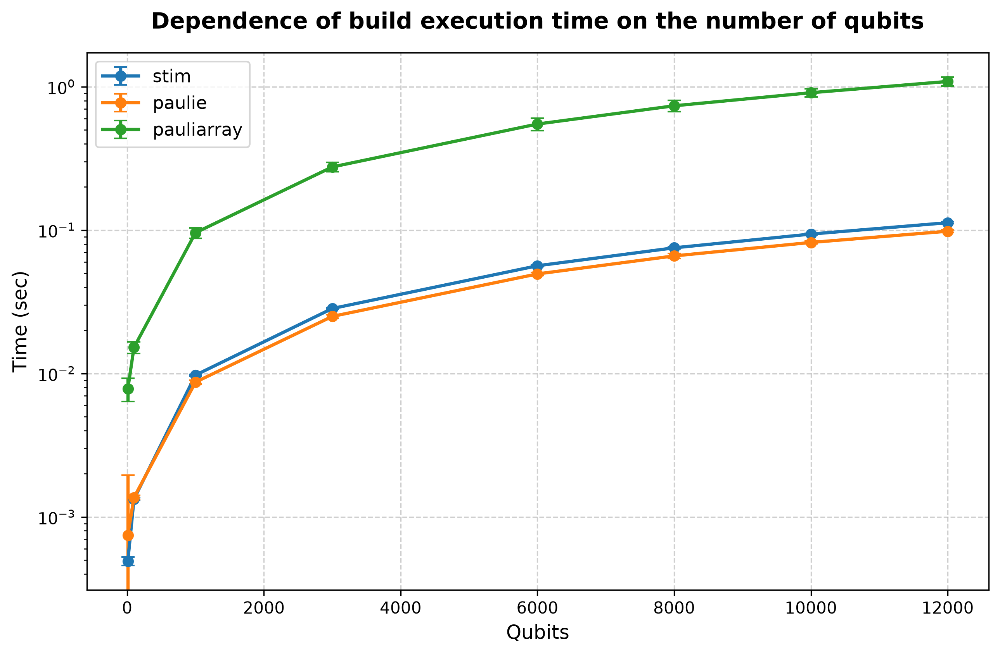
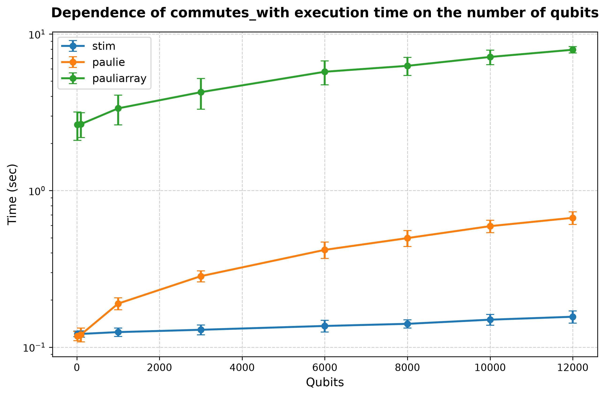
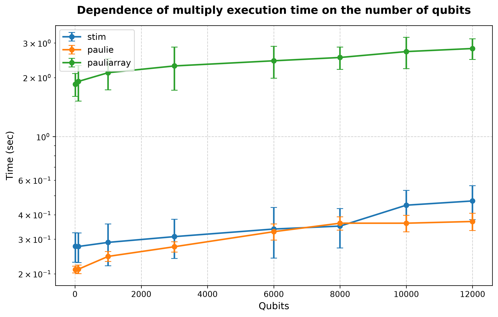

## Processor: Intel(R) Core(TM) i9-14900KF

### Performance for build (10 qubits and lenght of list is 1000')) 
| # | stim | paulie | pauliarray |
| :---: | :------: | :------: | :------: |
| 1 | 0.000551 | 0.000683 | 0.007650 |
| 2 | 0.000498 | 0.000609 | 0.007584 |
| 3 | 0.000493 | 0.000611 | 0.007749 |
| 4 | 0.000493 | 0.000619 | 0.007601 |
| 5 | 0.000493 | 0.000614 | 0.007594 |
| 6 | 0.000480 | 0.000618 | 0.007581 |
| 7 | 0.000486 | 0.000610 | 0.007652 |
| 8 | 0.000481 | 0.000604 | 0.007583 |
| 9 | 0.000491 | 0.000620 | 0.007566 |
| 10 | 0.000483 | 0.000618 | 0.007741 |
| 11 | 0.000488 | 0.000617 | 0.007593 |
| 12 | 0.000477 | 0.000619 | 0.007837 |
| 13 | 0.000477 | 0.000622 | 0.007566 |
| 14 | 0.000493 | 0.000618 | 0.007595 |
| 15 | 0.000479 | 0.000622 | 0.007531 |
| 16 | 0.000496 | 0.000619 | 0.007528 |
| 17 | 0.000490 | 0.000608 | 0.007509 |
| 18 | 0.000492 | 0.000625 | 0.007559 |
| 19 | 0.000478 | 0.000627 | 0.007647 |
| 20 | 0.000474 | 0.000597 | 0.007620 |
| 21 | 0.000489 | 0.000627 | 0.007538 |
| 22 | 0.000487 | 0.000625 | 0.007608 |
| 23 | 0.000487 | 0.000624 | 0.007570 |
| 24 | 0.000494 | 0.000631 | 0.007595 |
| 25 | 0.000491 | 0.000694 | 0.007584 |
| 26 | 0.000488 | 0.000618 | 0.007559 |
| 27 | 0.000492 | 0.000634 | 0.007613 |
| 28 | 0.000477 | 0.000624 | 0.007520 |
| 29 | 0.000492 | 0.000596 | 0.007591 |
| 30 | 0.000490 | 0.000610 | 0.007657 |
| 31 | 0.000492 | 0.000610 | 0.007605 |
| 32 | 0.000492 | 0.000620 | 0.007589 |
| 33 | 0.000478 | 0.000634 | 0.007603 |
| 34 | 0.000490 | 0.000624 | 0.007684 |
| 35 | 0.000485 | 0.000622 | 0.007618 |
| 36 | 0.000493 | 0.000625 | 0.007630 |
| 37 | 0.000489 | 0.000619 | 0.007558 |
| 38 | 0.000491 | 0.000623 | 0.007638 |
| 39 | 0.000494 | 0.000630 | 0.007582 |
| 40 | 0.000487 | 0.000621 | 0.007502 |
| 41 | 0.000475 | 0.000624 | 0.007546 |
| 42 | 0.000490 | 0.000620 | 0.007585 |
| 43 | 0.000480 | 0.000619 | 0.007560 |
| 44 | 0.000486 | 0.000628 | 0.017055 |
| 45 | 0.000488 | 0.000625 | 0.007564 |
| 46 | 0.000480 | 0.000627 | 0.007621 |
| 47 | 0.000480 | 0.000628 | 0.007657 |
| 48 | 0.000482 | 0.000630 | 0.007626 |
| 49 | 0.000493 | 0.000621 | 0.007570 |
| 50 | 0.000491 | 0.000628 | 0.007548 |
| 51 | 0.000490 | 0.000621 | 0.007604 |
| 52 | 0.000489 | 0.000630 | 0.007553 |
| 53 | 0.000597 | 0.000622 | 0.007561 |
| 54 | 0.000490 | 0.012727 | 0.007567 |
| 55 | 0.000478 | 0.000623 | 0.007602 |
| 56 | 0.000477 | 0.000626 | 0.007671 |
| 57 | 0.000479 | 0.000616 | 0.007572 |
| 58 | 0.000492 | 0.000624 | 0.007574 |
| 59 | 0.000494 | 0.000626 | 0.007620 |
| 60 | 0.000494 | 0.000624 | 0.007560 |
| 61 | 0.000496 | 0.000624 | 0.007524 |
| 62 | 0.000483 | 0.000621 | 0.007628 |
| 63 | 0.000479 | 0.000640 | 0.007583 |
| 64 | 0.000490 | 0.000626 | 0.007576 |
| 65 | 0.000480 | 0.000626 | 0.007618 |
| 66 | 0.000481 | 0.000622 | 0.007636 |
| 67 | 0.000491 | 0.000627 | 0.007658 |
| 68 | 0.000468 | 0.000600 | 0.007634 |
| 69 | 0.000491 | 0.000625 | 0.007583 |
| 70 | 0.000493 | 0.000624 | 0.007614 |
| 71 | 0.000480 | 0.000635 | 0.007572 |
| 72 | 0.000482 | 0.000623 | 0.007631 |
| 73 | 0.000477 | 0.000625 | 0.007554 |
| 74 | 0.000483 | 0.000613 | 0.007638 |
| 75 | 0.000490 | 0.000624 | 0.007589 |
| 76 | 0.000482 | 0.000622 | 0.007552 |
| 77 | 0.000480 | 0.000625 | 0.007703 |
| 78 | 0.000492 | 0.000627 | 0.007521 |
| 79 | 0.000493 | 0.000615 | 0.007612 |
| 80 | 0.000481 | 0.000618 | 0.007577 |
| 81 | 0.000490 | 0.000615 | 0.007640 |
| 82 | 0.000480 | 0.000629 | 0.007572 |
| 83 | 0.000481 | 0.000625 | 0.007608 |
| 84 | 0.000495 | 0.000623 | 0.007557 |
| 85 | 0.000479 | 0.000590 | 0.007566 |
| 86 | 0.000494 | 0.000623 | 0.007571 |
| 87 | 0.000488 | 0.000631 | 0.007601 |
| 88 | 0.000477 | 0.000621 | 0.007771 |
| 89 | 0.000476 | 0.000620 | 0.008243 |
| 90 | 0.000476 | 0.000624 | 0.007649 |
| 91 | 0.000790 | 0.000844 | 0.018647 |
| 92 | 0.000489 | 0.000626 | 0.007578 |
| 93 | 0.000480 | 0.000619 | 0.007551 |
| 94 | 0.000478 | 0.000630 | 0.007560 |
| 95 | 0.000497 | 0.000623 | 0.007514 |
| 96 | 0.000491 | 0.000623 | 0.007640 |
| 97 | 0.000491 | 0.000623 | 0.007628 |
| 98 | 0.000488 | 0.000622 | 0.007548 |
| 99 | 0.000490 | 0.000629 | 0.007563 |
| 100 | 0.000491 | 0.000625 | 0.007621 |
| avg | 0.000491 | 0.000746 | 0.007810 |
| dev | 0.000033 | 0.001204 | 0.001441 |
### Performance for commutes_with (10 qubits and lenght of list is 1000')) 
| # | stim | paulie | pauliarray |
| :---: | :------: | :------: | :------: |
| 1 | 0.121314 | 0.116137 | 2.510510 |
| 2 | 0.120887 | 0.116285 | 2.522574 |
| 3 | 0.121689 | 0.116918 | 2.528430 |
| 4 | 0.121113 | 0.117222 | 2.545765 |
| 5 | 0.121562 | 0.116470 | 2.518001 |
| 6 | 0.121327 | 0.116706 | 2.524183 |
| 7 | 0.120965 | 0.116174 | 2.527319 |
| 8 | 0.120965 | 0.116412 | 2.524094 |
| 9 | 0.121014 | 0.116870 | 2.528203 |
| 10 | 0.121146 | 0.116044 | 2.517167 |
| 11 | 0.121464 | 0.116541 | 2.514176 |
| 12 | 0.121361 | 0.117044 | 2.524941 |
| 13 | 0.121006 | 0.117241 | 2.532148 |
| 14 | 0.121068 | 0.117136 | 2.532467 |
| 15 | 0.121475 | 0.117701 | 2.518104 |
| 16 | 0.121271 | 0.116512 | 2.521704 |
| 17 | 0.121435 | 0.116252 | 3.208870 |
| 18 | 0.121400 | 0.117125 | 2.516885 |
| 19 | 0.120789 | 0.117457 | 2.532612 |
| 20 | 0.120975 | 0.117172 | 3.749273 |
| 21 | 0.121396 | 0.116378 | 2.528303 |
| 22 | 0.121234 | 0.115837 | 2.526933 |
| 23 | 0.121153 | 0.117415 | 2.516787 |
| 24 | 0.120851 | 0.116910 | 2.519810 |
| 25 | 0.120850 | 0.117630 | 2.516853 |
| 26 | 0.121249 | 0.116733 | 2.518877 |
| 27 | 0.121509 | 0.120049 | 2.538940 |
| 28 | 0.121168 | 0.117000 | 2.755443 |
| 29 | 0.121280 | 0.115545 | 2.514975 |
| 30 | 0.120975 | 0.116855 | 2.522068 |
| 31 | 0.121075 | 0.115529 | 2.529695 |
| 32 | 0.120840 | 0.116999 | 2.538872 |
| 33 | 0.120693 | 0.117280 | 2.523567 |
| 34 | 0.121143 | 0.116318 | 2.519780 |
| 35 | 0.120827 | 0.116391 | 2.516144 |
| 36 | 0.121059 | 0.120059 | 2.545006 |
| 37 | 0.120801 | 0.117026 | 2.517632 |
| 38 | 0.121212 | 0.117866 | 2.530739 |
| 39 | 0.121216 | 0.118038 | 2.515628 |
| 40 | 0.121454 | 0.117139 | 2.516482 |
| 41 | 0.120486 | 0.116584 | 2.514681 |
| 42 | 0.121177 | 0.117060 | 2.525570 |
| 43 | 0.121327 | 0.116578 | 5.783450 |
| 44 | 0.121314 | 0.117465 | 2.578374 |
| 45 | 0.120913 | 0.116656 | 2.579880 |
| 46 | 0.120933 | 0.116059 | 2.565101 |
| 47 | 0.121309 | 0.117458 | 2.527569 |
| 48 | 0.120799 | 0.116729 | 2.527528 |
| 49 | 0.120894 | 0.117470 | 2.538875 |
| 50 | 0.121245 | 0.117441 | 2.529184 |
| 51 | 0.120592 | 0.118547 | 2.519569 |
| 52 | 0.120866 | 0.116526 | 2.622851 |
| 53 | 0.120983 | 0.117325 | 2.522252 |
| 54 | 0.120762 | 0.118893 | 2.525486 |
| 55 | 0.121155 | 0.118010 | 2.536862 |
| 56 | 0.120787 | 0.116859 | 2.528203 |
| 57 | 0.121017 | 0.118023 | 2.523854 |
| 58 | 0.121234 | 0.117633 | 2.525933 |
| 59 | 0.121291 | 0.117356 | 2.524727 |
| 60 | 0.121057 | 0.118997 | 2.529343 |
| 61 | 0.121011 | 0.117516 | 2.719731 |
| 62 | 0.121278 | 0.118190 | 2.532788 |
| 63 | 0.121399 | 0.117174 | 2.520899 |
| 64 | 0.120802 | 0.117670 | 2.529341 |
| 65 | 0.120962 | 0.117956 | 2.530660 |
| 66 | 0.120725 | 0.117078 | 2.532179 |
| 67 | 0.121248 | 0.119224 | 2.543124 |
| 68 | 0.119937 | 0.117784 | 2.588343 |
| 69 | 0.121160 | 0.117689 | 2.519077 |
| 70 | 0.121994 | 0.117080 | 2.525136 |
| 71 | 0.120266 | 0.117397 | 2.540978 |
| 72 | 0.121128 | 0.117769 | 2.536347 |
| 73 | 0.120593 | 0.118413 | 2.569490 |
| 74 | 0.120808 | 0.117499 | 2.540736 |
| 75 | 0.120956 | 0.118058 | 2.529212 |
| 76 | 0.125814 | 0.117097 | 2.526627 |
| 77 | 0.120738 | 0.117088 | 2.549066 |
| 78 | 0.120720 | 0.117737 | 2.525890 |
| 79 | 0.120766 | 0.116084 | 2.523893 |
| 80 | 0.120895 | 0.117468 | 2.520372 |
| 81 | 0.121193 | 0.116537 | 2.518822 |
| 82 | 0.121092 | 0.116521 | 2.522970 |
| 83 | 0.120720 | 0.117480 | 2.544203 |
| 84 | 0.120453 | 0.116599 | 2.521322 |
| 85 | 0.120526 | 0.116067 | 2.520809 |
| 86 | 0.121069 | 0.116748 | 2.529480 |
| 87 | 0.121259 | 0.116325 | 2.525924 |
| 88 | 0.121558 | 0.116478 | 2.519696 |
| 89 | 0.121571 | 0.117305 | 2.617201 |
| 90 | 0.121254 | 0.116005 | 2.544364 |
| 91 | 0.172368 | 0.196051 | 6.702374 |
| 92 | 0.121213 | 0.117485 | 2.518112 |
| 93 | 0.121210 | 0.117188 | 2.520976 |
| 94 | 0.120996 | 0.117220 | 2.561811 |
| 95 | 0.121387 | 0.116853 | 2.515746 |
| 96 | 0.121860 | 0.117410 | 3.055384 |
| 97 | 0.122353 | 0.117603 | 2.516485 |
| 98 | 0.121915 | 0.116601 | 2.518877 |
| 99 | 0.120949 | 0.116374 | 2.518622 |
| 100 | 0.121263 | 0.116428 | 2.529781 |
| avg | 0.121658 | 0.117933 | 2.633661 |
| dev | 0.005130 | 0.007894 | 0.540973 |
### Performance for multiply (10 qubits and lenght of list is 1000')) 
| # | stim | paulie | pauliarray |
| :---: | :------: | :------: | :------: |
| 1 | 0.274151 | 0.207177 | 1.810869 |
| 2 | 0.271545 | 0.208992 | 1.815598 |
| 3 | 0.274691 | 0.208342 | 1.816425 |
| 4 | 0.271704 | 0.209754 | 1.813236 |
| 5 | 0.271970 | 0.208737 | 1.818908 |
| 6 | 0.273404 | 0.208441 | 1.822459 |
| 7 | 0.275455 | 0.209665 | 1.830619 |
| 8 | 0.273251 | 0.221442 | 1.822339 |
| 9 | 0.265854 | 0.209530 | 1.821742 |
| 10 | 0.270784 | 0.210168 | 1.824297 |
| 11 | 0.271189 | 0.208410 | 1.821259 |
| 12 | 0.277405 | 0.212055 | 1.818966 |
| 13 | 0.271862 | 0.207833 | 1.887981 |
| 14 | 0.278331 | 0.208872 | 1.825220 |
| 15 | 0.272767 | 0.208592 | 1.825156 |
| 16 | 0.271980 | 0.208582 | 1.824674 |
| 17 | 0.265285 | 0.209920 | 1.821207 |
| 18 | 0.273077 | 0.208614 | 1.825811 |
| 19 | 0.275077 | 0.209552 | 1.828320 |
| 20 | 0.271795 | 0.208912 | 1.814510 |
| 21 | 0.265846 | 0.210602 | 1.844391 |
| 22 | 0.273579 | 0.208324 | 1.841324 |
| 23 | 0.265277 | 0.209044 | 1.821170 |
| 24 | 0.265090 | 0.208934 | 1.821753 |
| 25 | 0.279198 | 0.208345 | 1.817563 |
| 26 | 0.266783 | 0.209040 | 1.817737 |
| 27 | 0.265292 | 0.210691 | 1.819145 |
| 28 | 0.273664 | 0.209529 | 1.815293 |
| 29 | 0.270346 | 0.209403 | 1.820278 |
| 30 | 0.275874 | 0.207914 | 1.822379 |
| 31 | 0.271600 | 0.208484 | 1.806362 |
| 32 | 0.272512 | 0.208657 | 1.833860 |
| 33 | 0.277055 | 0.208482 | 1.826401 |
| 34 | 0.272521 | 0.208521 | 1.826979 |
| 35 | 0.277411 | 0.208717 | 1.812740 |
| 36 | 0.275557 | 0.216267 | 1.815731 |
| 37 | 0.304521 | 0.209498 | 1.811171 |
| 38 | 0.275112 | 0.208297 | 1.807814 |
| 39 | 0.271165 | 0.208485 | 1.810236 |
| 40 | 0.269467 | 0.209834 | 1.808215 |
| 41 | 0.274795 | 0.209002 | 1.814715 |
| 42 | 0.272360 | 0.209547 | 1.808312 |
| 43 | 0.266093 | 0.209555 | 2.303405 |
| 44 | 0.265146 | 0.214025 | 1.828047 |
| 45 | 0.264921 | 0.210124 | 1.820784 |
| 46 | 0.269941 | 0.207826 | 1.815113 |
| 47 | 0.271791 | 0.207823 | 1.809227 |
| 48 | 0.266496 | 0.208350 | 1.815333 |
| 49 | 0.270528 | 0.208229 | 1.811008 |
| 50 | 0.270825 | 0.210169 | 1.821690 |
| 51 | 0.264008 | 0.208660 | 1.817167 |
| 52 | 0.262807 | 0.209903 | 1.815801 |
| 53 | 0.271817 | 0.208638 | 1.816351 |
| 54 | 0.272077 | 0.201918 | 1.816105 |
| 55 | 0.278325 | 0.210530 | 1.826996 |
| 56 | 0.270553 | 0.209561 | 1.819254 |
| 57 | 0.279781 | 0.208815 | 1.834211 |
| 58 | 0.264514 | 0.208893 | 1.826207 |
| 59 | 0.266092 | 0.208901 | 1.837401 |
| 60 | 0.273307 | 0.209683 | 1.822048 |
| 61 | 0.271429 | 0.209775 | 1.821387 |
| 62 | 0.276530 | 0.210081 | 1.835693 |
| 63 | 0.264644 | 0.209383 | 1.914727 |
| 64 | 0.275266 | 0.209481 | 1.817004 |
| 65 | 0.273101 | 0.208473 | 1.818493 |
| 66 | 0.273926 | 0.214894 | 1.828122 |
| 67 | 0.274974 | 0.214752 | 1.834942 |
| 68 | 0.271463 | 0.215457 | 1.843298 |
| 69 | 0.272633 | 0.209578 | 1.813711 |
| 70 | 0.266148 | 0.213606 | 1.814881 |
| 71 | 0.272044 | 0.209700 | 1.824529 |
| 72 | 0.265391 | 0.208059 | 1.818038 |
| 73 | 0.273787 | 0.208829 | 1.841967 |
| 74 | 0.264393 | 0.213440 | 1.821592 |
| 75 | 0.272973 | 0.210599 | 1.820403 |
| 76 | 0.264488 | 0.209119 | 1.821203 |
| 77 | 0.270888 | 0.208816 | 1.820543 |
| 78 | 0.271922 | 0.208602 | 1.815781 |
| 79 | 0.273410 | 0.208745 | 1.835446 |
| 80 | 0.275940 | 0.209147 | 1.840863 |
| 81 | 0.272207 | 0.208958 | 1.810243 |
| 82 | 0.272736 | 0.207569 | 1.817335 |
| 83 | 0.265068 | 0.207810 | 1.817561 |
| 84 | 0.272793 | 0.212048 | 1.817122 |
| 85 | 0.270004 | 0.207866 | 1.815419 |
| 86 | 0.264643 | 0.208332 | 1.812624 |
| 87 | 0.265883 | 0.208256 | 1.829293 |
| 88 | 0.268313 | 0.208656 | 1.813413 |
| 89 | 0.269340 | 0.208747 | 1.817477 |
| 90 | 0.272591 | 0.208940 | 1.825703 |
| 91 | 0.744470 | 0.289870 | 4.262549 |
| 92 | 0.272960 | 0.212557 | 1.812584 |
| 93 | 0.273679 | 0.208842 | 1.812469 |
| 94 | 0.275688 | 0.207884 | 1.809560 |
| 95 | 0.264833 | 0.208099 | 1.825921 |
| 96 | 0.274098 | 0.208913 | 1.826153 |
| 97 | 0.279102 | 0.209514 | 1.818774 |
| 98 | 0.278852 | 0.208191 | 1.818071 |
| 99 | 0.273026 | 0.209057 | 1.840500 |
| 100 | 0.273650 | 0.208088 | 1.817239 |
| avg | 0.276449 | 0.210295 | 1.851919 |
| dev | 0.047333 | 0.008298 | 0.247359 |
### Performance for build (100 qubits and lenght of list is 1000')) 
| # | stim | paulie | pauliarray |
| :---: | :------: | :------: | :------: |
| 1 | 0.001326 | 0.001314 | 0.015094 |
| 2 | 0.001329 | 0.001347 | 0.014959 |
| 3 | 0.001330 | 0.001340 | 0.015008 |
| 4 | 0.001329 | 0.001352 | 0.014983 |
| 5 | 0.001326 | 0.001348 | 0.015097 |
| 6 | 0.001334 | 0.001346 | 0.015104 |
| 7 | 0.001320 | 0.001345 | 0.015101 |
| 8 | 0.001325 | 0.001354 | 0.015105 |
| 9 | 0.001327 | 0.001355 | 0.014994 |
| 10 | 0.001329 | 0.001358 | 0.015070 |
| 11 | 0.001316 | 0.001356 | 0.015202 |
| 12 | 0.001327 | 0.001361 | 0.015073 |
| 13 | 0.001327 | 0.001362 | 0.015262 |
| 14 | 0.001323 | 0.001361 | 0.014975 |
| 15 | 0.001321 | 0.001356 | 0.015245 |
| 16 | 0.001334 | 0.001354 | 0.015047 |
| 17 | 0.001328 | 0.001359 | 0.015083 |
| 18 | 0.001327 | 0.001355 | 0.015016 |
| 19 | 0.001323 | 0.001358 | 0.015062 |
| 20 | 0.001332 | 0.001362 | 0.015105 |
| 21 | 0.001327 | 0.001355 | 0.015124 |
| 22 | 0.001332 | 0.001371 | 0.015301 |
| 23 | 0.001334 | 0.001360 | 0.015046 |
| 24 | 0.001328 | 0.001368 | 0.015062 |
| 25 | 0.001327 | 0.001362 | 0.015006 |
| 26 | 0.001330 | 0.001358 | 0.015023 |
| 27 | 0.001330 | 0.001365 | 0.015008 |
| 28 | 0.001323 | 0.001355 | 0.015132 |
| 29 | 0.001327 | 0.001360 | 0.014972 |
| 30 | 0.001321 | 0.001359 | 0.015129 |
| 31 | 0.001323 | 0.001353 | 0.015077 |
| 32 | 0.001323 | 0.001355 | 0.015017 |
| 33 | 0.001329 | 0.001360 | 0.015091 |
| 34 | 0.001333 | 0.001350 | 0.015130 |
| 35 | 0.001321 | 0.001353 | 0.015018 |
| 36 | 0.001331 | 0.001362 | 0.014972 |
| 37 | 0.001340 | 0.001358 | 0.014992 |
| 38 | 0.001330 | 0.001355 | 0.014982 |
| 39 | 0.001326 | 0.001361 | 0.015046 |
| 40 | 0.001325 | 0.001355 | 0.014928 |
| 41 | 0.001327 | 0.001364 | 0.014965 |
| 42 | 0.001323 | 0.001354 | 0.015195 |
| 43 | 0.001326 | 0.001367 | 0.015092 |
| 44 | 0.001329 | 0.001370 | 0.015107 |
| 45 | 0.001339 | 0.001349 | 0.015089 |
| 46 | 0.001326 | 0.001358 | 0.015064 |
| 47 | 0.001321 | 0.001359 | 0.015046 |
| 48 | 0.001318 | 0.001364 | 0.014923 |
| 49 | 0.001328 | 0.001353 | 0.015061 |
| 50 | 0.001333 | 0.001355 | 0.015108 |
| 51 | 0.001325 | 0.001352 | 0.015019 |
| 52 | 0.001330 | 0.001356 | 0.015000 |
| 53 | 0.001328 | 0.001358 | 0.014942 |
| 54 | 0.001327 | 0.001350 | 0.014975 |
| 55 | 0.001324 | 0.001352 | 0.015032 |
| 56 | 0.001329 | 0.001360 | 0.015297 |
| 57 | 0.001327 | 0.001359 | 0.014936 |
| 58 | 0.001327 | 0.001358 | 0.015049 |
| 59 | 0.001322 | 0.001364 | 0.015013 |
| 60 | 0.001327 | 0.001349 | 0.015107 |
| 61 | 0.001326 | 0.001356 | 0.014958 |
| 62 | 0.001325 | 0.001364 | 0.015095 |
| 63 | 0.001326 | 0.001350 | 0.015175 |
| 64 | 0.001337 | 0.001503 | 0.015111 |
| 65 | 0.001322 | 0.001365 | 0.015057 |
| 66 | 0.001323 | 0.001361 | 0.015270 |
| 67 | 0.001318 | 0.001354 | 0.015046 |
| 68 | 0.001336 | 0.001366 | 0.015078 |
| 69 | 0.001330 | 0.001359 | 0.015045 |
| 70 | 0.001324 | 0.001357 | 0.014959 |
| 71 | 0.001322 | 0.001361 | 0.014934 |
| 72 | 0.001331 | 0.001354 | 0.015083 |
| 73 | 0.001322 | 0.001371 | 0.015076 |
| 74 | 0.001326 | 0.001367 | 0.015046 |
| 75 | 0.001325 | 0.001361 | 0.015035 |
| 76 | 0.001323 | 0.001365 | 0.015117 |
| 77 | 0.001325 | 0.001365 | 0.015145 |
| 78 | 0.001316 | 0.001359 | 0.015061 |
| 79 | 0.001320 | 0.001359 | 0.014970 |
| 80 | 0.001329 | 0.001347 | 0.015007 |
| 81 | 0.001323 | 0.001360 | 0.014980 |
| 82 | 0.001332 | 0.001357 | 0.015082 |
| 83 | 0.001322 | 0.001353 | 0.015203 |
| 84 | 0.001328 | 0.001353 | 0.015179 |
| 85 | 0.001334 | 0.001354 | 0.015131 |
| 86 | 0.001324 | 0.001357 | 0.014940 |
| 87 | 0.001321 | 0.001348 | 0.015004 |
| 88 | 0.001326 | 0.001358 | 0.015051 |
| 89 | 0.001323 | 0.001352 | 0.015097 |
| 90 | 0.001443 | 0.001597 | 0.015002 |
| 91 | 0.001603 | 0.001728 | 0.029188 |
| 92 | 0.001323 | 0.001357 | 0.015038 |
| 93 | 0.001321 | 0.001361 | 0.015072 |
| 94 | 0.001329 | 0.001356 | 0.015034 |
| 95 | 0.001324 | 0.001362 | 0.015092 |
| 96 | 0.001336 | 0.001436 | 0.015060 |
| 97 | 0.001322 | 0.001356 | 0.015025 |
| 98 | 0.001330 | 0.001361 | 0.015078 |
| 99 | 0.001318 | 0.001357 | 0.014969 |
| 100 | 0.001335 | 0.001356 | 0.015043 |
| avg | 0.001331 | 0.001365 | 0.015202 |
| dev | 0.000030 | 0.000047 | 0.001408 |
### Performance for commutes_with (100 qubits and lenght of list is 1000')) 
| # | stim | paulie | pauliarray |
| :---: | :------: | :------: | :------: |
| 1 | 0.120594 | 0.117416 | 2.563070 |
| 2 | 0.120797 | 0.117580 | 2.568641 |
| 3 | 0.120916 | 0.119038 | 2.565947 |
| 4 | 0.121106 | 0.118207 | 2.571633 |
| 5 | 0.120782 | 0.118518 | 2.557928 |
| 6 | 0.120692 | 0.117870 | 2.585711 |
| 7 | 0.121435 | 0.117999 | 2.580576 |
| 8 | 0.120629 | 0.117901 | 2.568123 |
| 9 | 0.121617 | 0.118301 | 2.568527 |
| 10 | 0.121409 | 0.118936 | 2.577946 |
| 11 | 0.121567 | 0.119009 | 2.575398 |
| 12 | 0.121153 | 0.119330 | 2.582929 |
| 13 | 0.120655 | 0.118545 | 3.061239 |
| 14 | 0.121171 | 0.118804 | 2.563361 |
| 15 | 0.121119 | 0.119168 | 2.564345 |
| 16 | 0.121059 | 0.119284 | 2.569203 |
| 17 | 0.120912 | 0.116361 | 2.567500 |
| 18 | 0.121011 | 0.119318 | 2.570809 |
| 19 | 0.121240 | 0.117863 | 2.577747 |
| 20 | 0.121000 | 0.117661 | 2.573019 |
| 21 | 0.120995 | 0.118218 | 2.564402 |
| 22 | 0.121340 | 0.117610 | 2.565792 |
| 23 | 0.120670 | 0.118045 | 2.564020 |
| 24 | 0.120696 | 0.118886 | 2.566765 |
| 25 | 0.121179 | 0.119184 | 2.553518 |
| 26 | 0.121094 | 0.117045 | 2.585365 |
| 27 | 0.120886 | 0.118392 | 2.566064 |
| 28 | 0.121355 | 0.120109 | 2.562766 |
| 29 | 0.121005 | 0.118254 | 2.561537 |
| 30 | 0.120915 | 0.118417 | 2.550487 |
| 31 | 0.121010 | 0.118163 | 2.588786 |
| 32 | 0.120904 | 0.118883 | 2.569775 |
| 33 | 0.120907 | 0.118781 | 2.585000 |
| 34 | 0.120584 | 0.117924 | 2.571066 |
| 35 | 0.120868 | 0.117929 | 2.572375 |
| 36 | 0.120812 | 0.118036 | 2.579611 |
| 37 | 0.120669 | 0.117984 | 2.576722 |
| 38 | 0.120769 | 0.118918 | 3.787417 |
| 39 | 0.120451 | 0.119996 | 2.580928 |
| 40 | 0.120777 | 0.119080 | 2.564201 |
| 41 | 0.120909 | 0.117860 | 2.573158 |
| 42 | 0.120968 | 0.119663 | 2.574678 |
| 43 | 0.121118 | 0.117911 | 2.568978 |
| 44 | 0.121382 | 0.117762 | 2.616352 |
| 45 | 0.120509 | 0.118177 | 2.560786 |
| 46 | 0.120611 | 0.118214 | 2.575862 |
| 47 | 0.120969 | 0.118135 | 2.576211 |
| 48 | 0.120861 | 0.118960 | 3.367281 |
| 49 | 0.121014 | 0.117771 | 2.565912 |
| 50 | 0.120790 | 0.118090 | 2.567787 |
| 51 | 0.120779 | 0.117853 | 2.570989 |
| 52 | 0.121318 | 0.117660 | 2.579918 |
| 53 | 0.121043 | 0.117903 | 2.555738 |
| 54 | 0.120771 | 0.119173 | 2.572638 |
| 55 | 0.120566 | 0.119282 | 2.567891 |
| 56 | 0.120656 | 0.118309 | 2.576548 |
| 57 | 0.122068 | 0.119897 | 2.570742 |
| 58 | 0.120712 | 0.118041 | 2.638596 |
| 59 | 0.120887 | 0.117873 | 2.580072 |
| 60 | 0.120821 | 0.119349 | 2.575715 |
| 61 | 0.120876 | 0.118242 | 2.571838 |
| 62 | 0.120740 | 0.118774 | 2.611716 |
| 63 | 0.120800 | 0.118616 | 2.585774 |
| 64 | 0.120710 | 0.119742 | 2.609393 |
| 65 | 0.121127 | 0.118986 | 2.582535 |
| 66 | 0.120981 | 0.119287 | 2.577076 |
| 67 | 0.120763 | 0.118343 | 2.572074 |
| 68 | 0.120755 | 0.119273 | 2.574394 |
| 69 | 0.121140 | 0.118025 | 2.599485 |
| 70 | 0.121511 | 0.117904 | 2.566889 |
| 71 | 0.120762 | 0.118574 | 2.581038 |
| 72 | 0.122091 | 0.118494 | 2.575056 |
| 73 | 0.120668 | 0.118034 | 2.590323 |
| 74 | 0.120637 | 0.118803 | 2.583538 |
| 75 | 0.120629 | 0.118363 | 2.564785 |
| 76 | 0.120831 | 0.118403 | 2.585499 |
| 77 | 0.120707 | 0.117853 | 2.572867 |
| 78 | 0.121842 | 0.119577 | 2.576225 |
| 79 | 0.121090 | 0.118712 | 2.584205 |
| 80 | 0.121414 | 0.119517 | 4.407342 |
| 81 | 0.120166 | 0.118373 | 2.578257 |
| 82 | 0.121362 | 0.118728 | 2.563337 |
| 83 | 0.120746 | 0.118794 | 2.569757 |
| 84 | 0.121111 | 0.124485 | 2.576981 |
| 85 | 0.120943 | 0.118165 | 2.571119 |
| 86 | 0.120929 | 0.119422 | 2.569591 |
| 87 | 0.120556 | 0.117783 | 2.564969 |
| 88 | 0.121311 | 0.118446 | 2.572339 |
| 89 | 0.120755 | 0.118921 | 2.552657 |
| 90 | 0.121758 | 0.205086 | 2.582459 |
| 91 | 0.176722 | 0.207114 | 6.813712 |
| 92 | 0.120674 | 0.119091 | 2.574751 |
| 93 | 0.120729 | 0.117769 | 2.555026 |
| 94 | 0.120475 | 0.118411 | 2.611562 |
| 95 | 0.120572 | 0.118291 | 2.577018 |
| 96 | 0.121514 | 0.117788 | 2.564108 |
| 97 | 0.120635 | 0.118670 | 2.570355 |
| 98 | 0.120956 | 0.117713 | 2.557367 |
| 99 | 0.120814 | 0.117915 | 2.561560 |
| 100 | 0.120602 | 0.121738 | 2.595592 |
| avg | 0.121509 | 0.120311 | 2.660207 |
| dev | 0.005560 | 0.012293 | 0.479065 |
### Performance for multiply (100 qubits and lenght of list is 1000')) 
| # | stim | paulie | pauliarray |
| :---: | :------: | :------: | :------: |
| 1 | 0.267686 | 0.209249 | 1.835951 |
| 2 | 0.276966 | 0.207426 | 1.834528 |
| 3 | 0.263181 | 0.209184 | 1.825848 |
| 4 | 0.276731 | 0.208738 | 1.827761 |
| 5 | 0.272518 | 0.208301 | 1.823320 |
| 6 | 0.272099 | 0.208154 | 1.825229 |
| 7 | 0.272682 | 0.210534 | 1.850953 |
| 8 | 0.271361 | 0.209076 | 1.828664 |
| 9 | 0.276798 | 0.211858 | 1.830597 |
| 10 | 0.270401 | 0.210410 | 1.849665 |
| 11 | 0.270395 | 0.209103 | 1.852441 |
| 12 | 0.271254 | 0.209587 | 1.837168 |
| 13 | 0.272694 | 0.209431 | 2.666704 |
| 14 | 0.264909 | 0.208377 | 1.827289 |
| 15 | 0.270890 | 0.208684 | 1.826678 |
| 16 | 0.278057 | 0.210015 | 1.827769 |
| 17 | 0.272325 | 0.208799 | 1.823876 |
| 18 | 0.266149 | 0.209235 | 1.846120 |
| 19 | 0.268238 | 0.209066 | 1.851285 |
| 20 | 0.272267 | 0.212185 | 1.835901 |
| 21 | 0.275833 | 0.209980 | 1.831207 |
| 22 | 0.266100 | 0.209386 | 1.821094 |
| 23 | 0.272057 | 0.208174 | 1.842528 |
| 24 | 0.270802 | 0.207670 | 1.835817 |
| 25 | 0.265379 | 0.208723 | 1.843268 |
| 26 | 0.263611 | 0.210409 | 1.846904 |
| 27 | 0.275915 | 0.213789 | 1.823773 |
| 28 | 0.272594 | 0.209028 | 1.827766 |
| 29 | 0.271707 | 0.209698 | 1.832995 |
| 30 | 0.270243 | 0.208322 | 1.829575 |
| 31 | 0.270227 | 0.207682 | 1.821157 |
| 32 | 0.264263 | 0.209950 | 1.821702 |
| 33 | 0.271682 | 0.208173 | 1.820408 |
| 34 | 0.271778 | 0.208401 | 1.830280 |
| 35 | 0.265958 | 0.210422 | 1.827623 |
| 36 | 0.266915 | 0.212787 | 1.818042 |
| 37 | 0.270209 | 0.209229 | 1.837717 |
| 38 | 0.263639 | 0.214726 | 4.240788 |
| 39 | 0.263762 | 0.209439 | 1.815451 |
| 40 | 0.270894 | 0.216106 | 1.831218 |
| 41 | 0.277169 | 0.208517 | 1.835181 |
| 42 | 0.265680 | 0.210370 | 1.823406 |
| 43 | 0.265179 | 0.209209 | 1.819598 |
| 44 | 0.263711 | 0.210080 | 1.833626 |
| 45 | 0.269792 | 0.208582 | 1.820130 |
| 46 | 0.277248 | 0.208154 | 1.820399 |
| 47 | 0.270912 | 0.208540 | 1.822473 |
| 48 | 0.276548 | 0.208555 | 1.822537 |
| 49 | 0.271088 | 0.207917 | 1.832392 |
| 50 | 0.276418 | 0.209043 | 1.817249 |
| 51 | 0.276158 | 0.208348 | 1.815980 |
| 52 | 0.264771 | 0.208335 | 1.830007 |
| 53 | 0.263959 | 0.209254 | 1.836292 |
| 54 | 0.273560 | 0.208894 | 1.840890 |
| 55 | 0.275798 | 0.210992 | 1.853095 |
| 56 | 0.273688 | 0.209008 | 1.835963 |
| 57 | 0.272790 | 0.208748 | 1.830483 |
| 58 | 0.264930 | 0.210037 | 1.821920 |
| 59 | 0.274781 | 0.210013 | 1.830211 |
| 60 | 0.270534 | 0.209180 | 1.838597 |
| 61 | 0.272318 | 0.208435 | 1.827828 |
| 62 | 0.263849 | 0.215410 | 1.836696 |
| 63 | 0.272630 | 0.209097 | 1.829529 |
| 64 | 0.271485 | 0.209710 | 1.870038 |
| 65 | 0.280033 | 0.208588 | 1.831375 |
| 66 | 0.272865 | 0.210566 | 1.829317 |
| 67 | 0.264438 | 0.208007 | 1.826414 |
| 68 | 0.265448 | 0.209157 | 1.819894 |
| 69 | 0.264601 | 0.208569 | 1.848542 |
| 70 | 0.273678 | 0.208159 | 1.835976 |
| 71 | 0.272454 | 0.208732 | 1.831853 |
| 72 | 0.267907 | 0.212250 | 1.821323 |
| 73 | 0.273605 | 0.207675 | 1.827396 |
| 74 | 0.271614 | 0.208766 | 1.847001 |
| 75 | 0.265213 | 0.210240 | 1.857290 |
| 76 | 0.277131 | 0.210152 | 1.822940 |
| 77 | 0.266332 | 0.208189 | 1.818886 |
| 78 | 0.278858 | 0.209013 | 1.823408 |
| 79 | 0.272059 | 0.209299 | 1.820927 |
| 80 | 0.270968 | 0.208132 | 3.766091 |
| 81 | 0.266040 | 0.208079 | 1.834252 |
| 82 | 0.264553 | 0.208943 | 1.820470 |
| 83 | 0.264346 | 0.209382 | 1.822549 |
| 84 | 0.273171 | 0.216359 | 1.827704 |
| 85 | 0.271443 | 0.207608 | 1.838163 |
| 86 | 0.273584 | 0.208058 | 1.821804 |
| 87 | 0.270954 | 0.208879 | 1.823796 |
| 88 | 0.274664 | 0.207653 | 1.820986 |
| 89 | 0.265225 | 0.208853 | 1.839355 |
| 90 | 0.324980 | 0.278166 | 1.903267 |
| 91 | 0.741228 | 0.292343 | 4.246714 |
| 92 | 0.263551 | 0.208163 | 1.831138 |
| 93 | 0.263896 | 0.212570 | 1.832757 |
| 94 | 0.264972 | 0.215664 | 2.162230 |
| 95 | 0.275290 | 0.212399 | 1.836844 |
| 96 | 0.265553 | 0.207625 | 1.830818 |
| 97 | 0.273744 | 0.208271 | 1.836922 |
| 98 | 0.272784 | 0.207892 | 1.831011 |
| 99 | 0.270281 | 0.209626 | 1.826134 |
| 100 | 0.265650 | 0.209106 | 1.837778 |
| avg | 0.275593 | 0.211051 | 1.911249 |
| dev | 0.047316 | 0.010808 | 0.394542 |
### Performance for build (1000 qubits and lenght of list is 1000')) 
| # | stim | paulie | pauliarray |
| :---: | :------: | :------: | :------: |
| 1 | 0.009844 | 0.008647 | 0.095849 |
| 2 | 0.009705 | 0.008684 | 0.094200 |
| 3 | 0.009716 | 0.008627 | 0.094287 |
| 4 | 0.009715 | 0.008646 | 0.094731 |
| 5 | 0.009719 | 0.008605 | 0.093735 |
| 6 | 0.009719 | 0.008647 | 0.094321 |
| 7 | 0.009733 | 0.008654 | 0.094009 |
| 8 | 0.009738 | 0.008631 | 0.093751 |
| 9 | 0.009798 | 0.008752 | 0.094130 |
| 10 | 0.009723 | 0.008670 | 0.094615 |
| 11 | 0.009720 | 0.008651 | 0.093776 |
| 12 | 0.009723 | 0.008661 | 0.095040 |
| 13 | 0.009735 | 0.008658 | 0.094520 |
| 14 | 0.009706 | 0.008678 | 0.094279 |
| 15 | 0.009717 | 0.008668 | 0.094012 |
| 16 | 0.009740 | 0.008681 | 0.094270 |
| 17 | 0.009716 | 0.008676 | 0.094875 |
| 18 | 0.009718 | 0.008650 | 0.093941 |
| 19 | 0.009715 | 0.008629 | 0.094338 |
| 20 | 0.009705 | 0.008611 | 0.093189 |
| 21 | 0.009777 | 0.008631 | 0.095400 |
| 22 | 0.009723 | 0.008638 | 0.094258 |
| 23 | 0.009744 | 0.008643 | 0.095591 |
| 24 | 0.009707 | 0.008694 | 0.095434 |
| 25 | 0.009735 | 0.008653 | 0.093840 |
| 26 | 0.009742 | 0.008675 | 0.095580 |
| 27 | 0.009712 | 0.008670 | 0.094284 |
| 28 | 0.009711 | 0.008626 | 0.094273 |
| 29 | 0.009719 | 0.008654 | 0.108417 |
| 30 | 0.009722 | 0.010119 | 0.094329 |
| 31 | 0.009956 | 0.008663 | 0.094382 |
| 32 | 0.009706 | 0.008690 | 0.095450 |
| 33 | 0.009831 | 0.008675 | 0.094486 |
| 34 | 0.009732 | 0.008685 | 0.095147 |
| 35 | 0.009713 | 0.008719 | 0.095162 |
| 36 | 0.009731 | 0.008661 | 0.094634 |
| 37 | 0.009718 | 0.008663 | 0.095153 |
| 38 | 0.010964 | 0.010065 | 0.150877 |
| 39 | 0.009732 | 0.008657 | 0.095336 |
| 40 | 0.009719 | 0.008647 | 0.093906 |
| 41 | 0.009717 | 0.008675 | 0.095085 |
| 42 | 0.009705 | 0.008675 | 0.093617 |
| 43 | 0.009722 | 0.008670 | 0.096410 |
| 44 | 0.009715 | 0.008672 | 0.094400 |
| 45 | 0.009731 | 0.008648 | 0.093608 |
| 46 | 0.009718 | 0.008676 | 0.095077 |
| 47 | 0.009713 | 0.008646 | 0.094296 |
| 48 | 0.009732 | 0.008696 | 0.093787 |
| 49 | 0.009704 | 0.008664 | 0.095432 |
| 50 | 0.009721 | 0.008627 | 0.094964 |
| 51 | 0.009717 | 0.008658 | 0.094195 |
| 52 | 0.009713 | 0.008674 | 0.094595 |
| 53 | 0.009730 | 0.008654 | 0.094766 |
| 54 | 0.009720 | 0.008634 | 0.095028 |
| 55 | 0.009717 | 0.008667 | 0.094535 |
| 56 | 0.009719 | 0.008678 | 0.093966 |
| 57 | 0.009712 | 0.008684 | 0.094887 |
| 58 | 0.009716 | 0.008641 | 0.094157 |
| 59 | 0.009705 | 0.008654 | 0.094614 |
| 60 | 0.009717 | 0.008617 | 0.094679 |
| 61 | 0.009706 | 0.008629 | 0.094767 |
| 62 | 0.009715 | 0.008689 | 0.094479 |
| 63 | 0.009735 | 0.008683 | 0.094432 |
| 64 | 0.009770 | 0.008649 | 0.094334 |
| 65 | 0.009709 | 0.008705 | 0.094171 |
| 66 | 0.009718 | 0.008658 | 0.094285 |
| 67 | 0.009706 | 0.008660 | 0.093732 |
| 68 | 0.009713 | 0.008654 | 0.094422 |
| 69 | 0.009746 | 0.008657 | 0.093867 |
| 70 | 0.009699 | 0.008659 | 0.094489 |
| 71 | 0.009721 | 0.008654 | 0.093779 |
| 72 | 0.009716 | 0.008656 | 0.094343 |
| 73 | 0.009710 | 0.008807 | 0.094432 |
| 74 | 0.009704 | 0.008691 | 0.094548 |
| 75 | 0.009726 | 0.008717 | 0.094905 |
| 76 | 0.009722 | 0.008648 | 0.099867 |
| 77 | 0.009718 | 0.008652 | 0.094036 |
| 78 | 0.009715 | 0.008641 | 0.094313 |
| 79 | 0.009715 | 0.008613 | 0.094767 |
| 80 | 0.009716 | 0.008657 | 0.093971 |
| 81 | 0.009722 | 0.008652 | 0.093730 |
| 82 | 0.009715 | 0.008629 | 0.095111 |
| 83 | 0.009720 | 0.008659 | 0.093809 |
| 84 | 0.009711 | 0.008627 | 0.094153 |
| 85 | 0.009727 | 0.008694 | 0.094744 |
| 86 | 0.009705 | 0.008632 | 0.094244 |
| 87 | 0.009715 | 0.008626 | 0.094704 |
| 88 | 0.009713 | 0.008625 | 0.095356 |
| 89 | 0.009717 | 0.008711 | 0.094019 |
| 90 | 0.009715 | 0.008670 | 0.094112 |
| 91 | 0.010300 | 0.010136 | 0.151399 |
| 92 | 0.009705 | 0.008655 | 0.093723 |
| 93 | 0.009710 | 0.008638 | 0.095087 |
| 94 | 0.009710 | 0.008679 | 0.095565 |
| 95 | 0.009735 | 0.008641 | 0.094783 |
| 96 | 0.009711 | 0.008654 | 0.094092 |
| 97 | 0.009715 | 0.008668 | 0.094704 |
| 98 | 0.009729 | 0.008620 | 0.093803 |
| 99 | 0.009718 | 0.008675 | 0.094089 |
| 100 | 0.009721 | 0.008654 | 0.094856 |
| avg | 0.009743 | 0.008704 | 0.095819 |
| dev | 0.000139 | 0.000248 | 0.008060 |
### Performance for commutes_with (1000 qubits and lenght of list is 1000')) 
| # | stim | paulie | pauliarray |
| :---: | :------: | :------: | :------: |
| 1 | 0.123517 | 0.186650 | 3.189169 |
| 2 | 0.123224 | 0.186817 | 3.232206 |
| 3 | 0.123725 | 0.186179 | 3.227939 |
| 4 | 0.124226 | 0.185722 | 3.248975 |
| 5 | 0.123750 | 0.187761 | 3.216328 |
| 6 | 0.123936 | 0.185924 | 3.238153 |
| 7 | 0.124032 | 0.185933 | 3.279512 |
| 8 | 0.124201 | 0.186030 | 3.276559 |
| 9 | 0.123897 | 0.186577 | 3.245229 |
| 10 | 0.124184 | 0.185769 | 3.213578 |
| 11 | 0.123949 | 0.186817 | 3.234554 |
| 12 | 0.123530 | 0.187866 | 3.330386 |
| 13 | 0.123407 | 0.186489 | 3.238213 |
| 14 | 0.124156 | 0.187001 | 3.247939 |
| 15 | 0.124019 | 0.186840 | 3.228615 |
| 16 | 0.123459 | 0.186044 | 3.228488 |
| 17 | 0.124050 | 0.187034 | 3.360022 |
| 18 | 0.123337 | 0.187696 | 3.225256 |
| 19 | 0.123867 | 0.187315 | 3.246869 |
| 20 | 0.123232 | 0.185979 | 3.272159 |
| 21 | 0.124347 | 0.200554 | 3.265040 |
| 22 | 0.122970 | 0.187266 | 3.258528 |
| 23 | 0.123601 | 0.186181 | 3.231891 |
| 24 | 0.123652 | 0.187204 | 3.238026 |
| 25 | 0.123468 | 0.187136 | 3.263044 |
| 26 | 0.123761 | 0.188032 | 3.274118 |
| 27 | 0.123553 | 0.186432 | 3.251563 |
| 28 | 0.123788 | 0.188060 | 3.232253 |
| 29 | 0.124166 | 0.186538 | 3.245434 |
| 30 | 0.127566 | 0.239579 | 3.228935 |
| 31 | 0.124186 | 0.187419 | 3.329342 |
| 32 | 0.123100 | 0.185691 | 3.229639 |
| 33 | 0.123359 | 0.185596 | 3.222874 |
| 34 | 0.123214 | 0.186941 | 3.227971 |
| 35 | 0.123303 | 0.186518 | 3.213350 |
| 36 | 0.122936 | 0.185866 | 3.250700 |
| 37 | 0.127995 | 0.186695 | 3.363242 |
| 38 | 0.181184 | 0.302755 | 8.395415 |
| 39 | 0.123297 | 0.187073 | 3.227068 |
| 40 | 0.123090 | 0.186057 | 3.232977 |
| 41 | 0.123069 | 0.185716 | 3.238700 |
| 42 | 0.123612 | 0.185218 | 3.240811 |
| 43 | 0.123313 | 0.186145 | 3.265280 |
| 44 | 0.122919 | 0.186041 | 3.226235 |
| 45 | 0.123101 | 0.185707 | 3.215000 |
| 46 | 0.123134 | 0.185393 | 3.219739 |
| 47 | 0.124194 | 0.186844 | 3.233312 |
| 48 | 0.123890 | 0.186671 | 3.234404 |
| 49 | 0.123164 | 0.189512 | 3.261773 |
| 50 | 0.123579 | 0.185539 | 3.262484 |
| 51 | 0.123727 | 0.187161 | 3.223498 |
| 52 | 0.123069 | 0.186422 | 3.243139 |
| 53 | 0.123849 | 0.186392 | 3.257868 |
| 54 | 0.123224 | 0.187617 | 3.228421 |
| 55 | 0.122492 | 0.186901 | 3.234277 |
| 56 | 0.123557 | 0.185377 | 3.285077 |
| 57 | 0.123959 | 0.187038 | 3.271307 |
| 58 | 0.123195 | 0.187594 | 3.267273 |
| 59 | 0.122866 | 0.187622 | 3.241663 |
| 60 | 0.123666 | 0.186066 | 3.234187 |
| 61 | 0.123691 | 0.187820 | 3.260487 |
| 62 | 0.123419 | 0.189256 | 3.280974 |
| 63 | 0.122980 | 0.186797 | 3.228134 |
| 64 | 0.123631 | 0.187951 | 3.240588 |
| 65 | 0.123409 | 0.187113 | 3.355506 |
| 66 | 0.123740 | 0.187723 | 3.278043 |
| 67 | 0.124804 | 0.187681 | 3.256182 |
| 68 | 0.124385 | 0.186868 | 3.233251 |
| 69 | 0.123406 | 0.186800 | 3.247462 |
| 70 | 0.122452 | 0.186778 | 3.228388 |
| 71 | 0.124128 | 0.187843 | 3.257020 |
| 72 | 0.123673 | 0.187887 | 3.257404 |
| 73 | 0.123432 | 0.186056 | 3.236854 |
| 74 | 0.123081 | 0.187662 | 3.254120 |
| 75 | 0.123822 | 0.187397 | 3.296346 |
| 76 | 0.128152 | 0.199423 | 3.245537 |
| 77 | 0.124012 | 0.186808 | 3.256046 |
| 78 | 0.123050 | 0.188431 | 3.222029 |
| 79 | 0.123774 | 0.187472 | 3.239852 |
| 80 | 0.123369 | 0.187199 | 3.241001 |
| 81 | 0.123812 | 0.187325 | 3.229908 |
| 82 | 0.122900 | 0.187443 | 3.254258 |
| 83 | 0.123603 | 0.185874 | 3.234300 |
| 84 | 0.123049 | 0.186431 | 3.246551 |
| 85 | 0.123124 | 0.187097 | 3.216589 |
| 86 | 0.123649 | 0.185627 | 3.230637 |
| 87 | 0.123390 | 0.186711 | 3.227448 |
| 88 | 0.123432 | 0.186740 | 3.229720 |
| 89 | 0.123278 | 0.186203 | 3.238016 |
| 90 | 0.123262 | 0.186122 | 3.261405 |
| 91 | 0.177596 | 0.294480 | 8.429567 |
| 92 | 0.122981 | 0.186517 | 3.252881 |
| 93 | 0.123942 | 0.187301 | 3.225145 |
| 94 | 0.123246 | 0.187361 | 3.241572 |
| 95 | 0.124053 | 0.185690 | 3.297700 |
| 96 | 0.123503 | 0.186266 | 3.238373 |
| 97 | 0.123101 | 0.187256 | 3.254062 |
| 98 | 0.123714 | 0.187164 | 3.271104 |
| 99 | 0.122822 | 0.185727 | 3.237178 |
| 100 | 0.123374 | 0.186368 | 3.241945 |
| avg | 0.124780 | 0.189817 | 3.352196 |
| dev | 0.007853 | 0.016532 | 0.723509 |
### Performance for multiply (1000 qubits and lenght of list is 1000')) 
| # | stim | paulie | pauliarray |
| :---: | :------: | :------: | :------: |
| 1 | 0.275765 | 0.243511 | 2.038657 |
| 2 | 0.277280 | 0.241987 | 2.054313 |
| 3 | 0.277586 | 0.242139 | 2.050449 |
| 4 | 0.279480 | 0.241630 | 2.072489 |
| 5 | 0.278566 | 0.242242 | 2.052327 |
| 6 | 0.277649 | 0.242386 | 2.056971 |
| 7 | 0.281088 | 0.243354 | 2.083522 |
| 8 | 0.271401 | 0.242443 | 2.062241 |
| 9 | 0.269831 | 0.242991 | 2.065850 |
| 10 | 0.271177 | 0.244420 | 2.056186 |
| 11 | 0.278251 | 0.243793 | 2.053842 |
| 12 | 0.278943 | 0.242075 | 2.064576 |
| 13 | 0.272288 | 0.242847 | 2.054564 |
| 14 | 0.279028 | 0.243628 | 2.072888 |
| 15 | 0.271108 | 0.243634 | 2.062368 |
| 16 | 0.278229 | 0.243840 | 2.071477 |
| 17 | 0.281837 | 0.241760 | 2.096035 |
| 18 | 0.283566 | 0.243806 | 2.066053 |
| 19 | 0.284026 | 0.243494 | 2.058689 |
| 20 | 0.279909 | 0.243890 | 2.054714 |
| 21 | 0.269510 | 0.242771 | 2.111750 |
| 22 | 0.278685 | 0.243709 | 2.081089 |
| 23 | 0.272432 | 0.243383 | 2.060215 |
| 24 | 0.278704 | 0.242287 | 2.069594 |
| 25 | 0.271761 | 0.242110 | 2.067254 |
| 26 | 0.276578 | 0.242631 | 2.065182 |
| 27 | 0.279534 | 0.242961 | 2.059790 |
| 28 | 0.272670 | 0.242195 | 2.063656 |
| 29 | 0.282051 | 0.246645 | 2.060957 |
| 30 | 0.321080 | 0.243332 | 2.051297 |
| 31 | 0.272286 | 0.243115 | 2.060892 |
| 32 | 0.285273 | 0.241894 | 2.083804 |
| 33 | 0.277587 | 0.242149 | 2.049699 |
| 34 | 0.275870 | 0.245846 | 2.056271 |
| 35 | 0.279237 | 0.242514 | 2.045049 |
| 36 | 0.271851 | 0.241627 | 2.041719 |
| 37 | 0.270821 | 0.240904 | 2.145474 |
| 38 | 0.734467 | 0.333884 | 4.819745 |
| 39 | 0.271054 | 0.242680 | 2.044985 |
| 40 | 0.279739 | 0.242357 | 2.050350 |
| 41 | 0.280406 | 0.241532 | 2.053504 |
| 42 | 0.283030 | 0.244176 | 2.050920 |
| 43 | 0.278348 | 0.242857 | 2.051849 |
| 44 | 0.270510 | 0.240364 | 2.055849 |
| 45 | 0.271332 | 0.242114 | 2.094402 |
| 46 | 0.281150 | 0.241842 | 2.061534 |
| 47 | 0.279613 | 0.242140 | 2.048131 |
| 48 | 0.277528 | 0.243690 | 2.061150 |
| 49 | 0.275902 | 0.245449 | 2.062310 |
| 50 | 0.279529 | 0.241433 | 2.066967 |
| 51 | 0.278230 | 0.244999 | 2.051821 |
| 52 | 0.276597 | 0.241348 | 2.056693 |
| 53 | 0.279194 | 0.242339 | 2.058148 |
| 54 | 0.270028 | 0.243352 | 2.061181 |
| 55 | 0.272339 | 0.243142 | 2.056426 |
| 56 | 0.282980 | 0.241996 | 2.091370 |
| 57 | 0.279146 | 0.242198 | 2.088687 |
| 58 | 0.270783 | 0.246701 | 2.066119 |
| 59 | 0.277590 | 0.242372 | 2.058404 |
| 60 | 0.284916 | 0.242789 | 2.130921 |
| 61 | 0.276656 | 0.247581 | 2.080761 |
| 62 | 0.286724 | 0.241979 | 2.070423 |
| 63 | 0.279532 | 0.242967 | 2.103534 |
| 64 | 0.280323 | 0.244076 | 2.074207 |
| 65 | 0.278372 | 0.242210 | 2.048653 |
| 66 | 0.277496 | 0.248874 | 2.074645 |
| 67 | 0.285294 | 0.242222 | 2.061431 |
| 68 | 0.272302 | 0.242765 | 2.062660 |
| 69 | 0.283536 | 0.242433 | 2.067252 |
| 70 | 0.280157 | 0.242716 | 2.060161 |
| 71 | 0.272721 | 0.242115 | 2.050308 |
| 72 | 0.272893 | 0.243126 | 2.059807 |
| 73 | 0.278800 | 0.242565 | 2.078101 |
| 74 | 0.269721 | 0.243412 | 2.047549 |
| 75 | 0.271399 | 0.242983 | 2.064713 |
| 76 | 0.270954 | 0.248266 | 2.055227 |
| 77 | 0.284161 | 0.242260 | 2.052415 |
| 78 | 0.277675 | 0.246590 | 2.057602 |
| 79 | 0.277438 | 0.248185 | 2.050317 |
| 80 | 0.499050 | 0.248114 | 2.060110 |
| 81 | 0.280083 | 0.246399 | 2.050589 |
| 82 | 0.277868 | 0.246145 | 2.047308 |
| 83 | 0.279714 | 0.242287 | 2.054316 |
| 84 | 0.270451 | 0.243993 | 2.059445 |
| 85 | 0.271173 | 0.241884 | 2.053430 |
| 86 | 0.269689 | 0.242129 | 2.042488 |
| 87 | 0.277508 | 0.247096 | 2.057404 |
| 88 | 0.281687 | 0.242152 | 2.052204 |
| 89 | 0.273707 | 0.243678 | 2.045260 |
| 90 | 0.273102 | 0.241917 | 2.055414 |
| 91 | 0.763348 | 0.353326 | 4.802236 |
| 92 | 0.281418 | 0.242692 | 2.040518 |
| 93 | 0.286724 | 0.242827 | 2.049704 |
| 94 | 0.279745 | 0.248603 | 2.067779 |
| 95 | 0.272184 | 0.242568 | 2.057613 |
| 96 | 0.283119 | 0.242896 | 2.073007 |
| 97 | 0.270068 | 0.242752 | 2.048171 |
| 98 | 0.284687 | 0.242933 | 2.054801 |
| 99 | 0.270005 | 0.241947 | 2.057678 |
| 100 | 0.277907 | 0.242299 | 2.057012 |
| avg | 0.289167 | 0.245317 | 2.117696 |
| dev | 0.069594 | 0.014220 | 0.385134 |
### Performance for build (3000 qubits and lenght of list is 1000')) 
| # | stim | paulie | pauliarray |
| :---: | :------: | :------: | :------: |
| 1 | 0.028319 | 0.024819 | 0.275516 |
| 2 | 0.028308 | 0.024883 | 0.271576 |
| 3 | 0.028322 | 0.024933 | 0.270378 |
| 4 | 0.028309 | 0.024913 | 0.271352 |
| 5 | 0.028339 | 0.024820 | 0.274154 |
| 6 | 0.028342 | 0.024883 | 0.281976 |
| 7 | 0.028321 | 0.024910 | 0.274483 |
| 8 | 0.028346 | 0.025080 | 0.275741 |
| 9 | 0.028336 | 0.024839 | 0.272469 |
| 10 | 0.028305 | 0.024921 | 0.270574 |
| 11 | 0.028309 | 0.024918 | 0.269926 |
| 12 | 0.028362 | 0.024877 | 0.271330 |
| 13 | 0.028313 | 0.024852 | 0.272966 |
| 14 | 0.028319 | 0.024854 | 0.270273 |
| 15 | 0.028317 | 0.024834 | 0.272504 |
| 16 | 0.028507 | 0.024857 | 0.271776 |
| 17 | 0.028375 | 0.024854 | 0.274565 |
| 18 | 0.028310 | 0.024950 | 0.274499 |
| 19 | 0.028384 | 0.024897 | 0.271591 |
| 20 | 0.028311 | 0.024892 | 0.274461 |
| 21 | 0.028329 | 0.024912 | 0.273942 |
| 22 | 0.028303 | 0.024867 | 0.269701 |
| 23 | 0.028364 | 0.024957 | 0.273816 |
| 24 | 0.028342 | 0.024979 | 0.275976 |
| 25 | 0.028309 | 0.024884 | 0.272884 |
| 26 | 0.028303 | 0.025021 | 0.273671 |
| 27 | 0.028320 | 0.024884 | 0.271757 |
| 28 | 0.028343 | 0.024982 | 0.272896 |
| 29 | 0.028326 | 0.024881 | 0.272486 |
| 30 | 0.028317 | 0.024926 | 0.272759 |
| 31 | 0.028317 | 0.024884 | 0.271806 |
| 32 | 0.028321 | 0.024959 | 0.273970 |
| 33 | 0.028320 | 0.024931 | 0.273812 |
| 34 | 0.028322 | 0.024869 | 0.272277 |
| 35 | 0.028294 | 0.024877 | 0.272705 |
| 36 | 0.028295 | 0.024840 | 0.272282 |
| 37 | 0.028361 | 0.025013 | 0.271277 |
| 38 | 0.031235 | 0.030150 | 0.416654 |
| 39 | 0.028370 | 0.024893 | 0.273293 |
| 40 | 0.028307 | 0.024874 | 0.272954 |
| 41 | 0.028312 | 0.024913 | 0.271406 |
| 42 | 0.028326 | 0.024843 | 0.273699 |
| 43 | 0.028353 | 0.024927 | 0.270474 |
| 44 | 0.028341 | 0.024892 | 0.270618 |
| 45 | 0.028314 | 0.024906 | 0.272207 |
| 46 | 0.028308 | 0.024993 | 0.271935 |
| 47 | 0.028292 | 0.024924 | 0.270781 |
| 48 | 0.028289 | 0.024927 | 0.271864 |
| 49 | 0.028364 | 0.024885 | 0.272105 |
| 50 | 0.028297 | 0.024816 | 0.273289 |
| 51 | 0.028285 | 0.024867 | 0.282051 |
| 52 | 0.028344 | 0.024908 | 0.273848 |
| 53 | 0.028432 | 0.024984 | 0.274263 |
| 54 | 0.028334 | 0.024864 | 0.271531 |
| 55 | 0.028310 | 0.025004 | 0.270250 |
| 56 | 0.028314 | 0.024839 | 0.272122 |
| 57 | 0.028330 | 0.024884 | 0.273491 |
| 58 | 0.028310 | 0.024911 | 0.272758 |
| 59 | 0.028300 | 0.024879 | 0.274260 |
| 60 | 0.028274 | 0.024907 | 0.270089 |
| 61 | 0.028291 | 0.024961 | 0.272778 |
| 62 | 0.028318 | 0.024888 | 0.273609 |
| 63 | 0.028286 | 0.024950 | 0.270473 |
| 64 | 0.028333 | 0.024917 | 0.271447 |
| 65 | 0.028275 | 0.024868 | 0.271089 |
| 66 | 0.028304 | 0.024901 | 0.271854 |
| 67 | 0.028405 | 0.024914 | 0.270288 |
| 68 | 0.028367 | 0.024875 | 0.269941 |
| 69 | 0.028331 | 0.024930 | 0.271163 |
| 70 | 0.028289 | 0.024940 | 0.273525 |
| 71 | 0.028315 | 0.024882 | 0.270244 |
| 72 | 0.028356 | 0.025013 | 0.275475 |
| 73 | 0.028312 | 0.024903 | 0.271018 |
| 74 | 0.028343 | 0.024846 | 0.270982 |
| 75 | 0.028292 | 0.024901 | 0.271865 |
| 76 | 0.028337 | 0.024861 | 0.270165 |
| 77 | 0.028386 | 0.024902 | 0.270529 |
| 78 | 0.028315 | 0.024950 | 0.269977 |
| 79 | 0.028323 | 0.024863 | 0.273197 |
| 80 | 0.028284 | 0.024854 | 0.276586 |
| 81 | 0.028295 | 0.024989 | 0.271486 |
| 82 | 0.028309 | 0.024893 | 0.272311 |
| 83 | 0.028291 | 0.024909 | 0.271316 |
| 84 | 0.028291 | 0.024859 | 0.273726 |
| 85 | 0.028329 | 0.024934 | 0.272716 |
| 86 | 0.028329 | 0.024981 | 0.272227 |
| 87 | 0.028349 | 0.024849 | 0.272905 |
| 88 | 0.028284 | 0.024901 | 0.274255 |
| 89 | 0.028299 | 0.024879 | 0.273148 |
| 90 | 0.028315 | 0.024842 | 0.272118 |
| 91 | 0.031257 | 0.029787 | 0.421235 |
| 92 | 0.028295 | 0.024867 | 0.272601 |
| 93 | 0.028292 | 0.024863 | 0.270694 |
| 94 | 0.028309 | 0.024954 | 0.272919 |
| 95 | 0.028305 | 0.024996 | 0.273016 |
| 96 | 0.028303 | 0.024840 | 0.273302 |
| 97 | 0.028297 | 0.024835 | 0.272970 |
| 98 | 0.028310 | 0.025025 | 0.271496 |
| 99 | 0.028411 | 0.024871 | 0.271113 |
| 100 | 0.028327 | 0.024915 | 0.281157 |
| avg | 0.028382 | 0.025006 | 0.275590 |
| dev | 0.000410 | 0.000711 | 0.020598 |
### Performance for commutes_with (3000 qubits and lenght of list is 1000')) 
| # | stim | paulie | pauliarray |
| :---: | :------: | :------: | :------: |
| 1 | 0.127722 | 0.280568 | 4.046540 |
| 2 | 0.127358 | 0.279666 | 4.120981 |
| 3 | 0.128169 | 0.279448 | 4.103215 |
| 4 | 0.127784 | 0.279231 | 4.095391 |
| 5 | 0.127388 | 0.279557 | 4.099328 |
| 6 | 0.127407 | 0.280497 | 4.093401 |
| 7 | 0.128140 | 0.280114 | 4.119235 |
| 8 | 0.127526 | 0.280306 | 4.112532 |
| 9 | 0.127972 | 0.280694 | 4.109479 |
| 10 | 0.128112 | 0.280590 | 4.099702 |
| 11 | 0.128461 | 0.280184 | 4.109207 |
| 12 | 0.127789 | 0.280167 | 4.108086 |
| 13 | 0.127149 | 0.278919 | 4.121923 |
| 14 | 0.127823 | 0.279906 | 4.099096 |
| 15 | 0.127302 | 0.279628 | 4.101507 |
| 16 | 0.128218 | 0.279688 | 4.098586 |
| 17 | 0.127537 | 0.280869 | 4.281742 |
| 18 | 0.127392 | 0.281451 | 4.110823 |
| 19 | 0.127042 | 0.282047 | 4.100204 |
| 20 | 0.127140 | 0.280067 | 4.099151 |
| 21 | 0.127771 | 0.281757 | 4.126639 |
| 22 | 0.128194 | 0.279432 | 3.980194 |
| 23 | 0.127390 | 0.280398 | 4.114412 |
| 24 | 0.128027 | 0.280287 | 4.109026 |
| 25 | 0.127727 | 0.280524 | 4.116537 |
| 26 | 0.127934 | 0.281161 | 4.107081 |
| 27 | 0.127720 | 0.280866 | 4.114153 |
| 28 | 0.127999 | 0.279987 | 4.101834 |
| 29 | 0.127603 | 0.279261 | 4.100487 |
| 30 | 0.127174 | 0.280003 | 4.112034 |
| 31 | 0.127557 | 0.280090 | 4.095013 |
| 32 | 0.127415 | 0.280042 | 3.969331 |
| 33 | 0.128255 | 0.291238 | 4.088666 |
| 34 | 0.127201 | 0.280101 | 4.109415 |
| 35 | 0.127348 | 0.282166 | 4.096785 |
| 36 | 0.128020 | 0.279399 | 4.107025 |
| 37 | 0.126802 | 0.281802 | 7.769021 |
| 38 | 0.198294 | 0.437211 | 9.796162 |
| 39 | 0.127365 | 0.280367 | 4.105864 |
| 40 | 0.127302 | 0.280563 | 3.973769 |
| 41 | 0.127252 | 0.279503 | 4.118480 |
| 42 | 0.127226 | 0.281209 | 4.105433 |
| 43 | 0.127846 | 0.280513 | 4.097078 |
| 44 | 0.132399 | 0.281295 | 4.102204 |
| 45 | 0.127650 | 0.280119 | 3.967955 |
| 46 | 0.127093 | 0.284471 | 3.967514 |
| 47 | 0.127424 | 0.280574 | 4.118103 |
| 48 | 0.127206 | 0.279533 | 4.106207 |
| 49 | 0.127832 | 0.281599 | 4.096913 |
| 50 | 0.126636 | 0.282989 | 3.975916 |
| 51 | 0.126956 | 0.281341 | 3.980788 |
| 52 | 0.127999 | 0.281274 | 4.129364 |
| 53 | 0.128222 | 0.279531 | 4.107399 |
| 54 | 0.127912 | 0.280814 | 4.114018 |
| 55 | 0.128206 | 0.283847 | 4.117916 |
| 56 | 0.127657 | 0.281064 | 4.111398 |
| 57 | 0.127233 | 0.281035 | 3.977307 |
| 58 | 0.127374 | 0.280690 | 4.114298 |
| 59 | 0.127644 | 0.282076 | 4.118903 |
| 60 | 0.127770 | 0.279930 | 3.991439 |
| 61 | 0.127051 | 0.281184 | 4.118207 |
| 62 | 0.127558 | 0.280926 | 3.996006 |
| 63 | 0.127695 | 0.281452 | 3.980655 |
| 64 | 0.128059 | 0.286670 | 3.987954 |
| 65 | 0.127487 | 0.280583 | 4.110700 |
| 66 | 0.127661 | 0.281889 | 4.002320 |
| 67 | 0.128507 | 0.282063 | 3.981107 |
| 68 | 0.127708 | 0.280788 | 3.979874 |
| 69 | 0.127645 | 0.284961 | 4.097725 |
| 70 | 0.128467 | 0.282382 | 4.008978 |
| 71 | 0.127732 | 0.280817 | 3.973480 |
| 72 | 0.127642 | 0.280254 | 4.170743 |
| 73 | 0.128284 | 0.281549 | 4.113657 |
| 74 | 0.127139 | 0.280434 | 4.112390 |
| 75 | 0.127190 | 0.280956 | 4.007883 |
| 76 | 0.127611 | 0.281411 | 3.986367 |
| 77 | 0.126821 | 0.280762 | 4.100251 |
| 78 | 0.126873 | 0.280011 | 3.979189 |
| 79 | 0.127133 | 0.280931 | 4.011791 |
| 80 | 0.127302 | 0.283613 | 3.975563 |
| 81 | 0.127568 | 0.280255 | 4.129811 |
| 82 | 0.129003 | 0.279750 | 4.091910 |
| 83 | 0.128685 | 0.279707 | 3.995016 |
| 84 | 0.128273 | 0.279950 | 3.972126 |
| 85 | 0.127714 | 0.278980 | 3.997773 |
| 86 | 0.127614 | 0.279117 | 4.105705 |
| 87 | 0.127741 | 0.279991 | 3.981695 |
| 88 | 0.127594 | 0.279678 | 4.104270 |
| 89 | 0.128222 | 0.279597 | 3.987582 |
| 90 | 0.133695 | 0.280277 | 3.971118 |
| 91 | 0.191891 | 0.453039 | 9.722618 |
| 92 | 0.127204 | 0.280042 | 3.960769 |
| 93 | 0.127521 | 0.280269 | 3.979137 |
| 94 | 0.127611 | 0.279697 | 3.984272 |
| 95 | 0.130408 | 0.280139 | 7.786240 |
| 96 | 0.127631 | 0.280090 | 3.972747 |
| 97 | 0.126859 | 0.281204 | 3.974725 |
| 98 | 0.127772 | 0.280097 | 3.987115 |
| 99 | 0.127881 | 0.279967 | 4.101461 |
| 100 | 0.127261 | 0.278769 | 4.132328 |
| avg | 0.129118 | 0.284079 | 4.253755 |
| dev | 0.009480 | 0.023092 | 0.944816 |
### Performance for multiply (3000 qubits and lenght of list is 1000')) 
| # | stim | paulie | pauliarray |
| :---: | :------: | :------: | :------: |
| 1 | 0.298660 | 0.270298 | 2.161633 |
| 2 | 0.306834 | 0.272079 | 2.171252 |
| 3 | 0.300033 | 0.269913 | 2.186108 |
| 4 | 0.290409 | 0.271969 | 2.184354 |
| 5 | 0.290631 | 0.269274 | 2.170317 |
| 6 | 0.299780 | 0.281298 | 2.180763 |
| 7 | 0.291536 | 0.273009 | 2.182562 |
| 8 | 0.302596 | 0.272373 | 2.193959 |
| 9 | 0.296516 | 0.270810 | 2.178036 |
| 10 | 0.311055 | 0.271490 | 2.179634 |
| 11 | 0.301798 | 0.271539 | 2.179822 |
| 12 | 0.302124 | 0.272867 | 2.193545 |
| 13 | 0.306057 | 0.272653 | 2.179872 |
| 14 | 0.295804 | 0.271746 | 2.182426 |
| 15 | 0.298709 | 0.272387 | 2.174664 |
| 16 | 0.298302 | 0.277185 | 2.171848 |
| 17 | 0.442564 | 0.271866 | 2.173031 |
| 18 | 0.302062 | 0.272795 | 2.178006 |
| 19 | 0.299453 | 0.273305 | 2.196908 |
| 20 | 0.295963 | 0.274652 | 2.178891 |
| 21 | 0.299718 | 0.272414 | 2.202451 |
| 22 | 0.305581 | 0.271828 | 2.190805 |
| 23 | 0.289931 | 0.270700 | 2.164995 |
| 24 | 0.291990 | 0.272174 | 2.167318 |
| 25 | 0.299063 | 0.272319 | 2.173248 |
| 26 | 0.291986 | 0.273487 | 2.185984 |
| 27 | 0.291967 | 0.271006 | 2.172958 |
| 28 | 0.298899 | 0.270986 | 2.168228 |
| 29 | 0.297879 | 0.271383 | 2.178141 |
| 30 | 0.303402 | 0.272903 | 2.161836 |
| 31 | 0.304295 | 0.270596 | 2.202864 |
| 32 | 0.305822 | 0.271598 | 2.188472 |
| 33 | 0.297238 | 0.275491 | 2.179526 |
| 34 | 0.297434 | 0.271815 | 2.155525 |
| 35 | 0.299937 | 0.270241 | 2.158549 |
| 36 | 0.292829 | 0.270397 | 2.198190 |
| 37 | 0.290231 | 0.270049 | 5.013752 |
| 38 | 0.804232 | 0.387343 | 5.095858 |
| 39 | 0.288624 | 0.274303 | 2.168002 |
| 40 | 0.296580 | 0.269740 | 2.167642 |
| 41 | 0.303351 | 0.272076 | 2.167820 |
| 42 | 0.296726 | 0.274251 | 2.187722 |
| 43 | 0.290389 | 0.270447 | 2.175193 |
| 44 | 0.298160 | 0.270292 | 2.164708 |
| 45 | 0.299974 | 0.274210 | 2.158378 |
| 46 | 0.297138 | 0.283329 | 2.176874 |
| 47 | 0.290674 | 0.272478 | 2.162183 |
| 48 | 0.299549 | 0.269399 | 2.164207 |
| 49 | 0.292791 | 0.273994 | 2.188654 |
| 50 | 0.307103 | 0.270715 | 2.155466 |
| 51 | 0.306800 | 0.272234 | 2.169360 |
| 52 | 0.300704 | 0.269457 | 2.167703 |
| 53 | 0.301479 | 0.275267 | 2.170043 |
| 54 | 0.305114 | 0.274031 | 2.173085 |
| 55 | 0.299907 | 0.270238 | 2.173572 |
| 56 | 0.292377 | 0.270411 | 2.192128 |
| 57 | 0.298016 | 0.272146 | 2.167942 |
| 58 | 0.299801 | 0.268967 | 2.173741 |
| 59 | 0.297568 | 0.278379 | 2.180857 |
| 60 | 0.293081 | 0.270176 | 2.164488 |
| 61 | 0.296845 | 0.270943 | 2.162969 |
| 62 | 0.299513 | 0.270496 | 2.210156 |
| 63 | 0.304281 | 0.271646 | 2.179646 |
| 64 | 0.290887 | 0.275346 | 2.180191 |
| 65 | 0.298575 | 0.270588 | 2.175773 |
| 66 | 0.297459 | 0.269471 | 2.184444 |
| 67 | 0.299504 | 0.274563 | 2.210637 |
| 68 | 0.295662 | 0.275450 | 2.172110 |
| 69 | 0.301038 | 0.275051 | 2.177133 |
| 70 | 0.300175 | 0.273754 | 2.178706 |
| 71 | 0.299918 | 0.271630 | 2.190075 |
| 72 | 0.288962 | 0.272630 | 2.207442 |
| 73 | 0.288681 | 0.272502 | 2.177534 |
| 74 | 0.299745 | 0.272026 | 2.175110 |
| 75 | 0.296650 | 0.274653 | 2.172036 |
| 76 | 0.298907 | 0.271778 | 2.182513 |
| 77 | 0.302777 | 0.271201 | 2.184919 |
| 78 | 0.292163 | 0.269825 | 2.172170 |
| 79 | 0.300380 | 0.270552 | 2.181719 |
| 80 | 0.297766 | 0.283744 | 2.170769 |
| 81 | 0.292526 | 0.270280 | 2.175694 |
| 82 | 0.298577 | 0.272802 | 2.172485 |
| 83 | 0.290753 | 0.270847 | 2.167524 |
| 84 | 0.305136 | 0.271121 | 2.161134 |
| 85 | 0.300468 | 0.271243 | 2.150408 |
| 86 | 0.296401 | 0.271520 | 2.173244 |
| 87 | 0.299002 | 0.271956 | 2.173050 |
| 88 | 0.304429 | 0.274001 | 2.165475 |
| 89 | 0.290498 | 0.272291 | 2.173173 |
| 90 | 0.293008 | 0.275262 | 2.173239 |
| 91 | 0.769010 | 0.391038 | 5.111359 |
| 92 | 0.292363 | 0.273540 | 2.158642 |
| 93 | 0.306076 | 0.273106 | 2.200775 |
| 94 | 0.298801 | 0.272123 | 2.171531 |
| 95 | 0.300377 | 0.271182 | 5.080104 |
| 96 | 0.294447 | 0.271763 | 2.164602 |
| 97 | 0.297957 | 0.275826 | 2.166782 |
| 98 | 0.296465 | 0.272093 | 2.170349 |
| 99 | 0.313109 | 0.271195 | 2.158532 |
| 100 | 0.299506 | 0.273242 | 2.233735 |
| avg | 0.309380 | 0.274811 | 2.292740 |
| dev | 0.069901 | 0.016539 | 0.568185 |
### Performance for build (6000 qubits and lenght of list is 1000')) 
| # | stim | paulie | pauliarray |
| :---: | :------: | :------: | :------: |
| 1 | 0.056257 | 0.049167 | 0.539525 |
| 2 | 0.056193 | 0.049115 | 0.534129 |
| 3 | 0.056222 | 0.049061 | 0.540008 |
| 4 | 0.056275 | 0.049141 | 0.532696 |
| 5 | 0.056209 | 0.049122 | 0.536302 |
| 6 | 0.056250 | 0.049323 | 0.537971 |
| 7 | 0.056225 | 0.049075 | 0.540865 |
| 8 | 0.056180 | 0.049213 | 0.539760 |
| 9 | 0.056279 | 0.049127 | 0.534373 |
| 10 | 0.056211 | 0.049136 | 0.538374 |
| 11 | 0.056196 | 0.049174 | 0.531597 |
| 12 | 0.056270 | 0.049148 | 0.533164 |
| 13 | 0.056302 | 0.049177 | 0.542896 |
| 14 | 0.056275 | 0.049131 | 0.529993 |
| 15 | 0.056199 | 0.050592 | 0.534171 |
| 16 | 0.056191 | 0.049166 | 0.541566 |
| 17 | 0.056275 | 0.049133 | 0.539820 |
| 18 | 0.056214 | 0.049121 | 0.533943 |
| 19 | 0.056222 | 0.049240 | 0.533607 |
| 20 | 0.056179 | 0.049206 | 0.533913 |
| 21 | 0.056216 | 0.049280 | 0.535038 |
| 22 | 0.056191 | 0.049100 | 0.535020 |
| 23 | 0.056183 | 0.049121 | 0.536366 |
| 24 | 0.056233 | 0.049268 | 0.536130 |
| 25 | 0.056284 | 0.049194 | 0.539470 |
| 26 | 0.056215 | 0.049176 | 0.534694 |
| 27 | 0.056605 | 0.049024 | 0.539625 |
| 28 | 0.056193 | 0.049231 | 0.535256 |
| 29 | 0.056184 | 0.049258 | 0.539862 |
| 30 | 0.056169 | 0.049086 | 0.536639 |
| 31 | 0.056218 | 0.049409 | 0.534918 |
| 32 | 0.056197 | 0.049116 | 0.547616 |
| 33 | 0.056279 | 0.049094 | 0.536507 |
| 34 | 0.056200 | 0.049215 | 0.536323 |
| 35 | 0.056199 | 0.049213 | 0.539005 |
| 36 | 0.056242 | 0.049394 | 0.537734 |
| 37 | 0.061420 | 0.055033 | 0.802380 |
| 38 | 0.059127 | 0.056707 | 0.809360 |
| 39 | 0.056212 | 0.049165 | 0.537104 |
| 40 | 0.056181 | 0.049229 | 0.537969 |
| 41 | 0.056207 | 0.049229 | 0.536717 |
| 42 | 0.056237 | 0.049219 | 0.537539 |
| 43 | 0.056255 | 0.049183 | 0.534706 |
| 44 | 0.056234 | 0.049125 | 0.539965 |
| 45 | 0.056178 | 0.049290 | 0.536828 |
| 46 | 0.056190 | 0.049234 | 0.537461 |
| 47 | 0.056150 | 0.049108 | 0.534629 |
| 48 | 0.056192 | 0.049192 | 0.540793 |
| 49 | 0.056202 | 0.049211 | 0.533475 |
| 50 | 0.056218 | 0.049113 | 0.542307 |
| 51 | 0.056188 | 0.049239 | 0.539659 |
| 52 | 0.056280 | 0.049121 | 0.533809 |
| 53 | 0.056230 | 0.049247 | 0.536716 |
| 54 | 0.056194 | 0.049229 | 0.534779 |
| 55 | 0.056198 | 0.049023 | 0.540112 |
| 56 | 0.056175 | 0.049184 | 0.538556 |
| 57 | 0.056763 | 0.049548 | 0.534387 |
| 58 | 0.056191 | 0.049226 | 0.532780 |
| 59 | 0.056314 | 0.049101 | 0.538284 |
| 60 | 0.056351 | 0.049054 | 0.535447 |
| 61 | 0.056219 | 0.049082 | 0.542630 |
| 62 | 0.056178 | 0.049021 | 0.534311 |
| 63 | 0.056215 | 0.049192 | 0.534804 |
| 64 | 0.056245 | 0.049129 | 0.536689 |
| 65 | 0.056251 | 0.049181 | 0.533876 |
| 66 | 0.056199 | 0.049380 | 0.537698 |
| 67 | 0.056174 | 0.049248 | 0.545694 |
| 68 | 0.056197 | 0.049149 | 0.543654 |
| 69 | 0.056250 | 0.049036 | 0.533362 |
| 70 | 0.056212 | 0.049327 | 0.540606 |
| 71 | 0.056176 | 0.049061 | 0.542784 |
| 72 | 0.056265 | 0.049250 | 0.541171 |
| 73 | 0.056295 | 0.049147 | 0.545349 |
| 74 | 0.056153 | 0.049227 | 0.537669 |
| 75 | 0.056203 | 0.049208 | 0.536585 |
| 76 | 0.056202 | 0.049140 | 0.538377 |
| 77 | 0.056242 | 0.049197 | 0.533343 |
| 78 | 0.056209 | 0.049254 | 0.534116 |
| 79 | 0.056220 | 0.049097 | 0.533564 |
| 80 | 0.056208 | 0.049399 | 0.536400 |
| 81 | 0.056200 | 0.049285 | 0.538648 |
| 82 | 0.056168 | 0.049346 | 0.534622 |
| 83 | 0.056218 | 0.049171 | 0.540709 |
| 84 | 0.056219 | 0.049077 | 0.540222 |
| 85 | 0.056234 | 0.049125 | 0.534861 |
| 86 | 0.056168 | 0.049159 | 0.535078 |
| 87 | 0.056167 | 0.049204 | 0.537243 |
| 88 | 0.056237 | 0.049001 | 0.539771 |
| 89 | 0.056248 | 0.049165 | 0.535491 |
| 90 | 0.056151 | 0.049155 | 0.542176 |
| 91 | 0.060433 | 0.054233 | 0.809374 |
| 92 | 0.056214 | 0.049217 | 0.536906 |
| 93 | 0.056194 | 0.049193 | 0.532920 |
| 94 | 0.056259 | 0.049059 | 0.537246 |
| 95 | 0.059241 | 0.055886 | 0.812753 |
| 96 | 0.056413 | 0.049319 | 0.534927 |
| 97 | 0.056211 | 0.049247 | 0.533010 |
| 98 | 0.056226 | 0.049427 | 0.537100 |
| 99 | 0.056178 | 0.049338 | 0.538195 |
| 100 | 0.056240 | 0.049203 | 0.626467 |
| avg | 0.056383 | 0.049453 | 0.548950 |
| dev | 0.000777 | 0.001253 | 0.053815 |
### Performance for commutes_with (6000 qubits and lenght of list is 1000')) 
| # | stim | paulie | pauliarray |
| :---: | :------: | :------: | :------: |
| 1 | 0.155136 | 0.406078 | 5.206566 |
| 2 | 0.133811 | 0.405979 | 5.753879 |
| 3 | 0.134254 | 0.406605 | 5.484727 |
| 4 | 0.134179 | 0.406167 | 5.483546 |
| 5 | 0.133939 | 0.406309 | 5.508738 |
| 6 | 0.134189 | 0.408431 | 5.517920 |
| 7 | 0.134914 | 0.406452 | 5.509468 |
| 8 | 0.134062 | 0.406894 | 5.485417 |
| 9 | 0.134861 | 0.405560 | 5.498994 |
| 10 | 0.134683 | 0.406865 | 5.495763 |
| 11 | 0.133837 | 0.407052 | 5.503760 |
| 12 | 0.133956 | 0.406647 | 5.484966 |
| 13 | 0.134312 | 0.406041 | 5.498606 |
| 14 | 0.133546 | 0.407015 | 5.477707 |
| 15 | 0.134131 | 0.417911 | 5.486436 |
| 16 | 0.133405 | 0.405983 | 5.493517 |
| 17 | 0.133397 | 0.405645 | 5.516251 |
| 18 | 0.134937 | 0.407775 | 5.503133 |
| 19 | 0.134004 | 0.407880 | 5.485102 |
| 20 | 0.133740 | 0.408129 | 5.480724 |
| 21 | 0.137464 | 0.407342 | 5.544047 |
| 22 | 0.134885 | 0.409112 | 5.507754 |
| 23 | 0.133819 | 0.406754 | 5.509571 |
| 24 | 0.133272 | 0.406661 | 5.494610 |
| 25 | 0.134435 | 0.408063 | 5.507591 |
| 26 | 0.138358 | 0.407312 | 5.509882 |
| 27 | 0.134943 | 0.406633 | 5.490191 |
| 28 | 0.133894 | 0.406380 | 5.515190 |
| 29 | 0.134074 | 0.408667 | 5.526718 |
| 30 | 0.133623 | 0.405590 | 5.480260 |
| 31 | 0.133888 | 0.408992 | 5.522992 |
| 32 | 0.133297 | 0.407724 | 5.492720 |
| 33 | 0.134149 | 0.407182 | 5.523783 |
| 34 | 0.133906 | 0.409229 | 5.502244 |
| 35 | 0.134090 | 0.407372 | 5.487839 |
| 36 | 0.133617 | 0.405893 | 5.473982 |
| 37 | 0.188668 | 0.662442 | 6.813805 |
| 38 | 0.196485 | 0.659996 | 11.739492 |
| 39 | 0.133270 | 0.407282 | 5.504839 |
| 40 | 0.133217 | 0.406498 | 5.683237 |
| 41 | 0.133918 | 0.408766 | 5.501334 |
| 42 | 0.133080 | 0.406775 | 5.490781 |
| 43 | 0.133306 | 0.407031 | 5.487194 |
| 44 | 0.133749 | 0.406752 | 6.048731 |
| 45 | 0.133713 | 0.423754 | 5.490313 |
| 46 | 0.133819 | 0.405769 | 5.515349 |
| 47 | 0.133918 | 0.407095 | 5.494923 |
| 48 | 0.133603 | 0.406165 | 5.621922 |
| 49 | 0.133555 | 0.406164 | 5.563406 |
| 50 | 0.133367 | 0.406071 | 5.490162 |
| 51 | 0.133428 | 0.406476 | 5.513250 |
| 52 | 0.133826 | 0.407317 | 5.541700 |
| 53 | 0.134234 | 0.406664 | 5.486495 |
| 54 | 0.132698 | 0.408690 | 5.511234 |
| 55 | 0.133545 | 0.406734 | 5.496843 |
| 56 | 0.133287 | 0.408143 | 5.484501 |
| 57 | 0.139153 | 0.408036 | 5.492006 |
| 58 | 0.133524 | 0.406697 | 5.723423 |
| 59 | 0.133917 | 0.406398 | 5.528482 |
| 60 | 0.134613 | 0.405946 | 5.611724 |
| 61 | 0.134062 | 0.406841 | 5.514304 |
| 62 | 0.133323 | 0.414823 | 5.506906 |
| 63 | 0.133461 | 0.412173 | 5.505394 |
| 64 | 0.133286 | 0.408897 | 5.525667 |
| 65 | 0.134906 | 0.406786 | 5.513340 |
| 66 | 0.134847 | 0.407448 | 5.501387 |
| 67 | 0.134385 | 0.407877 | 5.542519 |
| 68 | 0.133360 | 0.451817 | 5.713191 |
| 69 | 0.133630 | 0.406883 | 5.519657 |
| 70 | 0.134470 | 0.413373 | 5.501740 |
| 71 | 0.133503 | 0.408376 | 5.491536 |
| 72 | 0.133792 | 0.408266 | 5.518480 |
| 73 | 0.133250 | 0.407487 | 5.663984 |
| 74 | 0.133720 | 0.407881 | 5.556579 |
| 75 | 0.133483 | 0.407775 | 5.523170 |
| 76 | 0.133652 | 0.409327 | 5.499302 |
| 77 | 0.134045 | 0.407580 | 5.507619 |
| 78 | 0.133527 | 0.407028 | 5.539120 |
| 79 | 0.134008 | 0.406914 | 5.505633 |
| 80 | 0.134027 | 0.405369 | 5.532726 |
| 81 | 0.133370 | 0.405080 | 5.511682 |
| 82 | 0.133221 | 0.405581 | 5.675511 |
| 83 | 0.134121 | 0.406372 | 5.479735 |
| 84 | 0.133934 | 0.405969 | 5.525370 |
| 85 | 0.133035 | 0.406162 | 5.505335 |
| 86 | 0.133478 | 0.405592 | 5.637573 |
| 87 | 0.133265 | 0.419505 | 5.530031 |
| 88 | 0.134724 | 0.406232 | 5.519555 |
| 89 | 0.135544 | 0.406359 | 5.497212 |
| 90 | 0.133705 | 0.406552 | 5.508137 |
| 91 | 0.185204 | 0.664249 | 11.693661 |
| 92 | 0.132965 | 0.406512 | 5.513088 |
| 93 | 0.133403 | 0.410397 | 5.486429 |
| 94 | 0.133313 | 0.406713 | 5.483577 |
| 95 | 0.198108 | 0.667152 | 9.981244 |
| 96 | 0.133656 | 0.409444 | 5.549174 |
| 97 | 0.138694 | 0.406969 | 7.729803 |
| 98 | 0.134941 | 0.406732 | 5.738181 |
| 99 | 0.133640 | 0.405721 | 6.468047 |
| 100 | 0.134197 | 0.407589 | 5.864173 |
| avg | 0.136582 | 0.418338 | 5.743795 |
| dev | 0.011625 | 0.050304 | 0.999862 |
### Performance for multiply (6000 qubits and lenght of list is 1000')) 
| # | stim | paulie | pauliarray |
| :---: | :------: | :------: | :------: |
| 1 | 0.377367 | 0.355211 | 2.343532 |
| 2 | 0.325406 | 0.319040 | 2.341224 |
| 3 | 0.319693 | 0.318076 | 2.372901 |
| 4 | 0.311590 | 0.320535 | 2.359717 |
| 5 | 0.318606 | 0.319066 | 2.365062 |
| 6 | 0.318095 | 0.318957 | 2.370475 |
| 7 | 0.320209 | 0.337793 | 2.365131 |
| 8 | 0.324318 | 0.319772 | 2.385032 |
| 9 | 0.311561 | 0.316477 | 2.360367 |
| 10 | 0.317810 | 0.323111 | 2.354081 |
| 11 | 0.312746 | 0.319233 | 2.345093 |
| 12 | 0.315600 | 0.319464 | 2.377128 |
| 13 | 0.311775 | 0.320286 | 2.446935 |
| 14 | 0.310052 | 0.319198 | 2.366423 |
| 15 | 0.326870 | 0.318742 | 2.364987 |
| 16 | 0.324329 | 0.320574 | 2.343917 |
| 17 | 0.319639 | 0.323110 | 2.351275 |
| 18 | 0.309760 | 0.319516 | 2.363351 |
| 19 | 0.323238 | 0.320409 | 2.371138 |
| 20 | 0.318399 | 0.319312 | 2.374294 |
| 21 | 0.330740 | 0.319169 | 2.395241 |
| 22 | 0.322108 | 0.319176 | 2.400179 |
| 23 | 0.317231 | 0.319811 | 2.370201 |
| 24 | 0.319214 | 0.319920 | 2.351738 |
| 25 | 0.311548 | 0.320678 | 2.363615 |
| 26 | 0.323067 | 0.318962 | 2.390158 |
| 27 | 0.324156 | 0.319307 | 2.356577 |
| 28 | 0.312291 | 0.319639 | 2.353195 |
| 29 | 0.318142 | 0.319160 | 2.352713 |
| 30 | 0.311804 | 0.318193 | 2.369867 |
| 31 | 0.319338 | 0.319696 | 2.377959 |
| 32 | 0.318525 | 0.325685 | 2.362792 |
| 33 | 0.319143 | 0.319727 | 2.346051 |
| 34 | 0.319226 | 0.319813 | 2.361102 |
| 35 | 0.311515 | 0.318149 | 2.348759 |
| 36 | 0.319146 | 0.318610 | 2.351726 |
| 37 | 0.812826 | 0.471228 | 2.341063 |
| 38 | 0.817645 | 0.475426 | 5.483555 |
| 39 | 0.316191 | 0.319290 | 2.346040 |
| 40 | 0.323078 | 0.319134 | 3.464046 |
| 41 | 0.309076 | 0.322347 | 2.342092 |
| 42 | 0.310268 | 0.318768 | 2.355100 |
| 43 | 0.324212 | 0.319543 | 2.367168 |
| 44 | 0.313566 | 0.320780 | 2.351124 |
| 45 | 0.309854 | 0.321678 | 2.344506 |
| 46 | 0.318063 | 0.323707 | 2.338177 |
| 47 | 0.315565 | 0.318704 | 2.335030 |
| 48 | 0.321058 | 0.319294 | 2.356202 |
| 49 | 0.309994 | 0.320753 | 2.359763 |
| 50 | 0.317955 | 0.317461 | 2.337557 |
| 51 | 0.319017 | 0.314120 | 2.346368 |
| 52 | 0.322017 | 0.317881 | 2.343617 |
| 53 | 0.311198 | 0.318184 | 2.381394 |
| 54 | 0.317961 | 0.318815 | 2.355238 |
| 55 | 0.321915 | 0.322136 | 2.364946 |
| 56 | 0.324509 | 0.318651 | 2.356351 |
| 57 | 0.325901 | 0.320031 | 2.348319 |
| 58 | 0.310311 | 0.320988 | 2.357386 |
| 59 | 0.319796 | 0.318741 | 2.354850 |
| 60 | 0.318421 | 0.319644 | 2.353361 |
| 61 | 0.311027 | 0.317649 | 2.375264 |
| 62 | 0.311167 | 0.319172 | 2.396588 |
| 63 | 0.319546 | 0.354038 | 2.353278 |
| 64 | 0.320555 | 0.322434 | 2.358563 |
| 65 | 0.309979 | 0.319594 | 2.357607 |
| 66 | 0.324021 | 0.319248 | 2.371305 |
| 67 | 0.325737 | 0.319722 | 2.403671 |
| 68 | 0.321503 | 0.323838 | 2.381153 |
| 69 | 0.324352 | 0.322474 | 2.376532 |
| 70 | 0.312622 | 0.325017 | 2.350369 |
| 71 | 0.322518 | 0.320453 | 2.361500 |
| 72 | 0.310477 | 0.319463 | 2.340491 |
| 73 | 0.330909 | 0.322965 | 2.361435 |
| 74 | 0.318644 | 0.318127 | 2.354270 |
| 75 | 0.325096 | 0.321253 | 2.356298 |
| 76 | 0.318843 | 0.321864 | 2.395062 |
| 77 | 0.315982 | 0.320119 | 2.358636 |
| 78 | 0.318044 | 0.320131 | 2.362710 |
| 79 | 0.310076 | 0.324025 | 2.351321 |
| 80 | 0.321056 | 0.319337 | 2.348920 |
| 81 | 0.311989 | 0.320339 | 2.367696 |
| 82 | 0.311119 | 0.319361 | 2.369262 |
| 83 | 0.317765 | 0.318928 | 2.346252 |
| 84 | 0.326178 | 0.315431 | 2.361917 |
| 85 | 0.326412 | 0.321496 | 2.350517 |
| 86 | 0.317358 | 0.321502 | 2.379844 |
| 87 | 0.319302 | 0.323318 | 2.339832 |
| 88 | 0.311542 | 0.317141 | 2.353102 |
| 89 | 0.312239 | 0.321924 | 2.353059 |
| 90 | 0.311106 | 0.321097 | 2.361814 |
| 91 | 0.824135 | 0.466302 | 5.510999 |
| 92 | 0.311231 | 0.319566 | 2.359267 |
| 93 | 0.309627 | 0.322723 | 2.372366 |
| 94 | 0.311266 | 0.326662 | 2.377967 |
| 95 | 0.804837 | 0.471282 | 2.367566 |
| 96 | 0.321669 | 0.320646 | 2.366872 |
| 97 | 0.320463 | 0.320171 | 2.342371 |
| 98 | 0.325029 | 0.318812 | 2.351479 |
| 99 | 0.320936 | 0.318724 | 2.366811 |
| 100 | 0.312940 | 0.404894 | 2.385795 |
| avg | 0.338240 | 0.327821 | 2.435570 |
| dev | 0.097628 | 0.030903 | 0.451242 |
### Performance for build (8000 qubits and lenght of list is 1000')) 
| # | stim | paulie | pauliarray |
| :---: | :------: | :------: | :------: |
| 1 | 0.074914 | 0.065346 | 0.713008 |
| 2 | 0.079266 | 0.065374 | 0.723887 |
| 3 | 0.074908 | 0.065410 | 0.846620 |
| 4 | 0.077147 | 0.078209 | 0.718575 |
| 5 | 0.074996 | 0.065136 | 0.718423 |
| 6 | 0.074925 | 0.065420 | 0.721080 |
| 7 | 0.074885 | 0.065386 | 0.714327 |
| 8 | 0.074944 | 0.065285 | 0.721439 |
| 9 | 0.076448 | 0.065384 | 0.724744 |
| 10 | 0.074964 | 0.065261 | 0.724257 |
| 11 | 0.074930 | 0.065216 | 0.717681 |
| 12 | 0.074947 | 0.065382 | 0.714421 |
| 13 | 0.074931 | 0.065342 | 0.975516 |
| 14 | 0.074944 | 0.065401 | 0.718822 |
| 15 | 0.074999 | 0.065286 | 0.726535 |
| 16 | 0.074917 | 0.065265 | 0.723854 |
| 17 | 0.074885 | 0.065487 | 0.714638 |
| 18 | 0.074936 | 0.065443 | 0.717097 |
| 19 | 0.074930 | 0.065429 | 0.717341 |
| 20 | 0.074906 | 0.065161 | 0.726459 |
| 21 | 0.075045 | 0.065617 | 0.713610 |
| 22 | 0.074923 | 0.065286 | 0.726727 |
| 23 | 0.074923 | 0.065164 | 0.720468 |
| 24 | 0.074927 | 0.065334 | 0.739946 |
| 25 | 0.074916 | 0.065354 | 0.718325 |
| 26 | 0.074927 | 0.065122 | 0.720094 |
| 27 | 0.075324 | 0.065356 | 0.720021 |
| 28 | 0.075015 | 0.065302 | 0.717558 |
| 29 | 0.074965 | 0.065196 | 0.715294 |
| 30 | 0.074999 | 0.065249 | 0.717198 |
| 31 | 0.074904 | 0.065560 | 0.714913 |
| 32 | 0.074905 | 0.065396 | 0.731019 |
| 33 | 0.074998 | 0.065357 | 0.716184 |
| 34 | 0.074977 | 0.065310 | 0.741314 |
| 35 | 0.077979 | 0.065342 | 0.713187 |
| 36 | 0.075088 | 0.065366 | 0.713224 |
| 37 | 0.074965 | 0.065211 | 0.718535 |
| 38 | 0.079270 | 0.073050 | 1.090645 |
| 39 | 0.074945 | 0.065214 | 0.723315 |
| 40 | 0.074903 | 0.065368 | 0.721295 |
| 41 | 0.074995 | 0.065264 | 0.713442 |
| 42 | 0.074840 | 0.065424 | 0.715524 |
| 43 | 0.074886 | 0.065095 | 0.718374 |
| 44 | 0.075049 | 0.065259 | 0.716820 |
| 45 | 0.074865 | 0.065447 | 0.732970 |
| 46 | 0.074972 | 0.065389 | 0.714290 |
| 47 | 0.074995 | 0.065267 | 0.718407 |
| 48 | 0.074853 | 0.073565 | 0.723297 |
| 49 | 0.074935 | 0.076323 | 0.713366 |
| 50 | 0.074924 | 0.065235 | 0.735141 |
| 51 | 0.074968 | 0.065111 | 0.713290 |
| 52 | 0.074889 | 0.065322 | 0.717185 |
| 53 | 0.075026 | 0.080502 | 1.057087 |
| 54 | 0.075144 | 0.065318 | 0.717653 |
| 55 | 0.074927 | 0.065187 | 0.713305 |
| 56 | 0.074938 | 0.065473 | 0.721803 |
| 57 | 0.075101 | 0.068148 | 0.716890 |
| 58 | 0.074920 | 0.065238 | 0.731659 |
| 59 | 0.074892 | 0.065270 | 0.713330 |
| 60 | 0.074939 | 0.065362 | 0.718477 |
| 61 | 0.074995 | 0.065318 | 0.720950 |
| 62 | 0.074984 | 0.065250 | 0.726056 |
| 63 | 0.074903 | 0.065332 | 0.715429 |
| 64 | 0.075037 | 0.065330 | 0.719932 |
| 65 | 0.074939 | 0.065582 | 0.808751 |
| 66 | 0.074899 | 0.065462 | 0.719211 |
| 67 | 0.074967 | 0.065500 | 0.714248 |
| 68 | 0.075030 | 0.065294 | 0.719135 |
| 69 | 0.075024 | 0.065278 | 0.716808 |
| 70 | 0.074906 | 0.065356 | 0.721457 |
| 71 | 0.074904 | 0.065314 | 0.719811 |
| 72 | 0.075040 | 0.066381 | 0.724714 |
| 73 | 0.074934 | 0.065263 | 0.733200 |
| 74 | 0.075114 | 0.065262 | 0.715264 |
| 75 | 0.075014 | 0.071120 | 0.747469 |
| 76 | 0.074881 | 0.065467 | 0.720873 |
| 77 | 0.074987 | 0.065435 | 0.714292 |
| 78 | 0.074848 | 0.065280 | 0.732763 |
| 79 | 0.074919 | 0.065338 | 0.717517 |
| 80 | 0.074912 | 0.065379 | 0.722794 |
| 81 | 0.074942 | 0.065402 | 0.713688 |
| 82 | 0.074923 | 0.065270 | 0.720399 |
| 83 | 0.075052 | 0.066463 | 0.715957 |
| 84 | 0.074947 | 0.065284 | 0.723553 |
| 85 | 0.075500 | 0.065276 | 0.713718 |
| 86 | 0.074916 | 0.065187 | 0.717936 |
| 87 | 0.074918 | 0.065256 | 0.719603 |
| 88 | 0.074993 | 0.065339 | 0.721355 |
| 89 | 0.074905 | 0.065449 | 0.717377 |
| 90 | 0.079952 | 0.065158 | 0.721066 |
| 91 | 0.079214 | 0.072596 | 1.089092 |
| 92 | 0.074933 | 0.065471 | 0.755462 |
| 93 | 0.074906 | 0.065501 | 0.716076 |
| 94 | 0.074909 | 0.065318 | 0.713874 |
| 95 | 0.074863 | 0.065274 | 0.716399 |
| 96 | 0.074886 | 0.065263 | 0.719148 |
| 97 | 0.074914 | 0.065291 | 0.716968 |
| 98 | 0.074975 | 0.065421 | 0.716313 |
| 99 | 0.074924 | 0.065496 | 0.719616 |
| 100 | 0.074943 | 0.065265 | 0.719227 |
| avg | 0.075204 | 0.066059 | 0.735914 |
| dev | 0.000954 | 0.002625 | 0.067550 |
### Performance for commutes_with (8000 qubits and lenght of list is 1000')) 
| # | stim | paulie | pauliarray |
| :---: | :------: | :------: | :------: |
| 1 | 0.139714 | 0.481992 | 6.462629 |
| 2 | 0.141963 | 0.484186 | 5.964589 |
| 3 | 0.139262 | 0.482931 | 6.167193 |
| 4 | 0.140781 | 0.482265 | 6.008656 |
| 5 | 0.139108 | 0.482027 | 5.945939 |
| 6 | 0.139072 | 0.482805 | 5.948550 |
| 7 | 0.140336 | 0.484328 | 5.968881 |
| 8 | 0.139894 | 0.483966 | 6.428853 |
| 9 | 0.142897 | 0.483936 | 5.935888 |
| 10 | 0.139784 | 0.482536 | 5.951843 |
| 11 | 0.139509 | 0.483360 | 5.978056 |
| 12 | 0.139961 | 0.484800 | 5.932333 |
| 13 | 0.139267 | 0.496914 | 7.058939 |
| 14 | 0.139260 | 0.482698 | 6.446701 |
| 15 | 0.140142 | 0.507381 | 5.949863 |
| 16 | 0.139329 | 0.482774 | 5.986731 |
| 17 | 0.139993 | 0.482157 | 6.457415 |
| 18 | 0.139484 | 0.483957 | 6.022445 |
| 19 | 0.139901 | 0.484754 | 6.099935 |
| 20 | 0.138712 | 0.482833 | 6.013144 |
| 21 | 0.140375 | 0.496383 | 6.221921 |
| 22 | 0.140050 | 0.482801 | 5.941551 |
| 23 | 0.139277 | 0.483684 | 6.077634 |
| 24 | 0.139201 | 0.483185 | 9.179127 |
| 25 | 0.139442 | 0.483382 | 6.019339 |
| 26 | 0.139029 | 0.483949 | 5.969900 |
| 27 | 0.150045 | 0.483367 | 5.993784 |
| 28 | 0.139912 | 0.482284 | 6.461816 |
| 29 | 0.139381 | 0.484030 | 6.452510 |
| 30 | 0.138719 | 0.482908 | 6.005361 |
| 31 | 0.139033 | 0.482793 | 5.968116 |
| 32 | 0.139785 | 0.483856 | 5.946452 |
| 33 | 0.139404 | 0.482670 | 5.966166 |
| 34 | 0.139446 | 0.482235 | 6.013452 |
| 35 | 0.146303 | 0.482510 | 5.954328 |
| 36 | 0.140234 | 0.482249 | 5.982648 |
| 37 | 0.138920 | 0.482571 | 6.453212 |
| 38 | 0.201724 | 0.800628 | 6.928354 |
| 39 | 0.139127 | 0.482939 | 6.450016 |
| 40 | 0.138181 | 0.482924 | 6.468683 |
| 41 | 0.138944 | 0.482172 | 5.959984 |
| 42 | 0.139243 | 0.482271 | 6.086716 |
| 43 | 0.138584 | 0.483362 | 5.951441 |
| 44 | 0.138488 | 0.483918 | 5.983939 |
| 45 | 0.139102 | 0.484782 | 5.946224 |
| 46 | 0.138713 | 0.485039 | 5.977028 |
| 47 | 0.138631 | 0.482667 | 5.938893 |
| 48 | 0.138834 | 0.699243 | 6.045283 |
| 49 | 0.138330 | 0.528293 | 6.472788 |
| 50 | 0.139739 | 0.483445 | 5.962256 |
| 51 | 0.139391 | 0.483312 | 6.510298 |
| 52 | 0.138869 | 0.482341 | 6.051012 |
| 53 | 0.139627 | 0.778082 | 8.004787 |
| 54 | 0.140940 | 0.483059 | 5.986914 |
| 55 | 0.138791 | 0.482982 | 6.459259 |
| 56 | 0.139057 | 0.484504 | 5.942866 |
| 57 | 0.142890 | 0.484116 | 5.934435 |
| 58 | 0.138913 | 0.483232 | 6.466012 |
| 59 | 0.138576 | 0.482888 | 5.983258 |
| 60 | 0.139551 | 0.483646 | 6.457181 |
| 61 | 0.138702 | 0.484209 | 5.957875 |
| 62 | 0.139572 | 0.491045 | 5.939452 |
| 63 | 0.138219 | 0.484824 | 5.958337 |
| 64 | 0.139545 | 0.483572 | 5.976356 |
| 65 | 0.139901 | 0.482574 | 5.974781 |
| 66 | 0.141105 | 0.483662 | 5.960997 |
| 67 | 0.139649 | 0.486133 | 6.510724 |
| 68 | 0.140019 | 0.485231 | 5.953596 |
| 69 | 0.139990 | 0.484350 | 5.975633 |
| 70 | 0.139762 | 0.483775 | 5.966670 |
| 71 | 0.139721 | 0.483864 | 5.998114 |
| 72 | 0.138642 | 0.487114 | 6.940299 |
| 73 | 0.138554 | 0.483340 | 6.469670 |
| 74 | 0.139550 | 0.483365 | 6.528800 |
| 75 | 0.139087 | 0.632981 | 5.991814 |
| 76 | 0.139141 | 0.483859 | 5.957657 |
| 77 | 0.139181 | 0.484775 | 5.954583 |
| 78 | 0.138678 | 0.483972 | 5.959962 |
| 79 | 0.139401 | 0.483097 | 6.105036 |
| 80 | 0.139131 | 0.482103 | 5.976970 |
| 81 | 0.139265 | 0.482779 | 6.025733 |
| 82 | 0.139225 | 0.482102 | 6.448133 |
| 83 | 0.140015 | 0.485639 | 6.426527 |
| 84 | 0.139318 | 0.482844 | 5.972404 |
| 85 | 0.139406 | 0.482680 | 6.468568 |
| 86 | 0.139240 | 0.483703 | 5.945883 |
| 87 | 0.140204 | 0.483365 | 5.953396 |
| 88 | 0.139918 | 0.482624 | 5.966826 |
| 89 | 0.139856 | 0.482244 | 6.465760 |
| 90 | 0.142164 | 0.482695 | 7.871378 |
| 91 | 0.199976 | 0.793343 | 12.962088 |
| 92 | 0.139234 | 0.482693 | 6.010306 |
| 93 | 0.139053 | 0.485266 | 6.447916 |
| 94 | 0.139844 | 0.485775 | 5.938891 |
| 95 | 0.139616 | 0.481928 | 5.936352 |
| 96 | 0.139686 | 0.484385 | 6.013163 |
| 97 | 0.138571 | 0.482383 | 5.965578 |
| 98 | 0.142080 | 0.483469 | 6.017141 |
| 99 | 0.139261 | 0.482516 | 6.464202 |
| 100 | 0.138992 | 0.483337 | 6.027694 |
| avg | 0.140936 | 0.497309 | 6.266888 |
| dev | 0.008692 | 0.057987 | 0.818676 |
### Performance for multiply (8000 qubits and lenght of list is 1000')) 
| # | stim | paulie | pauliarray |
| :---: | :------: | :------: | :------: |
| 1 | 0.333367 | 0.339391 | 2.470276 |
| 2 | 0.331637 | 0.374432 | 2.474892 |
| 3 | 0.326951 | 0.365961 | 2.498696 |
| 4 | 0.334880 | 0.339961 | 2.478998 |
| 5 | 0.334990 | 0.344339 | 2.485641 |
| 6 | 0.338017 | 0.367856 | 2.511822 |
| 7 | 0.386031 | 0.358548 | 2.508079 |
| 8 | 0.328539 | 0.339223 | 2.522426 |
| 9 | 0.335112 | 0.367251 | 2.486123 |
| 10 | 0.326588 | 0.368139 | 2.481642 |
| 11 | 0.334196 | 0.364129 | 2.480314 |
| 12 | 0.332249 | 0.360981 | 2.506366 |
| 13 | 0.328088 | 0.344270 | 2.576824 |
| 14 | 0.332325 | 0.367303 | 2.516269 |
| 15 | 0.325052 | 0.340412 | 2.487109 |
| 16 | 0.327969 | 0.367009 | 2.478121 |
| 17 | 0.333359 | 0.342802 | 2.484187 |
| 18 | 0.335713 | 0.368087 | 2.485729 |
| 19 | 0.334261 | 0.366827 | 2.519555 |
| 20 | 0.336172 | 0.372740 | 2.519247 |
| 21 | 0.336497 | 0.366640 | 2.540681 |
| 22 | 0.334179 | 0.367845 | 2.476713 |
| 23 | 0.336853 | 0.365285 | 2.530275 |
| 24 | 0.338960 | 0.366338 | 2.502116 |
| 25 | 0.337545 | 0.333993 | 2.475737 |
| 26 | 0.327605 | 0.369579 | 2.539563 |
| 27 | 0.338838 | 0.364102 | 2.497341 |
| 28 | 0.333240 | 0.361612 | 2.667959 |
| 29 | 0.331610 | 0.363541 | 2.479918 |
| 30 | 0.337446 | 0.338836 | 2.480511 |
| 31 | 0.337189 | 0.345806 | 2.516791 |
| 32 | 0.335594 | 0.371722 | 2.475603 |
| 33 | 0.327565 | 0.339993 | 2.474278 |
| 34 | 0.329243 | 0.377321 | 2.477585 |
| 35 | 0.334807 | 0.341141 | 2.473611 |
| 36 | 0.332236 | 0.362479 | 2.509093 |
| 37 | 0.337502 | 0.368795 | 2.467576 |
| 38 | 0.848079 | 0.494607 | 2.464029 |
| 39 | 0.325325 | 0.367445 | 2.481084 |
| 40 | 0.324050 | 0.335059 | 2.472412 |
| 41 | 0.328251 | 0.361309 | 2.548681 |
| 42 | 0.323325 | 0.366758 | 2.499234 |
| 43 | 0.326410 | 0.355676 | 2.505393 |
| 44 | 0.326046 | 0.362656 | 2.483045 |
| 45 | 0.331137 | 0.368742 | 2.476203 |
| 46 | 0.333829 | 0.362598 | 2.501880 |
| 47 | 0.330331 | 0.366350 | 2.478156 |
| 48 | 0.347803 | 0.338239 | 2.493805 |
| 49 | 0.475478 | 0.342916 | 2.495328 |
| 50 | 0.324510 | 0.342963 | 2.488753 |
| 51 | 0.338244 | 0.366547 | 2.477710 |
| 52 | 0.326713 | 0.365446 | 2.489567 |
| 53 | 0.601226 | 0.517008 | 2.474689 |
| 54 | 0.339702 | 0.367976 | 2.485028 |
| 55 | 0.336654 | 0.366813 | 2.480191 |
| 56 | 0.331924 | 0.340605 | 2.502246 |
| 57 | 0.357129 | 0.367094 | 2.477999 |
| 58 | 0.329364 | 0.367360 | 2.480724 |
| 59 | 0.327110 | 0.362381 | 2.477850 |
| 60 | 0.332455 | 0.361489 | 2.471152 |
| 61 | 0.338079 | 0.363958 | 2.510194 |
| 62 | 0.327558 | 0.340894 | 2.533514 |
| 63 | 0.339537 | 0.367453 | 2.497017 |
| 64 | 0.333837 | 0.343630 | 2.499934 |
| 65 | 0.326135 | 0.341582 | 2.916990 |
| 66 | 0.329138 | 0.342181 | 2.496725 |
| 67 | 0.341681 | 0.357054 | 2.554929 |
| 68 | 0.328811 | 0.372745 | 2.476440 |
| 69 | 0.333461 | 0.370978 | 2.478430 |
| 70 | 0.341388 | 0.367080 | 2.488574 |
| 71 | 0.329433 | 0.366023 | 2.500487 |
| 72 | 0.349417 | 0.368515 | 2.483892 |
| 73 | 0.337766 | 0.370434 | 2.482134 |
| 74 | 0.324125 | 0.338999 | 2.476492 |
| 75 | 0.523320 | 0.367377 | 2.488476 |
| 76 | 0.339725 | 0.336445 | 2.533380 |
| 77 | 0.340199 | 0.367471 | 2.482307 |
| 78 | 0.330121 | 0.367050 | 2.470682 |
| 79 | 0.332781 | 0.368936 | 2.485743 |
| 80 | 0.336235 | 0.347927 | 2.501392 |
| 81 | 0.326082 | 0.369723 | 2.474437 |
| 82 | 0.338219 | 0.365317 | 2.529140 |
| 83 | 0.342784 | 0.369327 | 2.483000 |
| 84 | 0.327546 | 0.367688 | 2.493010 |
| 85 | 0.326727 | 0.338720 | 2.483135 |
| 86 | 0.328515 | 0.368523 | 2.498444 |
| 87 | 0.333459 | 0.342326 | 2.481322 |
| 88 | 0.362974 | 0.367084 | 2.493044 |
| 89 | 0.327825 | 0.338483 | 2.481407 |
| 90 | 0.328189 | 0.362751 | 2.479991 |
| 91 | 0.841781 | 0.507398 | 5.769013 |
| 92 | 0.338528 | 0.339333 | 2.490073 |
| 93 | 0.332558 | 0.347382 | 2.476558 |
| 94 | 0.334113 | 0.345049 | 2.508581 |
| 95 | 0.334264 | 0.340932 | 2.482848 |
| 96 | 0.325209 | 0.367202 | 2.478898 |
| 97 | 0.327740 | 0.337945 | 2.479826 |
| 98 | 0.334553 | 0.357117 | 2.475158 |
| 99 | 0.326262 | 0.340153 | 2.509213 |
| 100 | 0.341232 | 0.367188 | 2.487737 |
| avg | 0.350088 | 0.362191 | 2.531754 |
| dev | 0.079401 | 0.028260 | 0.329166 |
### Performance for build (10000 qubits and lenght of list is 1000')) 
| # | stim | paulie | pauliarray |
| :---: | :------: | :------: | :------: |
| 1 | 0.093500 | 0.081749 | 0.903215 |
| 2 | 0.093532 | 0.081479 | 0.936143 |
| 3 | 0.093541 | 0.081606 | 0.903318 |
| 4 | 0.093505 | 0.081429 | 0.906640 |
| 5 | 0.093598 | 0.081795 | 0.890576 |
| 6 | 0.093548 | 0.081478 | 0.892918 |
| 7 | 0.093838 | 0.081575 | 0.903139 |
| 8 | 0.093563 | 0.081614 | 0.894771 |
| 9 | 0.093512 | 0.081472 | 0.887931 |
| 10 | 0.093490 | 0.081410 | 0.900576 |
| 11 | 0.093500 | 0.081191 | 0.897980 |
| 12 | 0.093457 | 0.081488 | 0.890753 |
| 13 | 0.093526 | 0.081449 | 0.890216 |
| 14 | 0.093539 | 0.081486 | 0.890713 |
| 15 | 0.093612 | 0.081455 | 0.897267 |
| 16 | 0.093549 | 0.081743 | 0.914488 |
| 17 | 0.093517 | 0.081603 | 0.894225 |
| 18 | 0.099118 | 0.081301 | 0.898688 |
| 19 | 0.093583 | 0.096180 | 0.906528 |
| 20 | 0.093449 | 0.081539 | 0.900218 |
| 21 | 0.093528 | 0.081539 | 0.899834 |
| 22 | 0.093470 | 0.081534 | 0.907569 |
| 23 | 0.093551 | 0.081498 | 0.898300 |
| 24 | 0.093483 | 0.081473 | 0.988643 |
| 25 | 0.093543 | 0.081559 | 0.897682 |
| 26 | 0.093573 | 0.081776 | 0.891295 |
| 27 | 0.093530 | 0.081624 | 0.894786 |
| 28 | 0.093533 | 0.081614 | 0.908754 |
| 29 | 0.093506 | 0.081429 | 0.893318 |
| 30 | 0.093534 | 0.081418 | 0.924841 |
| 31 | 0.094024 | 0.081518 | 0.897254 |
| 32 | 0.093521 | 0.083832 | 0.898459 |
| 33 | 0.093572 | 0.081493 | 0.897508 |
| 34 | 0.093535 | 0.081473 | 0.893981 |
| 35 | 0.102591 | 0.081457 | 0.897835 |
| 36 | 0.093552 | 0.081691 | 0.899072 |
| 37 | 0.093521 | 0.081447 | 0.905097 |
| 38 | 0.093530 | 0.081416 | 0.889741 |
| 39 | 0.093691 | 0.081445 | 0.891417 |
| 40 | 0.093483 | 0.081551 | 0.899784 |
| 41 | 0.093528 | 0.081672 | 0.889793 |
| 42 | 0.093646 | 0.081348 | 0.908663 |
| 43 | 0.093523 | 0.081634 | 0.896584 |
| 44 | 0.093632 | 0.081582 | 0.906005 |
| 45 | 0.093671 | 0.083113 | 0.924235 |
| 46 | 0.095009 | 0.081624 | 0.893698 |
| 47 | 0.093656 | 0.087667 | 0.902699 |
| 48 | 0.093557 | 0.081619 | 0.896786 |
| 49 | 0.093487 | 0.081559 | 0.897551 |
| 50 | 0.093505 | 0.081500 | 0.896472 |
| 51 | 0.093496 | 0.081462 | 0.903818 |
| 52 | 0.093561 | 0.081745 | 0.896852 |
| 53 | 0.093494 | 0.081590 | 0.899540 |
| 54 | 0.093572 | 0.081556 | 0.892298 |
| 55 | 0.093531 | 0.081542 | 0.894129 |
| 56 | 0.095255 | 0.081612 | 0.894296 |
| 57 | 0.093548 | 0.081708 | 0.895260 |
| 58 | 0.093576 | 0.084023 | 0.889158 |
| 59 | 0.093531 | 0.081640 | 0.897030 |
| 60 | 0.093530 | 0.081720 | 0.893953 |
| 61 | 0.093469 | 0.081480 | 0.911004 |
| 62 | 0.093553 | 0.081464 | 0.890523 |
| 63 | 0.093647 | 0.081504 | 0.892776 |
| 64 | 0.093500 | 0.088199 | 0.913323 |
| 65 | 0.093522 | 0.081627 | 0.897571 |
| 66 | 0.093519 | 0.081633 | 0.899962 |
| 67 | 0.093555 | 0.081374 | 0.897778 |
| 68 | 0.093593 | 0.081530 | 0.900284 |
| 69 | 0.093595 | 0.081775 | 0.890479 |
| 70 | 0.093571 | 0.081461 | 0.893145 |
| 71 | 0.093493 | 0.081507 | 0.888949 |
| 72 | 0.093522 | 0.081578 | 0.897003 |
| 73 | 0.093767 | 0.081306 | 0.891837 |
| 74 | 0.093565 | 0.081515 | 0.894774 |
| 75 | 0.093531 | 0.081712 | 0.892553 |
| 76 | 0.093554 | 0.081458 | 0.901866 |
| 77 | 0.093557 | 0.081752 | 0.893233 |
| 78 | 0.093508 | 0.081617 | 0.917320 |
| 79 | 0.093552 | 0.081442 | 0.894287 |
| 80 | 0.093545 | 0.081486 | 0.899345 |
| 81 | 0.093557 | 0.081404 | 0.929555 |
| 82 | 0.093471 | 0.081622 | 0.901473 |
| 83 | 0.093545 | 0.081286 | 0.890995 |
| 84 | 0.093493 | 0.081483 | 0.911884 |
| 85 | 0.093539 | 0.081576 | 0.893673 |
| 86 | 0.093477 | 0.081539 | 0.904348 |
| 87 | 0.093545 | 0.084500 | 0.901861 |
| 88 | 0.093601 | 0.081561 | 0.896193 |
| 89 | 0.093507 | 0.081564 | 0.897287 |
| 90 | 0.093496 | 0.081459 | 0.894977 |
| 91 | 0.102457 | 0.088807 | 1.348969 |
| 92 | 0.093507 | 0.081524 | 0.892568 |
| 93 | 0.093511 | 0.081447 | 0.897155 |
| 94 | 0.093530 | 0.081618 | 0.904974 |
| 95 | 0.093550 | 0.081638 | 0.890419 |
| 96 | 0.093562 | 0.081681 | 1.250231 |
| 97 | 0.093487 | 0.081512 | 0.888019 |
| 98 | 0.093651 | 0.081569 | 0.887975 |
| 99 | 0.093646 | 0.081683 | 0.894842 |
| 100 | 0.093602 | 0.081631 | 0.893521 |
| avg | 0.093819 | 0.081983 | 0.907732 |
| dev | 0.001380 | 0.001880 | 0.057773 |
### Performance for commutes_with (10000 qubits and lenght of list is 1000')) 
| # | stim | paulie | pauliarray |
| :---: | :------: | :------: | :------: |
| 1 | 0.148292 | 0.579744 | 6.863980 |
| 2 | 0.146890 | 0.578798 | 7.470403 |
| 3 | 0.146331 | 0.579422 | 6.901141 |
| 4 | 0.147212 | 0.578743 | 6.855068 |
| 5 | 0.146866 | 0.578533 | 6.885030 |
| 6 | 0.147482 | 0.579173 | 6.893887 |
| 7 | 0.157233 | 0.582012 | 6.895458 |
| 8 | 0.147355 | 0.580138 | 7.200245 |
| 9 | 0.147523 | 0.580127 | 6.825486 |
| 10 | 0.147353 | 0.579897 | 6.812004 |
| 11 | 0.147173 | 0.580571 | 6.856745 |
| 12 | 0.146621 | 0.580136 | 6.830675 |
| 13 | 0.146542 | 0.579259 | 6.948340 |
| 14 | 0.147801 | 0.581103 | 7.462811 |
| 15 | 0.147763 | 0.579915 | 7.430069 |
| 16 | 0.146030 | 0.579930 | 6.828209 |
| 17 | 0.147099 | 0.580120 | 6.879849 |
| 18 | 0.210778 | 0.580154 | 6.862182 |
| 19 | 0.146179 | 0.848282 | 8.046191 |
| 20 | 0.146339 | 0.579169 | 7.467747 |
| 21 | 0.146919 | 0.580014 | 6.845101 |
| 22 | 0.146562 | 0.587761 | 6.916263 |
| 23 | 0.147144 | 0.583760 | 6.905057 |
| 24 | 0.146149 | 0.590652 | 6.816650 |
| 25 | 0.147257 | 0.580783 | 6.916546 |
| 26 | 0.147061 | 0.581291 | 6.879316 |
| 27 | 0.147038 | 0.584476 | 6.852979 |
| 28 | 0.147559 | 0.582293 | 6.926414 |
| 29 | 0.145972 | 0.590628 | 6.909598 |
| 30 | 0.146109 | 0.830374 | 6.908266 |
| 31 | 0.153738 | 0.580917 | 6.822096 |
| 32 | 0.148958 | 0.585907 | 6.835597 |
| 33 | 0.151543 | 0.579202 | 6.853689 |
| 34 | 0.146702 | 0.581242 | 7.633512 |
| 35 | 0.208433 | 0.578465 | 6.890680 |
| 36 | 0.147094 | 0.580243 | 6.846407 |
| 37 | 0.146617 | 0.582840 | 6.875300 |
| 38 | 0.146721 | 0.610561 | 7.437759 |
| 39 | 0.146681 | 0.581110 | 6.995119 |
| 40 | 0.145651 | 0.592806 | 7.433140 |
| 41 | 0.145597 | 0.579333 | 7.441759 |
| 42 | 0.145476 | 0.580471 | 7.446689 |
| 43 | 0.146440 | 0.583571 | 6.889476 |
| 44 | 0.145941 | 0.589064 | 7.456615 |
| 45 | 0.146619 | 0.607576 | 6.873519 |
| 46 | 0.146343 | 0.580332 | 6.901837 |
| 47 | 0.147464 | 0.732893 | 7.698999 |
| 48 | 0.146444 | 0.609023 | 6.909350 |
| 49 | 0.145784 | 0.578837 | 6.892330 |
| 50 | 0.146502 | 0.584288 | 6.846944 |
| 51 | 0.146663 | 0.579179 | 7.453046 |
| 52 | 0.146838 | 0.580287 | 6.906267 |
| 53 | 0.146507 | 0.580993 | 6.842267 |
| 54 | 0.146282 | 0.580136 | 7.149357 |
| 55 | 0.149271 | 0.583285 | 6.949021 |
| 56 | 0.154741 | 0.581147 | 6.852902 |
| 57 | 0.145933 | 0.580295 | 6.871561 |
| 58 | 0.146296 | 0.588835 | 7.458993 |
| 59 | 0.148280 | 0.579488 | 7.466384 |
| 60 | 0.146733 | 0.581040 | 6.858568 |
| 61 | 0.145831 | 0.581130 | 6.990534 |
| 62 | 0.149237 | 0.580704 | 7.466600 |
| 63 | 0.147728 | 0.581392 | 6.900777 |
| 64 | 0.200708 | 0.593015 | 6.826258 |
| 65 | 0.146971 | 0.581740 | 6.905333 |
| 66 | 0.147499 | 0.580725 | 6.882016 |
| 67 | 0.147325 | 0.582040 | 6.996009 |
| 68 | 0.146942 | 0.580804 | 6.902539 |
| 69 | 0.146605 | 0.580582 | 6.850796 |
| 70 | 0.148047 | 0.582310 | 6.928461 |
| 71 | 0.146788 | 0.580783 | 7.285489 |
| 72 | 0.146803 | 0.581102 | 6.879616 |
| 73 | 0.147206 | 0.580377 | 6.918450 |
| 74 | 0.148992 | 0.592103 | 6.863535 |
| 75 | 0.146747 | 0.581631 | 6.875506 |
| 76 | 0.148184 | 0.580577 | 6.921534 |
| 77 | 0.146274 | 0.581329 | 6.833273 |
| 78 | 0.147232 | 0.580968 | 6.893119 |
| 79 | 0.151981 | 0.579804 | 7.447128 |
| 80 | 0.146707 | 0.579056 | 7.467927 |
| 81 | 0.145769 | 0.578842 | 9.634230 |
| 82 | 0.146707 | 0.579709 | 6.844874 |
| 83 | 0.146790 | 0.580780 | 6.874221 |
| 84 | 0.147788 | 0.579568 | 6.810151 |
| 85 | 0.160738 | 0.578992 | 6.858535 |
| 86 | 0.147159 | 0.583431 | 6.854563 |
| 87 | 0.146493 | 0.578076 | 6.831803 |
| 88 | 0.148316 | 0.581615 | 6.863275 |
| 89 | 0.147298 | 0.578510 | 6.885842 |
| 90 | 0.145469 | 0.579379 | 7.017172 |
| 91 | 0.205894 | 0.964895 | 9.654383 |
| 92 | 0.146581 | 0.580868 | 6.869429 |
| 93 | 0.146295 | 0.579493 | 6.871228 |
| 94 | 0.146068 | 0.579215 | 6.861601 |
| 95 | 0.146314 | 0.579205 | 7.455946 |
| 96 | 0.147628 | 0.579055 | 13.132463 |
| 97 | 0.146827 | 0.580780 | 8.239737 |
| 98 | 0.147719 | 0.579861 | 6.823088 |
| 99 | 0.146634 | 0.589350 | 6.875915 |
| 100 | 0.146282 | 0.580857 | 6.838910 |
| avg | 0.149775 | 0.592853 | 7.140132 |
| dev | 0.011802 | 0.054168 | 0.760311 |
### Performance for multiply (10000 qubits and lenght of list is 1000')) 
| # | stim | paulie | pauliarray |
| :---: | :------: | :------: | :------: |
| 1 | 0.400711 | 0.354903 | 2.601129 |
| 2 | 0.425215 | 0.350738 | 2.599110 |
| 3 | 0.448586 | 0.350337 | 2.607002 |
| 4 | 0.436507 | 0.361464 | 2.645766 |
| 5 | 0.464678 | 0.340757 | 3.309461 |
| 6 | 0.431111 | 0.360703 | 2.631237 |
| 7 | 0.433113 | 0.366456 | 2.644895 |
| 8 | 0.428542 | 0.364724 | 2.637598 |
| 9 | 0.431579 | 0.364303 | 2.664586 |
| 10 | 0.423356 | 0.365422 | 2.608421 |
| 11 | 0.426442 | 0.352926 | 2.606302 |
| 12 | 0.425814 | 0.350766 | 2.611145 |
| 13 | 0.430283 | 0.339014 | 2.639489 |
| 14 | 0.432962 | 0.363589 | 2.643878 |
| 15 | 0.423960 | 0.335404 | 2.667482 |
| 16 | 0.462268 | 0.364088 | 2.603707 |
| 17 | 0.428960 | 0.365251 | 2.606666 |
| 18 | 0.474464 | 0.365214 | 2.623377 |
| 19 | 0.467053 | 0.342067 | 2.616647 |
| 20 | 0.421631 | 0.352764 | 2.656654 |
| 21 | 0.433235 | 0.356003 | 2.672802 |
| 22 | 0.422521 | 0.365589 | 2.651543 |
| 23 | 0.431531 | 0.366410 | 2.620315 |
| 24 | 0.424731 | 0.368599 | 2.636456 |
| 25 | 0.431249 | 0.363512 | 2.622884 |
| 26 | 0.426644 | 0.365958 | 2.632384 |
| 27 | 0.431153 | 0.341738 | 2.650154 |
| 28 | 0.423106 | 0.354398 | 2.609209 |
| 29 | 0.422475 | 0.344767 | 2.614141 |
| 30 | 0.463149 | 0.577951 | 2.606590 |
| 31 | 0.429323 | 0.352631 | 2.636261 |
| 32 | 0.429098 | 0.350351 | 2.659749 |
| 33 | 0.430426 | 0.342528 | 2.630572 |
| 34 | 0.427727 | 0.364338 | 3.510879 |
| 35 | 0.641086 | 0.364624 | 2.604776 |
| 36 | 0.428848 | 0.341354 | 2.612982 |
| 37 | 0.447945 | 0.353843 | 2.611883 |
| 38 | 0.426244 | 0.341311 | 2.618289 |
| 39 | 0.427821 | 0.351386 | 2.605275 |
| 40 | 0.427945 | 0.364645 | 2.613503 |
| 41 | 0.426965 | 0.351303 | 2.604896 |
| 42 | 0.427205 | 0.350555 | 2.604072 |
| 43 | 0.431425 | 0.364886 | 2.612635 |
| 44 | 0.424718 | 0.448061 | 2.621009 |
| 45 | 0.433147 | 0.364682 | 2.629634 |
| 46 | 0.428658 | 0.352743 | 2.639978 |
| 47 | 0.431713 | 0.350605 | 2.609365 |
| 48 | 0.424737 | 0.366148 | 2.601467 |
| 49 | 0.464087 | 0.388353 | 2.605076 |
| 50 | 0.430761 | 0.350301 | 2.612271 |
| 51 | 0.429114 | 0.340975 | 2.613265 |
| 52 | 0.427192 | 0.351007 | 2.608911 |
| 53 | 0.426767 | 0.353552 | 2.620253 |
| 54 | 0.434718 | 0.366191 | 2.612404 |
| 55 | 0.446926 | 0.367923 | 2.620178 |
| 56 | 0.450900 | 0.355208 | 2.644160 |
| 57 | 0.426791 | 0.364696 | 2.647313 |
| 58 | 0.431655 | 0.364802 | 2.653756 |
| 59 | 0.427799 | 0.345712 | 2.615194 |
| 60 | 0.429593 | 0.345751 | 2.612727 |
| 61 | 0.431399 | 0.471114 | 2.634190 |
| 62 | 0.412959 | 0.341926 | 2.644111 |
| 63 | 0.431331 | 0.352402 | 2.666969 |
| 64 | 1.005021 | 0.340600 | 2.636310 |
| 65 | 0.429047 | 0.352431 | 2.600427 |
| 66 | 0.431517 | 0.356464 | 2.631820 |
| 67 | 0.439085 | 0.341255 | 2.668858 |
| 68 | 0.430260 | 0.344778 | 2.650086 |
| 69 | 0.432173 | 0.368913 | 2.618176 |
| 70 | 0.432575 | 0.369946 | 2.625977 |
| 71 | 0.429862 | 0.352891 | 2.623755 |
| 72 | 0.426416 | 0.339948 | 2.684947 |
| 73 | 0.435639 | 0.365006 | 2.649185 |
| 74 | 0.428622 | 0.344958 | 2.607130 |
| 75 | 0.434447 | 0.369127 | 2.617113 |
| 76 | 0.430622 | 0.343118 | 2.622614 |
| 77 | 0.427540 | 0.365220 | 2.633518 |
| 78 | 0.482050 | 0.363376 | 2.626938 |
| 79 | 0.428860 | 0.350470 | 2.625264 |
| 80 | 0.431604 | 0.368831 | 2.626322 |
| 81 | 0.423489 | 0.386078 | 6.098445 |
| 82 | 0.423295 | 0.348594 | 2.615363 |
| 83 | 0.427709 | 0.364247 | 2.658374 |
| 84 | 0.432348 | 0.342846 | 2.599498 |
| 85 | 0.534674 | 0.341615 | 2.609271 |
| 86 | 0.426508 | 0.338355 | 2.606209 |
| 87 | 0.441256 | 0.392384 | 2.621121 |
| 88 | 0.433534 | 0.363754 | 2.661284 |
| 89 | 0.427478 | 0.365089 | 2.610046 |
| 90 | 0.428494 | 0.367763 | 2.604856 |
| 91 | 1.023964 | 0.557043 | 2.632163 |
| 92 | 0.426117 | 0.340551 | 2.619022 |
| 93 | 0.423747 | 0.354936 | 2.622550 |
| 94 | 0.432963 | 0.362267 | 2.619280 |
| 95 | 0.425729 | 0.351873 | 2.612163 |
| 96 | 0.427172 | 0.339387 | 6.036835 |
| 97 | 0.428203 | 0.350851 | 2.617026 |
| 98 | 0.469187 | 0.341066 | 2.657399 |
| 99 | 0.425257 | 0.366606 | 2.889688 |
| 100 | 0.429598 | 0.355095 | 2.618700 |
| avg | 0.447401 | 0.362195 | 2.713368 |
| dev | 0.085119 | 0.034658 | 0.492804 |
### Performance for build (12000 qubits and lenght of list is 1000')) 
| # | stim | paulie | pauliarray |
| :---: | :------: | :------: | :------: |
| 1 | 0.112166 | 0.098311 | 1.071606 |
| 2 | 0.112164 | 0.097751 | 1.071980 |
| 3 | 0.112177 | 0.097958 | 1.065447 |
| 4 | 0.112324 | 0.097855 | 1.105377 |
| 5 | 0.112213 | 0.097640 | 1.073728 |
| 6 | 0.112187 | 0.098343 | 1.070009 |
| 7 | 0.112202 | 0.097946 | 1.073056 |
| 8 | 0.112092 | 0.097543 | 1.066805 |
| 9 | 0.112294 | 0.097521 | 1.077024 |
| 10 | 0.112112 | 0.097680 | 1.074153 |
| 11 | 0.112200 | 0.097726 | 1.092709 |
| 12 | 0.112079 | 0.097843 | 1.076106 |
| 13 | 0.112154 | 0.097882 | 1.073725 |
| 14 | 0.112090 | 0.097648 | 1.076326 |
| 15 | 0.112121 | 0.097384 | 1.075325 |
| 16 | 0.112108 | 0.097873 | 1.082035 |
| 17 | 0.112709 | 0.097887 | 1.078340 |
| 18 | 0.112147 | 0.097860 | 1.077310 |
| 19 | 0.112146 | 0.097615 | 1.067221 |
| 20 | 0.112162 | 0.097363 | 1.069025 |
| 21 | 0.112102 | 0.097708 | 1.076381 |
| 22 | 0.112376 | 0.097914 | 1.062640 |
| 23 | 0.112203 | 0.098270 | 1.073194 |
| 24 | 0.112242 | 0.097368 | 1.064106 |
| 25 | 0.112086 | 0.097908 | 1.070146 |
| 26 | 0.112079 | 0.097895 | 1.067618 |
| 27 | 0.112101 | 0.097659 | 1.075504 |
| 28 | 0.112176 | 0.097823 | 1.070549 |
| 29 | 0.112126 | 0.097476 | 1.075740 |
| 30 | 0.112155 | 0.097326 | 1.069397 |
| 31 | 0.112086 | 0.097758 | 1.074615 |
| 32 | 0.112097 | 0.097575 | 1.074756 |
| 33 | 0.112114 | 0.097763 | 1.066298 |
| 34 | 0.112108 | 0.097936 | 1.076249 |
| 35 | 0.112517 | 0.097772 | 1.064160 |
| 36 | 0.112169 | 0.097417 | 1.068469 |
| 37 | 0.112106 | 0.097618 | 1.069425 |
| 38 | 0.112142 | 0.097598 | 1.072274 |
| 39 | 0.112323 | 0.098255 | 1.068631 |
| 40 | 0.112163 | 0.097661 | 1.077724 |
| 41 | 0.112169 | 0.097650 | 1.066643 |
| 42 | 0.112071 | 0.097805 | 1.075174 |
| 43 | 0.112122 | 0.097556 | 1.079702 |
| 44 | 0.112144 | 0.101699 | 1.066620 |
| 45 | 0.112172 | 0.097617 | 1.079301 |
| 46 | 0.112222 | 0.097629 | 1.069112 |
| 47 | 0.112084 | 0.097760 | 1.077504 |
| 48 | 0.112164 | 0.097592 | 1.077639 |
| 49 | 0.112093 | 0.097984 | 1.066514 |
| 50 | 0.116384 | 0.098005 | 1.095537 |
| 51 | 0.117737 | 0.097576 | 1.073189 |
| 52 | 0.112062 | 0.097886 | 1.087414 |
| 53 | 0.112057 | 0.097830 | 1.071368 |
| 54 | 0.112149 | 0.097571 | 1.144568 |
| 55 | 0.112148 | 0.097568 | 1.065574 |
| 56 | 0.112115 | 0.097758 | 1.087316 |
| 57 | 0.112090 | 0.097837 | 1.074099 |
| 58 | 0.112194 | 0.097365 | 1.067092 |
| 59 | 0.112170 | 0.097591 | 1.063165 |
| 60 | 0.112145 | 0.097711 | 1.082165 |
| 61 | 0.112079 | 0.097492 | 1.071756 |
| 62 | 0.112155 | 0.097679 | 1.064482 |
| 63 | 0.112156 | 0.097681 | 1.146164 |
| 64 | 0.112219 | 0.097895 | 1.068367 |
| 65 | 0.112106 | 0.097426 | 1.081744 |
| 66 | 0.112133 | 0.097728 | 1.062934 |
| 67 | 0.112154 | 0.097833 | 1.066753 |
| 68 | 0.112138 | 0.097772 | 1.070528 |
| 69 | 0.116205 | 0.097640 | 1.074490 |
| 70 | 0.112220 | 0.097880 | 1.066916 |
| 71 | 0.112339 | 0.097738 | 1.077506 |
| 72 | 0.112218 | 0.097626 | 1.070344 |
| 73 | 0.112171 | 0.097661 | 1.081415 |
| 74 | 0.112080 | 0.097527 | 1.071111 |
| 75 | 0.120187 | 0.097617 | 1.088920 |
| 76 | 0.112216 | 0.097677 | 1.071385 |
| 77 | 0.112052 | 0.097825 | 1.066814 |
| 78 | 0.112116 | 0.097755 | 1.076059 |
| 79 | 0.112084 | 0.097758 | 1.067526 |
| 80 | 0.112716 | 0.097503 | 1.076239 |
| 81 | 0.116397 | 0.113106 | 1.616369 |
| 82 | 0.112178 | 0.111055 | 1.071116 |
| 83 | 0.112135 | 0.097527 | 1.072170 |
| 84 | 0.113133 | 0.097678 | 1.070576 |
| 85 | 0.112108 | 0.097961 | 1.077929 |
| 86 | 0.112143 | 0.097738 | 1.077566 |
| 87 | 0.112207 | 0.097761 | 1.141015 |
| 88 | 0.112193 | 0.097436 | 1.063232 |
| 89 | 0.112211 | 0.097659 | 1.066745 |
| 90 | 0.112105 | 0.097819 | 1.076400 |
| 91 | 0.120463 | 0.097630 | 1.195318 |
| 92 | 0.112125 | 0.098649 | 1.079886 |
| 93 | 0.112148 | 0.097797 | 1.077426 |
| 94 | 0.112078 | 0.097633 | 1.067165 |
| 95 | 0.112089 | 0.097448 | 1.079607 |
| 96 | 0.117345 | 0.107174 | 1.609941 |
| 97 | 0.112079 | 0.097539 | 1.080619 |
| 98 | 0.112135 | 0.097733 | 1.065407 |
| 99 | 0.112184 | 0.102531 | 1.078610 |
| 100 | 0.112135 | 0.097831 | 1.079014 |
| avg | 0.112571 | 0.098197 | 1.087724 |
| dev | 0.001512 | 0.002291 | 0.077265 |
### Performance for commutes_with (12000 qubits and lenght of list is 1000')) 
| # | stim | paulie | pauliarray |
| :---: | :------: | :------: | :------: |
| 1 | 0.154305 | 0.661135 | 7.660817 |
| 2 | 0.151799 | 0.655792 | 8.443731 |
| 3 | 0.152361 | 0.655185 | 7.695632 |
| 4 | 0.151468 | 0.654372 | 7.715011 |
| 5 | 0.153243 | 0.655028 | 8.458244 |
| 6 | 0.155665 | 0.657249 | 8.398761 |
| 7 | 0.153879 | 0.657309 | 7.685939 |
| 8 | 0.154483 | 0.654732 | 7.725750 |
| 9 | 0.153525 | 0.656366 | 7.694779 |
| 10 | 0.153652 | 0.655708 | 7.661659 |
| 11 | 0.153796 | 0.657201 | 7.732715 |
| 12 | 0.152925 | 0.655227 | 8.398056 |
| 13 | 0.154482 | 0.655545 | 8.433863 |
| 14 | 0.153200 | 0.656542 | 7.685267 |
| 15 | 0.152493 | 0.656158 | 8.430145 |
| 16 | 0.152049 | 0.655538 | 7.657835 |
| 17 | 0.159567 | 0.656262 | 7.709577 |
| 18 | 0.153192 | 0.656414 | 7.746865 |
| 19 | 0.151334 | 0.656040 | 7.886252 |
| 20 | 0.151768 | 0.819163 | 7.698938 |
| 21 | 0.152031 | 0.657224 | 8.423503 |
| 22 | 0.155403 | 0.700462 | 7.736981 |
| 23 | 0.153258 | 0.668001 | 8.410908 |
| 24 | 0.152219 | 0.656155 | 7.716560 |
| 25 | 0.152518 | 0.668351 | 7.692261 |
| 26 | 0.152370 | 0.657359 | 7.680640 |
| 27 | 0.152329 | 0.656379 | 7.831129 |
| 28 | 0.152171 | 0.657289 | 7.731269 |
| 29 | 0.153060 | 0.671478 | 7.647268 |
| 30 | 0.152044 | 0.657213 | 7.767995 |
| 31 | 0.151469 | 0.659777 | 7.723884 |
| 32 | 0.152641 | 0.656041 | 8.418809 |
| 33 | 0.151982 | 0.655737 | 8.431202 |
| 34 | 0.151574 | 0.655920 | 7.655248 |
| 35 | 0.152282 | 0.655866 | 8.390940 |
| 36 | 0.153187 | 0.655903 | 7.655688 |
| 37 | 0.151167 | 0.657926 | 7.671837 |
| 38 | 0.151770 | 0.655226 | 7.677474 |
| 39 | 0.171357 | 0.655855 | 8.379442 |
| 40 | 0.152603 | 0.656820 | 7.655743 |
| 41 | 0.152093 | 0.655438 | 7.661551 |
| 42 | 0.153217 | 0.655999 | 7.680536 |
| 43 | 0.152210 | 0.657389 | 8.619123 |
| 44 | 0.151434 | 0.655850 | 7.648782 |
| 45 | 0.154849 | 0.656566 | 7.735624 |
| 46 | 0.151128 | 0.655914 | 7.728994 |
| 47 | 0.156612 | 0.656380 | 7.717188 |
| 48 | 0.152464 | 0.656189 | 8.406332 |
| 49 | 0.152599 | 0.655603 | 7.687893 |
| 50 | 0.215592 | 0.656325 | 7.763999 |
| 51 | 0.218896 | 0.656798 | 8.413013 |
| 52 | 0.153114 | 0.657847 | 8.396358 |
| 53 | 0.152491 | 0.662530 | 9.303371 |
| 54 | 0.152043 | 0.656610 | 8.410905 |
| 55 | 0.151346 | 0.656135 | 7.733455 |
| 56 | 0.152858 | 0.656380 | 8.445107 |
| 57 | 0.151848 | 0.656441 | 8.427538 |
| 58 | 0.152162 | 0.656613 | 7.708467 |
| 59 | 0.153060 | 0.655824 | 7.685039 |
| 60 | 0.151412 | 0.657199 | 8.391615 |
| 61 | 0.151401 | 0.656886 | 7.831850 |
| 62 | 0.151620 | 0.656616 | 7.763552 |
| 63 | 0.152540 | 0.704577 | 7.714300 |
| 64 | 0.151835 | 0.656050 | 7.673747 |
| 65 | 0.153561 | 0.656708 | 7.676844 |
| 66 | 0.152424 | 0.656595 | 8.808194 |
| 67 | 0.152213 | 0.657222 | 7.688490 |
| 68 | 0.153626 | 0.656959 | 7.687219 |
| 69 | 0.162781 | 0.658461 | 7.686544 |
| 70 | 0.154282 | 0.656626 | 7.679980 |
| 71 | 0.153319 | 0.657326 | 8.428640 |
| 72 | 0.154512 | 0.668823 | 8.250122 |
| 73 | 0.152349 | 0.656643 | 7.685387 |
| 74 | 0.152547 | 0.656987 | 7.738344 |
| 75 | 0.163803 | 0.657830 | 7.690916 |
| 76 | 0.153725 | 0.658289 | 8.441120 |
| 77 | 0.151274 | 0.655490 | 7.673206 |
| 78 | 0.151472 | 0.656414 | 7.736299 |
| 79 | 0.153494 | 0.668109 | 7.654124 |
| 80 | 0.153727 | 0.655162 | 8.453465 |
| 81 | 0.210102 | 1.078221 | 8.592449 |
| 82 | 0.152522 | 0.680322 | 8.413989 |
| 83 | 0.153965 | 0.655871 | 7.698871 |
| 84 | 0.151991 | 0.655772 | 7.669808 |
| 85 | 0.152208 | 0.654690 | 7.774318 |
| 86 | 0.157115 | 0.662874 | 7.678962 |
| 87 | 0.154533 | 0.656404 | 7.696153 |
| 88 | 0.154507 | 0.656109 | 7.664583 |
| 89 | 0.153350 | 0.655908 | 7.656135 |
| 90 | 0.152182 | 0.698237 | 7.690845 |
| 91 | 0.217101 | 0.655816 | 8.060663 |
| 92 | 0.153953 | 0.722307 | 7.679357 |
| 93 | 0.151290 | 0.656443 | 8.453397 |
| 94 | 0.151456 | 0.655057 | 7.724782 |
| 95 | 0.152441 | 0.655338 | 7.685507 |
| 96 | 0.214743 | 1.092288 | 8.567518 |
| 97 | 0.152023 | 0.680342 | 7.702888 |
| 98 | 0.151534 | 0.655947 | 7.687850 |
| 99 | 0.153705 | 0.686061 | 7.699554 |
| 100 | 0.152245 | 0.656343 | 7.669037 |
| avg | 0.156375 | 0.670141 | 7.938125 |
| dev | 0.013795 | 0.062361 | 0.368370 |
### Performance for multiply (12000 qubits and lenght of list is 1000')) 
| # | stim | paulie | pauliarray |
| :---: | :------: | :------: | :------: |
| 1 | 0.449674 | 0.366703 | 2.781052 |
| 2 | 0.449099 | 0.362088 | 2.757305 |
| 3 | 0.448486 | 0.364576 | 2.755277 |
| 4 | 0.449895 | 0.369867 | 2.752835 |
| 5 | 0.450912 | 0.352399 | 2.743463 |
| 6 | 0.457459 | 0.352003 | 2.810171 |
| 7 | 0.448765 | 0.351378 | 2.784116 |
| 8 | 0.448698 | 0.366678 | 2.749951 |
| 9 | 0.457353 | 0.365204 | 2.757572 |
| 10 | 0.449663 | 0.366496 | 2.786522 |
| 11 | 0.452519 | 0.351766 | 2.761770 |
| 12 | 0.448168 | 0.365768 | 2.763396 |
| 13 | 0.451734 | 0.366456 | 2.769515 |
| 14 | 0.449301 | 0.363489 | 2.752783 |
| 15 | 0.446798 | 0.365117 | 2.754061 |
| 16 | 0.451573 | 0.364418 | 2.816588 |
| 17 | 0.451293 | 0.366059 | 2.793825 |
| 18 | 0.451493 | 0.365745 | 2.759852 |
| 19 | 0.443777 | 0.366675 | 2.786718 |
| 20 | 0.444013 | 0.366967 | 2.773136 |
| 21 | 0.447188 | 0.351906 | 2.781930 |
| 22 | 0.451388 | 0.395436 | 2.762444 |
| 23 | 0.453944 | 0.366463 | 2.792949 |
| 24 | 0.447624 | 0.364940 | 2.817624 |
| 25 | 0.451570 | 0.365118 | 2.763402 |
| 26 | 0.448420 | 0.351195 | 2.769445 |
| 27 | 0.445147 | 0.364217 | 2.748921 |
| 28 | 0.447032 | 0.366509 | 2.764083 |
| 29 | 0.448457 | 0.366798 | 2.796204 |
| 30 | 0.560213 | 0.364826 | 2.829214 |
| 31 | 0.444116 | 0.366809 | 2.756981 |
| 32 | 0.469967 | 0.352836 | 2.770902 |
| 33 | 0.448234 | 0.364214 | 2.767597 |
| 34 | 0.433353 | 0.363461 | 2.790591 |
| 35 | 0.446464 | 0.364351 | 2.746946 |
| 36 | 0.448909 | 0.363477 | 2.757066 |
| 37 | 0.441935 | 0.367285 | 2.748724 |
| 38 | 0.472926 | 0.365912 | 2.739166 |
| 39 | 0.516106 | 0.365210 | 2.782424 |
| 40 | 0.447000 | 0.363674 | 2.788663 |
| 41 | 0.449346 | 0.362164 | 2.739184 |
| 42 | 0.447197 | 0.351261 | 2.770184 |
| 43 | 0.443999 | 0.365513 | 2.745218 |
| 44 | 0.444421 | 0.351005 | 2.748723 |
| 45 | 0.655606 | 0.350177 | 2.781661 |
| 46 | 0.482629 | 0.362858 | 2.809047 |
| 47 | 0.443520 | 0.362163 | 2.747264 |
| 48 | 0.447290 | 0.361660 | 2.731777 |
| 49 | 0.453183 | 0.352328 | 2.754550 |
| 50 | 0.541489 | 0.363961 | 2.757802 |
| 51 | 0.449601 | 0.363587 | 2.825593 |
| 52 | 0.447863 | 0.366467 | 2.782231 |
| 53 | 0.452683 | 0.366228 | 2.761456 |
| 54 | 0.446964 | 0.505026 | 2.787191 |
| 55 | 0.450626 | 0.363346 | 2.762580 |
| 56 | 0.446623 | 0.365410 | 2.756004 |
| 57 | 0.449319 | 0.363262 | 2.766767 |
| 58 | 0.451481 | 0.368068 | 2.810150 |
| 59 | 0.450897 | 0.365323 | 2.792570 |
| 60 | 0.456774 | 0.366459 | 2.779683 |
| 61 | 0.444616 | 0.365815 | 2.803274 |
| 62 | 0.509316 | 0.351789 | 2.796109 |
| 63 | 0.457044 | 0.367455 | 2.789399 |
| 64 | 0.448521 | 0.350829 | 2.782967 |
| 65 | 0.473484 | 0.367464 | 2.772878 |
| 66 | 0.448473 | 0.350980 | 2.765751 |
| 67 | 0.447911 | 0.354125 | 2.775040 |
| 68 | 0.453772 | 0.369331 | 2.774939 |
| 69 | 0.453510 | 0.367612 | 2.801042 |
| 70 | 0.452103 | 0.368279 | 2.766229 |
| 71 | 0.447221 | 0.365474 | 2.752544 |
| 72 | 0.452414 | 0.363428 | 2.765167 |
| 73 | 0.446798 | 0.378063 | 2.760203 |
| 74 | 0.449338 | 0.369921 | 2.827801 |
| 75 | 0.445722 | 0.374766 | 2.792858 |
| 76 | 0.447631 | 0.363320 | 2.766430 |
| 77 | 0.454733 | 0.365190 | 2.749396 |
| 78 | 0.685622 | 0.357722 | 2.836340 |
| 79 | 0.451120 | 0.367955 | 2.805087 |
| 80 | 0.450184 | 0.352263 | 2.764298 |
| 81 | 1.063817 | 0.607700 | 2.763393 |
| 82 | 0.446684 | 0.367238 | 2.748316 |
| 83 | 0.458263 | 0.367267 | 2.740116 |
| 84 | 0.449460 | 0.367673 | 2.805146 |
| 85 | 0.450800 | 0.364831 | 2.741862 |
| 86 | 0.448688 | 0.351116 | 2.758423 |
| 87 | 0.448274 | 0.366451 | 2.770957 |
| 88 | 0.449236 | 0.365572 | 2.797842 |
| 89 | 0.451724 | 0.366375 | 2.753228 |
| 90 | 0.446032 | 0.363644 | 6.102987 |
| 91 | 0.445425 | 0.365668 | 2.764728 |
| 92 | 0.457872 | 0.365633 | 2.802358 |
| 93 | 0.448356 | 0.365949 | 2.752687 |
| 94 | 0.434297 | 0.363162 | 2.747031 |
| 95 | 0.446312 | 0.350248 | 2.761290 |
| 96 | 1.076319 | 0.605490 | 2.766581 |
| 97 | 0.444630 | 0.366109 | 3.452425 |
| 98 | 0.448650 | 0.365871 | 2.748960 |
| 99 | 0.453879 | 0.351633 | 2.748542 |
| 100 | 0.449891 | 0.361653 | 2.796547 |
| avg | 0.470203 | 0.369518 | 2.812660 |
| dev | 0.092659 | 0.037312 | 0.338312 |
