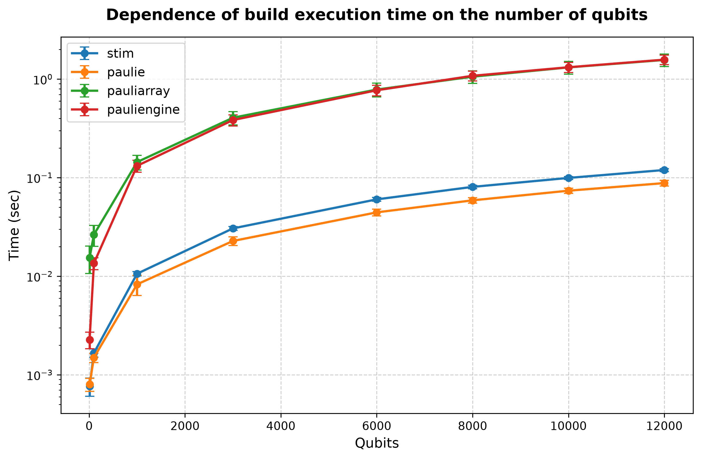
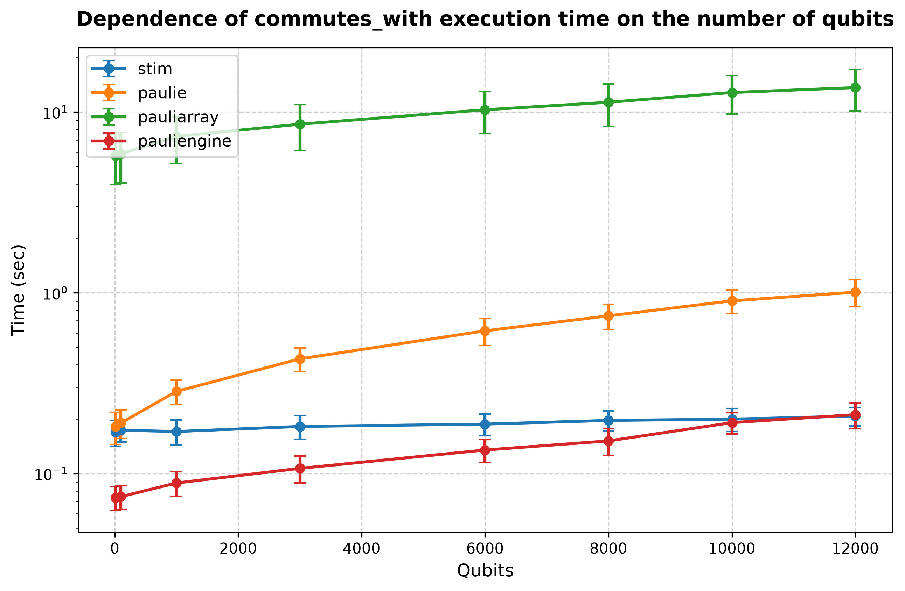
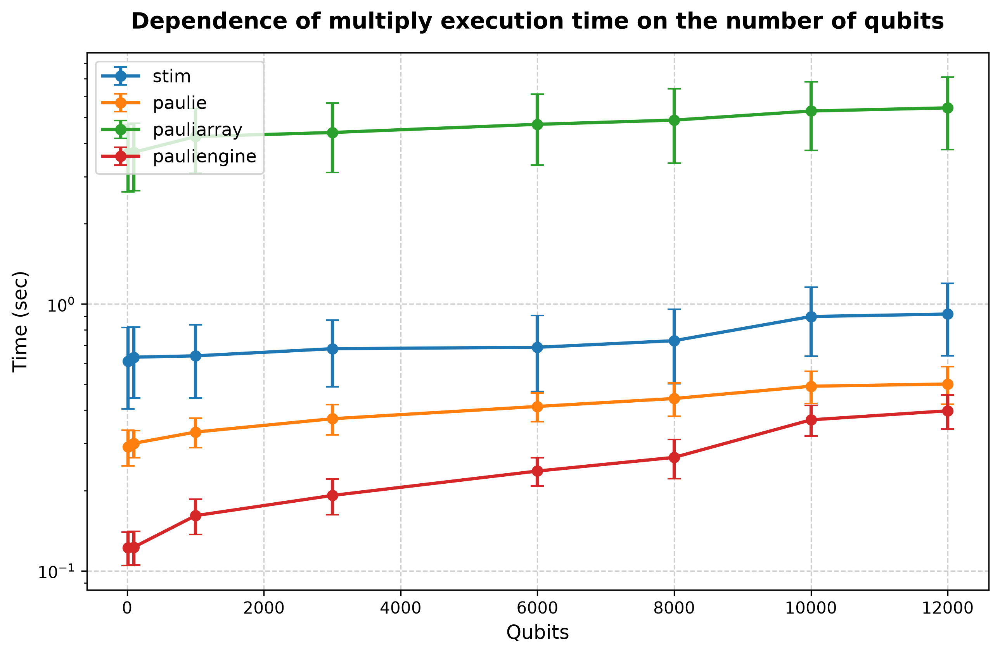

## Processor: Intel(R) Core(TM) i9-14900KF

### Performance for build (10 qubits and lenght of list is 1000')) 
| # | stim | paulie | pauliarray | pauliengine |
| :---: | :------: | :------: | :------: | :------: |
| 1 | 0.000957 | 0.000626 | 0.007506 | 0.001370 |
| 2 | 0.000489 | 0.000603 | 0.007514 | 0.001387 |
| 3 | 0.000836 | 0.000819 | 0.018667 | 0.002503 |
| 4 | 0.000835 | 0.000832 | 0.018105 | 0.002533 |
| 5 | 0.000826 | 0.000785 | 0.018612 | 0.002670 |
| 6 | 0.000847 | 0.000836 | 0.018356 | 0.002387 |
| 7 | 0.000832 | 0.000864 | 0.019130 | 0.002421 |
| 8 | 0.000879 | 0.000876 | 0.018365 | 0.002486 |
| 9 | 0.000872 | 0.000866 | 0.019802 | 0.002389 |
| 10 | 0.000487 | 0.000616 | 0.007322 | 0.001370 |
| 11 | 0.000488 | 0.000611 | 0.007378 | 0.001363 |
| 12 | 0.000485 | 0.000609 | 0.007340 | 0.001423 |
| 13 | 0.000493 | 0.000608 | 0.007354 | 0.001411 |
| 14 | 0.000864 | 0.000879 | 0.019141 | 0.002478 |
| 15 | 0.000866 | 0.000890 | 0.019333 | 0.002525 |
| 16 | 0.000873 | 0.000866 | 0.018367 | 0.002550 |
| 17 | 0.000880 | 0.000888 | 0.018677 | 0.002509 |
| 18 | 0.000494 | 0.000849 | 0.007387 | 0.001363 |
| 19 | 0.000890 | 0.000894 | 0.018632 | 0.002583 |
| 20 | 0.000883 | 0.000850 | 0.018496 | 0.002512 |
| 21 | 0.000834 | 0.000825 | 0.018595 | 0.002357 |
| 22 | 0.000866 | 0.000826 | 0.019165 | 0.002526 |
| 23 | 0.000490 | 0.000961 | 0.007963 | 0.002545 |
| 24 | 0.000762 | 0.000612 | 0.007489 | 0.001387 |
| 25 | 0.000493 | 0.000619 | 0.018482 | 0.002016 |
| 26 | 0.000639 | 0.000617 | 0.007577 | 0.002484 |
| 27 | 0.000502 | 0.000920 | 0.007575 | 0.002097 |
| 28 | 0.000890 | 0.000822 | 0.018717 | 0.002373 |
| 29 | 0.000841 | 0.000869 | 0.018898 | 0.002394 |
| 30 | 0.000493 | 0.000605 | 0.008330 | 0.002089 |
| 31 | 0.000801 | 0.000848 | 0.017755 | 0.002491 |
| 32 | 0.000857 | 0.000826 | 0.018026 | 0.002433 |
| 33 | 0.000904 | 0.000854 | 0.018528 | 0.002441 |
| 34 | 0.000880 | 0.000860 | 0.018681 | 0.002455 |
| 35 | 0.000855 | 0.000840 | 0.018119 | 0.002436 |
| 36 | 0.000879 | 0.000877 | 0.018630 | 0.002506 |
| 37 | 0.000876 | 0.000875 | 0.018181 | 0.002534 |
| 38 | 0.000886 | 0.000872 | 0.018794 | 0.002468 |
| 39 | 0.000828 | 0.000875 | 0.017914 | 0.002455 |
| 40 | 0.000828 | 0.000849 | 0.019540 | 0.002478 |
| 41 | 0.000864 | 0.000896 | 0.018348 | 0.002457 |
| 42 | 0.000848 | 0.000845 | 0.017523 | 0.002519 |
| 43 | 0.000882 | 0.000834 | 0.018582 | 0.002490 |
| 44 | 0.000497 | 0.000612 | 0.010718 | 0.001387 |
| 45 | 0.000868 | 0.000845 | 0.018877 | 0.002447 |
| 46 | 0.000856 | 0.000871 | 0.019696 | 0.002578 |
| 47 | 0.000839 | 0.000882 | 0.018085 | 0.002638 |
| 48 | 0.000857 | 0.000873 | 0.018643 | 0.002459 |
| 49 | 0.000880 | 0.000884 | 0.018465 | 0.002586 |
| 50 | 0.000872 | 0.000897 | 0.019796 | 0.002498 |
| 51 | 0.000863 | 0.000893 | 0.017872 | 0.002397 |
| 52 | 0.000867 | 0.000861 | 0.017785 | 0.002481 |
| 53 | 0.000853 | 0.000839 | 0.018589 | 0.002376 |
| 54 | 0.000833 | 0.000868 | 0.018688 | 0.002483 |
| 55 | 0.000886 | 0.000888 | 0.019015 | 0.002518 |
| 56 | 0.000911 | 0.000844 | 0.017799 | 0.002562 |
| 57 | 0.000919 | 0.000881 | 0.019126 | 0.002446 |
| 58 | 0.000498 | 0.000870 | 0.019085 | 0.002403 |
| 59 | 0.000500 | 0.000604 | 0.007625 | 0.002674 |
| 60 | 0.000829 | 0.000842 | 0.018491 | 0.002556 |
| 61 | 0.000841 | 0.000881 | 0.018134 | 0.002383 |
| 62 | 0.000492 | 0.000621 | 0.007437 | 0.001391 |
| 63 | 0.000851 | 0.000907 | 0.018360 | 0.002477 |
| 64 | 0.000821 | 0.000763 | 0.018329 | 0.002539 |
| 65 | 0.000851 | 0.000885 | 0.019009 | 0.002664 |
| 66 | 0.000805 | 0.000863 | 0.018921 | 0.002374 |
| 67 | 0.000777 | 0.000605 | 0.007448 | 0.001396 |
| 68 | 0.000497 | 0.000594 | 0.010826 | 0.001390 |
| 69 | 0.000517 | 0.001142 | 0.007413 | 0.002693 |
| 70 | 0.000865 | 0.000869 | 0.018156 | 0.002539 |
| 71 | 0.000840 | 0.000906 | 0.018290 | 0.002535 |
| 72 | 0.000906 | 0.000854 | 0.018811 | 0.002600 |
| 73 | 0.000828 | 0.000922 | 0.018657 | 0.002534 |
| 74 | 0.000502 | 0.000618 | 0.007823 | 0.002468 |
| 75 | 0.000492 | 0.000619 | 0.007643 | 0.001423 |
| 76 | 0.000566 | 0.000609 | 0.013400 | 0.002070 |
| 77 | 0.000494 | 0.000604 | 0.010668 | 0.001891 |
| 78 | 0.000492 | 0.000599 | 0.011597 | 0.002570 |
| 79 | 0.000946 | 0.000609 | 0.007337 | 0.002091 |
| 80 | 0.000770 | 0.000610 | 0.010684 | 0.002066 |
| 81 | 0.000497 | 0.000927 | 0.007293 | 0.002506 |
| 82 | 0.000894 | 0.000856 | 0.018706 | 0.002409 |
| 83 | 0.000904 | 0.000920 | 0.018617 | 0.002606 |
| 84 | 0.000736 | 0.000612 | 0.007352 | 0.001391 |
| 85 | 0.000854 | 0.000885 | 0.018197 | 0.002478 |
| 86 | 0.000873 | 0.000837 | 0.018477 | 0.002506 |
| 87 | 0.000500 | 0.000618 | 0.018122 | 0.001393 |
| 88 | 0.000498 | 0.000624 | 0.009772 | 0.002702 |
| 89 | 0.000748 | 0.000606 | 0.007323 | 0.001402 |
| 90 | 0.000896 | 0.000908 | 0.019059 | 0.002391 |
| 91 | 0.000749 | 0.000623 | 0.007476 | 0.001414 |
| 92 | 0.000499 | 0.000931 | 0.010792 | 0.001427 |
| 93 | 0.000898 | 0.000912 | 0.018668 | 0.002392 |
| 94 | 0.000897 | 0.000847 | 0.018268 | 0.002538 |
| 95 | 0.000866 | 0.000825 | 0.018006 | 0.002469 |
| 96 | 0.000876 | 0.000842 | 0.019279 | 0.002483 |
| 97 | 0.000856 | 0.000854 | 0.018503 | 0.002599 |
| 98 | 0.000913 | 0.000906 | 0.018367 | 0.002512 |
| 99 | 0.000898 | 0.000885 | 0.018144 | 0.002547 |
| 100 | 0.000832 | 0.000916 | 0.018606 | 0.002515 |
| avg | 0.000765 | 0.000802 | 0.015432 | 0.002269 |
| dev | 0.000160 | 0.000122 | 0.004797 | 0.000432 |
### Performance for commutes_with (10 qubits and lenght of list is 1000')) 
| # | stim | paulie | pauliarray | pauliengine |
| :---: | :------: | :------: | :------: | :------: |
| 1 | 0.187657 | 0.202705 | 2.786038 | 0.056445 |
| 2 | 0.117919 | 0.114663 | 3.207585 | 0.052631 |
| 3 | 0.186172 | 0.200882 | 6.905588 | 0.076575 |
| 4 | 0.182599 | 0.196283 | 6.877634 | 0.075372 |
| 5 | 0.186633 | 0.197465 | 6.922935 | 0.078545 |
| 6 | 0.183104 | 0.201167 | 6.836850 | 0.074957 |
| 7 | 0.185847 | 0.204643 | 6.943499 | 0.074421 |
| 8 | 0.187847 | 0.202689 | 6.948914 | 0.078386 |
| 9 | 0.189235 | 0.194688 | 6.955670 | 0.076096 |
| 10 | 0.123004 | 0.121498 | 2.819444 | 0.065899 |
| 11 | 0.120467 | 0.117035 | 2.841358 | 0.052378 |
| 12 | 0.122118 | 0.114851 | 2.883570 | 0.051984 |
| 13 | 0.118696 | 0.115462 | 2.852697 | 0.052241 |
| 14 | 0.184800 | 0.214165 | 6.939119 | 0.078504 |
| 15 | 0.180578 | 0.202267 | 6.950418 | 0.082251 |
| 16 | 0.183441 | 0.200351 | 6.913066 | 0.079615 |
| 17 | 0.184024 | 0.201595 | 6.916044 | 0.078606 |
| 18 | 0.118325 | 0.163399 | 2.623418 | 0.054063 |
| 19 | 0.191814 | 0.200036 | 6.868285 | 0.077490 |
| 20 | 0.181087 | 0.201743 | 6.914716 | 0.076099 |
| 21 | 0.181310 | 0.202238 | 6.958197 | 0.073361 |
| 22 | 0.183158 | 0.195489 | 6.985885 | 0.073552 |
| 23 | 0.126538 | 0.170097 | 3.527870 | 0.077976 |
| 24 | 0.165239 | 0.117419 | 2.888833 | 0.080116 |
| 25 | 0.118552 | 0.117121 | 5.642409 | 0.064923 |
| 26 | 0.130334 | 0.116277 | 3.314505 | 0.091175 |
| 27 | 0.130592 | 0.132480 | 3.604475 | 0.076681 |
| 28 | 0.188570 | 0.198369 | 6.881627 | 0.075941 |
| 29 | 0.182238 | 0.207131 | 6.947173 | 0.075074 |
| 30 | 0.119786 | 0.116982 | 3.369264 | 0.076082 |
| 31 | 0.171663 | 0.202180 | 6.939326 | 0.078588 |
| 32 | 0.188508 | 0.209068 | 6.881660 | 0.079953 |
| 33 | 0.188409 | 0.209686 | 6.867502 | 0.074313 |
| 34 | 0.191575 | 0.205655 | 6.858376 | 0.076032 |
| 35 | 0.184513 | 0.198949 | 6.956565 | 0.077969 |
| 36 | 0.182969 | 0.197474 | 6.931308 | 0.077912 |
| 37 | 0.180025 | 0.205698 | 6.883312 | 0.073807 |
| 38 | 0.183128 | 0.209873 | 6.965093 | 0.081284 |
| 39 | 0.184663 | 0.209612 | 6.902984 | 0.080052 |
| 40 | 0.182968 | 0.198527 | 6.953895 | 0.077605 |
| 41 | 0.183708 | 0.213374 | 6.917223 | 0.076236 |
| 42 | 0.178002 | 0.204505 | 6.891235 | 0.077349 |
| 43 | 0.183022 | 0.204130 | 6.882040 | 0.077990 |
| 44 | 0.131939 | 0.115624 | 2.835064 | 0.053800 |
| 45 | 0.182700 | 0.203567 | 6.954211 | 0.073660 |
| 46 | 0.178592 | 0.207959 | 6.994510 | 0.082707 |
| 47 | 0.180824 | 0.203179 | 6.934038 | 0.079977 |
| 48 | 0.185614 | 0.206889 | 6.950449 | 0.075182 |
| 49 | 0.179956 | 0.201483 | 6.978904 | 0.075592 |
| 50 | 0.183865 | 0.204826 | 6.927863 | 0.077578 |
| 51 | 0.181841 | 0.203902 | 6.899492 | 0.070955 |
| 52 | 0.185828 | 0.202440 | 6.917033 | 0.075673 |
| 53 | 0.180367 | 0.202257 | 6.875717 | 0.072284 |
| 54 | 0.178763 | 0.203932 | 6.904065 | 0.074796 |
| 55 | 0.192214 | 0.206755 | 6.925038 | 0.077736 |
| 56 | 0.192630 | 0.197320 | 6.884261 | 0.080402 |
| 57 | 0.196629 | 0.206178 | 6.979432 | 0.072183 |
| 58 | 0.153555 | 0.206784 | 6.900413 | 0.072871 |
| 59 | 0.126033 | 0.117935 | 2.857491 | 0.077933 |
| 60 | 0.180267 | 0.208652 | 6.944672 | 0.078713 |
| 61 | 0.181196 | 0.205153 | 6.831371 | 0.070828 |
| 62 | 0.127091 | 0.116248 | 2.584588 | 0.053070 |
| 63 | 0.185983 | 0.207684 | 6.931069 | 0.072903 |
| 64 | 0.182499 | 0.196515 | 6.938000 | 0.074319 |
| 65 | 0.181957 | 0.207372 | 6.799205 | 0.078663 |
| 66 | 0.179765 | 0.205319 | 6.895861 | 0.071249 |
| 67 | 0.167588 | 0.115846 | 2.931717 | 0.052276 |
| 68 | 0.119215 | 0.117465 | 3.315951 | 0.055310 |
| 69 | 0.210954 | 0.257298 | 3.279544 | 0.115316 |
| 70 | 0.187069 | 0.207578 | 6.832683 | 0.075206 |
| 71 | 0.182274 | 0.208761 | 6.854399 | 0.073990 |
| 72 | 0.188778 | 0.210907 | 6.899503 | 0.074752 |
| 73 | 0.186302 | 0.205367 | 6.902047 | 0.073647 |
| 74 | 0.118892 | 0.116543 | 2.813719 | 0.072221 |
| 75 | 0.118187 | 0.125320 | 3.135339 | 0.052538 |
| 76 | 0.134383 | 0.147843 | 3.199034 | 0.073028 |
| 77 | 0.119098 | 0.115805 | 3.538011 | 0.076251 |
| 78 | 0.119601 | 0.115477 | 6.891912 | 0.077580 |
| 79 | 0.253584 | 0.143712 | 3.221816 | 0.073308 |
| 80 | 0.170278 | 0.115835 | 3.353754 | 0.080568 |
| 81 | 0.126136 | 0.149789 | 2.836433 | 0.086421 |
| 82 | 0.179508 | 0.202386 | 6.894679 | 0.069509 |
| 83 | 0.188711 | 0.207095 | 6.903196 | 0.073480 |
| 84 | 0.170358 | 0.134195 | 3.337830 | 0.051776 |
| 85 | 0.180715 | 0.209536 | 6.884297 | 0.074817 |
| 86 | 0.186403 | 0.192914 | 6.880452 | 0.082287 |
| 87 | 0.153398 | 0.170461 | 3.203207 | 0.060001 |
| 88 | 0.118019 | 0.122083 | 3.376965 | 0.114789 |
| 89 | 0.119281 | 0.190067 | 4.205720 | 0.052094 |
| 90 | 0.186916 | 0.198381 | 6.888920 | 0.079571 |
| 91 | 0.150038 | 0.115873 | 2.983815 | 0.052479 |
| 92 | 0.138960 | 0.174209 | 2.991241 | 0.051673 |
| 93 | 0.184125 | 0.208254 | 6.916799 | 0.075447 |
| 94 | 0.188169 | 0.192753 | 6.910244 | 0.075130 |
| 95 | 0.183491 | 0.197819 | 6.875541 | 0.077455 |
| 96 | 0.191188 | 0.199785 | 6.963509 | 0.077397 |
| 97 | 0.183191 | 0.204789 | 6.846362 | 0.079060 |
| 98 | 0.187895 | 0.203637 | 6.880091 | 0.074642 |
| 99 | 0.183109 | 0.212308 | 6.898013 | 0.080644 |
| 100 | 0.187242 | 0.208488 | 6.917940 | 0.077239 |
| avg | 0.169180 | 0.181465 | 5.722650 | 0.073515 |
| dev | 0.027850 | 0.036970 | 1.759333 | 0.010899 |
### Performance for multiply (10 qubits and lenght of list is 1000')) 
| # | stim | paulie | pauliarray | pauliengine |
| :---: | :------: | :------: | :------: | :------: |
| 1 | 0.401918 | 0.323194 | 2.306420 | 0.095382 |
| 2 | 0.268751 | 0.213778 | 2.092820 | 0.091917 |
| 3 | 0.744012 | 0.314267 | 4.418968 | 0.134977 |
| 4 | 0.750362 | 0.314191 | 4.407192 | 0.121313 |
| 5 | 0.758498 | 0.329846 | 4.438327 | 0.123962 |
| 6 | 0.754626 | 0.314031 | 4.411346 | 0.129084 |
| 7 | 0.740350 | 0.311783 | 4.434085 | 0.129906 |
| 8 | 0.778207 | 0.311401 | 4.356889 | 0.130098 |
| 9 | 0.739273 | 0.316668 | 4.356833 | 0.127717 |
| 10 | 0.315303 | 0.210151 | 2.093885 | 0.133478 |
| 11 | 0.268971 | 0.207668 | 2.189222 | 0.095431 |
| 12 | 0.283655 | 0.221606 | 1.819715 | 0.094979 |
| 13 | 0.273500 | 0.208450 | 2.246030 | 0.091685 |
| 14 | 0.732442 | 0.328182 | 4.416777 | 0.131548 |
| 15 | 0.746082 | 0.311574 | 4.360402 | 0.133038 |
| 16 | 0.765544 | 0.309529 | 4.377856 | 0.128021 |
| 17 | 0.755428 | 0.316445 | 4.360577 | 0.129340 |
| 18 | 0.273881 | 0.228569 | 1.996025 | 0.094086 |
| 19 | 0.770335 | 0.302076 | 4.374296 | 0.130036 |
| 20 | 0.732866 | 0.319190 | 4.422095 | 0.120698 |
| 21 | 0.768277 | 0.320193 | 4.407793 | 0.129379 |
| 22 | 0.769097 | 0.314550 | 4.372508 | 0.119988 |
| 23 | 0.319469 | 0.279292 | 2.979942 | 0.127481 |
| 24 | 0.370541 | 0.210730 | 2.157457 | 0.133683 |
| 25 | 0.262262 | 0.230867 | 2.066685 | 0.130728 |
| 26 | 0.275643 | 0.208617 | 2.387797 | 0.090986 |
| 27 | 0.434296 | 0.208166 | 2.165097 | 0.124376 |
| 28 | 0.745340 | 0.322900 | 4.367653 | 0.123679 |
| 29 | 0.755502 | 0.316957 | 4.409917 | 0.121476 |
| 30 | 0.283857 | 0.210291 | 2.184953 | 0.124877 |
| 31 | 0.765031 | 0.314233 | 4.332191 | 0.126102 |
| 32 | 0.748204 | 0.305800 | 4.408642 | 0.131667 |
| 33 | 0.727849 | 0.317823 | 4.380924 | 0.120005 |
| 34 | 0.744524 | 0.311106 | 4.377718 | 0.122602 |
| 35 | 0.738087 | 0.309539 | 4.351221 | 0.121598 |
| 36 | 0.731595 | 0.303728 | 4.387309 | 0.123464 |
| 37 | 0.734197 | 0.322357 | 4.386236 | 0.112299 |
| 38 | 0.744698 | 0.309006 | 4.415182 | 0.131327 |
| 39 | 0.752467 | 0.316643 | 4.372076 | 0.128250 |
| 40 | 0.744220 | 0.313893 | 4.370171 | 0.124772 |
| 41 | 0.741149 | 0.315340 | 4.442493 | 0.126413 |
| 42 | 0.754249 | 0.302906 | 4.324861 | 0.126317 |
| 43 | 0.752448 | 0.308066 | 4.369649 | 0.125595 |
| 44 | 0.269914 | 0.263525 | 1.972038 | 0.093306 |
| 45 | 0.741290 | 0.306658 | 4.378687 | 0.125616 |
| 46 | 0.745069 | 0.322092 | 4.446122 | 0.131530 |
| 47 | 0.765756 | 0.302185 | 4.404822 | 0.128818 |
| 48 | 0.723696 | 0.324290 | 4.363961 | 0.128422 |
| 49 | 0.743057 | 0.307154 | 4.365019 | 0.121413 |
| 50 | 0.726962 | 0.324159 | 4.359900 | 0.131235 |
| 51 | 0.730869 | 0.319130 | 4.373964 | 0.121143 |
| 52 | 0.750951 | 0.311639 | 4.388563 | 0.125396 |
| 53 | 0.739156 | 0.310895 | 4.328330 | 0.115958 |
| 54 | 0.743498 | 0.316241 | 4.338846 | 0.125157 |
| 55 | 0.762100 | 0.310313 | 4.428441 | 0.131561 |
| 56 | 0.770977 | 0.297137 | 4.378121 | 0.129723 |
| 57 | 0.753717 | 0.304835 | 4.409939 | 0.115552 |
| 58 | 0.762075 | 0.314450 | 4.393093 | 0.126523 |
| 59 | 0.297671 | 0.213646 | 1.949157 | 0.089422 |
| 60 | 0.765509 | 0.317762 | 4.372613 | 0.120878 |
| 61 | 0.768500 | 0.308074 | 4.411534 | 0.128372 |
| 62 | 0.378400 | 0.219642 | 1.947015 | 0.090362 |
| 63 | 0.760689 | 0.302819 | 4.368548 | 0.121131 |
| 64 | 0.719963 | 0.314533 | 4.353119 | 0.121369 |
| 65 | 0.746687 | 0.324574 | 4.373491 | 0.129569 |
| 66 | 0.767368 | 0.314301 | 4.368458 | 0.122088 |
| 67 | 0.389022 | 0.211637 | 2.052835 | 0.120569 |
| 68 | 0.271942 | 0.251149 | 2.360474 | 0.096178 |
| 69 | 0.584692 | 0.287703 | 2.246156 | 0.203633 |
| 70 | 0.763246 | 0.307017 | 4.363236 | 0.122684 |
| 71 | 0.770144 | 0.309576 | 4.368846 | 0.124393 |
| 72 | 0.759909 | 0.310342 | 4.361048 | 0.127359 |
| 73 | 0.766498 | 0.318217 | 4.405780 | 0.128660 |
| 74 | 0.272705 | 0.212296 | 2.666868 | 0.118139 |
| 75 | 0.295009 | 0.273974 | 2.083811 | 0.089826 |
| 76 | 0.262711 | 0.474145 | 2.236112 | 0.118512 |
| 77 | 0.274067 | 0.244933 | 1.909259 | 0.128524 |
| 78 | 0.277730 | 0.209470 | 4.368005 | 0.125779 |
| 79 | 0.343914 | 0.229916 | 2.329780 | 0.107484 |
| 80 | 0.360972 | 0.307552 | 2.279164 | 0.134496 |
| 81 | 0.337145 | 0.208260 | 2.296741 | 0.103865 |
| 82 | 0.761352 | 0.304569 | 4.408180 | 0.123047 |
| 83 | 0.741778 | 0.315942 | 4.409396 | 0.125137 |
| 84 | 0.312656 | 0.218289 | 2.027907 | 0.112945 |
| 85 | 0.760452 | 0.315411 | 4.383625 | 0.121382 |
| 86 | 0.735923 | 0.308996 | 4.389661 | 0.137821 |
| 87 | 0.539960 | 0.313049 | 2.022195 | 0.100096 |
| 88 | 0.260336 | 0.268569 | 1.999922 | 0.201387 |
| 89 | 0.261139 | 0.325397 | 2.111772 | 0.088414 |
| 90 | 0.745334 | 0.307111 | 4.380402 | 0.138167 |
| 91 | 0.261733 | 0.212785 | 1.979680 | 0.099365 |
| 92 | 0.443121 | 0.324314 | 2.304258 | 0.095150 |
| 93 | 0.770724 | 0.305953 | 4.439142 | 0.127378 |
| 94 | 0.753662 | 0.303975 | 4.384623 | 0.136343 |
| 95 | 0.761057 | 0.310998 | 4.414249 | 0.128643 |
| 96 | 0.746836 | 0.316526 | 4.411183 | 0.128386 |
| 97 | 0.741622 | 0.310626 | 4.420959 | 0.133110 |
| 98 | 0.758620 | 0.309245 | 4.343001 | 0.120889 |
| 99 | 0.749628 | 0.317474 | 4.391120 | 0.131293 |
| 100 | 0.743342 | 0.313964 | 4.439685 | 0.124760 |
| avg | 0.610299 | 0.291950 | 3.677611 | 0.122121 |
| dev | 0.205630 | 0.044198 | 1.041774 | 0.017423 |
### Performance for build (100 qubits and lenght of list is 1000')) 
| # | stim | paulie | pauliarray | pauliengine |
| :---: | :------: | :------: | :------: | :------: |
| 1 | 0.001400 | 0.001158 | 0.029636 | 0.010127 |
| 2 | 0.001337 | 0.001171 | 0.014936 | 0.010002 |
| 3 | 0.001791 | 0.001508 | 0.029975 | 0.013917 |
| 4 | 0.001744 | 0.001560 | 0.029044 | 0.014781 |
| 5 | 0.001652 | 0.001496 | 0.031169 | 0.014514 |
| 6 | 0.001700 | 0.001530 | 0.030012 | 0.014830 |
| 7 | 0.001787 | 0.001489 | 0.029729 | 0.014083 |
| 8 | 0.001781 | 0.001505 | 0.030512 | 0.014156 |
| 9 | 0.001732 | 0.001548 | 0.030147 | 0.014348 |
| 10 | 0.001676 | 0.001463 | 0.014853 | 0.010105 |
| 11 | 0.001334 | 0.001207 | 0.014866 | 0.009987 |
| 12 | 0.001329 | 0.001187 | 0.014844 | 0.010023 |
| 13 | 0.001327 | 0.001799 | 0.014903 | 0.009910 |
| 14 | 0.001808 | 0.001506 | 0.031366 | 0.015424 |
| 15 | 0.001790 | 0.001582 | 0.028852 | 0.014962 |
| 16 | 0.001701 | 0.001559 | 0.030287 | 0.014606 |
| 17 | 0.001699 | 0.001519 | 0.030299 | 0.014119 |
| 18 | 0.001333 | 0.001196 | 0.014919 | 0.009950 |
| 19 | 0.001798 | 0.001534 | 0.030462 | 0.014415 |
| 20 | 0.001696 | 0.001479 | 0.030417 | 0.014147 |
| 21 | 0.001698 | 0.001589 | 0.030651 | 0.014703 |
| 22 | 0.001742 | 0.001545 | 0.029786 | 0.014277 |
| 23 | 0.001837 | 0.001627 | 0.030145 | 0.014354 |
| 24 | 0.001673 | 0.001475 | 0.014900 | 0.010253 |
| 25 | 0.001561 | 0.001469 | 0.020343 | 0.011396 |
| 26 | 0.001335 | 0.001572 | 0.014923 | 0.013261 |
| 27 | 0.001555 | 0.001624 | 0.020604 | 0.010036 |
| 28 | 0.001692 | 0.001498 | 0.030958 | 0.014753 |
| 29 | 0.001740 | 0.001505 | 0.030309 | 0.015018 |
| 30 | 0.001793 | 0.001522 | 0.031303 | 0.014933 |
| 31 | 0.001715 | 0.001580 | 0.029130 | 0.015339 |
| 32 | 0.001829 | 0.001551 | 0.030651 | 0.014880 |
| 33 | 0.001704 | 0.001459 | 0.029737 | 0.014587 |
| 34 | 0.001707 | 0.001544 | 0.030165 | 0.014600 |
| 35 | 0.001716 | 0.001520 | 0.030482 | 0.015027 |
| 36 | 0.001709 | 0.001549 | 0.030327 | 0.014600 |
| 37 | 0.001730 | 0.001496 | 0.030070 | 0.014916 |
| 38 | 0.001730 | 0.001521 | 0.030774 | 0.013842 |
| 39 | 0.001712 | 0.001468 | 0.030680 | 0.014452 |
| 40 | 0.001722 | 0.001574 | 0.028981 | 0.014265 |
| 41 | 0.001697 | 0.001494 | 0.030633 | 0.013555 |
| 42 | 0.001739 | 0.001482 | 0.031319 | 0.014167 |
| 43 | 0.001724 | 0.001485 | 0.030797 | 0.014403 |
| 44 | 0.001337 | 0.001184 | 0.014878 | 0.010010 |
| 45 | 0.001746 | 0.001588 | 0.031317 | 0.015409 |
| 46 | 0.001703 | 0.001590 | 0.030325 | 0.014161 |
| 47 | 0.001648 | 0.001535 | 0.030175 | 0.014558 |
| 48 | 0.001747 | 0.001515 | 0.031310 | 0.014697 |
| 49 | 0.001786 | 0.001547 | 0.030486 | 0.014316 |
| 50 | 0.001759 | 0.001552 | 0.030521 | 0.014479 |
| 51 | 0.001757 | 0.001470 | 0.031160 | 0.014770 |
| 52 | 0.001699 | 0.001586 | 0.029997 | 0.014955 |
| 53 | 0.001733 | 0.001630 | 0.031435 | 0.014971 |
| 54 | 0.001742 | 0.001486 | 0.030413 | 0.014646 |
| 55 | 0.001798 | 0.001560 | 0.030274 | 0.014622 |
| 56 | 0.001692 | 0.001494 | 0.030063 | 0.014615 |
| 57 | 0.001693 | 0.001523 | 0.030737 | 0.014561 |
| 58 | 0.001804 | 0.001569 | 0.030598 | 0.014767 |
| 59 | 0.001334 | 0.001180 | 0.015289 | 0.012414 |
| 60 | 0.001626 | 0.001571 | 0.029285 | 0.014161 |
| 61 | 0.001747 | 0.001518 | 0.031120 | 0.013832 |
| 62 | 0.001339 | 0.002043 | 0.014951 | 0.013102 |
| 63 | 0.001733 | 0.001570 | 0.031266 | 0.014621 |
| 64 | 0.001783 | 0.001548 | 0.030481 | 0.014872 |
| 65 | 0.001735 | 0.001405 | 0.030654 | 0.014807 |
| 66 | 0.001728 | 0.001545 | 0.030472 | 0.014530 |
| 67 | 0.001683 | 0.001613 | 0.017317 | 0.010067 |
| 68 | 0.001335 | 0.001176 | 0.020554 | 0.013058 |
| 69 | 0.002020 | 0.001195 | 0.015085 | 0.010064 |
| 70 | 0.001659 | 0.001536 | 0.030140 | 0.014591 |
| 71 | 0.001735 | 0.001455 | 0.031443 | 0.014601 |
| 72 | 0.001783 | 0.001585 | 0.030041 | 0.014924 |
| 73 | 0.001786 | 0.001501 | 0.030866 | 0.014257 |
| 74 | 0.001742 | 0.001388 | 0.020036 | 0.014001 |
| 75 | 0.001324 | 0.002036 | 0.014920 | 0.010242 |
| 76 | 0.001652 | 0.001201 | 0.015304 | 0.010356 |
| 77 | 0.001625 | 0.001549 | 0.015069 | 0.009932 |
| 78 | 0.001725 | 0.001538 | 0.029758 | 0.014636 |
| 79 | 0.001562 | 0.001196 | 0.014844 | 0.012968 |
| 80 | 0.001551 | 0.001178 | 0.020266 | 0.012981 |
| 81 | 0.001473 | 0.001645 | 0.014919 | 0.010042 |
| 82 | 0.001717 | 0.001592 | 0.029465 | 0.014868 |
| 83 | 0.001657 | 0.001485 | 0.030249 | 0.014655 |
| 84 | 0.001562 | 0.001474 | 0.020637 | 0.009971 |
| 85 | 0.001675 | 0.001533 | 0.029315 | 0.014985 |
| 86 | 0.001811 | 0.001509 | 0.029602 | 0.014911 |
| 87 | 0.001395 | 0.001182 | 0.020631 | 0.009978 |
| 88 | 0.002023 | 0.001196 | 0.014809 | 0.017683 |
| 89 | 0.001331 | 0.001449 | 0.019440 | 0.010267 |
| 90 | 0.001726 | 0.001535 | 0.030766 | 0.014489 |
| 91 | 0.001334 | 0.001192 | 0.019790 | 0.012840 |
| 92 | 0.001429 | 0.001887 | 0.020345 | 0.010063 |
| 93 | 0.001739 | 0.001500 | 0.030812 | 0.015212 |
| 94 | 0.001842 | 0.001460 | 0.030292 | 0.014788 |
| 95 | 0.001736 | 0.001555 | 0.030099 | 0.014320 |
| 96 | 0.001704 | 0.001563 | 0.030024 | 0.014326 |
| 97 | 0.001750 | 0.001550 | 0.029851 | 0.014615 |
| 98 | 0.001706 | 0.001553 | 0.030842 | 0.014678 |
| 99 | 0.001779 | 0.001646 | 0.030892 | 0.014657 |
| 100 | 0.001740 | 0.001535 | 0.030155 | 0.014562 |
| avg | 0.001665 | 0.001495 | 0.026447 | 0.013565 |
| dev | 0.000158 | 0.000161 | 0.006291 | 0.001877 |
### Performance for commutes_with (100 qubits and lenght of list is 1000')) 
| # | stim | paulie | pauliarray | pauliengine |
| :---: | :------: | :------: | :------: | :------: |
| 1 | 0.120435 | 0.203999 | 3.456415 | 0.053784 |
| 2 | 0.202768 | 0.116651 | 3.094600 | 0.058771 |
| 3 | 0.186558 | 0.207052 | 7.060856 | 0.077036 |
| 4 | 0.185319 | 0.207408 | 7.089375 | 0.073409 |
| 5 | 0.177464 | 0.209666 | 7.069975 | 0.078802 |
| 6 | 0.182289 | 0.202950 | 7.029577 | 0.082677 |
| 7 | 0.181750 | 0.207518 | 7.089373 | 0.076455 |
| 8 | 0.185567 | 0.205698 | 7.117795 | 0.070421 |
| 9 | 0.181014 | 0.206661 | 7.050048 | 0.075681 |
| 10 | 0.169862 | 0.163337 | 3.275268 | 0.087230 |
| 11 | 0.119136 | 0.134451 | 2.798526 | 0.054338 |
| 12 | 0.146901 | 0.121031 | 2.699313 | 0.052784 |
| 13 | 0.117929 | 0.241934 | 3.045916 | 0.055098 |
| 14 | 0.187486 | 0.206015 | 7.028270 | 0.086747 |
| 15 | 0.186082 | 0.208895 | 7.020052 | 0.080404 |
| 16 | 0.180136 | 0.210717 | 7.034655 | 0.080832 |
| 17 | 0.183710 | 0.205640 | 7.021366 | 0.071546 |
| 18 | 0.117024 | 0.118435 | 2.737915 | 0.056324 |
| 19 | 0.181038 | 0.203817 | 7.044330 | 0.075758 |
| 20 | 0.179197 | 0.208582 | 7.089280 | 0.074899 |
| 21 | 0.180978 | 0.210506 | 7.082911 | 0.084806 |
| 22 | 0.182162 | 0.201871 | 7.092587 | 0.074762 |
| 23 | 0.191274 | 0.214613 | 7.206225 | 0.072451 |
| 24 | 0.155657 | 0.121002 | 3.533189 | 0.061943 |
| 25 | 0.167022 | 0.166212 | 3.236630 | 0.064415 |
| 26 | 0.117914 | 0.178864 | 2.753682 | 0.066875 |
| 27 | 0.166355 | 0.123158 | 3.267182 | 0.056576 |
| 28 | 0.183767 | 0.210364 | 7.053830 | 0.076915 |
| 29 | 0.185241 | 0.205841 | 7.068838 | 0.075769 |
| 30 | 0.179934 | 0.206990 | 7.078319 | 0.080889 |
| 31 | 0.183212 | 0.213638 | 7.031947 | 0.080867 |
| 32 | 0.188837 | 0.212926 | 7.071151 | 0.079820 |
| 33 | 0.182424 | 0.203075 | 7.020333 | 0.084310 |
| 34 | 0.185796 | 0.206152 | 7.066464 | 0.078563 |
| 35 | 0.184436 | 0.204833 | 7.034155 | 0.078526 |
| 36 | 0.186589 | 0.209657 | 7.057094 | 0.084749 |
| 37 | 0.182219 | 0.209339 | 7.072232 | 0.079464 |
| 38 | 0.183327 | 0.200504 | 7.085581 | 0.079108 |
| 39 | 0.182239 | 0.205544 | 7.018205 | 0.081906 |
| 40 | 0.184496 | 0.210610 | 7.013807 | 0.084668 |
| 41 | 0.182521 | 0.206488 | 7.021970 | 0.074483 |
| 42 | 0.182977 | 0.210023 | 7.029778 | 0.077699 |
| 43 | 0.189387 | 0.208070 | 7.023227 | 0.076450 |
| 44 | 0.118175 | 0.119015 | 2.841616 | 0.054288 |
| 45 | 0.182346 | 0.207853 | 7.045613 | 0.081979 |
| 46 | 0.177326 | 0.211951 | 7.130771 | 0.077684 |
| 47 | 0.177016 | 0.207777 | 7.112259 | 0.082695 |
| 48 | 0.184839 | 0.204442 | 7.066775 | 0.076725 |
| 49 | 0.187202 | 0.205420 | 7.067247 | 0.081815 |
| 50 | 0.187410 | 0.210101 | 7.042448 | 0.079081 |
| 51 | 0.181818 | 0.196238 | 7.067814 | 0.080534 |
| 52 | 0.184297 | 0.216480 | 6.998735 | 0.079478 |
| 53 | 0.188207 | 0.211047 | 6.988518 | 0.079714 |
| 54 | 0.188708 | 0.205607 | 7.031076 | 0.078179 |
| 55 | 0.185572 | 0.215292 | 7.039159 | 0.080916 |
| 56 | 0.176454 | 0.207802 | 7.031939 | 0.089282 |
| 57 | 0.188549 | 0.211999 | 7.044176 | 0.078340 |
| 58 | 0.185017 | 0.206555 | 7.067916 | 0.077435 |
| 59 | 0.123991 | 0.117737 | 3.028823 | 0.077421 |
| 60 | 0.176913 | 0.211059 | 6.950350 | 0.079013 |
| 61 | 0.185245 | 0.204289 | 7.068839 | 0.074394 |
| 62 | 0.118472 | 0.141488 | 2.615877 | 0.079119 |
| 63 | 0.186833 | 0.214368 | 7.016619 | 0.081274 |
| 64 | 0.188284 | 0.206317 | 7.044826 | 0.082539 |
| 65 | 0.186412 | 0.198928 | 7.069332 | 0.076523 |
| 66 | 0.185029 | 0.200521 | 7.065909 | 0.081675 |
| 67 | 0.170486 | 0.182069 | 3.122839 | 0.053587 |
| 68 | 0.118659 | 0.123035 | 3.392756 | 0.077838 |
| 69 | 0.253464 | 0.141014 | 3.409658 | 0.054274 |
| 70 | 0.171096 | 0.212885 | 6.982074 | 0.082899 |
| 71 | 0.190952 | 0.204583 | 7.009177 | 0.082121 |
| 72 | 0.186920 | 0.208340 | 7.088438 | 0.079077 |
| 73 | 0.186445 | 0.207315 | 7.021882 | 0.076708 |
| 74 | 0.186606 | 0.138676 | 3.474289 | 0.068037 |
| 75 | 0.118239 | 0.290010 | 2.939803 | 0.053061 |
| 76 | 0.163890 | 0.118260 | 2.919275 | 0.052791 |
| 77 | 0.167924 | 0.154780 | 2.985353 | 0.052411 |
| 78 | 0.180829 | 0.210150 | 7.037923 | 0.081196 |
| 79 | 0.166783 | 0.118311 | 2.903458 | 0.078560 |
| 80 | 0.167653 | 0.119243 | 3.189381 | 0.078622 |
| 81 | 0.181339 | 0.129681 | 3.014650 | 0.052778 |
| 82 | 0.177413 | 0.213572 | 6.998487 | 0.082085 |
| 83 | 0.181519 | 0.204197 | 7.055498 | 0.086116 |
| 84 | 0.167314 | 0.181572 | 3.349439 | 0.059753 |
| 85 | 0.172589 | 0.210257 | 7.028822 | 0.078653 |
| 86 | 0.185700 | 0.204919 | 7.065814 | 0.082867 |
| 87 | 0.124851 | 0.161917 | 3.325201 | 0.053468 |
| 88 | 0.196444 | 0.117913 | 3.063616 | 0.121798 |
| 89 | 0.118641 | 0.169036 | 3.027375 | 0.052471 |
| 90 | 0.184010 | 0.207173 | 7.069706 | 0.076099 |
| 91 | 0.120018 | 0.125726 | 3.489591 | 0.075904 |
| 92 | 0.122733 | 0.171983 | 3.193197 | 0.053336 |
| 93 | 0.185433 | 0.205562 | 7.025886 | 0.079149 |
| 94 | 0.191203 | 0.203548 | 7.041067 | 0.074050 |
| 95 | 0.184212 | 0.213826 | 7.005614 | 0.079092 |
| 96 | 0.184535 | 0.209056 | 7.106348 | 0.073280 |
| 97 | 0.181167 | 0.201184 | 7.002341 | 0.076699 |
| 98 | 0.179278 | 0.205690 | 7.051951 | 0.075015 |
| 99 | 0.182285 | 0.213157 | 7.035931 | 0.075075 |
| 100 | 0.182594 | 0.201507 | 7.016671 | 0.077484 |
| avg | 0.173578 | 0.190432 | 5.866524 | 0.074455 |
| dev | 0.024123 | 0.034356 | 1.812696 | 0.011185 |
### Performance for multiply (100 qubits and lenght of list is 1000')) 
| # | stim | paulie | pauliarray | pauliengine |
| :---: | :------: | :------: | :------: | :------: |
| 1 | 0.259788 | 0.317078 | 1.847713 | 0.093383 |
| 2 | 0.354588 | 0.207062 | 1.915101 | 0.096436 |
| 3 | 0.756255 | 0.308903 | 4.438882 | 0.131008 |
| 4 | 0.748088 | 0.294364 | 4.429282 | 0.121013 |
| 5 | 0.749628 | 0.303932 | 4.389683 | 0.130878 |
| 6 | 0.769420 | 0.307252 | 4.406166 | 0.137101 |
| 7 | 0.754404 | 0.315983 | 4.408563 | 0.129500 |
| 8 | 0.760094 | 0.321066 | 4.351856 | 0.119014 |
| 9 | 0.747462 | 0.304710 | 4.378503 | 0.126503 |
| 10 | 0.437435 | 0.281819 | 1.984338 | 0.109430 |
| 11 | 0.264063 | 0.210884 | 1.974046 | 0.096222 |
| 12 | 0.305249 | 0.208226 | 1.927985 | 0.090027 |
| 13 | 0.358630 | 0.281821 | 2.108887 | 0.138507 |
| 14 | 0.768925 | 0.304449 | 4.372945 | 0.134732 |
| 15 | 0.750951 | 0.310130 | 4.379787 | 0.133644 |
| 16 | 0.745757 | 0.314922 | 4.403563 | 0.130778 |
| 17 | 0.743343 | 0.320366 | 4.429234 | 0.115527 |
| 18 | 0.259714 | 0.264624 | 1.787830 | 0.093768 |
| 19 | 0.756507 | 0.313703 | 4.409356 | 0.121347 |
| 20 | 0.754065 | 0.322960 | 4.451343 | 0.122601 |
| 21 | 0.755646 | 0.309192 | 4.344480 | 0.131823 |
| 22 | 0.768919 | 0.310705 | 4.358099 | 0.122870 |
| 23 | 0.753367 | 0.320465 | 4.420547 | 0.118446 |
| 24 | 0.407956 | 0.225897 | 2.659782 | 0.106123 |
| 25 | 0.350440 | 0.324515 | 2.156814 | 0.111585 |
| 26 | 0.425851 | 0.297435 | 2.151937 | 0.185462 |
| 27 | 0.350909 | 0.237063 | 2.198518 | 0.098251 |
| 28 | 0.743468 | 0.308334 | 4.383238 | 0.115006 |
| 29 | 0.742566 | 0.310317 | 4.399676 | 0.119323 |
| 30 | 0.763267 | 0.319446 | 4.416641 | 0.135407 |
| 31 | 0.748099 | 0.312798 | 4.428965 | 0.124082 |
| 32 | 0.760567 | 0.313609 | 4.421638 | 0.127688 |
| 33 | 0.766923 | 0.319225 | 4.413409 | 0.130662 |
| 34 | 0.747333 | 0.316351 | 4.347278 | 0.127173 |
| 35 | 0.738967 | 0.314698 | 4.386385 | 0.127720 |
| 36 | 0.742811 | 0.313147 | 4.332777 | 0.135665 |
| 37 | 0.740764 | 0.305657 | 4.359342 | 0.125941 |
| 38 | 0.745041 | 0.315221 | 4.383192 | 0.124737 |
| 39 | 0.757569 | 0.318256 | 4.331521 | 0.127860 |
| 40 | 0.750339 | 0.304994 | 4.385446 | 0.134549 |
| 41 | 0.737963 | 0.307969 | 4.377046 | 0.125680 |
| 42 | 0.751452 | 0.312498 | 4.352018 | 0.121340 |
| 43 | 0.738352 | 0.321468 | 4.311494 | 0.124652 |
| 44 | 0.262414 | 0.210546 | 1.907696 | 0.093940 |
| 45 | 0.742017 | 0.321959 | 4.428085 | 0.132032 |
| 46 | 0.769057 | 0.319080 | 4.406738 | 0.128041 |
| 47 | 0.744295 | 0.322885 | 4.361006 | 0.130825 |
| 48 | 0.754407 | 0.322370 | 4.373227 | 0.123971 |
| 49 | 0.729873 | 0.317745 | 4.414936 | 0.133331 |
| 50 | 0.745762 | 0.314791 | 4.393706 | 0.124452 |
| 51 | 0.751621 | 0.309379 | 4.442651 | 0.132708 |
| 52 | 0.776538 | 0.322018 | 4.374375 | 0.125214 |
| 53 | 0.762149 | 0.318658 | 4.367815 | 0.125029 |
| 54 | 0.735685 | 0.312056 | 4.369935 | 0.129037 |
| 55 | 0.770402 | 0.308764 | 4.406932 | 0.128579 |
| 56 | 0.743538 | 0.309643 | 4.397951 | 0.149375 |
| 57 | 0.750089 | 0.317054 | 4.412209 | 0.129106 |
| 58 | 0.752398 | 0.316899 | 4.369458 | 0.134485 |
| 59 | 0.289449 | 0.214736 | 2.125799 | 0.128406 |
| 60 | 0.757442 | 0.319020 | 4.337300 | 0.130370 |
| 61 | 0.750334 | 0.313708 | 4.389002 | 0.122327 |
| 62 | 0.370418 | 0.232025 | 1.936686 | 0.116994 |
| 63 | 0.739927 | 0.320193 | 4.382516 | 0.127103 |
| 64 | 0.743050 | 0.318513 | 4.352013 | 0.130971 |
| 65 | 0.737287 | 0.318065 | 4.380875 | 0.128064 |
| 66 | 0.752896 | 0.312346 | 4.369794 | 0.130443 |
| 67 | 0.442936 | 0.321416 | 2.222232 | 0.092645 |
| 68 | 0.268567 | 0.323223 | 2.081500 | 0.104008 |
| 69 | 0.387966 | 0.209785 | 2.304589 | 0.094449 |
| 70 | 0.727743 | 0.317148 | 4.398300 | 0.133362 |
| 71 | 0.740735 | 0.317897 | 4.396064 | 0.140971 |
| 72 | 0.751946 | 0.317475 | 4.407199 | 0.129135 |
| 73 | 0.742252 | 0.314964 | 4.417152 | 0.121788 |
| 74 | 0.735933 | 0.321722 | 2.372845 | 0.095805 |
| 75 | 0.313365 | 0.411422 | 1.998551 | 0.094428 |
| 76 | 0.281566 | 0.209604 | 2.355899 | 0.091493 |
| 77 | 0.424023 | 0.222796 | 2.028135 | 0.095355 |
| 78 | 0.762459 | 0.307454 | 4.362511 | 0.131870 |
| 79 | 0.409243 | 0.274396 | 2.216469 | 0.133179 |
| 80 | 0.282793 | 0.295198 | 2.060594 | 0.131335 |
| 81 | 0.481617 | 0.259282 | 2.113213 | 0.092018 |
| 82 | 0.766857 | 0.300297 | 4.361042 | 0.137416 |
| 83 | 0.737408 | 0.312139 | 4.389474 | 0.136152 |
| 84 | 0.440247 | 0.319893 | 2.503784 | 0.104075 |
| 85 | 0.754737 | 0.303669 | 4.390101 | 0.126597 |
| 86 | 0.737493 | 0.314281 | 4.377335 | 0.137891 |
| 87 | 0.360671 | 0.320480 | 2.061689 | 0.098470 |
| 88 | 0.268605 | 0.209828 | 2.227888 | 0.207083 |
| 89 | 0.320703 | 0.317439 | 2.083873 | 0.092345 |
| 90 | 0.734421 | 0.317116 | 4.362746 | 0.129361 |
| 91 | 0.276360 | 0.252429 | 2.157077 | 0.108250 |
| 92 | 0.332122 | 0.307340 | 2.131023 | 0.092812 |
| 93 | 0.737965 | 0.314848 | 4.373660 | 0.131520 |
| 94 | 0.732271 | 0.317947 | 4.404476 | 0.128232 |
| 95 | 0.750322 | 0.326520 | 4.382007 | 0.129165 |
| 96 | 0.749753 | 0.321981 | 4.467316 | 0.125206 |
| 97 | 0.737960 | 0.307861 | 4.424338 | 0.127446 |
| 98 | 0.737980 | 0.304631 | 4.403867 | 0.121915 |
| 99 | 0.782253 | 0.323541 | 4.419489 | 0.127431 |
| 100 | 0.754859 | 0.304862 | 4.392610 | 0.125397 |
| avg | 0.632301 | 0.300669 | 3.708651 | 0.122769 |
| dev | 0.187699 | 0.035162 | 1.045294 | 0.017784 |
### Performance for build (1000 qubits and lenght of list is 1000')) 
| # | stim | paulie | pauliarray | pauliengine |
| :---: | :------: | :------: | :------: | :------: |
| 1 | 0.009861 | 0.007047 | 0.104257 | 0.113291 |
| 2 | 0.009723 | 0.007791 | 0.097959 | 0.096185 |
| 3 | 0.011214 | 0.008534 | 0.157585 | 0.147153 |
| 4 | 0.011065 | 0.008317 | 0.160682 | 0.143208 |
| 5 | 0.011025 | 0.008167 | 0.156066 | 0.139626 |
| 6 | 0.010918 | 0.008425 | 0.156721 | 0.136753 |
| 7 | 0.010857 | 0.008309 | 0.152678 | 0.148124 |
| 8 | 0.010293 | 0.008181 | 0.158877 | 0.145166 |
| 9 | 0.010960 | 0.008550 | 0.159685 | 0.139295 |
| 10 | 0.009723 | 0.007031 | 0.104168 | 0.163189 |
| 11 | 0.009748 | 0.007055 | 0.098387 | 0.141083 |
| 12 | 0.009735 | 0.007099 | 0.107023 | 0.098010 |
| 13 | 0.010465 | 0.007099 | 0.096072 | 0.106144 |
| 14 | 0.010819 | 0.008459 | 0.154507 | 0.138878 |
| 15 | 0.010530 | 0.007885 | 0.158447 | 0.139773 |
| 16 | 0.010597 | 0.008490 | 0.156713 | 0.146113 |
| 17 | 0.010907 | 0.008200 | 0.154460 | 0.137928 |
| 18 | 0.009724 | 0.006979 | 0.108904 | 0.097788 |
| 19 | 0.011201 | 0.007874 | 0.161794 | 0.144270 |
| 20 | 0.011526 | 0.008652 | 0.156033 | 0.141771 |
| 21 | 0.010705 | 0.008538 | 0.156513 | 0.142589 |
| 22 | 0.011241 | 0.007833 | 0.157200 | 0.142479 |
| 23 | 0.010516 | 0.008567 | 0.160608 | 0.143227 |
| 24 | 0.010163 | 0.007539 | 0.158028 | 0.126485 |
| 25 | 0.010052 | 0.007065 | 0.138403 | 0.145899 |
| 26 | 0.009734 | 0.007719 | 0.127336 | 0.113823 |
| 27 | 0.009729 | 0.008050 | 0.097280 | 0.137933 |
| 28 | 0.010405 | 0.008088 | 0.156718 | 0.139748 |
| 29 | 0.010897 | 0.008704 | 0.153133 | 0.143700 |
| 30 | 0.011157 | 0.008243 | 0.152908 | 0.138694 |
| 31 | 0.010550 | 0.008007 | 0.153085 | 0.145943 |
| 32 | 0.010914 | 0.008518 | 0.157828 | 0.146113 |
| 33 | 0.011113 | 0.008364 | 0.158536 | 0.144446 |
| 34 | 0.010625 | 0.008806 | 0.148837 | 0.137375 |
| 35 | 0.011034 | 0.008150 | 0.155968 | 0.144940 |
| 36 | 0.010721 | 0.008105 | 0.156312 | 0.143795 |
| 37 | 0.011209 | 0.008123 | 0.158147 | 0.140053 |
| 38 | 0.010967 | 0.008320 | 0.150990 | 0.138578 |
| 39 | 0.010837 | 0.007870 | 0.162636 | 0.147902 |
| 40 | 0.011158 | 0.008649 | 0.157803 | 0.139418 |
| 41 | 0.010652 | 0.008465 | 0.157629 | 0.137064 |
| 42 | 0.011414 | 0.008260 | 0.159401 | 0.143825 |
| 43 | 0.011074 | 0.008323 | 0.157262 | 0.149492 |
| 44 | 0.009754 | 0.007039 | 0.102200 | 0.098279 |
| 45 | 0.010864 | 0.008342 | 0.165418 | 0.139926 |
| 46 | 0.010627 | 0.008141 | 0.154094 | 0.143646 |
| 47 | 0.011098 | 0.008579 | 0.160018 | 0.143935 |
| 48 | 0.011074 | 0.008227 | 0.152156 | 0.139650 |
| 49 | 0.010192 | 0.008213 | 0.161307 | 0.143485 |
| 50 | 0.010981 | 0.007832 | 0.162426 | 0.149767 |
| 51 | 0.010882 | 0.008378 | 0.153775 | 0.146863 |
| 52 | 0.010847 | 0.008569 | 0.156093 | 0.139061 |
| 53 | 0.010850 | 0.008540 | 0.155814 | 0.137709 |
| 54 | 0.010938 | 0.026319 | 0.156642 | 0.140893 |
| 55 | 0.010798 | 0.007733 | 0.162080 | 0.143673 |
| 56 | 0.010683 | 0.008356 | 0.168460 | 0.146367 |
| 57 | 0.011234 | 0.008093 | 0.159157 | 0.144217 |
| 58 | 0.010835 | 0.008746 | 0.154402 | 0.143618 |
| 59 | 0.010276 | 0.008163 | 0.101522 | 0.097522 |
| 60 | 0.010569 | 0.008389 | 0.164857 | 0.141531 |
| 61 | 0.011147 | 0.008171 | 0.159927 | 0.139177 |
| 62 | 0.011984 | 0.007047 | 0.100262 | 0.097896 |
| 63 | 0.011130 | 0.008305 | 0.162852 | 0.141885 |
| 64 | 0.010890 | 0.008605 | 0.154108 | 0.138469 |
| 65 | 0.010576 | 0.008239 | 0.156152 | 0.141792 |
| 66 | 0.010452 | 0.008188 | 0.160110 | 0.136766 |
| 67 | 0.009744 | 0.010158 | 0.095832 | 0.120022 |
| 68 | 0.009734 | 0.007027 | 0.125720 | 0.097824 |
| 69 | 0.009717 | 0.007054 | 0.107700 | 0.108372 |
| 70 | 0.011261 | 0.008567 | 0.162475 | 0.145134 |
| 71 | 0.010384 | 0.008501 | 0.161697 | 0.143479 |
| 72 | 0.010754 | 0.008578 | 0.155078 | 0.145442 |
| 73 | 0.010914 | 0.008131 | 0.156865 | 0.141418 |
| 74 | 0.009735 | 0.007907 | 0.114383 | 0.098024 |
| 75 | 0.009721 | 0.007175 | 0.097286 | 0.098149 |
| 76 | 0.009875 | 0.007059 | 0.095076 | 0.097978 |
| 77 | 0.009735 | 0.007060 | 0.095797 | 0.097306 |
| 78 | 0.010740 | 0.008376 | 0.159279 | 0.146403 |
| 79 | 0.010543 | 0.009917 | 0.095663 | 0.097925 |
| 80 | 0.010555 | 0.006983 | 0.172074 | 0.097618 |
| 81 | 0.009728 | 0.007748 | 0.150857 | 0.098103 |
| 82 | 0.010633 | 0.008607 | 0.156497 | 0.139423 |
| 83 | 0.010469 | 0.008542 | 0.154621 | 0.139096 |
| 84 | 0.010393 | 0.006993 | 0.095989 | 0.125419 |
| 85 | 0.010666 | 0.008134 | 0.156917 | 0.142543 |
| 86 | 0.010488 | 0.008158 | 0.151488 | 0.098498 |
| 87 | 0.009801 | 0.009690 | 0.096285 | 0.111683 |
| 88 | 0.010186 | 0.007075 | 0.102808 | 0.103339 |
| 89 | 0.010392 | 0.007715 | 0.121893 | 0.098129 |
| 90 | 0.011100 | 0.008592 | 0.159111 | 0.098318 |
| 91 | 0.009730 | 0.007926 | 0.095953 | 0.124337 |
| 92 | 0.009764 | 0.007022 | 0.183191 | 0.097887 |
| 93 | 0.011286 | 0.008490 | 0.155293 | 0.140324 |
| 94 | 0.010999 | 0.007968 | 0.157371 | 0.143349 |
| 95 | 0.010963 | 0.008365 | 0.158119 | 0.140092 |
| 96 | 0.011209 | 0.007876 | 0.154414 | 0.140854 |
| 97 | 0.010637 | 0.008341 | 0.154452 | 0.139187 |
| 98 | 0.010700 | 0.008314 | 0.157797 | 0.145520 |
| 99 | 0.010754 | 0.008441 | 0.152682 | 0.146327 |
| 100 | 0.011173 | 0.008472 | 0.158713 | 0.147717 |
| avg | 0.010609 | 0.008276 | 0.144068 | 0.131886 |
| dev | 0.000527 | 0.001916 | 0.024375 | 0.018396 |
### Performance for commutes_with (1000 qubits and lenght of list is 1000')) 
| # | stim | paulie | pauliarray | pauliengine |
| :---: | :------: | :------: | :------: | :------: |
| 1 | 0.119904 | 0.189274 | 4.032435 | 0.096473 |
| 2 | 0.119372 | 0.241961 | 4.035318 | 0.062544 |
| 3 | 0.186417 | 0.308207 | 8.857321 | 0.096572 |
| 4 | 0.187598 | 0.309381 | 8.743362 | 0.088199 |
| 5 | 0.186137 | 0.308628 | 8.777893 | 0.097474 |
| 6 | 0.183387 | 0.311923 | 8.684311 | 0.091160 |
| 7 | 0.192961 | 0.301465 | 8.685527 | 0.102648 |
| 8 | 0.183233 | 0.300166 | 8.727078 | 0.096107 |
| 9 | 0.194604 | 0.309057 | 8.703145 | 0.090374 |
| 10 | 0.120848 | 0.190664 | 3.908051 | 0.108105 |
| 11 | 0.121294 | 0.190247 | 4.440206 | 0.089922 |
| 12 | 0.123579 | 0.190943 | 3.457321 | 0.061316 |
| 13 | 0.135423 | 0.191974 | 4.372533 | 0.093809 |
| 14 | 0.187208 | 0.305138 | 8.678801 | 0.098177 |
| 15 | 0.185917 | 0.301735 | 8.761030 | 0.095190 |
| 16 | 0.182076 | 0.312003 | 8.755665 | 0.098775 |
| 17 | 0.183615 | 0.311648 | 8.782636 | 0.087246 |
| 18 | 0.119805 | 0.191378 | 3.415878 | 0.064537 |
| 19 | 0.194304 | 0.305143 | 8.712265 | 0.093090 |
| 20 | 0.192478 | 0.312314 | 8.702886 | 0.090854 |
| 21 | 0.184967 | 0.312380 | 8.758316 | 0.094363 |
| 22 | 0.192817 | 0.305982 | 8.704118 | 0.092768 |
| 23 | 0.190694 | 0.313591 | 8.816003 | 0.096464 |
| 24 | 0.175125 | 0.263504 | 4.910752 | 0.085700 |
| 25 | 0.122844 | 0.206820 | 3.903372 | 0.097135 |
| 26 | 0.120507 | 0.257848 | 3.922928 | 0.093894 |
| 27 | 0.135439 | 0.213441 | 7.073044 | 0.093847 |
| 28 | 0.176320 | 0.304115 | 8.746991 | 0.089603 |
| 29 | 0.188565 | 0.314220 | 8.742592 | 0.093849 |
| 30 | 0.197036 | 0.309159 | 8.679870 | 0.098322 |
| 31 | 0.187014 | 0.296716 | 8.709739 | 0.090810 |
| 32 | 0.181511 | 0.306578 | 8.682185 | 0.098453 |
| 33 | 0.191702 | 0.300099 | 8.714547 | 0.103817 |
| 34 | 0.182520 | 0.305753 | 8.645696 | 0.094011 |
| 35 | 0.184995 | 0.307349 | 8.719720 | 0.099335 |
| 36 | 0.185885 | 0.301892 | 8.686400 | 0.097060 |
| 37 | 0.190348 | 0.297381 | 8.780565 | 0.099745 |
| 38 | 0.183032 | 0.316000 | 8.768039 | 0.094015 |
| 39 | 0.186455 | 0.299488 | 8.693633 | 0.102786 |
| 40 | 0.190059 | 0.320918 | 8.651919 | 0.090710 |
| 41 | 0.184436 | 0.308177 | 8.721786 | 0.095655 |
| 42 | 0.192353 | 0.299283 | 8.596387 | 0.098807 |
| 43 | 0.192468 | 0.304136 | 8.725324 | 0.098372 |
| 44 | 0.124731 | 0.190009 | 3.774803 | 0.062515 |
| 45 | 0.186332 | 0.300059 | 8.697266 | 0.090264 |
| 46 | 0.188849 | 0.311626 | 8.679570 | 0.094513 |
| 47 | 0.189037 | 0.310928 | 8.699695 | 0.093398 |
| 48 | 0.189833 | 0.303523 | 8.742377 | 0.087996 |
| 49 | 0.179665 | 0.300538 | 8.739291 | 0.099108 |
| 50 | 0.192859 | 0.303676 | 8.691529 | 0.099152 |
| 51 | 0.188301 | 0.310469 | 8.760523 | 0.104708 |
| 52 | 0.188876 | 0.310948 | 8.650634 | 0.098152 |
| 53 | 0.181171 | 0.322985 | 8.715269 | 0.099038 |
| 54 | 0.190567 | 0.294164 | 8.707608 | 0.091829 |
| 55 | 0.187940 | 0.293046 | 8.783984 | 0.093350 |
| 56 | 0.181089 | 0.302315 | 8.799969 | 0.100214 |
| 57 | 0.191595 | 0.312853 | 8.776804 | 0.093821 |
| 58 | 0.188496 | 0.307082 | 8.673836 | 0.095819 |
| 59 | 0.169809 | 0.274797 | 3.668664 | 0.061729 |
| 60 | 0.187280 | 0.299101 | 8.678801 | 0.094270 |
| 61 | 0.185430 | 0.303663 | 8.758169 | 0.088024 |
| 62 | 0.172279 | 0.336655 | 3.420815 | 0.069264 |
| 63 | 0.190829 | 0.295466 | 8.715468 | 0.091071 |
| 64 | 0.188109 | 0.312193 | 8.730839 | 0.090758 |
| 65 | 0.184538 | 0.311818 | 8.689311 | 0.103628 |
| 66 | 0.186107 | 0.310693 | 8.747448 | 0.090330 |
| 67 | 0.148581 | 0.358274 | 3.736307 | 0.061138 |
| 68 | 0.120878 | 0.189182 | 3.979538 | 0.062350 |
| 69 | 0.122105 | 0.192255 | 4.379816 | 0.067741 |
| 70 | 0.185493 | 0.309824 | 8.665625 | 0.091678 |
| 71 | 0.181728 | 0.312528 | 8.655074 | 0.094397 |
| 72 | 0.186634 | 0.316035 | 8.806368 | 0.095610 |
| 73 | 0.183637 | 0.303757 | 8.761744 | 0.092832 |
| 74 | 0.122645 | 0.266151 | 4.165217 | 0.062616 |
| 75 | 0.121165 | 0.189974 | 4.152498 | 0.067388 |
| 76 | 0.120525 | 0.254048 | 3.742967 | 0.063486 |
| 77 | 0.132441 | 0.190355 | 3.965791 | 0.063965 |
| 78 | 0.188526 | 0.314917 | 8.621356 | 0.093255 |
| 79 | 0.125790 | 0.251633 | 4.533275 | 0.061359 |
| 80 | 0.166738 | 0.195346 | 3.987208 | 0.063907 |
| 81 | 0.121405 | 0.284262 | 3.981802 | 0.062055 |
| 82 | 0.186367 | 0.303854 | 8.745296 | 0.090538 |
| 83 | 0.180726 | 0.306956 | 8.736057 | 0.095317 |
| 84 | 0.121330 | 0.212142 | 3.907854 | 0.078013 |
| 85 | 0.184199 | 0.301464 | 8.686912 | 0.090141 |
| 86 | 0.180039 | 0.306872 | 8.682573 | 0.062283 |
| 87 | 0.129479 | 0.366886 | 4.668291 | 0.062840 |
| 88 | 0.127619 | 0.191262 | 4.549459 | 0.092901 |
| 89 | 0.171112 | 0.275389 | 3.777144 | 0.123243 |
| 90 | 0.193125 | 0.310280 | 7.188634 | 0.061246 |
| 91 | 0.134998 | 0.270556 | 3.598751 | 0.092776 |
| 92 | 0.121945 | 0.189158 | 4.135087 | 0.061860 |
| 93 | 0.186948 | 0.306287 | 8.726214 | 0.096544 |
| 94 | 0.179709 | 0.308873 | 8.714779 | 0.091361 |
| 95 | 0.189764 | 0.300026 | 8.732005 | 0.094502 |
| 96 | 0.186251 | 0.309079 | 8.782153 | 0.094401 |
| 97 | 0.180210 | 0.307202 | 8.689602 | 0.093029 |
| 98 | 0.185346 | 0.292190 | 8.720374 | 0.093130 |
| 99 | 0.184397 | 0.307042 | 8.720420 | 0.096842 |
| 100 | 0.187249 | 0.299937 | 8.779665 | 0.092406 |
| avg | 0.170701 | 0.284607 | 7.325661 | 0.088622 |
| dev | 0.026847 | 0.044306 | 2.135044 | 0.013647 |
### Performance for multiply (1000 qubits and lenght of list is 1000')) 
| # | stim | paulie | pauliarray | pauliengine |
| :---: | :------: | :------: | :------: | :------: |
| 1 | 0.276497 | 0.264045 | 2.261416 | 0.169857 |
| 2 | 0.428437 | 0.238452 | 2.379607 | 0.112971 |
| 3 | 0.757061 | 0.350875 | 5.036899 | 0.174130 |
| 4 | 0.762534 | 0.362853 | 5.005197 | 0.158281 |
| 5 | 0.744980 | 0.351504 | 4.967590 | 0.177028 |
| 6 | 0.766606 | 0.359967 | 5.009105 | 0.174962 |
| 7 | 0.753089 | 0.348506 | 5.057228 | 0.187656 |
| 8 | 0.756235 | 0.363621 | 5.022288 | 0.180336 |
| 9 | 0.779424 | 0.360574 | 4.971234 | 0.173147 |
| 10 | 0.265879 | 0.297174 | 2.322857 | 0.118534 |
| 11 | 0.281092 | 0.240249 | 4.992254 | 0.163066 |
| 12 | 0.282894 | 0.297861 | 2.039066 | 0.111006 |
| 13 | 0.276085 | 0.238565 | 2.359268 | 0.166992 |
| 14 | 0.763598 | 0.351295 | 4.932521 | 0.176708 |
| 15 | 0.765401 | 0.362392 | 4.997580 | 0.176589 |
| 16 | 0.772939 | 0.357163 | 4.978557 | 0.174260 |
| 17 | 0.761666 | 0.350105 | 4.942766 | 0.174561 |
| 18 | 0.276967 | 0.257160 | 2.089459 | 0.122372 |
| 19 | 0.754941 | 0.347809 | 4.961735 | 0.176133 |
| 20 | 0.774943 | 0.356890 | 4.944343 | 0.168602 |
| 21 | 0.760919 | 0.349338 | 4.970400 | 0.167787 |
| 22 | 0.779217 | 0.349397 | 4.944200 | 0.180291 |
| 23 | 0.787126 | 0.349668 | 4.930761 | 0.169101 |
| 24 | 0.410840 | 0.415799 | 3.072398 | 0.162947 |
| 25 | 0.279222 | 0.322595 | 2.922447 | 0.177205 |
| 26 | 0.327066 | 0.313123 | 2.336701 | 0.121187 |
| 27 | 0.449370 | 0.239758 | 5.024368 | 0.170773 |
| 28 | 0.768788 | 0.344665 | 4.997123 | 0.161010 |
| 29 | 0.750076 | 0.363218 | 5.020510 | 0.162511 |
| 30 | 0.755074 | 0.347216 | 5.015387 | 0.177598 |
| 31 | 0.769950 | 0.340707 | 4.973795 | 0.155301 |
| 32 | 0.780161 | 0.349903 | 4.944020 | 0.174847 |
| 33 | 0.738827 | 0.359359 | 4.952105 | 0.181582 |
| 34 | 0.763466 | 0.349075 | 4.943933 | 0.165767 |
| 35 | 0.773996 | 0.352848 | 4.996231 | 0.175968 |
| 36 | 0.761649 | 0.341607 | 4.977029 | 0.170891 |
| 37 | 0.757443 | 0.352323 | 4.958278 | 0.177672 |
| 38 | 0.742316 | 0.344200 | 4.979461 | 0.163572 |
| 39 | 0.764456 | 0.352519 | 4.966396 | 0.179213 |
| 40 | 0.770696 | 0.353385 | 5.019715 | 0.166343 |
| 41 | 0.767588 | 0.357628 | 5.027353 | 0.160947 |
| 42 | 0.760467 | 0.345780 | 4.981608 | 0.179183 |
| 43 | 0.762238 | 0.343718 | 4.979820 | 0.168565 |
| 44 | 0.268077 | 0.246450 | 2.632137 | 0.120340 |
| 45 | 0.768799 | 0.347800 | 4.957486 | 0.162056 |
| 46 | 0.779685 | 0.352629 | 4.967016 | 0.168278 |
| 47 | 0.797890 | 0.344139 | 4.943029 | 0.177496 |
| 48 | 0.775497 | 0.345237 | 5.021642 | 0.167521 |
| 49 | 0.778100 | 0.353529 | 4.993867 | 0.176483 |
| 50 | 0.763913 | 0.362837 | 5.005074 | 0.174566 |
| 51 | 0.767593 | 0.346539 | 4.996348 | 0.186390 |
| 52 | 0.765163 | 0.355076 | 4.999286 | 0.171052 |
| 53 | 0.758027 | 0.350690 | 5.021936 | 0.172024 |
| 54 | 0.778935 | 0.337927 | 5.028051 | 0.171309 |
| 55 | 0.772009 | 0.351096 | 4.991673 | 0.163617 |
| 56 | 0.780069 | 0.340669 | 5.018630 | 0.178032 |
| 57 | 0.773028 | 0.347424 | 5.006856 | 0.171035 |
| 58 | 0.773884 | 0.354014 | 4.991070 | 0.177820 |
| 59 | 0.444363 | 0.327039 | 2.199411 | 0.118368 |
| 60 | 0.764337 | 0.343871 | 4.992225 | 0.165576 |
| 61 | 0.768163 | 0.349502 | 4.979938 | 0.162398 |
| 62 | 0.320408 | 0.268926 | 2.101333 | 0.128669 |
| 63 | 0.752297 | 0.342683 | 5.007621 | 0.171982 |
| 64 | 0.752370 | 0.351034 | 5.002364 | 0.174924 |
| 65 | 0.751499 | 0.357040 | 4.946534 | 0.186568 |
| 66 | 0.775110 | 0.357547 | 4.923116 | 0.172795 |
| 67 | 0.380041 | 0.261464 | 2.576404 | 0.110721 |
| 68 | 0.282303 | 0.361576 | 2.123326 | 0.118629 |
| 69 | 0.344657 | 0.340696 | 2.798104 | 0.121923 |
| 70 | 0.764978 | 0.351072 | 4.956052 | 0.162021 |
| 71 | 0.772072 | 0.339711 | 4.976829 | 0.168481 |
| 72 | 0.752688 | 0.347572 | 4.969514 | 0.170607 |
| 73 | 0.776067 | 0.342803 | 4.895729 | 0.163989 |
| 74 | 0.349975 | 0.374935 | 2.898552 | 0.119138 |
| 75 | 0.275956 | 0.245759 | 2.090376 | 0.124623 |
| 76 | 0.283527 | 0.243260 | 2.458714 | 0.123544 |
| 77 | 0.360343 | 0.243319 | 2.488519 | 0.115609 |
| 78 | 0.768946 | 0.344922 | 4.950576 | 0.168517 |
| 79 | 0.348736 | 0.243829 | 2.481559 | 0.116968 |
| 80 | 0.355613 | 0.421027 | 2.458738 | 0.121479 |
| 81 | 0.411058 | 0.262244 | 2.539372 | 0.123971 |
| 82 | 0.755360 | 0.344904 | 4.996074 | 0.175734 |
| 83 | 0.774185 | 0.352373 | 4.915068 | 0.175581 |
| 84 | 0.388619 | 0.243024 | 2.508145 | 0.121394 |
| 85 | 0.753054 | 0.349232 | 4.953846 | 0.164768 |
| 86 | 0.748834 | 0.331824 | 2.251294 | 0.113766 |
| 87 | 0.482438 | 0.243324 | 2.774200 | 0.215837 |
| 88 | 0.283541 | 0.244363 | 2.364239 | 0.172498 |
| 89 | 0.434546 | 0.366083 | 2.578426 | 0.230383 |
| 90 | 0.756348 | 0.347144 | 4.729454 | 0.112817 |
| 91 | 0.445914 | 0.326604 | 2.481231 | 0.175201 |
| 92 | 0.398952 | 0.255534 | 2.518262 | 0.117821 |
| 93 | 0.767297 | 0.343154 | 4.996245 | 0.175338 |
| 94 | 0.764637 | 0.354364 | 4.927005 | 0.168341 |
| 95 | 0.750670 | 0.345070 | 4.949981 | 0.170406 |
| 96 | 0.764006 | 0.345185 | 4.942131 | 0.176846 |
| 97 | 0.748603 | 0.341481 | 4.969507 | 0.176464 |
| 98 | 0.764806 | 0.354876 | 4.968911 | 0.169756 |
| 99 | 0.772929 | 0.347369 | 4.945684 | 0.171768 |
| 100 | 0.762234 | 0.345142 | 4.992711 | 0.162363 |
| avg | 0.639554 | 0.331338 | 4.243564 | 0.161041 |
| dev | 0.195167 | 0.041602 | 1.154188 | 0.024319 |
### Performance for build (3000 qubits and lenght of list is 1000')) 
| # | stim | paulie | pauliarray | pauliengine |
| :---: | :------: | :------: | :------: | :------: |
| 1 | 0.028882 | 0.020093 | 0.291672 | 0.350544 |
| 2 | 0.028426 | 0.021812 | 0.352219 | 0.284852 |
| 3 | 0.031837 | 0.023768 | 0.439568 | 0.413514 |
| 4 | 0.030570 | 0.040597 | 0.442667 | 0.409442 |
| 5 | 0.032449 | 0.023532 | 0.468582 | 0.409245 |
| 6 | 0.032045 | 0.024095 | 0.437972 | 0.408924 |
| 7 | 0.030158 | 0.023466 | 0.445379 | 0.401777 |
| 8 | 0.030744 | 0.023360 | 0.431852 | 0.404988 |
| 9 | 0.030317 | 0.022874 | 0.449165 | 0.415765 |
| 10 | 0.030437 | 0.020080 | 0.277129 | 0.336718 |
| 11 | 0.031540 | 0.023313 | 0.427893 | 0.415056 |
| 12 | 0.028412 | 0.020181 | 0.280633 | 0.318215 |
| 13 | 0.032440 | 0.020043 | 0.276835 | 0.344374 |
| 14 | 0.029563 | 0.023972 | 0.433692 | 0.413612 |
| 15 | 0.032063 | 0.023480 | 0.455479 | 0.413807 |
| 16 | 0.031806 | 0.024236 | 0.455912 | 0.417256 |
| 17 | 0.032734 | 0.024500 | 0.434259 | 0.414105 |
| 18 | 0.028363 | 0.021022 | 0.278453 | 0.287016 |
| 19 | 0.029702 | 0.022565 | 0.443541 | 0.425122 |
| 20 | 0.031277 | 0.023482 | 0.446908 | 0.420421 |
| 21 | 0.030968 | 0.024201 | 0.443757 | 0.411691 |
| 22 | 0.032230 | 0.023290 | 0.436513 | 0.415931 |
| 23 | 0.031100 | 0.022709 | 0.445537 | 0.421349 |
| 24 | 0.030032 | 0.021123 | 0.405960 | 0.286497 |
| 25 | 0.030974 | 0.022870 | 0.459187 | 0.346389 |
| 26 | 0.035336 | 0.021628 | 0.281064 | 0.288166 |
| 27 | 0.030653 | 0.023151 | 0.366682 | 0.299847 |
| 28 | 0.030681 | 0.022905 | 0.451978 | 0.407792 |
| 29 | 0.031237 | 0.023928 | 0.444395 | 0.307250 |
| 30 | 0.030580 | 0.023638 | 0.451172 | 0.419325 |
| 31 | 0.030951 | 0.023809 | 0.455521 | 0.430039 |
| 32 | 0.029881 | 0.022748 | 0.441512 | 0.415909 |
| 33 | 0.030131 | 0.022272 | 0.443657 | 0.420848 |
| 34 | 0.030886 | 0.023100 | 0.440503 | 0.411014 |
| 35 | 0.031272 | 0.022946 | 0.435003 | 0.415809 |
| 36 | 0.030427 | 0.023318 | 0.439996 | 0.423544 |
| 37 | 0.031287 | 0.023296 | 0.444031 | 0.422862 |
| 38 | 0.032488 | 0.022876 | 0.449885 | 0.400649 |
| 39 | 0.029806 | 0.022153 | 0.447271 | 0.415347 |
| 40 | 0.030343 | 0.021982 | 0.433939 | 0.403884 |
| 41 | 0.030298 | 0.023519 | 0.441870 | 0.403666 |
| 42 | 0.031523 | 0.024038 | 0.444501 | 0.428068 |
| 43 | 0.030503 | 0.023514 | 0.445453 | 0.427876 |
| 44 | 0.028352 | 0.020472 | 0.279730 | 0.286668 |
| 45 | 0.030954 | 0.023544 | 0.442303 | 0.424014 |
| 46 | 0.031034 | 0.022095 | 0.442291 | 0.415666 |
| 47 | 0.030865 | 0.022216 | 0.444121 | 0.422633 |
| 48 | 0.030553 | 0.023467 | 0.425861 | 0.423907 |
| 49 | 0.030854 | 0.022457 | 0.439250 | 0.425331 |
| 50 | 0.031025 | 0.023289 | 0.435607 | 0.406826 |
| 51 | 0.029762 | 0.023540 | 0.450820 | 0.288475 |
| 52 | 0.029181 | 0.023389 | 0.444714 | 0.407604 |
| 53 | 0.031102 | 0.023350 | 0.450849 | 0.421640 |
| 54 | 0.030053 | 0.022924 | 0.437578 | 0.427038 |
| 55 | 0.032138 | 0.023784 | 0.449969 | 0.426140 |
| 56 | 0.031478 | 0.022628 | 0.449334 | 0.418518 |
| 57 | 0.030981 | 0.023133 | 0.452462 | 0.408931 |
| 58 | 0.031050 | 0.023572 | 0.438764 | 0.403820 |
| 59 | 0.035290 | 0.020395 | 0.356211 | 0.345577 |
| 60 | 0.031602 | 0.023865 | 0.440860 | 0.418532 |
| 61 | 0.032115 | 0.022854 | 0.446527 | 0.404321 |
| 62 | 0.028409 | 0.020117 | 0.276634 | 0.287119 |
| 63 | 0.030400 | 0.023090 | 0.436769 | 0.420433 |
| 64 | 0.030668 | 0.022326 | 0.433922 | 0.423150 |
| 65 | 0.031801 | 0.022897 | 0.437046 | 0.410038 |
| 66 | 0.030629 | 0.023302 | 0.433527 | 0.415522 |
| 67 | 0.030198 | 0.020086 | 0.358576 | 0.411617 |
| 68 | 0.028342 | 0.020102 | 0.276409 | 0.368999 |
| 69 | 0.030481 | 0.020072 | 0.373461 | 0.324843 |
| 70 | 0.031061 | 0.022996 | 0.437772 | 0.420542 |
| 71 | 0.031957 | 0.023883 | 0.439769 | 0.424480 |
| 72 | 0.032208 | 0.022886 | 0.439411 | 0.400233 |
| 73 | 0.030402 | 0.021496 | 0.447222 | 0.415377 |
| 74 | 0.029061 | 0.020759 | 0.338423 | 0.324033 |
| 75 | 0.028395 | 0.021510 | 0.298400 | 0.288854 |
| 76 | 0.030133 | 0.021770 | 0.428661 | 0.288674 |
| 77 | 0.028368 | 0.021196 | 0.360392 | 0.341281 |
| 78 | 0.030902 | 0.023105 | 0.429371 | 0.412001 |
| 79 | 0.028516 | 0.020150 | 0.276142 | 0.452720 |
| 80 | 0.028392 | 0.022464 | 0.336687 | 0.290204 |
| 81 | 0.028345 | 0.022110 | 0.276260 | 0.411797 |
| 82 | 0.031701 | 0.023195 | 0.433458 | 0.408766 |
| 83 | 0.029603 | 0.022186 | 0.433457 | 0.402047 |
| 84 | 0.028339 | 0.021994 | 0.311800 | 0.289197 |
| 85 | 0.030410 | 0.023348 | 0.435058 | 0.421685 |
| 86 | 0.028400 | 0.020736 | 0.318996 | 0.288811 |
| 87 | 0.030281 | 0.020117 | 0.275806 | 0.292249 |
| 88 | 0.030302 | 0.020022 | 0.280199 | 0.287203 |
| 89 | 0.028372 | 0.027595 | 0.351125 | 0.339356 |
| 90 | 0.028401 | 0.020082 | 0.273861 | 0.308334 |
| 91 | 0.029302 | 0.020060 | 0.428630 | 0.383083 |
| 92 | 0.028337 | 0.028257 | 0.335971 | 0.290033 |
| 93 | 0.031770 | 0.024209 | 0.440907 | 0.415906 |
| 94 | 0.030634 | 0.022570 | 0.445026 | 0.401795 |
| 95 | 0.032755 | 0.022848 | 0.444484 | 0.419625 |
| 96 | 0.031239 | 0.023813 | 0.434752 | 0.407878 |
| 97 | 0.032040 | 0.023593 | 0.427522 | 0.411260 |
| 98 | 0.031238 | 0.023506 | 0.443107 | 0.395061 |
| 99 | 0.030454 | 0.022539 | 0.436615 | 0.429426 |
| 100 | 0.030603 | 0.022475 | 0.434723 | 0.411354 |
| avg | 0.030586 | 0.022799 | 0.405668 | 0.384391 |
| dev | 0.001385 | 0.002315 | 0.061747 | 0.050432 |
### Performance for commutes_with (3000 qubits and lenght of list is 1000')) 
| # | stim | paulie | pauliarray | pauliengine |
| :---: | :------: | :------: | :------: | :------: |
| 1 | 0.124551 | 0.283642 | 4.467424 | 0.116514 |
| 2 | 0.123268 | 0.365617 | 5.009418 | 0.076519 |
| 3 | 0.192057 | 0.468714 | 10.241582 | 0.126785 |
| 4 | 0.190776 | 0.466077 | 10.257462 | 0.108886 |
| 5 | 0.198143 | 0.476189 | 10.240219 | 0.112600 |
| 6 | 0.193204 | 0.462590 | 10.151820 | 0.109005 |
| 7 | 0.190826 | 0.465228 | 10.205618 | 0.112324 |
| 8 | 0.194065 | 0.474728 | 10.250876 | 0.115280 |
| 9 | 0.187373 | 0.471554 | 10.188747 | 0.121099 |
| 10 | 0.160436 | 0.344129 | 4.692365 | 0.178621 |
| 11 | 0.198308 | 0.465406 | 10.154936 | 0.114574 |
| 12 | 0.125556 | 0.284598 | 4.357503 | 0.084641 |
| 13 | 0.181019 | 0.284242 | 4.571739 | 0.157256 |
| 14 | 0.190913 | 0.464952 | 10.226179 | 0.111711 |
| 15 | 0.199431 | 0.466278 | 10.092921 | 0.113302 |
| 16 | 0.194733 | 0.475067 | 10.189240 | 0.111289 |
| 17 | 0.201287 | 0.472328 | 10.168685 | 0.114614 |
| 18 | 0.123852 | 0.285836 | 4.341376 | 0.129461 |
| 19 | 0.188149 | 0.455925 | 10.248936 | 0.117815 |
| 20 | 0.197545 | 0.465571 | 10.171210 | 0.118209 |
| 21 | 0.194055 | 0.468963 | 10.123597 | 0.108783 |
| 22 | 0.199491 | 0.464661 | 10.226187 | 0.119173 |
| 23 | 0.192297 | 0.449469 | 10.242787 | 0.118856 |
| 24 | 0.172396 | 0.476662 | 5.968957 | 0.084872 |
| 25 | 0.197671 | 0.466099 | 10.115376 | 0.080453 |
| 26 | 0.263503 | 0.365907 | 4.728231 | 0.075746 |
| 27 | 0.190232 | 0.470104 | 4.586675 | 0.113240 |
| 28 | 0.186145 | 0.457240 | 10.166292 | 0.116056 |
| 29 | 0.192381 | 0.466871 | 7.795616 | 0.084613 |
| 30 | 0.194644 | 0.461607 | 10.190292 | 0.124182 |
| 31 | 0.189804 | 0.471108 | 10.106027 | 0.117481 |
| 32 | 0.186486 | 0.456941 | 10.175390 | 0.122046 |
| 33 | 0.189119 | 0.457339 | 10.134701 | 0.119720 |
| 34 | 0.188045 | 0.472751 | 10.095670 | 0.119324 |
| 35 | 0.199030 | 0.462008 | 10.153053 | 0.114391 |
| 36 | 0.196906 | 0.460727 | 10.132491 | 0.120640 |
| 37 | 0.195414 | 0.461127 | 10.075659 | 0.116810 |
| 38 | 0.198780 | 0.454613 | 10.195340 | 0.108776 |
| 39 | 0.186396 | 0.459456 | 10.170923 | 0.117411 |
| 40 | 0.190390 | 0.460943 | 10.132699 | 0.115224 |
| 41 | 0.191431 | 0.468277 | 10.148039 | 0.115327 |
| 42 | 0.196565 | 0.474693 | 10.204439 | 0.119443 |
| 43 | 0.189593 | 0.475505 | 10.234323 | 0.117838 |
| 44 | 0.193633 | 0.320771 | 5.052980 | 0.078114 |
| 45 | 0.186145 | 0.458409 | 10.126363 | 0.111302 |
| 46 | 0.185556 | 0.453963 | 10.152260 | 0.104901 |
| 47 | 0.196380 | 0.459803 | 10.177974 | 0.114629 |
| 48 | 0.199100 | 0.462676 | 10.225498 | 0.121313 |
| 49 | 0.193588 | 0.457976 | 10.119603 | 0.109640 |
| 50 | 0.200035 | 0.468706 | 10.211085 | 0.116760 |
| 51 | 0.193255 | 0.470150 | 7.878412 | 0.077263 |
| 52 | 0.188745 | 0.462441 | 10.213859 | 0.113736 |
| 53 | 0.198944 | 0.478733 | 10.120286 | 0.116649 |
| 54 | 0.197729 | 0.459652 | 10.185581 | 0.111973 |
| 55 | 0.196855 | 0.467973 | 10.197813 | 0.111917 |
| 56 | 0.196179 | 0.457951 | 10.202852 | 0.117728 |
| 57 | 0.199327 | 0.463255 | 10.198137 | 0.107663 |
| 58 | 0.184606 | 0.470225 | 10.135780 | 0.111742 |
| 59 | 0.263474 | 0.328778 | 4.989604 | 0.076868 |
| 60 | 0.192336 | 0.462744 | 10.132723 | 0.107928 |
| 61 | 0.202134 | 0.476403 | 10.089789 | 0.107882 |
| 62 | 0.132227 | 0.284354 | 9.084208 | 0.074649 |
| 63 | 0.188912 | 0.466074 | 10.105621 | 0.109310 |
| 64 | 0.194107 | 0.449026 | 10.133524 | 0.113999 |
| 65 | 0.195250 | 0.460087 | 10.182464 | 0.111045 |
| 66 | 0.197553 | 0.459624 | 10.126768 | 0.111612 |
| 67 | 0.177811 | 0.283396 | 4.918650 | 0.083711 |
| 68 | 0.124345 | 0.525427 | 4.887876 | 0.110842 |
| 69 | 0.177509 | 0.286122 | 5.060675 | 0.090652 |
| 70 | 0.188566 | 0.459728 | 10.095075 | 0.108385 |
| 71 | 0.197479 | 0.466714 | 10.169681 | 0.106939 |
| 72 | 0.200214 | 0.460123 | 10.159820 | 0.120135 |
| 73 | 0.193047 | 0.476682 | 10.197633 | 0.111174 |
| 74 | 0.124329 | 0.360719 | 4.816995 | 0.076083 |
| 75 | 0.140540 | 0.288452 | 5.074441 | 0.074657 |
| 76 | 0.175136 | 0.298440 | 4.847646 | 0.078308 |
| 77 | 0.123755 | 0.415506 | 4.954397 | 0.082165 |
| 78 | 0.191182 | 0.471624 | 10.147550 | 0.110103 |
| 79 | 0.124488 | 0.406005 | 5.008690 | 0.073536 |
| 80 | 0.135290 | 0.420003 | 4.729348 | 0.079874 |
| 81 | 0.143790 | 0.368267 | 4.790976 | 0.090798 |
| 82 | 0.194618 | 0.470928 | 10.210036 | 0.111625 |
| 83 | 0.192344 | 0.453336 | 10.185797 | 0.113187 |
| 84 | 0.163652 | 0.417960 | 5.040410 | 0.073878 |
| 85 | 0.187966 | 0.459885 | 10.124515 | 0.117992 |
| 86 | 0.125518 | 0.313880 | 4.440504 | 0.077017 |
| 87 | 0.174437 | 0.282336 | 4.425605 | 0.076821 |
| 88 | 0.170821 | 0.290459 | 4.884426 | 0.077755 |
| 89 | 0.123607 | 0.464695 | 4.787992 | 0.130637 |
| 90 | 0.125973 | 0.294753 | 4.446425 | 0.083375 |
| 91 | 0.131714 | 0.318855 | 4.844125 | 0.097710 |
| 92 | 0.135363 | 0.451652 | 5.044450 | 0.084436 |
| 93 | 0.195885 | 0.468685 | 10.152981 | 0.107664 |
| 94 | 0.182678 | 0.459262 | 10.134411 | 0.106981 |
| 95 | 0.196175 | 0.465264 | 10.133635 | 0.111233 |
| 96 | 0.195681 | 0.464310 | 10.089359 | 0.109726 |
| 97 | 0.197155 | 0.463345 | 10.163163 | 0.112536 |
| 98 | 0.188367 | 0.461337 | 10.133194 | 0.116644 |
| 99 | 0.195181 | 0.450979 | 10.130572 | 0.111968 |
| 100 | 0.197364 | 0.455780 | 10.107862 | 0.117891 |
| avg | 0.182043 | 0.430764 | 8.557131 | 0.106760 |
| dev | 0.027292 | 0.064645 | 2.418949 | 0.018094 |
### Performance for multiply (3000 qubits and lenght of list is 1000')) 
| # | stim | paulie | pauliarray | pauliengine |
| :---: | :------: | :------: | :------: | :------: |
| 1 | 0.294811 | 0.263314 | 2.579750 | 0.254251 |
| 2 | 0.355179 | 0.262264 | 2.457952 | 0.138139 |
| 3 | 0.800802 | 0.391922 | 5.298145 | 0.214244 |
| 4 | 0.804795 | 0.388867 | 5.276027 | 0.210861 |
| 5 | 0.791759 | 0.393557 | 5.370572 | 0.202778 |
| 6 | 0.817786 | 0.372876 | 5.255393 | 0.196307 |
| 7 | 0.800097 | 0.385420 | 5.249376 | 0.205256 |
| 8 | 0.778271 | 0.394710 | 5.276545 | 0.203744 |
| 9 | 0.792880 | 0.404168 | 5.254708 | 0.206339 |
| 10 | 0.288666 | 0.369689 | 2.555156 | 0.161475 |
| 11 | 0.802110 | 0.401864 | 5.309871 | 0.208655 |
| 12 | 0.296842 | 0.268498 | 2.349483 | 0.161589 |
| 13 | 0.440461 | 0.269218 | 2.786810 | 0.152295 |
| 14 | 0.786923 | 0.379861 | 5.264942 | 0.201377 |
| 15 | 0.813309 | 0.379130 | 5.273897 | 0.201791 |
| 16 | 0.806163 | 0.389036 | 5.359434 | 0.201791 |
| 17 | 0.793779 | 0.389988 | 5.266491 | 0.196482 |
| 18 | 0.354165 | 0.303640 | 2.320458 | 0.273013 |
| 19 | 0.793748 | 0.395647 | 5.296881 | 0.206307 |
| 20 | 0.798664 | 0.376858 | 5.294390 | 0.208144 |
| 21 | 0.806741 | 0.383134 | 5.272641 | 0.190035 |
| 22 | 0.784973 | 0.392736 | 5.231255 | 0.207961 |
| 23 | 0.779795 | 0.380824 | 5.366532 | 0.199080 |
| 24 | 0.459189 | 0.532295 | 3.370155 | 0.177779 |
| 25 | 0.798697 | 0.385223 | 5.302623 | 0.139196 |
| 26 | 0.373021 | 0.288089 | 2.519453 | 0.138017 |
| 27 | 0.813092 | 0.376587 | 2.215131 | 0.196904 |
| 28 | 0.794504 | 0.381963 | 5.273734 | 0.213834 |
| 29 | 0.797362 | 0.395337 | 2.154459 | 0.139185 |
| 30 | 0.821416 | 0.399005 | 5.280674 | 0.214217 |
| 31 | 0.829885 | 0.370402 | 5.230054 | 0.200167 |
| 32 | 0.797470 | 0.393949 | 5.260355 | 0.212673 |
| 33 | 0.782939 | 0.385802 | 5.318008 | 0.206428 |
| 34 | 0.809214 | 0.394116 | 5.235698 | 0.207964 |
| 35 | 0.814107 | 0.383064 | 5.226318 | 0.211682 |
| 36 | 0.828704 | 0.390849 | 5.239516 | 0.215038 |
| 37 | 0.799181 | 0.379112 | 5.254213 | 0.206811 |
| 38 | 0.799702 | 0.376797 | 5.240497 | 0.184335 |
| 39 | 0.803325 | 0.373929 | 5.264369 | 0.204845 |
| 40 | 0.781520 | 0.384500 | 5.204616 | 0.208984 |
| 41 | 0.808888 | 0.377078 | 5.262131 | 0.209958 |
| 42 | 0.790568 | 0.395810 | 5.252272 | 0.207495 |
| 43 | 0.803215 | 0.376760 | 5.260674 | 0.207881 |
| 44 | 0.484028 | 0.292563 | 2.637504 | 0.138911 |
| 45 | 0.800660 | 0.385038 | 5.254585 | 0.193344 |
| 46 | 0.798080 | 0.382203 | 5.266053 | 0.206178 |
| 47 | 0.786487 | 0.372076 | 5.281866 | 0.203026 |
| 48 | 0.799378 | 0.383859 | 5.291690 | 0.212578 |
| 49 | 0.822316 | 0.390812 | 5.276176 | 0.197767 |
| 50 | 0.797898 | 0.382033 | 5.304843 | 0.213302 |
| 51 | 0.781189 | 0.380118 | 2.389623 | 0.146544 |
| 52 | 0.801765 | 0.377571 | 5.250613 | 0.194607 |
| 53 | 0.805077 | 0.374234 | 5.187657 | 0.197817 |
| 54 | 0.821489 | 0.381945 | 5.278867 | 0.201523 |
| 55 | 0.806362 | 0.375948 | 5.296952 | 0.201138 |
| 56 | 0.779524 | 0.389933 | 5.342866 | 0.202702 |
| 57 | 0.809946 | 0.372585 | 5.257285 | 0.200180 |
| 58 | 0.771531 | 0.385449 | 5.263121 | 0.189368 |
| 59 | 0.421418 | 0.328616 | 2.591606 | 0.133541 |
| 60 | 0.790546 | 0.400153 | 5.222818 | 0.190306 |
| 61 | 0.796061 | 0.392288 | 5.199633 | 0.198521 |
| 62 | 0.328996 | 0.264837 | 2.492144 | 0.186935 |
| 63 | 0.781567 | 0.375493 | 5.259185 | 0.198667 |
| 64 | 0.784646 | 0.390948 | 5.250029 | 0.198000 |
| 65 | 0.795924 | 0.394018 | 5.295594 | 0.202840 |
| 66 | 0.815852 | 0.373297 | 5.272304 | 0.204875 |
| 67 | 0.351504 | 0.264861 | 2.625728 | 0.146921 |
| 68 | 0.289957 | 0.344833 | 2.740333 | 0.138703 |
| 69 | 0.355406 | 0.265537 | 2.719903 | 0.152038 |
| 70 | 0.809901 | 0.392834 | 5.283774 | 0.196194 |
| 71 | 0.816223 | 0.368880 | 5.246134 | 0.191586 |
| 72 | 0.813872 | 0.383893 | 5.313693 | 0.214613 |
| 73 | 0.792571 | 0.379939 | 5.288122 | 0.207516 |
| 74 | 0.409977 | 0.414274 | 2.613326 | 0.168424 |
| 75 | 0.329298 | 0.266353 | 2.593016 | 0.140000 |
| 76 | 0.475563 | 0.387575 | 2.647886 | 0.142010 |
| 77 | 0.416332 | 0.393030 | 2.604127 | 0.146641 |
| 78 | 0.781720 | 0.398238 | 5.217500 | 0.207580 |
| 79 | 0.482253 | 0.339563 | 2.559476 | 0.156443 |
| 80 | 0.472674 | 0.398727 | 2.167904 | 0.145078 |
| 81 | 0.467997 | 0.267530 | 2.760219 | 0.249985 |
| 82 | 0.792134 | 0.390020 | 5.260820 | 0.206951 |
| 83 | 0.801665 | 0.381502 | 5.239082 | 0.211085 |
| 84 | 0.485314 | 0.406055 | 2.598755 | 0.138325 |
| 85 | 0.797482 | 0.379840 | 5.215310 | 0.208112 |
| 86 | 0.296571 | 0.349038 | 2.268789 | 0.139593 |
| 87 | 0.414672 | 0.263118 | 2.573932 | 0.137812 |
| 88 | 0.301586 | 0.395445 | 2.604704 | 0.147355 |
| 89 | 0.315046 | 0.345114 | 2.313680 | 0.251210 |
| 90 | 0.439574 | 0.267302 | 2.230613 | 0.169107 |
| 91 | 0.298133 | 0.528833 | 2.724057 | 0.250927 |
| 92 | 0.615087 | 0.479035 | 2.602924 | 0.176685 |
| 93 | 0.792643 | 0.383801 | 5.239006 | 0.193706 |
| 94 | 0.793832 | 0.383024 | 5.235512 | 0.188103 |
| 95 | 0.787578 | 0.381619 | 5.261435 | 0.210981 |
| 96 | 0.797268 | 0.377311 | 5.258815 | 0.198433 |
| 97 | 0.775624 | 0.390857 | 5.239026 | 0.201511 |
| 98 | 0.785342 | 0.385582 | 5.312582 | 0.207355 |
| 99 | 0.792799 | 0.400920 | 5.264829 | 0.202350 |
| 100 | 0.800932 | 0.387023 | 5.275601 | 0.207527 |
| avg | 0.680180 | 0.371654 | 4.395953 | 0.191688 |
| dev | 0.190762 | 0.048075 | 1.278246 | 0.029235 |
### Performance for build (6000 qubits and lenght of list is 1000')) 
| # | stim | paulie | pauliarray | pauliengine |
| :---: | :------: | :------: | :------: | :------: |
| 1 | 0.056222 | 0.042589 | 0.556278 | 0.667468 |
| 2 | 0.059604 | 0.039569 | 0.806047 | 0.674984 |
| 3 | 0.059484 | 0.046637 | 0.872130 | 0.825888 |
| 4 | 0.058622 | 0.045931 | 0.876740 | 0.831762 |
| 5 | 0.060501 | 0.045835 | 0.846755 | 0.822270 |
| 6 | 0.060438 | 0.046032 | 0.872553 | 0.839986 |
| 7 | 0.059980 | 0.047978 | 0.861304 | 0.839917 |
| 8 | 0.062985 | 0.047805 | 0.880205 | 0.578567 |
| 9 | 0.061200 | 0.046686 | 0.875182 | 0.840959 |
| 10 | 0.059015 | 0.039488 | 0.587366 | 0.745115 |
| 11 | 0.058204 | 0.045736 | 0.880400 | 0.820914 |
| 12 | 0.056277 | 0.039633 | 0.545365 | 0.580988 |
| 13 | 0.059636 | 0.039664 | 0.662458 | 0.628239 |
| 14 | 0.060638 | 0.044994 | 0.868304 | 0.831655 |
| 15 | 0.058816 | 0.044930 | 0.859218 | 0.832314 |
| 16 | 0.061272 | 0.044840 | 0.869012 | 0.818001 |
| 17 | 0.060876 | 0.045813 | 0.881911 | 0.832811 |
| 18 | 0.056740 | 0.039671 | 0.550135 | 0.577122 |
| 19 | 0.062808 | 0.043719 | 0.869874 | 0.833633 |
| 20 | 0.063531 | 0.046251 | 0.883431 | 0.816971 |
| 21 | 0.061821 | 0.045689 | 0.872088 | 0.826339 |
| 22 | 0.061022 | 0.046849 | 0.631218 | 0.663965 |
| 23 | 0.060592 | 0.051234 | 0.851776 | 0.834824 |
| 24 | 0.056276 | 0.039538 | 0.555948 | 0.603176 |
| 25 | 0.059023 | 0.039574 | 0.772565 | 0.579932 |
| 26 | 0.059772 | 0.040246 | 0.692116 | 0.585333 |
| 27 | 0.056298 | 0.039605 | 0.547878 | 0.578658 |
| 28 | 0.062865 | 0.047766 | 0.872580 | 0.833368 |
| 29 | 0.056275 | 0.039630 | 0.548420 | 0.602796 |
| 30 | 0.059687 | 0.047798 | 0.871635 | 0.862121 |
| 31 | 0.061448 | 0.044404 | 0.866631 | 0.839248 |
| 32 | 0.062132 | 0.045625 | 0.845305 | 0.845138 |
| 33 | 0.060252 | 0.045968 | 0.863715 | 0.824712 |
| 34 | 0.062687 | 0.046069 | 0.874091 | 0.825672 |
| 35 | 0.061025 | 0.043993 | 0.895671 | 0.833169 |
| 36 | 0.060511 | 0.045743 | 0.884429 | 0.832158 |
| 37 | 0.060185 | 0.045324 | 0.877140 | 0.825936 |
| 38 | 0.061703 | 0.046569 | 0.856013 | 0.814972 |
| 39 | 0.060851 | 0.045652 | 0.880627 | 0.834945 |
| 40 | 0.064145 | 0.046432 | 0.856896 | 0.830206 |
| 41 | 0.060453 | 0.046930 | 0.878607 | 0.840885 |
| 42 | 0.060941 | 0.046124 | 0.867439 | 0.840939 |
| 43 | 0.061266 | 0.047732 | 0.869787 | 0.849488 |
| 44 | 0.060028 | 0.042993 | 0.610273 | 0.649632 |
| 45 | 0.061764 | 0.045567 | 0.863658 | 0.576664 |
| 46 | 0.062376 | 0.045562 | 0.862745 | 0.838870 |
| 47 | 0.061266 | 0.046257 | 0.845833 | 0.845034 |
| 48 | 0.061797 | 0.046740 | 0.870676 | 0.834151 |
| 49 | 0.061834 | 0.044967 | 0.869809 | 0.831099 |
| 50 | 0.060786 | 0.045313 | 0.869182 | 0.834314 |
| 51 | 0.057162 | 0.039641 | 0.556995 | 0.579013 |
| 52 | 0.057269 | 0.045868 | 0.875197 | 0.847161 |
| 53 | 0.059249 | 0.047861 | 0.874985 | 0.850382 |
| 54 | 0.062769 | 0.046942 | 0.861996 | 0.845387 |
| 55 | 0.061866 | 0.045154 | 0.866997 | 0.836633 |
| 56 | 0.060344 | 0.044394 | 0.856621 | 0.825736 |
| 57 | 0.062520 | 0.043600 | 0.870480 | 0.848051 |
| 58 | 0.060470 | 0.045998 | 0.869143 | 0.824164 |
| 59 | 0.058880 | 0.039489 | 0.663518 | 0.755025 |
| 60 | 0.063767 | 0.045204 | 0.868517 | 0.818606 |
| 61 | 0.059630 | 0.046765 | 0.842446 | 0.831846 |
| 62 | 0.059854 | 0.039968 | 0.668200 | 0.629301 |
| 63 | 0.062751 | 0.046082 | 0.879785 | 0.816129 |
| 64 | 0.060480 | 0.044784 | 0.855029 | 0.772209 |
| 65 | 0.059996 | 0.044531 | 0.863202 | 0.820666 |
| 66 | 0.061606 | 0.047475 | 0.870097 | 0.825332 |
| 67 | 0.059715 | 0.039488 | 0.656568 | 0.761483 |
| 68 | 0.056329 | 0.039529 | 0.548601 | 0.637872 |
| 69 | 0.069764 | 0.040977 | 0.602523 | 0.743774 |
| 70 | 0.063114 | 0.046787 | 0.845432 | 0.840470 |
| 71 | 0.060134 | 0.047229 | 0.862658 | 0.832271 |
| 72 | 0.060886 | 0.047382 | 0.870949 | 0.841061 |
| 73 | 0.062217 | 0.047396 | 0.875921 | 0.838509 |
| 74 | 0.064875 | 0.039500 | 0.634455 | 0.842529 |
| 75 | 0.056960 | 0.039395 | 0.702871 | 0.604832 |
| 76 | 0.069696 | 0.039566 | 0.930463 | 0.751066 |
| 77 | 0.059739 | 0.043115 | 0.610021 | 0.683157 |
| 78 | 0.060325 | 0.045921 | 0.863205 | 0.825015 |
| 79 | 0.056850 | 0.058275 | 0.553052 | 0.751946 |
| 80 | 0.060002 | 0.042957 | 0.617692 | 0.589326 |
| 81 | 0.056217 | 0.043436 | 0.546044 | 0.700076 |
| 82 | 0.060959 | 0.045546 | 0.879812 | 0.669207 |
| 83 | 0.060630 | 0.046524 | 0.858640 | 0.837621 |
| 84 | 0.056200 | 0.039531 | 0.682218 | 0.770540 |
| 85 | 0.058919 | 0.047113 | 0.855490 | 0.850819 |
| 86 | 0.056407 | 0.039903 | 0.656547 | 0.650650 |
| 87 | 0.056399 | 0.039509 | 0.570588 | 0.704678 |
| 88 | 0.056370 | 0.039821 | 0.618280 | 0.658220 |
| 89 | 0.056247 | 0.039547 | 0.570385 | 0.848069 |
| 90 | 0.056383 | 0.039929 | 0.548613 | 0.609166 |
| 91 | 0.056691 | 0.055049 | 0.613916 | 0.832264 |
| 92 | 0.056290 | 0.039615 | 0.546143 | 0.586588 |
| 93 | 0.059933 | 0.044429 | 0.856867 | 0.836090 |
| 94 | 0.061752 | 0.046723 | 0.861383 | 0.830860 |
| 95 | 0.062384 | 0.045771 | 0.854905 | 0.837539 |
| 96 | 0.062933 | 0.045800 | 0.879138 | 0.832687 |
| 97 | 0.060813 | 0.044033 | 0.845504 | 0.834917 |
| 98 | 0.062746 | 0.047372 | 0.860843 | 0.830939 |
| 99 | 0.059078 | 0.046150 | 0.876314 | 0.825896 |
| 100 | 0.061838 | 0.045302 | 0.852223 | 0.814689 |
| avg | 0.060263 | 0.044481 | 0.783809 | 0.770878 |
| dev | 0.002567 | 0.003445 | 0.126223 | 0.094518 |
### Performance for commutes_with (6000 qubits and lenght of list is 1000')) 
| # | stim | paulie | pauliarray | pauliengine |
| :---: | :------: | :------: | :------: | :------: |
| 1 | 0.141564 | 0.593798 | 6.425260 | 0.145461 |
| 2 | 0.183936 | 0.413767 | 6.554545 | 0.143174 |
| 3 | 0.201475 | 0.676880 | 12.173658 | 0.143771 |
| 4 | 0.198269 | 0.661220 | 12.247581 | 0.147049 |
| 5 | 0.200981 | 0.680158 | 12.151620 | 0.136936 |
| 6 | 0.204428 | 0.688230 | 12.256804 | 0.136040 |
| 7 | 0.199534 | 0.696519 | 12.150582 | 0.136935 |
| 8 | 0.201434 | 0.674344 | 12.217536 | 0.138955 |
| 9 | 0.200306 | 0.687127 | 12.218326 | 0.143182 |
| 10 | 0.181261 | 0.409443 | 6.287246 | 0.096681 |
| 11 | 0.203952 | 0.684939 | 12.142643 | 0.142034 |
| 12 | 0.130713 | 0.528168 | 5.810480 | 0.097936 |
| 13 | 0.172162 | 0.410069 | 6.651932 | 0.102248 |
| 14 | 0.206503 | 0.683303 | 12.204812 | 0.147123 |
| 15 | 0.195683 | 0.695802 | 12.280613 | 0.153307 |
| 16 | 0.200522 | 0.684717 | 12.205658 | 0.141842 |
| 17 | 0.204194 | 0.690826 | 12.237574 | 0.141048 |
| 18 | 0.132127 | 0.422084 | 6.011174 | 0.100131 |
| 19 | 0.207371 | 0.680484 | 12.208999 | 0.139331 |
| 20 | 0.207449 | 0.686809 | 12.212734 | 0.138440 |
| 21 | 0.208126 | 0.692939 | 12.278211 | 0.135071 |
| 22 | 0.201491 | 0.685094 | 6.486110 | 0.149413 |
| 23 | 0.204156 | 0.726017 | 12.046712 | 0.147412 |
| 24 | 0.131494 | 0.419759 | 6.257833 | 0.095347 |
| 25 | 0.175134 | 0.425467 | 6.464768 | 0.099323 |
| 26 | 0.139542 | 0.410284 | 6.999011 | 0.097161 |
| 27 | 0.132110 | 0.548423 | 6.018247 | 0.132358 |
| 28 | 0.201668 | 0.686898 | 12.238005 | 0.135123 |
| 29 | 0.132651 | 0.412530 | 6.104246 | 0.098134 |
| 30 | 0.199908 | 0.687986 | 12.188431 | 0.138301 |
| 31 | 0.202600 | 0.694771 | 12.205328 | 0.136413 |
| 32 | 0.204146 | 0.684664 | 12.190213 | 0.155003 |
| 33 | 0.205753 | 0.679679 | 12.143362 | 0.140709 |
| 34 | 0.195590 | 0.684945 | 12.119498 | 0.143998 |
| 35 | 0.203593 | 0.682246 | 12.153963 | 0.138607 |
| 36 | 0.192765 | 0.682132 | 12.166733 | 0.140781 |
| 37 | 0.205606 | 0.685177 | 12.146220 | 0.145739 |
| 38 | 0.205614 | 0.694506 | 12.190894 | 0.143128 |
| 39 | 0.198011 | 0.679475 | 12.226106 | 0.142977 |
| 40 | 0.207227 | 0.684804 | 12.220903 | 0.139782 |
| 41 | 0.192458 | 0.674400 | 12.227063 | 0.147012 |
| 42 | 0.204068 | 0.678517 | 12.194733 | 0.145861 |
| 43 | 0.196986 | 0.677508 | 12.194535 | 0.139212 |
| 44 | 0.186133 | 0.467066 | 6.658284 | 0.107104 |
| 45 | 0.200477 | 0.678943 | 12.135844 | 0.101358 |
| 46 | 0.206379 | 0.677096 | 12.223592 | 0.137918 |
| 47 | 0.199277 | 0.682976 | 12.236605 | 0.150991 |
| 48 | 0.205782 | 0.681744 | 12.210499 | 0.139060 |
| 49 | 0.201880 | 0.685679 | 12.305864 | 0.146184 |
| 50 | 0.201470 | 0.684252 | 12.183328 | 0.132105 |
| 51 | 0.155311 | 0.416405 | 5.842976 | 0.095213 |
| 52 | 0.196098 | 0.672174 | 12.085848 | 0.148238 |
| 53 | 0.204834 | 0.680844 | 12.150087 | 0.137070 |
| 54 | 0.208886 | 0.686318 | 12.130688 | 0.141232 |
| 55 | 0.202869 | 0.669966 | 12.244332 | 0.129516 |
| 56 | 0.203204 | 0.685886 | 12.178222 | 0.152462 |
| 57 | 0.204867 | 0.684234 | 12.157769 | 0.138903 |
| 58 | 0.195609 | 0.676270 | 12.166765 | 0.139536 |
| 59 | 0.180439 | 0.501307 | 6.553677 | 0.193120 |
| 60 | 0.211682 | 0.665441 | 12.179687 | 0.144917 |
| 61 | 0.199282 | 0.664669 | 12.213938 | 0.148460 |
| 62 | 0.189116 | 0.448179 | 6.298279 | 0.101619 |
| 63 | 0.201067 | 0.672651 | 12.236908 | 0.145283 |
| 64 | 0.203618 | 0.681857 | 12.115819 | 0.095865 |
| 65 | 0.200788 | 0.679787 | 12.156177 | 0.133574 |
| 66 | 0.204252 | 0.657389 | 12.114020 | 0.138175 |
| 67 | 0.185448 | 0.409882 | 5.903594 | 0.199344 |
| 68 | 0.131420 | 0.466551 | 6.830558 | 0.098229 |
| 69 | 0.201598 | 0.509110 | 6.811070 | 0.166854 |
| 70 | 0.202061 | 0.688509 | 12.186049 | 0.140265 |
| 71 | 0.205342 | 0.678498 | 12.149952 | 0.145965 |
| 72 | 0.206801 | 0.682946 | 12.237500 | 0.145722 |
| 73 | 0.198883 | 0.687484 | 12.239249 | 0.143782 |
| 74 | 0.162445 | 0.549376 | 11.811413 | 0.137742 |
| 75 | 0.130626 | 0.411437 | 6.712431 | 0.097059 |
| 76 | 0.196437 | 0.423934 | 6.370543 | 0.138455 |
| 77 | 0.184435 | 0.498551 | 6.426197 | 0.142240 |
| 78 | 0.206626 | 0.677979 | 12.063663 | 0.142348 |
| 79 | 0.184884 | 0.623397 | 6.624071 | 0.131872 |
| 80 | 0.166794 | 0.615996 | 6.487540 | 0.096600 |
| 81 | 0.132221 | 0.628442 | 6.645639 | 0.149664 |
| 82 | 0.200688 | 0.677739 | 6.836739 | 0.132850 |
| 83 | 0.197985 | 0.684146 | 12.163913 | 0.145148 |
| 84 | 0.134960 | 0.409667 | 6.404967 | 0.096636 |
| 85 | 0.202407 | 0.681920 | 12.080339 | 0.137929 |
| 86 | 0.132201 | 0.411948 | 6.068419 | 0.095753 |
| 87 | 0.165182 | 0.544112 | 6.848387 | 0.134753 |
| 88 | 0.130468 | 0.573595 | 6.453229 | 0.141863 |
| 89 | 0.131022 | 0.409889 | 8.692809 | 0.140986 |
| 90 | 0.131992 | 0.437356 | 5.966205 | 0.136398 |
| 91 | 0.201230 | 0.512589 | 10.861642 | 0.141678 |
| 92 | 0.131106 | 0.610167 | 6.522576 | 0.142290 |
| 93 | 0.200243 | 0.675109 | 12.208975 | 0.142450 |
| 94 | 0.202421 | 0.670935 | 12.113010 | 0.137381 |
| 95 | 0.201788 | 0.672800 | 12.190289 | 0.133219 |
| 96 | 0.202247 | 0.684568 | 12.089697 | 0.142296 |
| 97 | 0.206990 | 0.677586 | 12.107715 | 0.142523 |
| 98 | 0.200137 | 0.678315 | 12.128821 | 0.139288 |
| 99 | 0.199954 | 0.678205 | 12.230566 | 0.133102 |
| 100 | 0.206150 | 0.683880 | 12.213856 | 0.141525 |
| avg | 0.187531 | 0.615547 | 10.285717 | 0.134906 |
| dev | 0.025906 | 0.104113 | 2.685932 | 0.019486 |
### Performance for multiply (6000 qubits and lenght of list is 1000')) 
| # | stim | paulie | pauliarray | pauliengine |
| :---: | :------: | :------: | :------: | :------: |
| 1 | 0.485999 | 0.303044 | 2.708043 | 0.250081 |
| 2 | 0.403886 | 0.437174 | 2.550711 | 0.248404 |
| 3 | 0.859909 | 0.451058 | 5.749584 | 0.240906 |
| 4 | 0.828475 | 0.444066 | 5.768764 | 0.255653 |
| 5 | 0.836615 | 0.445498 | 5.731450 | 0.236367 |
| 6 | 0.823307 | 0.446001 | 5.740944 | 0.253237 |
| 7 | 0.842882 | 0.436156 | 5.638943 | 0.252474 |
| 8 | 0.841699 | 0.434932 | 5.126501 | 0.247515 |
| 9 | 0.860232 | 0.431652 | 5.702229 | 0.249003 |
| 10 | 0.455911 | 0.308278 | 2.833092 | 0.176290 |
| 11 | 0.837295 | 0.430340 | 5.764507 | 0.244352 |
| 12 | 0.339547 | 0.326303 | 2.519808 | 0.178403 |
| 13 | 0.369312 | 0.307074 | 2.859539 | 0.184611 |
| 14 | 0.836792 | 0.439342 | 5.721606 | 0.251649 |
| 15 | 0.822898 | 0.439787 | 5.724907 | 0.268749 |
| 16 | 0.839054 | 0.446760 | 5.712885 | 0.258034 |
| 17 | 0.839436 | 0.446315 | 5.665448 | 0.249167 |
| 18 | 0.316903 | 0.302433 | 2.474210 | 0.183715 |
| 19 | 0.844439 | 0.437739 | 5.697636 | 0.249478 |
| 20 | 0.846471 | 0.442558 | 5.770218 | 0.249213 |
| 21 | 0.818616 | 0.433182 | 5.674960 | 0.234897 |
| 22 | 0.855307 | 0.451275 | 2.521726 | 0.252192 |
| 23 | 0.897436 | 0.423843 | 5.705490 | 0.268689 |
| 24 | 0.315697 | 0.468329 | 3.236988 | 0.202859 |
| 25 | 0.316915 | 0.449208 | 2.784071 | 0.187390 |
| 26 | 0.316712 | 0.309243 | 2.586789 | 0.175719 |
| 27 | 0.318885 | 0.316354 | 2.478047 | 0.258778 |
| 28 | 0.837396 | 0.448378 | 5.730265 | 0.255267 |
| 29 | 0.330377 | 0.345630 | 2.935427 | 0.211780 |
| 30 | 0.829985 | 0.428663 | 5.704965 | 0.231947 |
| 31 | 0.794718 | 0.416049 | 5.707653 | 0.233065 |
| 32 | 0.842357 | 0.443540 | 5.750736 | 0.248115 |
| 33 | 0.831860 | 0.445637 | 5.684405 | 0.244398 |
| 34 | 0.860174 | 0.425572 | 5.726234 | 0.242072 |
| 35 | 0.825891 | 0.421077 | 5.662729 | 0.251426 |
| 36 | 0.858252 | 0.442292 | 5.701392 | 0.252632 |
| 37 | 0.834934 | 0.423616 | 5.701580 | 0.256006 |
| 38 | 0.844997 | 0.442794 | 5.684180 | 0.248523 |
| 39 | 0.855665 | 0.428762 | 5.711322 | 0.240108 |
| 40 | 0.843699 | 0.436547 | 5.640895 | 0.254227 |
| 41 | 0.840645 | 0.440567 | 5.693774 | 0.251928 |
| 42 | 0.832937 | 0.429558 | 5.660354 | 0.249971 |
| 43 | 0.838327 | 0.433591 | 5.715743 | 0.239567 |
| 44 | 0.487280 | 0.334057 | 2.870232 | 0.209419 |
| 45 | 0.847443 | 0.439452 | 3.584689 | 0.207172 |
| 46 | 0.825914 | 0.449216 | 5.654852 | 0.238637 |
| 47 | 0.826656 | 0.435859 | 5.686183 | 0.259127 |
| 48 | 0.852992 | 0.439149 | 5.677631 | 0.257828 |
| 49 | 0.833778 | 0.441714 | 5.720764 | 0.259340 |
| 50 | 0.827347 | 0.430429 | 5.674226 | 0.234695 |
| 51 | 0.337259 | 0.308398 | 2.501107 | 0.175267 |
| 52 | 0.844332 | 0.436610 | 5.694840 | 0.261747 |
| 53 | 0.815858 | 0.452569 | 5.663438 | 0.241271 |
| 54 | 0.830158 | 0.455256 | 5.733386 | 0.251386 |
| 55 | 0.833469 | 0.435696 | 5.731679 | 0.252374 |
| 56 | 0.834178 | 0.452477 | 5.788291 | 0.262032 |
| 57 | 0.821872 | 0.446562 | 5.723118 | 0.249179 |
| 58 | 0.824836 | 0.434922 | 5.744942 | 0.261148 |
| 59 | 0.451984 | 0.360046 | 2.954887 | 0.320172 |
| 60 | 0.847463 | 0.435487 | 5.633178 | 0.257160 |
| 61 | 0.844815 | 0.447427 | 5.727185 | 0.251015 |
| 62 | 0.355132 | 0.467982 | 2.610761 | 0.185320 |
| 63 | 0.830912 | 0.446064 | 5.704919 | 0.260283 |
| 64 | 0.832637 | 0.436806 | 5.676797 | 0.183573 |
| 65 | 0.827602 | 0.430226 | 5.647258 | 0.228664 |
| 66 | 0.854159 | 0.451806 | 5.690786 | 0.250174 |
| 67 | 0.410178 | 0.311395 | 2.625879 | 0.291753 |
| 68 | 0.372134 | 0.304265 | 2.572788 | 0.181319 |
| 69 | 0.374704 | 0.321991 | 2.750331 | 0.200826 |
| 70 | 0.831494 | 0.429826 | 5.733257 | 0.260345 |
| 71 | 0.838126 | 0.438380 | 5.703598 | 0.251754 |
| 72 | 0.850351 | 0.424265 | 5.726467 | 0.252188 |
| 73 | 0.826614 | 0.435550 | 5.687423 | 0.245735 |
| 74 | 0.373553 | 0.406498 | 5.610824 | 0.250917 |
| 75 | 0.306982 | 0.303758 | 2.730311 | 0.179222 |
| 76 | 0.307535 | 0.423683 | 2.775154 | 0.176154 |
| 77 | 0.489142 | 0.304247 | 2.846294 | 0.251397 |
| 78 | 0.864959 | 0.451814 | 5.668368 | 0.256420 |
| 79 | 0.464046 | 0.332420 | 2.678305 | 0.196718 |
| 80 | 0.492026 | 0.419148 | 2.718897 | 0.175892 |
| 81 | 0.354286 | 0.382004 | 2.728600 | 0.245569 |
| 82 | 0.823077 | 0.424094 | 2.601893 | 0.186388 |
| 83 | 0.817150 | 0.433112 | 5.719008 | 0.248633 |
| 84 | 0.486954 | 0.316146 | 2.713860 | 0.178028 |
| 85 | 0.862838 | 0.429411 | 5.668854 | 0.238091 |
| 86 | 0.322118 | 0.340780 | 2.567759 | 0.189722 |
| 87 | 0.428533 | 0.454564 | 2.745355 | 0.251820 |
| 88 | 0.317808 | 0.435799 | 2.765839 | 0.251324 |
| 89 | 0.308671 | 0.304734 | 5.669614 | 0.250790 |
| 90 | 0.316543 | 0.332368 | 2.683406 | 0.211676 |
| 91 | 0.664658 | 0.452254 | 5.630160 | 0.242177 |
| 92 | 0.307608 | 0.463460 | 2.676191 | 0.253325 |
| 93 | 0.837920 | 0.445248 | 5.709788 | 0.236689 |
| 94 | 0.844548 | 0.429410 | 5.709986 | 0.241444 |
| 95 | 0.834223 | 0.436429 | 5.658369 | 0.243911 |
| 96 | 0.835827 | 0.447369 | 5.721422 | 0.248593 |
| 97 | 0.820785 | 0.436456 | 5.686492 | 0.245362 |
| 98 | 0.851086 | 0.448996 | 5.707242 | 0.255965 |
| 99 | 0.825577 | 0.430428 | 5.812960 | 0.244119 |
| 100 | 0.829204 | 0.437119 | 5.707057 | 0.252473 |
| avg | 0.688522 | 0.413158 | 4.716676 | 0.236626 |
| dev | 0.218580 | 0.050551 | 1.399264 | 0.028984 |
### Performance for build (8000 qubits and lenght of list is 1000')) 
| # | stim | paulie | pauliarray | pauliengine |
| :---: | :------: | :------: | :------: | :------: |
| 1 | 0.075515 | 0.053331 | 0.737623 | 0.988191 |
| 2 | 0.092986 | 0.063567 | 0.810585 | 1.042443 |
| 3 | 0.081686 | 0.060700 | 1.146192 | 1.158304 |
| 4 | 0.084285 | 0.062022 | 1.153797 | 1.139255 |
| 5 | 0.080918 | 0.062411 | 1.161512 | 1.144491 |
| 6 | 0.080088 | 0.059923 | 1.175676 | 1.167111 |
| 7 | 0.082747 | 0.058707 | 1.158339 | 1.172779 |
| 8 | 0.083131 | 0.061743 | 1.155485 | 1.176000 |
| 9 | 0.085181 | 0.059840 | 1.143850 | 1.187214 |
| 10 | 0.074979 | 0.057754 | 0.720982 | 0.802320 |
| 11 | 0.081591 | 0.061435 | 1.170363 | 1.161763 |
| 12 | 0.074984 | 0.060872 | 0.737619 | 0.936671 |
| 13 | 0.075059 | 0.052826 | 0.925735 | 0.995671 |
| 14 | 0.079726 | 0.061201 | 1.166845 | 1.148863 |
| 15 | 0.078617 | 0.063815 | 1.168422 | 1.147199 |
| 16 | 0.081657 | 0.061582 | 1.150682 | 1.169324 |
| 17 | 0.083749 | 0.057214 | 1.122577 | 1.163370 |
| 18 | 0.075297 | 0.052838 | 1.159627 | 1.148063 |
| 19 | 0.082835 | 0.062425 | 1.148165 | 1.148045 |
| 20 | 0.079085 | 0.060092 | 1.155301 | 1.159192 |
| 21 | 0.082541 | 0.061862 | 1.180203 | 1.156032 |
| 22 | 0.081855 | 0.061493 | 1.128590 | 1.032065 |
| 23 | 0.080516 | 0.061602 | 1.162806 | 0.859700 |
| 24 | 0.078002 | 0.052558 | 0.921146 | 0.990314 |
| 25 | 0.079441 | 0.053006 | 0.992487 | 0.806310 |
| 26 | 0.079049 | 0.054005 | 0.808554 | 0.888962 |
| 27 | 0.082275 | 0.059969 | 1.152548 | 1.166545 |
| 28 | 0.084464 | 0.063134 | 1.154858 | 1.160311 |
| 29 | 0.074988 | 0.052570 | 0.890416 | 1.144765 |
| 30 | 0.082469 | 0.061304 | 1.149623 | 1.152107 |
| 31 | 0.080865 | 0.060676 | 1.164033 | 0.856844 |
| 32 | 0.081919 | 0.062521 | 1.154590 | 1.161506 |
| 33 | 0.082072 | 0.061624 | 1.154221 | 1.158994 |
| 34 | 0.084398 | 0.060854 | 1.177397 | 1.170316 |
| 35 | 0.077795 | 0.062069 | 1.153881 | 1.151768 |
| 36 | 0.083683 | 0.061897 | 1.169053 | 1.165099 |
| 37 | 0.081427 | 0.061289 | 1.154684 | 1.132750 |
| 38 | 0.082659 | 0.062480 | 1.146217 | 1.150268 |
| 39 | 0.080679 | 0.060569 | 1.133269 | 1.004183 |
| 40 | 0.080097 | 0.061671 | 1.162646 | 1.162462 |
| 41 | 0.081779 | 0.059341 | 1.140043 | 1.145303 |
| 42 | 0.082946 | 0.061701 | 1.152007 | 1.156388 |
| 43 | 0.080349 | 0.059250 | 1.145892 | 1.146766 |
| 44 | 0.075040 | 0.057715 | 0.887976 | 1.163970 |
| 45 | 0.074995 | 0.055780 | 0.736183 | 1.140270 |
| 46 | 0.082894 | 0.062588 | 1.152444 | 1.154874 |
| 47 | 0.083943 | 0.063533 | 1.153202 | 1.167707 |
| 48 | 0.083077 | 0.063321 | 1.147181 | 1.158155 |
| 49 | 0.081679 | 0.060184 | 1.143014 | 1.159970 |
| 50 | 0.082534 | 0.063255 | 1.145603 | 1.148833 |
| 51 | 0.076427 | 0.052942 | 0.730392 | 0.992299 |
| 52 | 0.083977 | 0.062388 | 1.155590 | 1.167440 |
| 53 | 0.080317 | 0.060629 | 1.137144 | 1.160376 |
| 54 | 0.082768 | 0.059414 | 1.145021 | 1.131800 |
| 55 | 0.078971 | 0.059929 | 1.154107 | 1.152517 |
| 56 | 0.082209 | 0.062468 | 1.152773 | 1.157443 |
| 57 | 0.084192 | 0.063207 | 1.153423 | 1.164466 |
| 58 | 0.078475 | 0.062237 | 1.167844 | 1.154823 |
| 59 | 0.079817 | 0.052413 | 0.917079 | 0.875623 |
| 60 | 0.079886 | 0.059337 | 1.146342 | 1.160471 |
| 61 | 0.082442 | 0.057210 | 1.150605 | 1.163447 |
| 62 | 0.075012 | 0.052736 | 0.908233 | 1.001892 |
| 63 | 0.080962 | 0.062009 | 1.142878 | 1.149287 |
| 64 | 0.081432 | 0.061385 | 1.150522 | 0.892639 |
| 65 | 0.083513 | 0.056774 | 1.175660 | 1.153210 |
| 66 | 0.081723 | 0.059936 | 1.177544 | 0.844800 |
| 67 | 0.092781 | 0.053505 | 0.764179 | 0.835583 |
| 68 | 0.077068 | 0.057112 | 0.813880 | 1.007526 |
| 69 | 0.075002 | 0.058775 | 0.725581 | 0.810222 |
| 70 | 0.082815 | 0.060685 | 1.134549 | 1.147840 |
| 71 | 0.083778 | 0.057787 | 1.162922 | 1.150798 |
| 72 | 0.078949 | 0.060569 | 1.146335 | 1.178988 |
| 73 | 0.080989 | 0.059412 | 1.151846 | 1.137011 |
| 74 | 0.080516 | 0.061496 | 1.146688 | 1.153381 |
| 75 | 0.078721 | 0.052692 | 0.894005 | 0.810197 |
| 76 | 0.079192 | 0.052561 | 0.887893 | 0.865593 |
| 77 | 0.079480 | 0.054270 | 0.725971 | 0.842329 |
| 78 | 0.082600 | 0.054663 | 1.147295 | 1.154279 |
| 79 | 0.079563 | 0.052768 | 0.911196 | 0.952635 |
| 80 | 0.075004 | 0.052612 | 0.819144 | 1.010174 |
| 81 | 0.078549 | 0.057043 | 0.878722 | 0.823089 |
| 82 | 0.079606 | 0.052653 | 0.861161 | 0.895402 |
| 83 | 0.081214 | 0.060471 | 1.143469 | 1.190150 |
| 84 | 0.076075 | 0.052509 | 0.777042 | 0.812318 |
| 85 | 0.083700 | 0.060493 | 1.142463 | 1.158019 |
| 86 | 0.083901 | 0.052531 | 0.887223 | 0.948740 |
| 87 | 0.075004 | 0.052527 | 1.167740 | 1.155074 |
| 88 | 0.074978 | 0.062476 | 0.918998 | 1.026500 |
| 89 | 0.081998 | 0.057051 | 1.155188 | 1.171333 |
| 90 | 0.079157 | 0.052482 | 0.752441 | 0.821509 |
| 91 | 0.080539 | 0.062149 | 1.138905 | 1.148379 |
| 92 | 0.076821 | 0.053169 | 0.742206 | 1.117668 |
| 93 | 0.080197 | 0.061479 | 1.169960 | 1.148925 |
| 94 | 0.079170 | 0.061422 | 1.146500 | 1.145499 |
| 95 | 0.082297 | 0.062426 | 1.139461 | 1.183623 |
| 96 | 0.082511 | 0.062538 | 1.136320 | 1.160167 |
| 97 | 0.085243 | 0.059887 | 1.154555 | 1.162365 |
| 98 | 0.082611 | 0.060719 | 1.155948 | 1.148403 |
| 99 | 0.082623 | 0.059903 | 1.142026 | 1.166296 |
| 100 | 0.081456 | 0.057132 | 1.150023 | 1.178151 |
| avg | 0.080708 | 0.058931 | 1.059411 | 1.081105 |
| dev | 0.003317 | 0.003663 | 0.152795 | 0.122474 |
### Performance for commutes_with (8000 qubits and lenght of list is 1000')) 
| # | stim | paulie | pauliarray | pauliengine |
| :---: | :------: | :------: | :------: | :------: |
| 1 | 0.154891 | 0.725219 | 7.048035 | 0.108924 |
| 2 | 0.208981 | 0.684642 | 6.878255 | 0.160839 |
| 3 | 0.202938 | 0.808817 | 13.657857 | 0.155465 |
| 4 | 0.210581 | 0.821044 | 13.472040 | 0.156202 |
| 5 | 0.204236 | 0.821235 | 13.617218 | 0.161274 |
| 6 | 0.206278 | 0.836505 | 13.496552 | 0.157969 |
| 7 | 0.212211 | 0.825764 | 13.517728 | 0.166525 |
| 8 | 0.211707 | 0.823934 | 13.469993 | 0.156549 |
| 9 | 0.213893 | 0.804935 | 13.436849 | 0.161333 |
| 10 | 0.135725 | 0.745904 | 6.566299 | 0.113530 |
| 11 | 0.207109 | 0.805704 | 13.563620 | 0.160585 |
| 12 | 0.140634 | 0.605781 | 6.560730 | 0.121120 |
| 13 | 0.137484 | 0.586796 | 6.940803 | 0.107376 |
| 14 | 0.210128 | 0.817068 | 13.422000 | 0.151693 |
| 15 | 0.210012 | 0.821075 | 13.579180 | 0.161354 |
| 16 | 0.206645 | 0.825922 | 13.556114 | 0.150521 |
| 17 | 0.211682 | 0.825317 | 13.438448 | 0.155877 |
| 18 | 0.136149 | 0.690965 | 13.484426 | 0.164411 |
| 19 | 0.211861 | 0.817890 | 13.475783 | 0.164837 |
| 20 | 0.207991 | 0.816139 | 13.523501 | 0.167845 |
| 21 | 0.200442 | 0.812120 | 13.430839 | 0.152984 |
| 22 | 0.212260 | 0.806024 | 8.603993 | 0.160133 |
| 23 | 0.207233 | 0.813291 | 10.917153 | 0.118204 |
| 24 | 0.137107 | 0.519306 | 7.659298 | 0.110518 |
| 25 | 0.186158 | 0.718194 | 6.213721 | 0.111528 |
| 26 | 0.189564 | 0.492661 | 6.308519 | 0.107896 |
| 27 | 0.210122 | 0.842386 | 13.579558 | 0.170031 |
| 28 | 0.210527 | 0.817787 | 13.641736 | 0.167291 |
| 29 | 0.138611 | 0.577876 | 7.056956 | 0.116419 |
| 30 | 0.206062 | 0.823542 | 13.396939 | 0.153090 |
| 31 | 0.202898 | 0.814592 | 9.588517 | 0.110329 |
| 32 | 0.206653 | 0.807175 | 13.433103 | 0.166757 |
| 33 | 0.201330 | 0.823760 | 13.431707 | 0.164367 |
| 34 | 0.210370 | 0.804152 | 13.431533 | 0.161365 |
| 35 | 0.207618 | 0.821402 | 13.522326 | 0.156701 |
| 36 | 0.207408 | 0.817120 | 13.523658 | 0.165950 |
| 37 | 0.205456 | 0.821842 | 13.375963 | 0.164498 |
| 38 | 0.212168 | 0.822398 | 13.463661 | 0.166140 |
| 39 | 0.205517 | 0.832411 | 9.364242 | 0.178961 |
| 40 | 0.210241 | 0.821971 | 13.453003 | 0.163376 |
| 41 | 0.210826 | 0.811184 | 13.484884 | 0.163019 |
| 42 | 0.205608 | 0.817598 | 13.424954 | 0.161141 |
| 43 | 0.210474 | 0.814084 | 13.417720 | 0.154346 |
| 44 | 0.136420 | 0.739063 | 6.658680 | 0.161666 |
| 45 | 0.135965 | 0.572515 | 6.729840 | 0.161754 |
| 46 | 0.208683 | 0.836019 | 13.429790 | 0.163210 |
| 47 | 0.213281 | 0.811073 | 13.600740 | 0.166025 |
| 48 | 0.209788 | 0.821862 | 13.461616 | 0.158906 |
| 49 | 0.199692 | 0.803473 | 13.380017 | 0.154584 |
| 50 | 0.206161 | 0.801402 | 13.441909 | 0.152658 |
| 51 | 0.149047 | 0.490035 | 7.146050 | 0.114871 |
| 52 | 0.218074 | 0.813526 | 13.409975 | 0.164163 |
| 53 | 0.203964 | 0.829242 | 13.362208 | 0.164648 |
| 54 | 0.219848 | 0.814698 | 13.307781 | 0.159859 |
| 55 | 0.210675 | 0.811307 | 13.446865 | 0.163859 |
| 56 | 0.205205 | 0.829653 | 13.425990 | 0.160029 |
| 57 | 0.207664 | 0.817461 | 13.609153 | 0.161635 |
| 58 | 0.199638 | 0.816345 | 13.365683 | 0.160386 |
| 59 | 0.196699 | 0.493203 | 7.109098 | 0.143875 |
| 60 | 0.202555 | 0.803292 | 13.425594 | 0.163005 |
| 61 | 0.213190 | 0.817491 | 13.510177 | 0.153930 |
| 62 | 0.136086 | 0.637668 | 7.028869 | 0.174476 |
| 63 | 0.212160 | 0.819130 | 13.423632 | 0.160537 |
| 64 | 0.198521 | 0.815503 | 11.004362 | 0.113134 |
| 65 | 0.211594 | 0.804910 | 13.345536 | 0.164057 |
| 66 | 0.216165 | 0.820888 | 7.849678 | 0.110522 |
| 67 | 0.248738 | 0.499683 | 7.354169 | 0.109530 |
| 68 | 0.195448 | 0.562896 | 7.019064 | 0.107213 |
| 69 | 0.177717 | 0.520201 | 7.134854 | 0.248687 |
| 70 | 0.207351 | 0.811717 | 13.379631 | 0.158729 |
| 71 | 0.216560 | 0.814347 | 13.380351 | 0.157187 |
| 72 | 0.203648 | 0.809801 | 13.377900 | 0.160069 |
| 73 | 0.208186 | 0.816984 | 13.427048 | 0.167910 |
| 74 | 0.215012 | 0.816447 | 13.366032 | 0.160943 |
| 75 | 0.191464 | 0.488729 | 7.032791 | 0.135147 |
| 76 | 0.181711 | 0.488161 | 6.519045 | 0.109662 |
| 77 | 0.193326 | 0.548162 | 7.171670 | 0.260172 |
| 78 | 0.200743 | 0.819415 | 13.398434 | 0.160205 |
| 79 | 0.164147 | 0.489059 | 7.125241 | 0.119135 |
| 80 | 0.138014 | 0.673709 | 7.187046 | 0.105809 |
| 81 | 0.137883 | 0.614187 | 7.171664 | 0.114294 |
| 82 | 0.193314 | 0.542040 | 6.885716 | 0.164078 |
| 83 | 0.206006 | 0.808045 | 13.422987 | 0.157338 |
| 84 | 0.192074 | 0.561116 | 6.602702 | 0.111044 |
| 85 | 0.213377 | 0.802924 | 13.377825 | 0.155101 |
| 86 | 0.218677 | 0.577667 | 6.584072 | 0.160264 |
| 87 | 0.214449 | 0.493997 | 13.382224 | 0.157820 |
| 88 | 0.162873 | 0.729385 | 7.250932 | 0.112132 |
| 89 | 0.211711 | 0.814803 | 13.460434 | 0.160346 |
| 90 | 0.193256 | 0.532699 | 6.395655 | 0.110118 |
| 91 | 0.212135 | 0.840105 | 13.455278 | 0.167217 |
| 92 | 0.136801 | 0.495256 | 6.572896 | 0.152681 |
| 93 | 0.206686 | 0.810286 | 13.419011 | 0.152858 |
| 94 | 0.201081 | 0.820592 | 13.356094 | 0.168414 |
| 95 | 0.209956 | 0.815890 | 13.319334 | 0.145145 |
| 96 | 0.218648 | 0.820759 | 13.534710 | 0.159859 |
| 97 | 0.213178 | 0.839665 | 13.390652 | 0.156289 |
| 98 | 0.202040 | 0.824115 | 13.403668 | 0.166635 |
| 99 | 0.211235 | 0.805248 | 13.447581 | 0.163186 |
| 100 | 0.211566 | 0.824473 | 13.415602 | 0.153208 |
| avg | 0.196559 | 0.745159 | 11.316250 | 0.151495 |
| dev | 0.025407 | 0.118753 | 2.989727 | 0.025497 |
### Performance for multiply (8000 qubits and lenght of list is 1000')) 
| # | stim | paulie | pauliarray | pauliengine |
| :---: | :------: | :------: | :------: | :------: |
| 1 | 0.326670 | 0.305982 | 3.044692 | 0.196240 |
| 2 | 0.328809 | 0.310971 | 2.864175 | 0.212347 |
| 3 | 0.873866 | 0.494229 | 6.039698 | 0.287232 |
| 4 | 0.872380 | 0.476404 | 5.993404 | 0.290155 |
| 5 | 0.858673 | 0.474355 | 5.995953 | 0.288293 |
| 6 | 0.851853 | 0.480901 | 5.969720 | 0.280919 |
| 7 | 0.906954 | 0.481736 | 6.020247 | 0.293618 |
| 8 | 0.902404 | 0.475837 | 5.998002 | 0.300404 |
| 9 | 0.866701 | 0.488876 | 6.010155 | 0.283682 |
| 10 | 0.382003 | 0.321266 | 2.526834 | 0.201180 |
| 11 | 0.847429 | 0.466909 | 5.991409 | 0.282125 |
| 12 | 0.333620 | 0.326074 | 2.732179 | 0.201451 |
| 13 | 0.334789 | 0.438675 | 2.765540 | 0.200991 |
| 14 | 0.895328 | 0.468434 | 6.004455 | 0.295059 |
| 15 | 0.887915 | 0.480049 | 6.010779 | 0.282733 |
| 16 | 0.882515 | 0.489923 | 5.988133 | 0.265799 |
| 17 | 0.886230 | 0.478808 | 5.990078 | 0.275758 |
| 18 | 0.331934 | 0.477178 | 6.029409 | 0.284063 |
| 19 | 0.850960 | 0.486130 | 6.033351 | 0.288913 |
| 20 | 0.867829 | 0.488856 | 5.976242 | 0.284953 |
| 21 | 0.868820 | 0.470171 | 5.976651 | 0.278258 |
| 22 | 0.898849 | 0.469060 | 2.819209 | 0.222669 |
| 23 | 0.901125 | 0.477844 | 2.842026 | 0.208371 |
| 24 | 0.333054 | 0.398201 | 3.126383 | 0.196531 |
| 25 | 0.419453 | 0.465464 | 2.640087 | 0.195655 |
| 26 | 0.378101 | 0.315968 | 2.725704 | 0.201399 |
| 27 | 0.864589 | 0.469408 | 6.023653 | 0.298237 |
| 28 | 0.899382 | 0.485232 | 6.006569 | 0.290761 |
| 29 | 0.329922 | 0.375441 | 2.950177 | 0.204406 |
| 30 | 0.883148 | 0.467712 | 6.039229 | 0.277663 |
| 31 | 0.881653 | 0.482221 | 2.560900 | 0.198451 |
| 32 | 0.880232 | 0.480777 | 5.998894 | 0.288279 |
| 33 | 0.874020 | 0.472425 | 5.976102 | 0.289330 |
| 34 | 0.887079 | 0.469618 | 6.032747 | 0.271717 |
| 35 | 0.857849 | 0.478824 | 5.982014 | 0.286023 |
| 36 | 0.879960 | 0.499151 | 6.006203 | 0.278496 |
| 37 | 0.881783 | 0.483928 | 5.994726 | 0.281047 |
| 38 | 0.880339 | 0.494814 | 5.989782 | 0.298183 |
| 39 | 0.873981 | 0.470962 | 3.044824 | 0.194663 |
| 40 | 0.879312 | 0.460580 | 5.983772 | 0.288308 |
| 41 | 0.880078 | 0.491914 | 5.962060 | 0.286481 |
| 42 | 0.855326 | 0.467592 | 6.009232 | 0.281794 |
| 43 | 0.858925 | 0.472483 | 5.996122 | 0.289355 |
| 44 | 0.363423 | 0.349997 | 3.617705 | 0.278387 |
| 45 | 0.334203 | 0.473258 | 3.013499 | 0.287750 |
| 46 | 0.870060 | 0.477333 | 6.004617 | 0.280912 |
| 47 | 0.883069 | 0.467817 | 6.041137 | 0.286271 |
| 48 | 0.881719 | 0.480039 | 6.003040 | 0.279757 |
| 49 | 0.863974 | 0.478787 | 6.034143 | 0.271908 |
| 50 | 0.890235 | 0.497658 | 6.009692 | 0.264075 |
| 51 | 0.337200 | 0.313096 | 2.869331 | 0.201481 |
| 52 | 0.875287 | 0.460060 | 5.997301 | 0.277220 |
| 53 | 0.893546 | 0.469754 | 6.051070 | 0.277610 |
| 54 | 0.887925 | 0.471890 | 6.041580 | 0.286311 |
| 55 | 0.888578 | 0.481599 | 5.984025 | 0.272645 |
| 56 | 0.875240 | 0.476682 | 6.027625 | 0.280297 |
| 57 | 0.898603 | 0.486634 | 6.018904 | 0.286999 |
| 58 | 0.890376 | 0.490667 | 5.975725 | 0.280352 |
| 59 | 0.375070 | 0.327025 | 2.781484 | 0.195869 |
| 60 | 0.900080 | 0.494021 | 6.016937 | 0.278370 |
| 61 | 0.869402 | 0.467812 | 5.970377 | 0.265023 |
| 62 | 0.324776 | 0.325525 | 3.224291 | 0.296636 |
| 63 | 0.871303 | 0.463473 | 6.005010 | 0.288052 |
| 64 | 0.894826 | 0.476987 | 2.590321 | 0.209652 |
| 65 | 0.865068 | 0.483719 | 5.924391 | 0.272369 |
| 66 | 0.870911 | 0.471718 | 2.622980 | 0.195852 |
| 67 | 0.336507 | 0.323652 | 2.524680 | 0.202450 |
| 68 | 0.531902 | 0.321485 | 2.749224 | 0.194814 |
| 69 | 0.624912 | 0.323413 | 2.722376 | 0.451203 |
| 70 | 0.856920 | 0.481491 | 6.007048 | 0.274703 |
| 71 | 0.878556 | 0.477538 | 6.004977 | 0.281215 |
| 72 | 0.886574 | 0.474306 | 5.964410 | 0.275567 |
| 73 | 0.872509 | 0.473593 | 6.029626 | 0.295933 |
| 74 | 0.879162 | 0.463702 | 5.995474 | 0.279763 |
| 75 | 0.337618 | 0.310939 | 2.907510 | 0.277344 |
| 76 | 0.499610 | 0.314959 | 2.716909 | 0.205873 |
| 77 | 0.469933 | 0.321777 | 2.758516 | 0.451799 |
| 78 | 0.884206 | 0.490803 | 5.998079 | 0.286365 |
| 79 | 0.448616 | 0.398958 | 3.087427 | 0.220908 |
| 80 | 0.330163 | 0.484913 | 2.905264 | 0.193734 |
| 81 | 0.392755 | 0.320902 | 2.632955 | 0.198317 |
| 82 | 0.408336 | 0.383620 | 2.916004 | 0.279584 |
| 83 | 0.864321 | 0.456076 | 5.978310 | 0.280566 |
| 84 | 0.327528 | 0.474559 | 2.995141 | 0.327914 |
| 85 | 0.874967 | 0.481466 | 5.968719 | 0.273808 |
| 86 | 0.410152 | 0.509956 | 2.750587 | 0.244115 |
| 87 | 0.653780 | 0.325289 | 6.018110 | 0.282970 |
| 88 | 0.523079 | 0.332050 | 2.912357 | 0.196454 |
| 89 | 0.871655 | 0.490321 | 5.927216 | 0.283648 |
| 90 | 0.486177 | 0.337091 | 2.568512 | 0.223024 |
| 91 | 0.876487 | 0.478103 | 5.956835 | 0.302362 |
| 92 | 0.371494 | 0.321078 | 2.628866 | 0.286231 |
| 93 | 0.906704 | 0.487805 | 6.025297 | 0.279689 |
| 94 | 0.906390 | 0.473348 | 5.998285 | 0.286543 |
| 95 | 0.868428 | 0.487566 | 5.975644 | 0.274212 |
| 96 | 0.850714 | 0.451345 | 5.948210 | 0.279834 |
| 97 | 0.852196 | 0.455663 | 6.018700 | 0.278093 |
| 98 | 0.853693 | 0.475304 | 6.035679 | 0.295676 |
| 99 | 0.860970 | 0.477426 | 6.029869 | 0.287546 |
| 100 | 0.862898 | 0.458222 | 6.013067 | 0.257724 |
| avg | 0.729006 | 0.442557 | 4.891666 | 0.266258 |
| dev | 0.226585 | 0.063462 | 1.516881 | 0.044681 |
### Performance for build (10000 qubits and lenght of list is 1000')) 
| # | stim | paulie | pauliarray | pauliengine |
| :---: | :------: | :------: | :------: | :------: |
| 1 | 0.093541 | 0.065726 | 1.192314 | 1.197628 |
| 2 | 0.093572 | 0.070914 | 0.915862 | 0.999791 |
| 3 | 0.101039 | 0.078327 | 1.436502 | 1.398148 |
| 4 | 0.104565 | 0.080424 | 1.426316 | 1.408358 |
| 5 | 0.102745 | 0.073663 | 1.440697 | 1.412635 |
| 6 | 0.102429 | 0.078699 | 1.436533 | 1.405217 |
| 7 | 0.099289 | 0.076502 | 1.440672 | 1.383857 |
| 8 | 0.100967 | 0.073985 | 1.428272 | 1.404558 |
| 9 | 0.103750 | 0.076341 | 1.248978 | 1.068764 |
| 10 | 0.093583 | 0.074072 | 0.905136 | 1.051065 |
| 11 | 0.101214 | 0.076074 | 1.457208 | 0.989649 |
| 12 | 0.093598 | 0.071285 | 0.932456 | 1.163177 |
| 13 | 0.100976 | 0.078934 | 1.044324 | 0.988604 |
| 14 | 0.102086 | 0.076487 | 1.462886 | 1.439134 |
| 15 | 0.100028 | 0.075687 | 1.427037 | 1.425586 |
| 16 | 0.101635 | 0.072870 | 1.442939 | 1.415237 |
| 17 | 0.100072 | 0.075623 | 1.452069 | 1.029693 |
| 18 | 0.102233 | 0.076176 | 1.454816 | 1.417906 |
| 19 | 0.102664 | 0.076465 | 1.438650 | 1.417055 |
| 20 | 0.101458 | 0.075430 | 1.424547 | 1.400377 |
| 21 | 0.104488 | 0.072925 | 1.431600 | 1.403499 |
| 22 | 0.093874 | 0.066315 | 1.090834 | 1.147691 |
| 23 | 0.098113 | 0.077811 | 1.435441 | 1.418595 |
| 24 | 0.093768 | 0.065461 | 0.967097 | 1.207986 |
| 25 | 0.099716 | 0.065630 | 1.024948 | 1.055219 |
| 26 | 0.093791 | 0.065689 | 1.439347 | 1.419267 |
| 27 | 0.103425 | 0.076713 | 1.419410 | 1.415729 |
| 28 | 0.099017 | 0.072457 | 1.430242 | 1.397144 |
| 29 | 0.096948 | 0.065727 | 1.068478 | 1.131019 |
| 30 | 0.098869 | 0.077683 | 1.430235 | 1.437959 |
| 31 | 0.093641 | 0.065546 | 1.443275 | 1.421285 |
| 32 | 0.102302 | 0.079068 | 1.441226 | 1.408404 |
| 33 | 0.100735 | 0.078091 | 1.436032 | 1.409866 |
| 34 | 0.101120 | 0.077568 | 1.451023 | 1.408221 |
| 35 | 0.105411 | 0.077560 | 1.448931 | 1.407064 |
| 36 | 0.098961 | 0.076516 | 1.427622 | 1.411006 |
| 37 | 0.103191 | 0.075986 | 1.453126 | 1.417015 |
| 38 | 0.102645 | 0.074911 | 1.429684 | 1.408756 |
| 39 | 0.093704 | 0.065760 | 1.427069 | 1.426917 |
| 40 | 0.100536 | 0.076707 | 1.429009 | 1.413719 |
| 41 | 0.102226 | 0.077479 | 1.443851 | 1.380320 |
| 42 | 0.102585 | 0.074749 | 1.433015 | 1.420989 |
| 43 | 0.101298 | 0.076322 | 1.431319 | 1.114405 |
| 44 | 0.102704 | 0.076225 | 1.438978 | 1.413745 |
| 45 | 0.100179 | 0.074428 | 1.431418 | 1.425801 |
| 46 | 0.103829 | 0.078543 | 1.435791 | 1.417194 |
| 47 | 0.099253 | 0.072886 | 1.435299 | 1.407454 |
| 48 | 0.101799 | 0.074835 | 1.409230 | 1.411963 |
| 49 | 0.102642 | 0.078784 | 1.440333 | 1.418496 |
| 50 | 0.104885 | 0.077486 | 1.438976 | 1.438251 |
| 51 | 0.093693 | 0.077373 | 1.461782 | 1.439935 |
| 52 | 0.097754 | 0.075196 | 1.443293 | 1.426354 |
| 53 | 0.101478 | 0.074348 | 1.437111 | 1.427141 |
| 54 | 0.099490 | 0.074264 | 1.453825 | 1.420982 |
| 55 | 0.103298 | 0.075038 | 1.426657 | 1.424329 |
| 56 | 0.099764 | 0.076769 | 1.462369 | 1.427263 |
| 57 | 0.102541 | 0.075033 | 1.423818 | 1.417942 |
| 58 | 0.100306 | 0.075095 | 1.419323 | 1.409349 |
| 59 | 0.093604 | 0.065692 | 0.906734 | 1.077086 |
| 60 | 0.100213 | 0.077102 | 1.426614 | 1.128988 |
| 61 | 0.100632 | 0.075380 | 1.010501 | 1.020831 |
| 62 | 0.098285 | 0.078720 | 1.439774 | 1.426707 |
| 63 | 0.096994 | 0.075475 | 1.443372 | 1.431670 |
| 64 | 0.104971 | 0.067911 | 0.910902 | 1.405107 |
| 65 | 0.098597 | 0.074942 | 1.437431 | 1.410677 |
| 66 | 0.093670 | 0.071409 | 1.195782 | 1.156314 |
| 67 | 0.093712 | 0.071275 | 0.939991 | 1.026485 |
| 68 | 0.093676 | 0.065550 | 1.028469 | 1.084325 |
| 69 | 0.099504 | 0.074113 | 1.432271 | 1.439933 |
| 70 | 0.102274 | 0.074307 | 1.416268 | 1.443752 |
| 71 | 0.101258 | 0.074356 | 1.444193 | 1.427470 |
| 72 | 0.101438 | 0.077381 | 1.453329 | 1.439141 |
| 73 | 0.098864 | 0.077354 | 1.438805 | 1.072440 |
| 74 | 0.102265 | 0.065556 | 0.964931 | 1.421620 |
| 75 | 0.093621 | 0.071457 | 0.904190 | 1.166883 |
| 76 | 0.099938 | 0.066996 | 0.905367 | 1.107890 |
| 77 | 0.093562 | 0.065626 | 1.115172 | 1.177609 |
| 78 | 0.101166 | 0.078195 | 1.199406 | 1.251376 |
| 79 | 0.094692 | 0.071392 | 1.006584 | 1.048746 |
| 80 | 0.093823 | 0.065621 | 0.917190 | 1.167499 |
| 81 | 0.093696 | 0.065705 | 1.050532 | 1.064246 |
| 82 | 0.093722 | 0.071827 | 1.065595 | 1.434816 |
| 83 | 0.103529 | 0.077935 | 1.425148 | 1.433788 |
| 84 | 0.100203 | 0.076168 | 1.425658 | 1.403161 |
| 85 | 0.098297 | 0.075047 | 1.419267 | 1.409994 |
| 86 | 0.102728 | 0.065554 | 1.062634 | 1.055660 |
| 87 | 0.102060 | 0.075726 | 1.456569 | 1.098016 |
| 88 | 0.095646 | 0.065728 | 1.067976 | 1.220895 |
| 89 | 0.100535 | 0.076243 | 1.101972 | 1.098911 |
| 90 | 0.094660 | 0.065444 | 1.296177 | 1.423617 |
| 91 | 0.095083 | 0.072409 | 0.982531 | 1.237602 |
| 92 | 0.097860 | 0.075467 | 1.409467 | 1.458033 |
| 93 | 0.102822 | 0.076302 | 1.429220 | 1.441345 |
| 94 | 0.100348 | 0.075681 | 1.439544 | 1.446776 |
| 95 | 0.097860 | 0.077544 | 1.431863 | 1.440157 |
| 96 | 0.100064 | 0.076996 | 1.423267 | 1.434273 |
| 97 | 0.097556 | 0.075428 | 1.441307 | 1.409564 |
| 98 | 0.104999 | 0.072644 | 1.445903 | 1.437529 |
| 99 | 0.103337 | 0.075364 | 1.437111 | 1.445379 |
| 100 | 0.101340 | 0.078550 | 1.444637 | 1.440643 |
| avg | 0.099485 | 0.073802 | 1.315929 | 1.319917 |
| dev | 0.003534 | 0.004311 | 0.194104 | 0.152537 |
### Performance for commutes_with (10000 qubits and lenght of list is 1000')) 
| # | stim | paulie | pauliarray | pauliengine |
| :---: | :------: | :------: | :------: | :------: |
| 1 | 0.186064 | 0.650892 | 8.563921 | 0.150171 |
| 2 | 0.141525 | 0.808629 | 7.913021 | 0.147120 |
| 3 | 0.203512 | 1.000018 | 14.922280 | 0.207002 |
| 4 | 0.216501 | 0.982285 | 15.051646 | 0.210156 |
| 5 | 0.218421 | 0.984195 | 14.932596 | 0.202456 |
| 6 | 0.213852 | 0.981561 | 14.886968 | 0.202272 |
| 7 | 0.212079 | 0.974374 | 14.862834 | 0.209241 |
| 8 | 0.217711 | 0.987648 | 14.789039 | 0.198315 |
| 9 | 0.222251 | 0.985817 | 8.594050 | 0.180317 |
| 10 | 0.143226 | 0.640521 | 7.314774 | 0.196152 |
| 11 | 0.215491 | 0.963063 | 9.214499 | 0.140800 |
| 12 | 0.148772 | 0.738970 | 7.514769 | 0.195415 |
| 13 | 0.214652 | 0.995473 | 7.497647 | 0.146814 |
| 14 | 0.216475 | 0.986378 | 14.864534 | 0.217331 |
| 15 | 0.218891 | 0.977410 | 15.100115 | 0.211260 |
| 16 | 0.220810 | 0.998364 | 15.037511 | 0.198081 |
| 17 | 0.217052 | 0.984906 | 14.975347 | 0.142393 |
| 18 | 0.219662 | 0.987229 | 15.056876 | 0.207959 |
| 19 | 0.218146 | 1.013705 | 14.892115 | 0.193975 |
| 20 | 0.216765 | 0.969633 | 14.848913 | 0.190194 |
| 21 | 0.221247 | 0.968451 | 14.892449 | 0.207914 |
| 22 | 0.143410 | 0.768277 | 8.658758 | 0.267198 |
| 23 | 0.162959 | 0.996328 | 15.020503 | 0.201823 |
| 24 | 0.142378 | 0.764664 | 7.590133 | 0.142798 |
| 25 | 0.212050 | 0.616939 | 7.648462 | 0.162470 |
| 26 | 0.143741 | 0.588247 | 14.848313 | 0.204044 |
| 27 | 0.215849 | 0.976285 | 14.727518 | 0.193406 |
| 28 | 0.213273 | 0.962361 | 15.066669 | 0.204333 |
| 29 | 0.199346 | 0.583908 | 7.854155 | 0.200015 |
| 30 | 0.223887 | 0.958971 | 14.910563 | 0.206268 |
| 31 | 0.150199 | 0.645512 | 14.928670 | 0.207016 |
| 32 | 0.209369 | 0.984404 | 14.729273 | 0.201071 |
| 33 | 0.213688 | 0.966821 | 14.904517 | 0.199067 |
| 34 | 0.215923 | 0.969531 | 15.161340 | 0.207081 |
| 35 | 0.213001 | 0.963001 | 14.830048 | 0.206482 |
| 36 | 0.218794 | 0.962533 | 14.853156 | 0.208898 |
| 37 | 0.215906 | 0.973577 | 14.892924 | 0.200169 |
| 38 | 0.214076 | 0.967527 | 14.785169 | 0.199377 |
| 39 | 0.142200 | 0.861509 | 14.675144 | 0.211867 |
| 40 | 0.202315 | 0.972165 | 14.780037 | 0.195797 |
| 41 | 0.217416 | 0.965001 | 14.859277 | 0.193460 |
| 42 | 0.220016 | 0.976897 | 14.765117 | 0.202154 |
| 43 | 0.218385 | 0.986142 | 14.576860 | 0.144842 |
| 44 | 0.215866 | 0.972651 | 15.027643 | 0.193986 |
| 45 | 0.212533 | 0.965170 | 14.945193 | 0.199318 |
| 46 | 0.215815 | 0.972588 | 14.982829 | 0.191074 |
| 47 | 0.212959 | 0.978471 | 14.830890 | 0.184659 |
| 48 | 0.216654 | 1.001766 | 14.819221 | 0.189346 |
| 49 | 0.213875 | 0.977253 | 14.981047 | 0.197069 |
| 50 | 0.212183 | 0.969029 | 15.094436 | 0.189017 |
| 51 | 0.142345 | 0.985998 | 14.740851 | 0.206754 |
| 52 | 0.206901 | 0.967195 | 15.003910 | 0.193007 |
| 53 | 0.223833 | 0.990574 | 14.886403 | 0.192973 |
| 54 | 0.214368 | 0.980772 | 14.890644 | 0.191826 |
| 55 | 0.216685 | 0.983180 | 14.955883 | 0.207001 |
| 56 | 0.207652 | 0.983832 | 14.867252 | 0.200744 |
| 57 | 0.218646 | 0.973700 | 15.012910 | 0.213798 |
| 58 | 0.217525 | 0.991518 | 14.811701 | 0.192871 |
| 59 | 0.142425 | 0.901100 | 8.131273 | 0.168656 |
| 60 | 0.212594 | 0.985703 | 13.274021 | 0.191764 |
| 61 | 0.221158 | 0.979598 | 8.553841 | 0.148958 |
| 62 | 0.217736 | 0.998616 | 14.951782 | 0.196787 |
| 63 | 0.213610 | 0.973939 | 14.910549 | 0.195865 |
| 64 | 0.165777 | 0.640171 | 8.060373 | 0.195855 |
| 65 | 0.210797 | 0.984488 | 14.707101 | 0.199725 |
| 66 | 0.142400 | 0.729536 | 7.503798 | 0.147509 |
| 67 | 0.141600 | 0.825015 | 7.956123 | 0.210502 |
| 68 | 0.142148 | 0.686236 | 7.762372 | 0.155812 |
| 69 | 0.216722 | 0.977085 | 14.799713 | 0.197277 |
| 70 | 0.210517 | 0.977606 | 14.700190 | 0.183076 |
| 71 | 0.214571 | 0.989992 | 14.669042 | 0.200094 |
| 72 | 0.207061 | 0.993360 | 14.921256 | 0.206146 |
| 73 | 0.214330 | 0.981056 | 14.361256 | 0.141369 |
| 74 | 0.208426 | 0.604177 | 13.482094 | 0.203302 |
| 75 | 0.142330 | 0.866686 | 8.509730 | 0.139550 |
| 76 | 0.175374 | 0.604318 | 8.369047 | 0.144368 |
| 77 | 0.143597 | 0.591023 | 8.457723 | 0.193081 |
| 78 | 0.215600 | 0.964964 | 8.046305 | 0.168077 |
| 79 | 0.199766 | 0.744893 | 7.688194 | 0.203093 |
| 80 | 0.147914 | 0.726598 | 8.541307 | 0.165341 |
| 81 | 0.142120 | 0.599292 | 7.248919 | 0.146334 |
| 82 | 0.142091 | 0.738684 | 13.344399 | 0.188377 |
| 83 | 0.221332 | 0.986766 | 14.708974 | 0.211164 |
| 84 | 0.212217 | 0.976712 | 14.963654 | 0.195171 |
| 85 | 0.212101 | 0.975260 | 14.938620 | 0.198125 |
| 86 | 0.281294 | 0.597614 | 10.392510 | 0.144373 |
| 87 | 0.211160 | 0.954777 | 8.975155 | 0.200263 |
| 88 | 0.154309 | 0.618737 | 7.838904 | 0.313044 |
| 89 | 0.214809 | 0.966052 | 8.328985 | 0.143753 |
| 90 | 0.202173 | 0.583521 | 7.926594 | 0.198097 |
| 91 | 0.210906 | 0.960460 | 7.951405 | 0.173790 |
| 92 | 0.212337 | 0.984845 | 14.769657 | 0.208026 |
| 93 | 0.217717 | 0.976641 | 14.739570 | 0.192056 |
| 94 | 0.209794 | 0.977303 | 14.896809 | 0.193815 |
| 95 | 0.206241 | 0.997715 | 14.760095 | 0.197728 |
| 96 | 0.213346 | 0.978844 | 14.652393 | 0.198899 |
| 97 | 0.208646 | 0.984923 | 14.921921 | 0.184374 |
| 98 | 0.218639 | 0.969817 | 14.902290 | 0.212288 |
| 99 | 0.216858 | 0.975550 | 14.981542 | 0.199128 |
| 100 | 0.209326 | 0.976144 | 14.817906 | 0.196807 |
| avg | 0.199830 | 0.901896 | 12.810607 | 0.191102 |
| dev | 0.029430 | 0.136666 | 3.081207 | 0.025896 |
### Performance for multiply (10000 qubits and lenght of list is 1000')) 
| # | stim | paulie | pauliarray | pauliengine |
| :---: | :------: | :------: | :------: | :------: |
| 1 | 0.404643 | 0.494927 | 3.000492 | 0.275171 |
| 2 | 0.445052 | 0.321330 | 2.690512 | 0.285224 |
| 3 | 1.084718 | 0.534253 | 6.398563 | 0.388243 |
| 4 | 1.052890 | 0.532175 | 6.376543 | 0.401785 |
| 5 | 1.059861 | 0.515049 | 6.355987 | 0.385771 |
| 6 | 1.055129 | 0.523278 | 6.342280 | 0.395294 |
| 7 | 1.077734 | 0.516002 | 6.346619 | 0.409344 |
| 8 | 1.059802 | 0.531268 | 6.379821 | 0.389366 |
| 9 | 1.037728 | 0.535194 | 2.953634 | 0.363700 |
| 10 | 0.477491 | 0.320389 | 3.359101 | 0.376501 |
| 11 | 1.053170 | 0.536023 | 2.765785 | 0.267899 |
| 12 | 0.456614 | 0.370607 | 3.064014 | 0.276484 |
| 13 | 1.086432 | 0.532209 | 3.013500 | 0.276888 |
| 14 | 1.042229 | 0.521627 | 6.330158 | 0.422092 |
| 15 | 1.074905 | 0.538723 | 6.350729 | 0.397233 |
| 16 | 1.082518 | 0.520915 | 6.342776 | 0.374536 |
| 17 | 1.054726 | 0.521091 | 5.279295 | 0.268724 |
| 18 | 1.025217 | 0.534313 | 6.287046 | 0.388468 |
| 19 | 1.047168 | 0.541011 | 6.338073 | 0.378541 |
| 20 | 1.087683 | 0.519777 | 6.359639 | 0.375679 |
| 21 | 1.063103 | 0.532172 | 6.389475 | 0.401180 |
| 22 | 0.532173 | 0.355083 | 3.395710 | 0.475895 |
| 23 | 0.626106 | 0.501169 | 6.393290 | 0.397372 |
| 24 | 0.515439 | 0.475988 | 3.005947 | 0.275783 |
| 25 | 0.481279 | 0.441718 | 3.423239 | 0.372576 |
| 26 | 0.406648 | 0.429723 | 6.341304 | 0.366858 |
| 27 | 1.082157 | 0.528530 | 6.369736 | 0.360228 |
| 28 | 1.056578 | 0.519440 | 6.341633 | 0.397100 |
| 29 | 0.542760 | 0.465222 | 3.091612 | 0.379860 |
| 30 | 1.065846 | 0.541986 | 6.355627 | 0.382148 |
| 31 | 0.482136 | 0.542522 | 6.318889 | 0.392455 |
| 32 | 1.037564 | 0.521058 | 6.324513 | 0.398858 |
| 33 | 1.112735 | 0.514402 | 6.401410 | 0.382435 |
| 34 | 1.080754 | 0.508606 | 6.322992 | 0.386293 |
| 35 | 1.082499 | 0.508785 | 6.343857 | 0.376812 |
| 36 | 1.041442 | 0.522681 | 6.427225 | 0.394858 |
| 37 | 1.063608 | 0.514542 | 6.375536 | 0.371834 |
| 38 | 1.069341 | 0.533291 | 6.388938 | 0.392009 |
| 39 | 0.470499 | 0.525189 | 6.315361 | 0.393193 |
| 40 | 1.082505 | 0.533230 | 6.288292 | 0.370313 |
| 41 | 0.995814 | 0.518116 | 6.261163 | 0.343850 |
| 42 | 1.066944 | 0.526040 | 6.292821 | 0.378315 |
| 43 | 1.017153 | 0.525091 | 3.030523 | 0.278305 |
| 44 | 1.075763 | 0.514453 | 6.340266 | 0.386713 |
| 45 | 1.065536 | 0.503466 | 6.460858 | 0.386221 |
| 46 | 1.015219 | 0.528645 | 6.353371 | 0.374610 |
| 47 | 1.078820 | 0.510121 | 6.265709 | 0.374137 |
| 48 | 1.049968 | 0.534866 | 6.297762 | 0.379353 |
| 49 | 1.077147 | 0.515137 | 6.308575 | 0.389589 |
| 50 | 1.037393 | 0.541138 | 6.354776 | 0.370324 |
| 51 | 0.472758 | 0.518595 | 6.269848 | 0.384421 |
| 52 | 1.078547 | 0.534689 | 6.340863 | 0.389519 |
| 53 | 1.074752 | 0.522554 | 6.330999 | 0.402738 |
| 54 | 1.059892 | 0.521844 | 6.281806 | 0.362076 |
| 55 | 1.063150 | 0.542022 | 6.343823 | 0.376170 |
| 56 | 1.058684 | 0.552876 | 6.346794 | 0.378348 |
| 57 | 1.077284 | 0.543371 | 6.345779 | 0.392421 |
| 58 | 1.038000 | 0.517894 | 6.360771 | 0.385868 |
| 59 | 0.428742 | 0.440869 | 3.083127 | 0.260634 |
| 60 | 1.059029 | 0.516262 | 2.973841 | 0.361905 |
| 61 | 1.081335 | 0.526581 | 2.891359 | 0.283958 |
| 62 | 1.078188 | 0.529649 | 6.367567 | 0.391350 |
| 63 | 1.059288 | 0.504894 | 6.282355 | 0.375707 |
| 64 | 0.539883 | 0.358642 | 5.252108 | 0.379540 |
| 65 | 1.019693 | 0.516950 | 6.312446 | 0.368437 |
| 66 | 0.534036 | 0.384772 | 3.001586 | 0.279907 |
| 67 | 0.576063 | 0.329342 | 3.217831 | 0.402456 |
| 68 | 0.446469 | 0.471789 | 3.255728 | 0.553235 |
| 69 | 1.061297 | 0.528791 | 6.339320 | 0.388848 |
| 70 | 1.047141 | 0.536274 | 6.292625 | 0.371913 |
| 71 | 1.068242 | 0.525235 | 6.265974 | 0.410336 |
| 72 | 1.085887 | 0.525943 | 6.320300 | 0.385845 |
| 73 | 1.078499 | 0.528789 | 2.809193 | 0.278999 |
| 74 | 0.454868 | 0.355232 | 6.336193 | 0.404157 |
| 75 | 0.607208 | 0.323163 | 3.230062 | 0.268361 |
| 76 | 0.486120 | 0.334456 | 2.828583 | 0.290183 |
| 77 | 0.489054 | 0.485875 | 3.029958 | 0.381277 |
| 78 | 1.080445 | 0.526014 | 2.834348 | 0.433989 |
| 79 | 0.581127 | 0.324627 | 3.396327 | 0.404446 |
| 80 | 0.434772 | 0.336641 | 2.797897 | 0.267325 |
| 81 | 0.429085 | 0.337463 | 2.737625 | 0.303687 |
| 82 | 0.514251 | 0.337769 | 6.320127 | 0.387771 |
| 83 | 1.051159 | 0.525110 | 6.334165 | 0.404361 |
| 84 | 1.070480 | 0.510111 | 6.353400 | 0.376328 |
| 85 | 1.102465 | 0.524007 | 6.355278 | 0.364927 |
| 86 | 0.488638 | 0.319362 | 3.259672 | 0.373720 |
| 87 | 1.065364 | 0.541811 | 3.194767 | 0.387597 |
| 88 | 0.429803 | 0.487003 | 3.096328 | 0.282285 |
| 89 | 1.057460 | 0.517015 | 2.833327 | 0.279872 |
| 90 | 0.643379 | 0.486040 | 6.312715 | 0.377002 |
| 91 | 1.092642 | 0.462132 | 2.873166 | 0.379886 |
| 92 | 1.054518 | 0.538244 | 6.335489 | 0.397428 |
| 93 | 1.041366 | 0.562428 | 6.287878 | 0.378196 |
| 94 | 1.069698 | 0.526240 | 6.263155 | 0.381326 |
| 95 | 1.062097 | 0.534062 | 6.315845 | 0.384596 |
| 96 | 1.053753 | 0.511032 | 6.328516 | 0.387412 |
| 97 | 1.058967 | 0.530748 | 6.328469 | 0.359745 |
| 98 | 1.032234 | 0.524748 | 6.296507 | 0.392708 |
| 99 | 1.056985 | 0.530770 | 6.337674 | 0.384705 |
| 100 | 1.069964 | 0.541801 | 6.329218 | 0.388203 |
| avg | 0.898054 | 0.492051 | 5.291477 | 0.368125 |
| dev | 0.259502 | 0.067690 | 1.523231 | 0.048291 |
### Performance for build (12000 qubits and lenght of list is 1000')) 
| # | stim | paulie | pauliarray | pauliengine |
| :---: | :------: | :------: | :------: | :------: |
| 1 | 0.112180 | 0.078604 | 1.164652 | 1.358840 |
| 2 | 0.112427 | 0.093228 | 1.722812 | 1.698027 |
| 3 | 0.117240 | 0.089439 | 1.722551 | 1.654618 |
| 4 | 0.119296 | 0.090774 | 1.728015 | 1.693592 |
| 5 | 0.120317 | 0.092562 | 1.741218 | 1.703947 |
| 6 | 0.120741 | 0.093156 | 1.729494 | 1.691652 |
| 7 | 0.121826 | 0.090247 | 1.744328 | 1.668457 |
| 8 | 0.124838 | 0.089320 | 1.709002 | 1.675548 |
| 9 | 0.122128 | 0.078740 | 1.220424 | 1.295848 |
| 10 | 0.117738 | 0.078554 | 1.585143 | 1.228519 |
| 11 | 0.113266 | 0.078700 | 1.158264 | 1.185464 |
| 12 | 0.117804 | 0.078781 | 1.169550 | 1.501568 |
| 13 | 0.119252 | 0.078516 | 1.134163 | 1.692404 |
| 14 | 0.121131 | 0.091038 | 1.696745 | 1.666294 |
| 15 | 0.120305 | 0.090911 | 1.724012 | 1.678876 |
| 16 | 0.121515 | 0.088636 | 1.741843 | 1.693352 |
| 17 | 0.112221 | 0.079588 | 1.115188 | 1.317289 |
| 18 | 0.119658 | 0.090846 | 1.714313 | 1.687449 |
| 19 | 0.125132 | 0.090763 | 1.718056 | 1.711498 |
| 20 | 0.117795 | 0.093839 | 1.743040 | 1.694785 |
| 21 | 0.115897 | 0.093447 | 1.720760 | 1.693085 |
| 22 | 0.118662 | 0.106602 | 1.210388 | 1.461984 |
| 23 | 0.120943 | 0.089089 | 1.727864 | 1.221474 |
| 24 | 0.118249 | 0.078868 | 1.176629 | 1.194358 |
| 25 | 0.119378 | 0.082427 | 1.312256 | 1.334761 |
| 26 | 0.117598 | 0.088069 | 1.724591 | 1.382926 |
| 27 | 0.125826 | 0.092184 | 1.718024 | 1.690388 |
| 28 | 0.120824 | 0.090432 | 1.716796 | 1.723327 |
| 29 | 0.115947 | 0.078760 | 1.268648 | 1.309624 |
| 30 | 0.122298 | 0.090966 | 1.706641 | 1.682326 |
| 31 | 0.125697 | 0.090628 | 1.714419 | 1.706168 |
| 32 | 0.121356 | 0.091961 | 1.710193 | 1.720511 |
| 33 | 0.121176 | 0.091392 | 1.731389 | 1.683237 |
| 34 | 0.116755 | 0.087812 | 1.715320 | 1.698142 |
| 35 | 0.119040 | 0.090356 | 1.732961 | 1.697768 |
| 36 | 0.123987 | 0.091931 | 1.732915 | 1.702571 |
| 37 | 0.120137 | 0.091233 | 1.719539 | 1.699339 |
| 38 | 0.119777 | 0.089074 | 1.711591 | 1.679793 |
| 39 | 0.128022 | 0.090215 | 1.704452 | 1.672487 |
| 40 | 0.126596 | 0.090361 | 1.707480 | 1.692181 |
| 41 | 0.119662 | 0.092025 | 1.708692 | 1.677728 |
| 42 | 0.119408 | 0.090088 | 1.706377 | 1.668975 |
| 43 | 0.119519 | 0.081212 | 1.424295 | 1.314405 |
| 44 | 0.118668 | 0.091820 | 1.701365 | 1.676089 |
| 45 | 0.123443 | 0.093086 | 1.708084 | 1.689921 |
| 46 | 0.121114 | 0.089450 | 1.710877 | 1.699976 |
| 47 | 0.122761 | 0.092744 | 1.731415 | 1.679326 |
| 48 | 0.129955 | 0.090450 | 1.716891 | 1.668377 |
| 49 | 0.122590 | 0.089932 | 1.713544 | 1.700574 |
| 50 | 0.122976 | 0.091584 | 1.727244 | 1.705067 |
| 51 | 0.124006 | 0.094104 | 1.727879 | 1.680514 |
| 52 | 0.118684 | 0.093096 | 1.726221 | 1.709250 |
| 53 | 0.122551 | 0.089417 | 1.707409 | 1.696932 |
| 54 | 0.124498 | 0.087107 | 1.719851 | 1.692442 |
| 55 | 0.120358 | 0.088756 | 1.725582 | 1.686389 |
| 56 | 0.123070 | 0.093234 | 1.730180 | 1.724663 |
| 57 | 0.120358 | 0.091631 | 1.500086 | 1.589519 |
| 58 | 0.118415 | 0.089696 | 1.720729 | 1.315108 |
| 59 | 0.118821 | 0.087235 | 1.253186 | 1.271708 |
| 60 | 0.114036 | 0.079181 | 1.095195 | 1.712794 |
| 61 | 0.113118 | 0.084726 | 1.268467 | 1.226201 |
| 62 | 0.118634 | 0.091591 | 1.714369 | 1.697611 |
| 63 | 0.126240 | 0.088149 | 1.697955 | 1.690657 |
| 64 | 0.122335 | 0.092340 | 1.711622 | 1.691026 |
| 65 | 0.123738 | 0.091301 | 1.725025 | 1.690771 |
| 66 | 0.112360 | 0.078769 | 1.565912 | 1.181447 |
| 67 | 0.112378 | 0.078622 | 1.187718 | 1.405479 |
| 68 | 0.118362 | 0.078745 | 1.199023 | 1.490413 |
| 69 | 0.126260 | 0.092161 | 1.706679 | 1.693434 |
| 70 | 0.117168 | 0.093800 | 1.696362 | 1.681555 |
| 71 | 0.122739 | 0.091150 | 1.716892 | 1.679379 |
| 72 | 0.122489 | 0.090931 | 1.709068 | 1.708091 |
| 73 | 0.112555 | 0.078937 | 1.086193 | 1.228804 |
| 74 | 0.119369 | 0.091812 | 1.716452 | 1.355875 |
| 75 | 0.112521 | 0.085615 | 1.268037 | 1.643727 |
| 76 | 0.112117 | 0.081547 | 1.312331 | 1.448135 |
| 77 | 0.119508 | 0.078870 | 1.383216 | 1.214240 |
| 78 | 0.119212 | 0.078567 | 1.098825 | 1.253285 |
| 79 | 0.118097 | 0.085464 | 1.458768 | 1.584758 |
| 80 | 0.127006 | 0.106308 | 1.256962 | 1.405283 |
| 81 | 0.112840 | 0.078854 | 1.090299 | 1.705095 |
| 82 | 0.122854 | 0.088830 | 1.718372 | 1.690527 |
| 83 | 0.121365 | 0.088772 | 1.727274 | 1.374278 |
| 84 | 0.115657 | 0.090724 | 1.717242 | 1.686905 |
| 85 | 0.123513 | 0.093661 | 1.717226 | 1.687491 |
| 86 | 0.112303 | 0.085406 | 1.215092 | 1.286962 |
| 87 | 0.119024 | 0.078468 | 1.194662 | 1.467198 |
| 88 | 0.112377 | 0.087897 | 1.268071 | 1.271748 |
| 89 | 0.115684 | 0.078723 | 1.348630 | 1.516125 |
| 90 | 0.112121 | 0.078537 | 1.141660 | 1.321632 |
| 91 | 0.112242 | 0.078586 | 1.478609 | 1.598485 |
| 92 | 0.118626 | 0.091824 | 1.693062 | 1.711973 |
| 93 | 0.121671 | 0.091551 | 1.744420 | 1.709211 |
| 94 | 0.115904 | 0.088076 | 1.709879 | 1.669333 |
| 95 | 0.122698 | 0.090048 | 1.681014 | 1.702483 |
| 96 | 0.118667 | 0.091154 | 1.694243 | 1.725918 |
| 97 | 0.122788 | 0.091799 | 1.697470 | 1.687334 |
| 98 | 0.123612 | 0.090184 | 1.700425 | 1.676418 |
| 99 | 0.122091 | 0.091135 | 1.714106 | 1.716673 |
| 100 | 0.126739 | 0.093153 | 1.722695 | 1.702338 |
| avg | 0.119688 | 0.088147 | 1.566551 | 1.575825 |
| dev | 0.004190 | 0.005835 | 0.228666 | 0.176561 |
### Performance for commutes_with (12000 qubits and lenght of list is 1000')) 
| # | stim | paulie | pauliarray | pauliengine |
| :---: | :------: | :------: | :------: | :------: |
| 1 | 0.151979 | 0.679585 | 9.416378 | 0.158444 |
| 2 | 0.151105 | 1.110525 | 16.321365 | 0.214823 |
| 3 | 0.216367 | 1.136364 | 16.232327 | 0.230223 |
| 4 | 0.215539 | 1.133960 | 16.199826 | 0.227539 |
| 5 | 0.217085 | 1.110862 | 16.085119 | 0.213256 |
| 6 | 0.219345 | 1.121812 | 16.369033 | 0.221017 |
| 7 | 0.221212 | 1.101063 | 16.308206 | 0.213146 |
| 8 | 0.229672 | 1.125676 | 16.101063 | 0.222792 |
| 9 | 0.221851 | 0.691976 | 8.781387 | 0.157658 |
| 10 | 0.197542 | 0.662492 | 9.383217 | 0.219554 |
| 11 | 0.172990 | 0.687652 | 8.071380 | 0.157748 |
| 12 | 0.202012 | 1.049370 | 8.576674 | 0.333647 |
| 13 | 0.190481 | 0.737697 | 15.430958 | 0.226017 |
| 14 | 0.222015 | 1.099442 | 16.360079 | 0.202384 |
| 15 | 0.222874 | 1.137021 | 16.261337 | 0.228084 |
| 16 | 0.219385 | 1.124159 | 16.269866 | 0.215131 |
| 17 | 0.150607 | 0.734012 | 8.069611 | 0.152978 |
| 18 | 0.221951 | 1.111537 | 16.478968 | 0.220690 |
| 19 | 0.222991 | 1.100811 | 16.188820 | 0.224009 |
| 20 | 0.222467 | 1.110934 | 16.264841 | 0.225293 |
| 21 | 0.219923 | 1.128052 | 16.276572 | 0.223798 |
| 22 | 0.204703 | 0.967831 | 10.584471 | 0.327213 |
| 23 | 0.217799 | 1.115771 | 16.489432 | 0.196922 |
| 24 | 0.209980 | 0.737219 | 8.467570 | 0.157385 |
| 25 | 0.211250 | 0.698002 | 8.783107 | 0.288850 |
| 26 | 0.215486 | 1.113337 | 9.478853 | 0.154819 |
| 27 | 0.222737 | 1.140142 | 16.292933 | 0.216253 |
| 28 | 0.224799 | 1.117461 | 16.263243 | 0.219567 |
| 29 | 0.206270 | 0.660677 | 10.464088 | 0.215495 |
| 30 | 0.221485 | 1.118992 | 16.178817 | 0.229735 |
| 31 | 0.226079 | 1.121365 | 16.162042 | 0.226550 |
| 32 | 0.221166 | 1.128403 | 16.176294 | 0.214836 |
| 33 | 0.216819 | 1.096542 | 16.179619 | 0.220767 |
| 34 | 0.224053 | 1.120650 | 16.184536 | 0.227621 |
| 35 | 0.221671 | 1.110799 | 16.257045 | 0.225136 |
| 36 | 0.222079 | 1.124643 | 16.255775 | 0.216268 |
| 37 | 0.215004 | 1.117531 | 16.107369 | 0.223577 |
| 38 | 0.225318 | 1.131615 | 16.138872 | 0.219369 |
| 39 | 0.226009 | 1.096528 | 16.219814 | 0.225247 |
| 40 | 0.224954 | 1.145981 | 16.147649 | 0.230117 |
| 41 | 0.221092 | 1.084857 | 16.254757 | 0.220866 |
| 42 | 0.217973 | 1.100969 | 16.383903 | 0.213625 |
| 43 | 0.214182 | 0.851467 | 8.327933 | 0.151943 |
| 44 | 0.220129 | 1.124741 | 16.365946 | 0.222200 |
| 45 | 0.226784 | 1.137113 | 16.437698 | 0.216944 |
| 46 | 0.225844 | 1.120282 | 16.163045 | 0.224348 |
| 47 | 0.228495 | 1.120254 | 16.342589 | 0.232790 |
| 48 | 0.227169 | 1.114134 | 16.539106 | 0.210169 |
| 49 | 0.221883 | 1.123658 | 16.462294 | 0.220690 |
| 50 | 0.227513 | 1.128997 | 9.898613 | 0.221995 |
| 51 | 0.222357 | 1.109324 | 16.253028 | 0.217791 |
| 52 | 0.208305 | 1.097705 | 16.178595 | 0.205274 |
| 53 | 0.221701 | 1.111759 | 16.140753 | 0.221310 |
| 54 | 0.222038 | 1.113251 | 16.310360 | 0.228903 |
| 55 | 0.221923 | 1.128840 | 16.191901 | 0.221162 |
| 56 | 0.221005 | 1.124180 | 16.376543 | 0.222731 |
| 57 | 0.220007 | 1.117399 | 8.819299 | 0.328699 |
| 58 | 0.216413 | 1.113798 | 9.735376 | 0.150679 |
| 59 | 0.150412 | 0.921294 | 9.007466 | 0.161408 |
| 60 | 0.150958 | 0.741105 | 8.758494 | 0.216263 |
| 61 | 0.152965 | 0.901749 | 8.103232 | 0.172773 |
| 62 | 0.226931 | 1.110126 | 16.315497 | 0.223674 |
| 63 | 0.219200 | 1.106897 | 16.121763 | 0.211134 |
| 64 | 0.227625 | 1.104602 | 16.277693 | 0.215742 |
| 65 | 0.222971 | 1.129437 | 16.501940 | 0.221473 |
| 66 | 0.151140 | 0.779855 | 9.571093 | 0.159551 |
| 67 | 0.183477 | 0.662992 | 8.660978 | 0.155386 |
| 68 | 0.202697 | 0.695724 | 9.641582 | 0.178742 |
| 69 | 0.223475 | 1.113173 | 16.243020 | 0.222529 |
| 70 | 0.223328 | 1.125814 | 16.274076 | 0.220820 |
| 71 | 0.221394 | 1.115254 | 16.114285 | 0.225770 |
| 72 | 0.221726 | 1.100732 | 16.417633 | 0.222124 |
| 73 | 0.153379 | 0.956015 | 8.014866 | 0.162651 |
| 74 | 0.213630 | 1.140074 | 12.374307 | 0.156521 |
| 75 | 0.199366 | 0.739266 | 8.925357 | 0.191605 |
| 76 | 0.180666 | 0.914266 | 8.693760 | 0.217840 |
| 77 | 0.209042 | 0.660901 | 8.267852 | 0.176124 |
| 78 | 0.187941 | 0.952239 | 9.428318 | 0.161947 |
| 79 | 0.202551 | 0.687973 | 9.236455 | 0.153077 |
| 80 | 0.154286 | 0.826953 | 8.494334 | 0.244698 |
| 81 | 0.153872 | 0.692178 | 8.988854 | 0.229613 |
| 82 | 0.224566 | 1.098894 | 16.066734 | 0.218500 |
| 83 | 0.220754 | 1.131124 | 15.927735 | 0.203582 |
| 84 | 0.219392 | 1.123012 | 16.108808 | 0.224975 |
| 85 | 0.227130 | 1.127105 | 16.088312 | 0.221941 |
| 86 | 0.152479 | 0.806723 | 8.580644 | 0.233287 |
| 87 | 0.196385 | 0.741973 | 8.570945 | 0.271288 |
| 88 | 0.152086 | 0.776218 | 8.304044 | 0.217229 |
| 89 | 0.156737 | 0.663912 | 8.597747 | 0.150963 |
| 90 | 0.161288 | 0.781839 | 8.931683 | 0.155156 |
| 91 | 0.212212 | 0.724247 | 8.876107 | 0.152201 |
| 92 | 0.215479 | 1.117997 | 16.114301 | 0.213966 |
| 93 | 0.220098 | 1.109413 | 16.149061 | 0.212019 |
| 94 | 0.214814 | 1.121983 | 16.366774 | 0.206903 |
| 95 | 0.217218 | 1.109772 | 16.359358 | 0.231199 |
| 96 | 0.214458 | 1.095458 | 16.147121 | 0.221299 |
| 97 | 0.225278 | 1.104272 | 16.192509 | 0.223568 |
| 98 | 0.227436 | 1.117151 | 16.307072 | 0.213951 |
| 99 | 0.216751 | 1.114509 | 16.240810 | 0.214530 |
| 100 | 0.225513 | 1.114713 | 16.235213 | 0.220312 |
| avg | 0.207850 | 1.007402 | 13.640581 | 0.211644 |
| dev | 0.024405 | 0.171164 | 3.500901 | 0.034810 |
### Performance for multiply (12000 qubits and lenght of list is 1000')) 
| # | stim | paulie | pauliarray | pauliengine |
| :---: | :------: | :------: | :------: | :------: |
| 1 | 0.419408 | 0.371339 | 3.076867 | 0.298061 |
| 2 | 0.511425 | 0.539222 | 6.602353 | 0.405436 |
| 3 | 1.118298 | 0.557792 | 6.674741 | 0.445499 |
| 4 | 1.134292 | 0.556376 | 6.614504 | 0.427487 |
| 5 | 1.103328 | 0.547145 | 6.620990 | 0.427080 |
| 6 | 1.084050 | 0.547877 | 6.699851 | 0.403388 |
| 7 | 1.133601 | 0.547408 | 6.676131 | 0.450982 |
| 8 | 1.114892 | 0.568708 | 6.694492 | 0.427461 |
| 9 | 0.520062 | 0.339610 | 3.013676 | 0.297678 |
| 10 | 0.606702 | 0.463152 | 3.206458 | 0.300756 |
| 11 | 0.527124 | 0.356156 | 2.813726 | 0.294708 |
| 12 | 0.445130 | 0.349568 | 2.885898 | 0.381208 |
| 13 | 0.564852 | 0.336733 | 6.636906 | 0.442350 |
| 14 | 1.120367 | 0.540149 | 6.652239 | 0.407103 |
| 15 | 1.090142 | 0.556615 | 6.642527 | 0.415947 |
| 16 | 1.091655 | 0.574779 | 6.625660 | 0.431047 |
| 17 | 0.444808 | 0.337019 | 2.809426 | 0.286134 |
| 18 | 1.113930 | 0.544762 | 6.609971 | 0.444216 |
| 19 | 1.116531 | 0.546021 | 6.620939 | 0.443095 |
| 20 | 1.139300 | 0.568828 | 6.578637 | 0.418249 |
| 21 | 1.078110 | 0.545518 | 6.713016 | 0.403487 |
| 22 | 0.480540 | 0.494666 | 3.803248 | 0.361674 |
| 23 | 1.146898 | 0.545945 | 4.057829 | 0.390534 |
| 24 | 0.668131 | 0.340396 | 3.002575 | 0.312346 |
| 25 | 0.707674 | 0.364659 | 3.242035 | 0.407296 |
| 26 | 1.131949 | 0.563848 | 3.191613 | 0.286983 |
| 27 | 1.086113 | 0.546726 | 6.733449 | 0.412688 |
| 28 | 1.146475 | 0.554270 | 6.732602 | 0.407990 |
| 29 | 0.620951 | 0.474027 | 4.430798 | 0.407431 |
| 30 | 1.118492 | 0.541798 | 6.642930 | 0.411119 |
| 31 | 1.106693 | 0.541421 | 6.684253 | 0.425690 |
| 32 | 1.101393 | 0.535145 | 6.627351 | 0.421003 |
| 33 | 1.100451 | 0.572244 | 6.642263 | 0.416004 |
| 34 | 1.099834 | 0.549559 | 6.661116 | 0.447796 |
| 35 | 1.100996 | 0.551018 | 6.694602 | 0.414385 |
| 36 | 1.100776 | 0.545259 | 6.735246 | 0.411757 |
| 37 | 1.100920 | 0.570765 | 6.710130 | 0.446746 |
| 38 | 1.115359 | 0.572248 | 6.693594 | 0.430716 |
| 39 | 1.100380 | 0.567971 | 6.676326 | 0.428665 |
| 40 | 1.102444 | 0.548628 | 6.691224 | 0.432616 |
| 41 | 1.092798 | 0.563716 | 6.578119 | 0.433375 |
| 42 | 1.099216 | 0.531931 | 6.667836 | 0.430952 |
| 43 | 0.560560 | 0.330055 | 3.209133 | 0.300692 |
| 44 | 1.087465 | 0.548300 | 6.624986 | 0.424060 |
| 45 | 1.123793 | 0.544126 | 6.759871 | 0.420931 |
| 46 | 1.115145 | 0.546730 | 6.681561 | 0.411945 |
| 47 | 1.107532 | 0.533612 | 6.700432 | 0.441152 |
| 48 | 1.104592 | 0.555033 | 6.682492 | 0.434284 |
| 49 | 1.098990 | 0.557139 | 6.611966 | 0.431123 |
| 50 | 1.095464 | 0.553098 | 5.558370 | 0.432648 |
| 51 | 1.190989 | 0.561710 | 6.666330 | 0.426467 |
| 52 | 1.115341 | 0.536677 | 6.655660 | 0.415401 |
| 53 | 1.102586 | 0.547344 | 6.688855 | 0.413226 |
| 54 | 1.110878 | 0.548284 | 6.641660 | 0.432969 |
| 55 | 1.113464 | 0.545083 | 6.605287 | 0.423487 |
| 56 | 1.113754 | 0.564360 | 6.675649 | 0.447132 |
| 57 | 1.102914 | 0.554422 | 3.023623 | 0.414799 |
| 58 | 1.105865 | 0.515591 | 2.969449 | 0.279019 |
| 59 | 0.486904 | 0.441706 | 2.950083 | 0.324665 |
| 60 | 0.445456 | 0.371278 | 4.058324 | 0.413125 |
| 61 | 0.454753 | 0.361521 | 2.951570 | 0.375419 |
| 62 | 1.101387 | 0.556280 | 6.678561 | 0.422624 |
| 63 | 1.124492 | 0.566576 | 6.660432 | 0.419746 |
| 64 | 1.102796 | 0.566140 | 6.691012 | 0.414196 |
| 65 | 1.107078 | 0.555669 | 6.659784 | 0.409086 |
| 66 | 0.496772 | 0.416835 | 3.235359 | 0.321008 |
| 67 | 0.588094 | 0.327591 | 3.060457 | 0.283199 |
| 68 | 0.555983 | 0.507823 | 3.343033 | 0.316371 |
| 69 | 1.087964 | 0.548100 | 6.631041 | 0.427845 |
| 70 | 1.109067 | 0.545839 | 6.665835 | 0.441840 |
| 71 | 1.094613 | 0.559359 | 6.634195 | 0.433771 |
| 72 | 1.107422 | 0.543610 | 6.673821 | 0.417175 |
| 73 | 0.452524 | 0.358398 | 2.972258 | 0.306733 |
| 74 | 1.132080 | 0.542539 | 3.315300 | 0.282412 |
| 75 | 0.545860 | 0.334430 | 3.129868 | 0.368445 |
| 76 | 0.699349 | 0.535102 | 3.219545 | 0.314759 |
| 77 | 0.568510 | 0.352204 | 2.837876 | 0.313644 |
| 78 | 0.524991 | 0.362302 | 3.071191 | 0.550423 |
| 79 | 0.574404 | 0.398878 | 3.259553 | 0.306052 |
| 80 | 0.516604 | 0.338212 | 3.164866 | 0.295193 |
| 81 | 0.450599 | 0.368594 | 6.610006 | 0.440255 |
| 82 | 1.114403 | 0.552509 | 6.644636 | 0.440573 |
| 83 | 1.111590 | 0.552297 | 6.317894 | 0.412801 |
| 84 | 1.138355 | 0.560470 | 6.646960 | 0.428265 |
| 85 | 1.118736 | 0.522399 | 6.710700 | 0.433898 |
| 86 | 0.620611 | 0.343901 | 3.199067 | 0.372138 |
| 87 | 0.536906 | 0.474427 | 3.243141 | 0.587719 |
| 88 | 0.443952 | 0.480071 | 3.201134 | 0.337860 |
| 89 | 0.448622 | 0.411835 | 3.117739 | 0.286168 |
| 90 | 0.461355 | 0.504350 | 3.050929 | 0.407566 |
| 91 | 0.447723 | 0.492554 | 3.454401 | 0.292944 |
| 92 | 1.099971 | 0.533628 | 6.590175 | 0.407670 |
| 93 | 1.088548 | 0.557498 | 6.588777 | 0.439288 |
| 94 | 1.101721 | 0.540940 | 6.570314 | 0.408706 |
| 95 | 1.105134 | 0.533153 | 6.672405 | 0.444097 |
| 96 | 1.110336 | 0.545538 | 6.625384 | 0.444886 |
| 97 | 1.080971 | 0.541888 | 6.623822 | 0.432616 |
| 98 | 1.085474 | 0.531939 | 6.638124 | 0.421933 |
| 99 | 1.106399 | 0.552318 | 6.634195 | 0.416628 |
| 100 | 1.133351 | 0.546138 | 6.600365 | 0.452025 |
| avg | 0.917377 | 0.501494 | 5.437276 | 0.398042 |
| dev | 0.277776 | 0.080389 | 1.647407 | 0.058074 |
